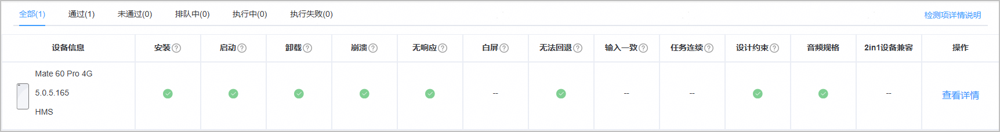
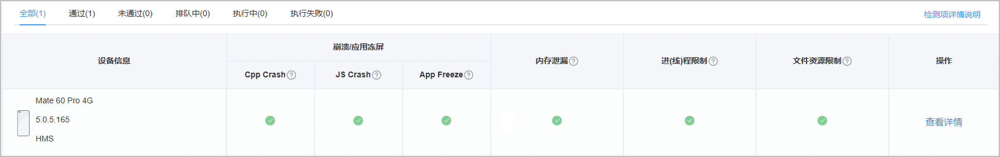
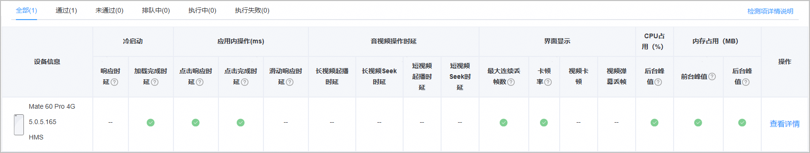
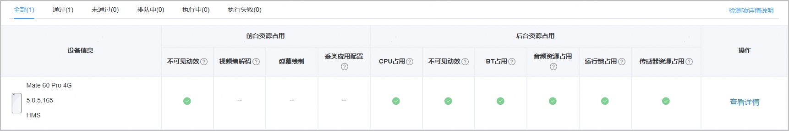
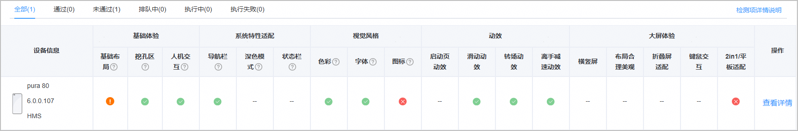
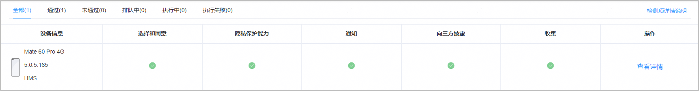
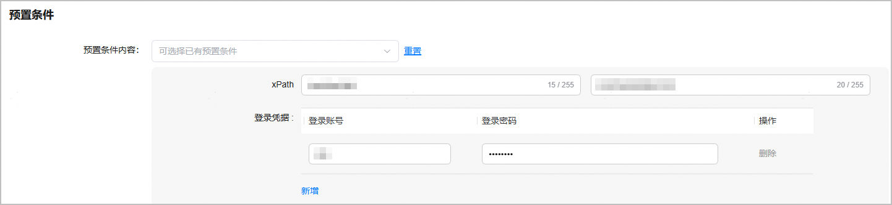
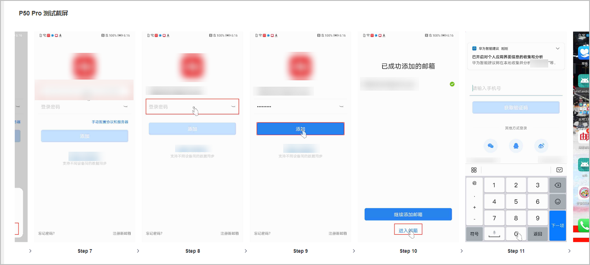
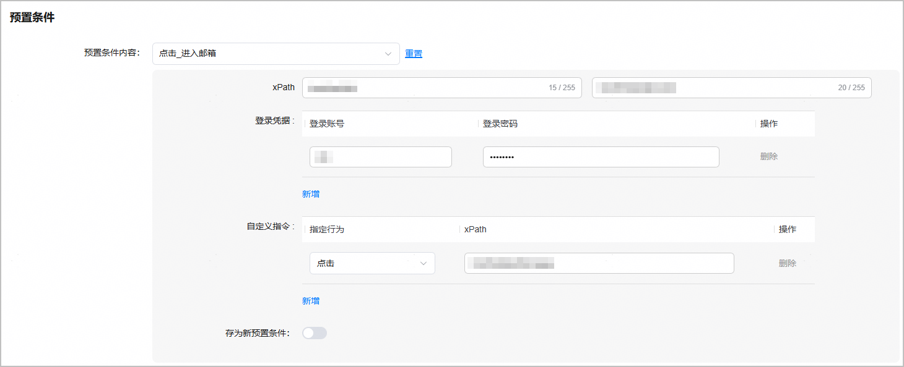
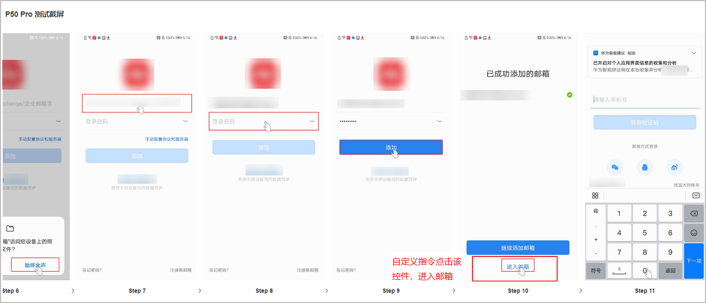

#### 检测应用兼容性问题

release版本的应用通过提交兼容性测试，可检测出该应用在华为手机设备上的兼容性问题，帮助您提前发现问题。

#### 检测应用稳定性问题

release版本的应用通过提交长时间的稳定性测试，可检测出该应用在华为手机设备上的稳定性问题，帮助您提前发现问题。

#### 检测应用性能问题

release版本的应用通过提交性能测试，在真机设备上完成应用性能数据如CPU、内存、耗电量、流量等关键指标采集，深入分析应用性能薄弱点。

#### 检测应用功耗问题

release版本的应用通过提交功耗测试，检测影响手机应用功耗的各项关键指标。

#### 检测应用UX问题

release版本的应用通过提交UX测试，验证应用在基础体验、系统特性适配、视觉风格、动效、大屏体验等方面的关键指标是否满足要求。

#### 检测应用隐私问题

release版本的应用通过提交隐私测试，验证应用在隐私政策选择、隐私保护、隐私通知、向第三方披露和收集等方面的关键指标是否满足要求。

#### 在测试过程中使用账号信息登录应用

针对需要账号和密码登录后才可正常使用的应用，您可在创建测试任务时填写已预置的账号和密码，以便让待测应用在所选手机上完成账号登录，从而实现完整的测试。

#### 设置自定义指令

您可在创建测试任务时填写自定义指令的预置条件，则测试遍历时将按照您的指令进行。

