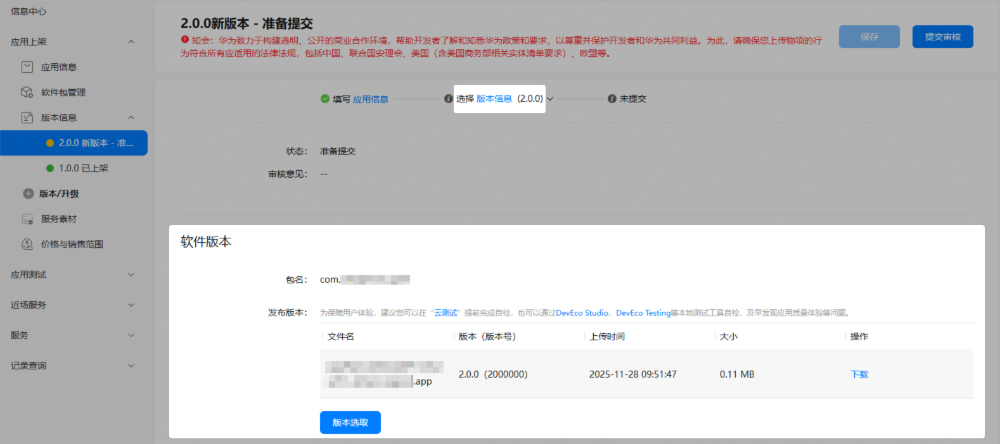
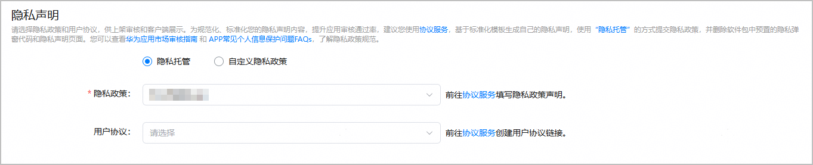
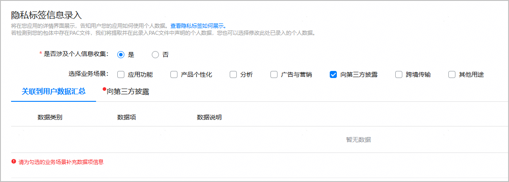
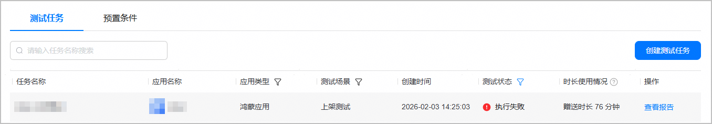
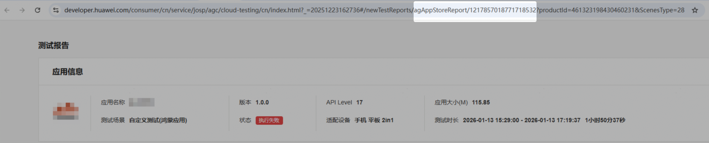
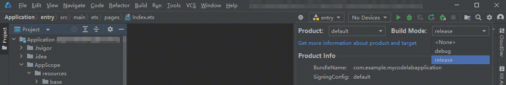
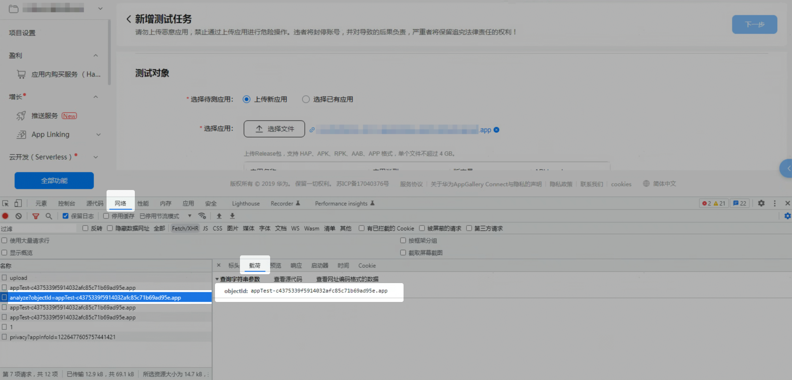

#### 通用

#### [h2]云测试的单个测试范围（兼容性测试、稳定性测试、性能测试、功耗测试、UX测试和隐私测试）每次可以选择多少款机型进行测试？

云测试的兼容性测试、稳定性测试、性能测试、功耗测试或UX测试每次选择的机型没有限制，可以同时选择多台。但鉴于某些热门机型使用人数较多，建议您一次最多选择9款进行测试，以免造成长时间排队的情况。

云测试的隐私测试与设备机型无关，单个隐私测试任务只会下发到一个设备上。

#### [h2]提交的测试任务一直在测试中，怎么办？

正常情况下，兼容性测试、稳定性测试和性能测试的测试时长一般在10～30分钟左右，最长可以设置为360分钟。功耗测试的测试时长在40～75分钟左右。如果实际测试时长与设置时长相差过大，您可以提交[问题反馈](https://developer.huawei.com/consumer/cn/support/feedback)，并说明具体情况。

#### [h2]提交的测试任务为什么一直在排队中？

一般情况下，某些热门机型上会出现排队的情况，这种情况下，需要您耐心等待。如果发现一直排队但不执行的云测试任务，请您提交[问题反馈](https://developer.huawei.com/consumer/cn/support/feedback)，并说明具体情况。

#### [h2]云测试支持使用账号登录应用吗？

云测试支持预置条件功能，您可以预置账号和密码的控件路径，并输入账号和密码，在云测试的兼容性测试、性能测试等单项测试中使用该预置条件，则可实现使用账号登录应用进行遍历。

详情可参见[预置条件](/docs/distribute/agc/agc-help-cloudtest-0000002235710242/agc-help-cloudtest-presetcontent-0000002254933880)。

#### [h2]在云测试上提交的测试任务，为什么出现很多执行失败的结果？

一般情况下，当您选择的手机下架了或者手机本身出现了问题，则在该款手机上的任务会出现执行失败的结果。如任务出现执行失败的结果，建议您重新选择机型进行测试。

#### [h2]稳定性测试中检测出Crash/App Freeze等问题，如何定位这些问题？

一般情况下，我们的测试报告详情会有对应的错误提示，点击错误提示会出现异常描述和异常信息，异常信息中会给出异常堆栈信息。同时您也可以在测试报告详情中点击“下载”按钮，下载日志到本地，解压后可查看到以@crash/@appfreeze结尾的文件，这些crash/appfreeze文件可作为分析应用检测出crash/appfreeze异常的定位日志文件。

#### [h2]云测试怎么开具发票？开具发票周期是多久？

点击云测试服务页面右上角的“订单查看”。然后在左侧菜单栏中选择“费用 > 发票管理”，进入发票管理页面对已购订单申请开票即可。

开具发票周期为华为财务工作人员收到发票申请或您确认结算金额后的30个自然日内。

#### [h2]云测试线上提供哪些设备？

目前线上提供HarmonyOS NEXT系统的直屏手机、折叠屏手机和平板设备。

#### [h2]无法选择隐私检测项。如何解决？

请按照以下步骤进行排查，排查完成后，请刷新云测试创建测试任务页面并重试。

1. 确保当前账号具有操作权限。

   当前账号可能不属于目标软件包所属的应用账号，因此没有操作权限。您可以尝试以下方法后重试：

   1. 联系该应用的管理员，将您的账号添加为团队成员。操作方法可参考[添加成员账号](/docs/distribute/agc/agc-help-developid-0000002235870038/agc-help-manageaccount-0000002306610129#section151241455193313)。
   2. 切换到有权限的账号进行测试。
2. 在对应用软件包进行隐私测试之前，您需要先配置应用或元服务的隐私声明和隐私标签信息。请按照以下步骤操作后重试：
   1. 进入“应用上架/元服务上架 > 版本信息 > 新版本 - 准备提交”页面，在“软件版本”区域选取在云测试创建测试任务页面上传的应用软件包。

      
   2. 在“隐私声明”区域，根据实际情况配置隐私内容。配置方法可参考[配置隐私声明](/docs/distribute/agc/agc-help-release-app-0000002271695230/agc-help-release-app-privacy-state-0000002278878296)。

      
   3. 如果您的应用类型是元服务，可跳过本步骤。如果是HarmonyOS应用，且涉及用户信息收集，请继续在“隐私标签信息录入”区域配置隐私标签信息。配置方法可参考[配置隐私标签信息](/docs/distribute/agc/agc-help-release-app-0000002271695230/agc-help-release-app-privacy-tag-0000002316420993)。

      
   4. 配置完成后，点击页面右上角的“保存”。

#### [h2]遇到云测试检测报告出错时，如何反馈？

请发送邮件告知我们您遇到的问题，华为方收到邮件后，将在1~3个工作日内邮件答复您。

* 邮箱地址：agconnect@huawei.com
* 邮件标题：【云测试检测报告出错问题】
* 邮件内容

  需包含以下信息：
  + 问题发生时间，例如XX月XX日XX时左右。
  + 问题相关的TaskGroupId，请参考[TaskGroupId获取方法](#ZH-CN_TOPIC_0000002255036920__p3135193614911)进行获取。

**TaskGroupId获取方法**

1. 在云测试主界面，选择“测试任务”页签，点击对应测试任务“操作”列的“查看报告”。

   
2. 在新打开的测试报告窗口中，复制浏览器地址栏中“agAppStoreReport”参数后的数字，例如下图示例中的1217857018771718532，该数字即为TaskGroupId。

   

#### 应用包相关

#### [h2]上传应用包后提示“应用非Release版本，请上传Release版本应用”是什么原因？

请检查上传的应用包是否是debug版本，当前不支持上传debug版本的应用包。

检查步骤：

1. 打开DevEco Studio，在**“**File > Project Structure > Project > Signing Configs**”**窗口中检查配置的证书类型。须确保配置的是发布证书，而非调试证书。
2. 在代码编辑界面，点击右上角图标，在弹出框中查看“Build Mode”配置。如果配置为“debug”，则构建的为debug版本应用包；如果配置为“release”，则构建的为release版本应用包。须确保将“Build Mode”配置为“release”。

   

#### [h2]应用包未使用发布证书进行签名，如何解决？

请执行以下步骤解决：

1. 申请[发布证书](/docs/distribute/agc/agc-help-cert-0000002270829389/agc-help-release-cert-0000002283336729)和[发布Profile](/docs/distribute/agc/agc-help-profile-0000002270709473/agc-help-release-profile-0000002248341090)。
2. 打开DevEco Studio，重新[配置签名信息](/docs/tools/coding-debug/ide-publish-app#section280162182818)（选择步骤1中申请的发布证书和发布Profile文件）
3. 使用Release模式[编译构建应用包](/docs/tools/coding-debug/ide-publish-app#section1992513343374)。

#### [h2]遇到解析应用包未知异常类问题时，如何反馈？

请发送邮件告知我们您遇到的问题，华为方收到邮件后，将在1~3个工作日内邮件答复您。

* 邮箱地址：agconnect@huawei.com
* 邮件标题：【云测试上传应用包失败问题】
* 邮件内容

  需包含以下信息：
  + 问题发生时间，例如XX月XX日XX时左右。
  + 问题相关的ObjectID，请参考[ObjectID获取方法](#ZH-CN_TOPIC_0000002255036920__p66183337427)进行获取。

**ObjectID获取方法**

1. 在创建测试任务页面，按下快捷键F12打开工具窗口。
2. 上传应用包。
3. 选择“网络”面板，点击“名称”列中以“analyze?objectId=”开头的接口URL名称，然后复制“载荷”页签下的“objectId”参数值。

   
