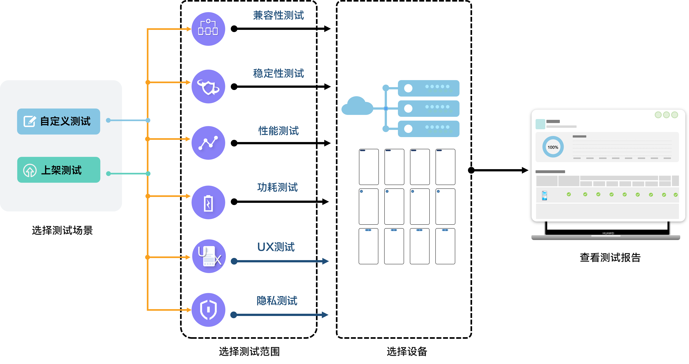

云测试致力于为您提供便捷的一站式应用测试服务，解决您在应用开发、测试过程中面临的成本、技术和效率问题，保障您的应用在华为平台上架期间获得优质的用户体验。云测试为您提供了热门移动真机设备，有针对性地向您提供应用在手机、平板等设备上的兼容性测试、稳定性测试、性能测试、功耗测试、UX测试和隐私测试能力，快速出具专业且详细的测试报告，帮助您提前发现并精准定位和解决问题。

#### 主要功能

云测试服务支持上架测试和自定义测试两种测试场景。

* 上架测试：按照应用上架华为应用市场的标准进行测试，为您的应用上架华为应用市场提供质量保证。上架测试可对应用进行兼容性、稳定性、性能、功耗、UX测试和隐私测试。
* 自定义测试：您可以选择您关注的测试专项，例如兼容性、稳定性、性能、功耗、UX或隐私专项进行测试。系统会默认选择当前最新和热门的机型，帮助您提前发现问题，提升用户侧应用体验。

| **主要功能** | 使用平台/工具 | **功能描述** |
| --- | --- | --- |
| [兼容性测试](/docs/distribute/agc/agc-help-cloudtest-viewreport-0000002289646669/agc-help-cloudtest-compatibilitytest-0000002289534101) | AGC、DevEco Studio | 兼容性测试为您提供大量的手机、折叠屏和热门平板设备，全自动化验证应用在不同类型设备上的首次安装、再次安装、卸载和启动中的异常问题，检测应用的崩溃、无响应、闪退、运行错误、账号异常、黑白屏、无法回退等兼容性方面的问题。 |
| [稳定性测试](/docs/distribute/agc/agc-help-cloudtest-viewreport-0000002289646669/agc-help-cloudtest-stabilitytest-0000002254933876) | AGC、DevEco Studio | 长时间遍历测试及随机测试应用在手机、折叠屏和平板上的内存泄漏、内存越界、冻屏、崩溃等稳定性问题。 |
| [性能测试](/docs/distribute/agc/agc-help-cloudtest-viewreport-0000002289646669/agc-help-cloudtest-performancetest-0000002289647209) | AGC、DevEco Studio | 提供手机应用性能测试服务，在真机上完成应用性能数据如时延、CPU、内存、耗电量、流量等关键指标采集，深入分析应用性能薄弱点。 |
| [功耗测试](/docs/distribute/agc/agc-help-cloudtest-viewreport-0000002289646669/agc-help-cloudtest-powerconsumptiontest-0000002255036916) | AGC、DevEco Studio | 提供手机、折叠屏应用功耗测试服务，检测影响应用功耗的各项关键指标。 |
| [UX测试](/docs/distribute/agc/agc-help-cloudtest-viewreport-0000002289646669/agc-help-cloudtest-uxtest-0000002289534109) | AGC、DevEco Studio | 提供手机、折叠屏和平板应用UX测试服务，可检测问题类别包括基础体验、系统特性适配、视觉风格、动效、大屏体验等。 |
| [隐私测试](/docs/distribute/agc/agc-help-cloudtest-viewreport-0000002289646669/agc-help-cloudtest-privacytest-0000002465035109) | AGC | 提供手机应用隐私测试服务，在真机上完成应用隐私合规如隐私政策的选择和同意、隐私保护能力、隐私通知、向第三方披露和收集等方面的检测，规范应用全生命周期的隐私行为。 |

#### 工作原理

当进行自定义测试或者上架测试时，选择测试范围后，可根据设备形态、系统版本、API Level或是否空闲等维度筛选设备。待提交测试后，系统推送到云端找到对应的设备遍历执行，分别得出兼容性、稳定性、性能、功耗、UX和隐私专项对应的测试报告。

#### 实现流程

本章节介绍不同测试场景的实现流程。

#### [h2]上架测试实现流程

| **序号** | **步骤** | **详情** |
| --- | --- | --- |
| 1 | 上传应用程序 | 上传待测应用软件包。 |
| 2 | 选择应用分类 | 选择应用的一级、二级和三级分类。 |
| 3 | 选择测试场景 | 选择上架测试。 |
| 4 | 选择测试范围 | 默认勾选所有测试专项（包括兼容性测试、稳定性测试、性能测试、功耗测试、UX测试和隐私测试）。  仅隐私测试支持根据实际需求取消勾选或勾选。 |
| 5 | （可选）设置预置条件 | 根据需要设置登录账号相关控件ID及账号信息，或者在自定义指令（点击、输入文字、忽略）中输入相关操作的应用包名和应用包内对应的控件ID，实现应用在测试过程中使用账号登录，或者某些动作的自动化操作。 |
| 6 | 选择测试设备 | 选择即将进行测试的设备型号。 |
| 7 | 提交测试 | 提交测试。 |
| 8 | 确认使用详情 | 确认提交测试需要消耗的时长及余额。 |
| 9 | 测试执行 | 被测应用程序提交到对应的测试设备上进行测试。 |
| 10 | 查看测试报告 | 测试完成后，查看任务的执行报告。 |

#### [h2]自定义测试实现流程

| **序号** | **步骤** | **详情** |
| --- | --- | --- |
| 1 | 上传应用程序 | 上传待测应用软件包。 |
| 2 | 选择应用分类 | 选择应用的一级、二级和三级分类。 |
| 3 | 选择测试场景 | 选择自定义测试。 |
| 4 | 选择测试范围 | 默认勾选兼容性测试。所有测试专项均可根据实际需求勾选或取消勾选。 |
| 5 | （可选）设置预置条件 | 根据需要设置登录账号相关控件ID及账号信息，或者在自定义指令（点击、输入文字、忽略）中输入相关操作的应用包名和应用包内对应的控件ID，实现应用在测试过程中使用账号登录，或者某些动作的自动化操作。 |
| 6 | 选择测试设备 | 选择即将进行测试的设备型号。 |
| 7 | 提交测试 | 提交测试。 |
| 8 | 确认使用详情 | 确认提交测试需要消耗的时长及余额。 |
| 9 | 测试执行 | 被测应用程序提交到对应的测试设备上进行测试。 |
| 10 | 查看测试报告 | 测试完成后，查看任务的执行报告。 |
