在云测试自动化遍历测试过程中，您的应用可能需要登录才可以进入，或者您希望在测试过程中能够通过云测试点击某些控件、对某些控件执行文本输入，或者直接忽略掉某些控件，因此，云测试在创建测试任务时增加了预置条件的选项，以实现以上场景。您可以在创建测试任务的过程中新增预置条件，也可通过云测试主界面的“预置条件”页签新增预置条件，在需要时直接使用已预置的条件，省去反复输入的不便。

#### 在创建测试任务的过程中预置条件

#### [h2]前提条件

* 您准备的必须是配置了发布证书且打包时编译模式选择“release”的应用包，且不同格式的应用包大小在4GB以内。
* 您准备的应用需要账号和密码登录，且准备好了账号和密码。或者您获取到了需要自定义指令的应用包名和应用包内对应的控件ID。

#### [h2]操作步骤

1. 登录[AppGallery Connect](https://developer.huawei.com/consumer/cn/service/josp/agc/index.html)，点击“开发与服务”。
2. 在项目列表中点击需要测试的项目。
3. 在左侧导航栏选择“质量 > 云测试”，进入云测试主界面。
4. 选择“测试任务”页签，点击“创建测试任务”。

   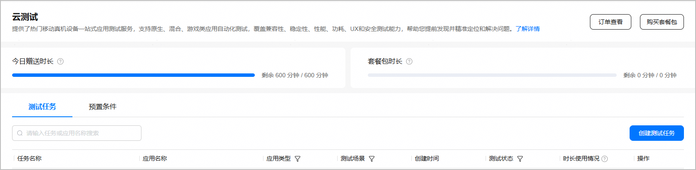
5. 进入“配置测试任务”页面，在“测试对象”和“测试任务”区域进行基础信息配置。

   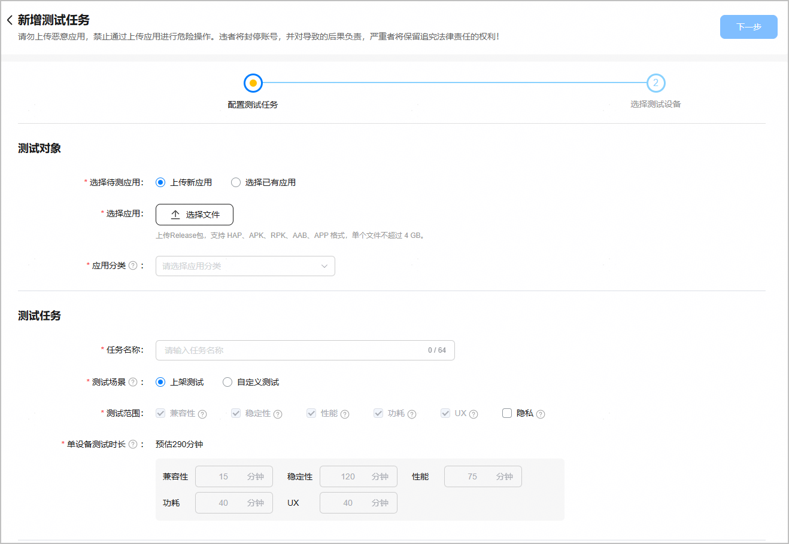
6. 在“预置条件”区域，您可以新增预置条件，也可以复用历史预置条件。
   * 新增预置条件

     如果您之前没有设置过预置条件，请参考以下步骤操作：

     1. 填写登录信息。在“xPath”后的两个方框内分别输入账号控件路径和密码控件路径。在“登录凭据”后的两个方框内分别输入账号和密码，点击“新增”可预置多个账号和密码。

        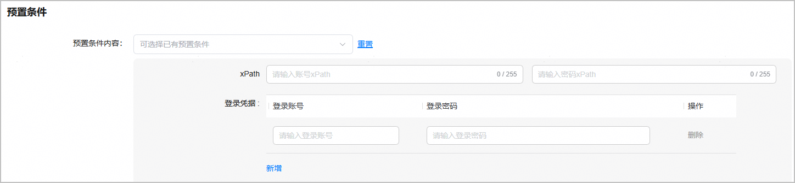

        | **参数** | **说明** |
        | --- | --- |
        | 账号xPath | 账号控件路径。输入内容限长255字符，只允许大小写字母（区分大小写）、数字和特殊字符+ @ / \_ . : [ ]  说明：  xPath可以使用[DevEco Testing](https://developer.huawei.com/consumer/cn/doc/harmonyos-guides/get-familiar)自带的UIViewer工具查看。   |
        | 密码xPath | 密码控件路径。输入内容限长255字符，只允许大小写字母（区分大小写）、数字和特殊字符+ @ / \_ . : [ ] |
        | 账号 | 应用注册的账号。限长32字符，不允许有空格。 |
        | 密码 | 应用注册账号设置的密码。限长32字符，不允许有中文和空格。 |
     2. 填写自定义指令。点击“新增”可预置多个自定义指令。

        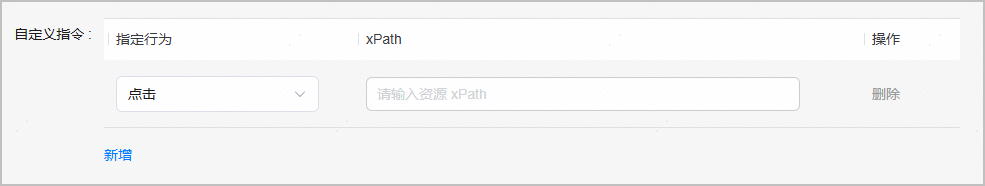

        | **指令** | **说明** |
        | --- | --- |
        | 点击 | 控件路径。某个或某些点击操作控件的控件ID。限长255个字符，支持大小写字母（区分大小写）、数字和特殊字符+ @ / \_ . : [ ] |
        | 输入文字 | 控件路径。某个或某些输入文字控件的控件ID。限长255个字符，支持大小写字母（区分大小写）、数字和特殊字符+ @ / \_ . : [ ] |
        | 输入值。限长512个字符，支持大小写字母（区分大小写）、数字和特殊字符+ @ / \_ . : [ ] |
        | 忽略 | 控件路径。某个或某些忽略控件的控件ID。限长255个字符，支持大小写字母（区分大小写）、数字和特殊字符+ @ / \_ . : [ ] |
     3. 您可以打开“存为新预置条件”开关，并填写预置条件名称（只能包含中英文、数字、+ @ /\_ . : [ ]）和预置条件说明。

        

        此步骤为可选。如果您打开了“存为新预置条件”开关，填写的登录信息将被保存，以便下次直接使用。如果未打开此开关，此次编辑的信息将不会被保存。

        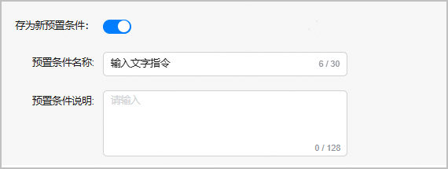

        保存的预设条件可在“预置条件”页签中查看和编辑。

        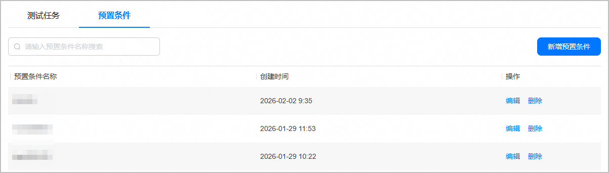
     4. 完成相关信息填写后，点击页面右上角的“下一步”，继续进行测试设备的配置。
   * 复用历史预置条件

     如果您之前在创建测试任务过程中保存过预置条件，或是在“预置条件”页签中创建过预置条件，则可选择复用历史预置条件。

     1. 点击“可选择已有预置条件”下拉框，选择对应的预置条件，登录信息区域将自动填充预置的条件信息。

        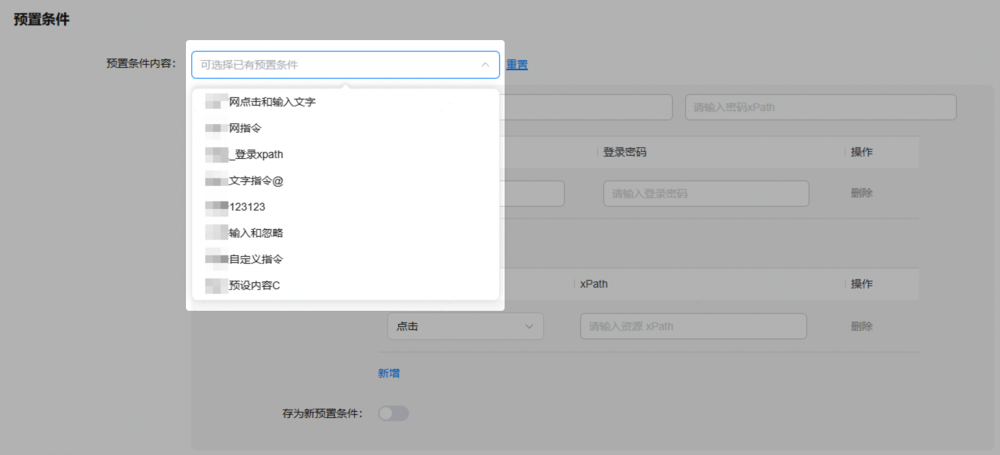
     2. 完成相关信息填写后，点击页面右上角的“下一步”，继续进行测试设备的配置。
7. 在“选择测试设备”页面，您可以在搜索框中输入机型名称筛选机型，也可以根据设备形态、系统版本、API Level以及我的收藏、是否空闲机型、是否优惠机型等维度筛选您所需的机型。选择完成后，点击右上角的“提交”。

   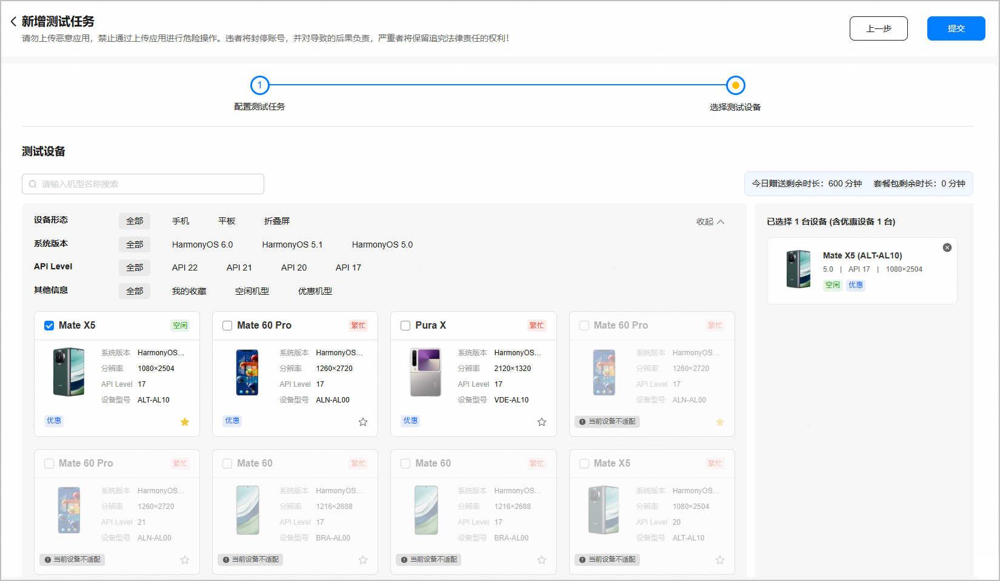

#### 管理预置条件

您可在“预置条件”页签下创建、编辑和删除预置条件。

#### [h2]创建预置条件

1. 登录[AppGallery Connect](https://developer.huawei.com/consumer/cn/service/josp/agc/index.html)，点击“开发与服务”。
2. 在项目列表中点击需要测试的项目。
3. 在左侧导航栏选择“质量 > 云测试”，进入云测试主界面。
4. 选择“预置条件”页签，点击右上角的“新增预置条件”。

   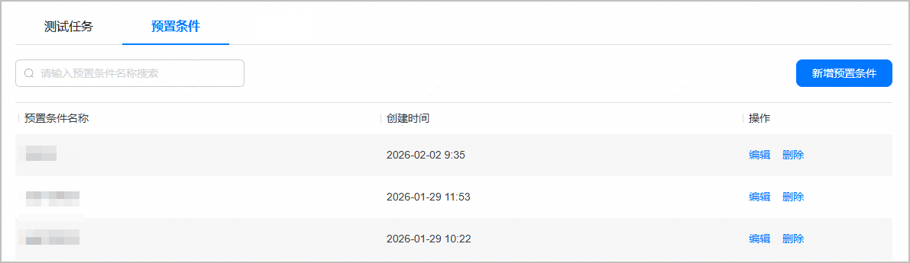
5. 填写预置条件相关内容。

   

   * 一个预置条件中登录信息和自定义指令可二选一填写，也可全部填写。
   * 登录凭据最多支持设置5个账号信息。
   * 自定义指令最多支持设置10个指令。

   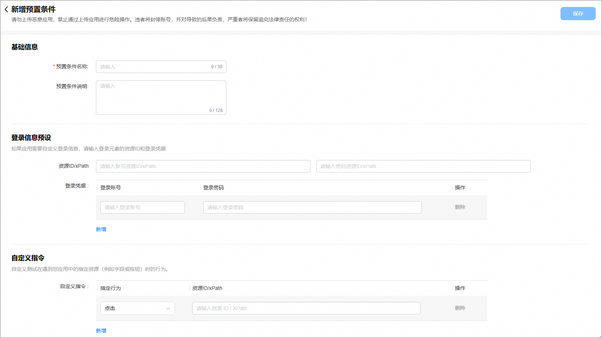

   * 填写预置条件名称（只能包含中英文、数字、+ @ /\_ . : [ ]）和预置条件说明。

     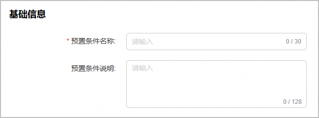
   * 填写登录信息。

     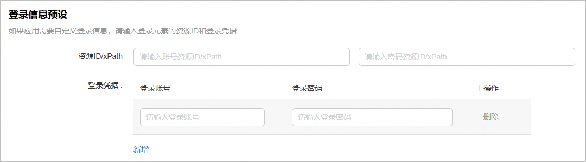

     | **参数** | **说明** |
     | --- | --- |
     | 账号xPath | 账号控件路径。输入内容限长255字符，只允许大小写字母（区分大小写）、数字和特殊字符+ @ / \_ . : [ ]  说明：  xPath可以使用[DevEco Testing](https://developer.huawei.com/consumer/cn/doc/harmonyos-guides/get-familiar)自带的UIViewer工具查看。  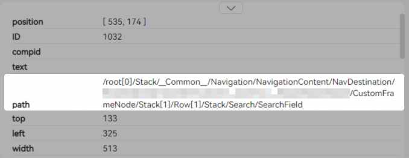 |
     | 密码xPath | 密码控件路径。输入内容限长255字符，只允许大小写字母（区分大小写）、数字和特殊字符+ @ / \_ . : [ ] |
     | 账号 | 应用注册的账号。限长32字符，不允许有空格。 |
     | 密码 | 应用注册账号设置的密码。限长32字符，不允许有中文和空格。 |
   * 填写自定义指令。

     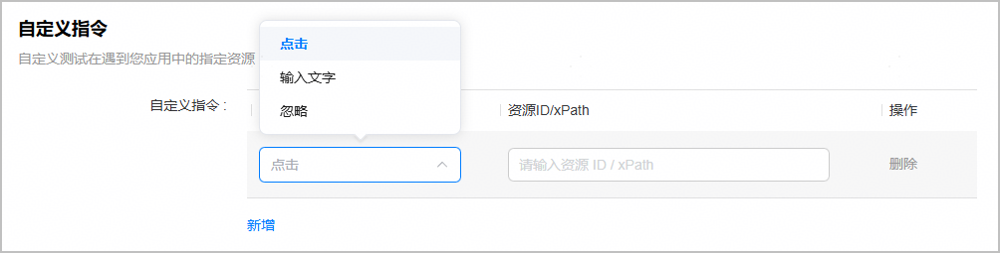

     | **指令** | **说明** |
     | --- | --- |
     | 点击 | 控件路径。某个或某些点击操作控件的控件ID。限长255个字符，支持大小写字母（区分大小写）、数字和特殊字符+ @ / \_ . : [ ] |
     | 输入文字 | 控件路径。某个或某些输入文字控件的控件ID。限长255个字符，支持大小写字母（区分大小写）、数字和特殊字符+ @ / \_ . : [ ] |
     | 输入值。限长512个字符，支持大小写字母（区分大小写）、数字和特殊字符+ @ / \_ . : [ ] |
     | 忽略 | 控件路径。某个或某些忽略控件的控件ID。限长255个字符，支持大小写字母（区分大小写）、数字和特殊字符+ @ / \_ . : [ ] |
6. 完成配置后，点击页面右上角的“保存”，预置条件列表中会出现新增的预置条件。

#### [h2]编辑和删除预置条件

1. 登录[AppGallery Connect](https://developer.huawei.com/consumer/cn/service/josp/agc/index.html)，点击“开发与服务”。
2. 在项目列表中点击需要测试的项目。
3. 在左侧导航栏选择“质量 > 云测试”，进入云测试主界面。
4. 选择“预置条件”页签，点击预置条件列表“操作”列的“编辑”或“删除”对某个预置条件进行编辑或删除操作。

   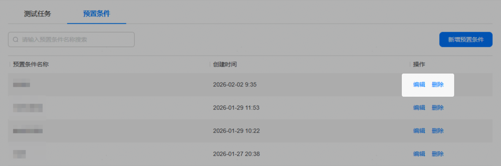
