#### 计费方式说明

自2022年5月23日起，云测试服务采用“赠送时长+套餐余额+按量付费”的方式进行结算。下表列举了云测试服务的计费方式，您可根据实际需求进行选择。

| 计费方式 | 说明 |
| --- | --- |
| 赠送时长 | 当您成功注册华为开发者账号后，系统会在每日零点为您提供一定量的赠送时长，当日有效，您团队账号下的所有项目均可共用该赠送时长。赠送时长仅适用于优惠机型，可享受赠送时长的机型会在其图标下方展示“优惠”标识。  关于云测试服务的赠送时长额度，请参见[套餐价格](#section922853442512)。 |
| [付费套餐](#section1973751217156) | 您可以为某个项目购买云测试服务付费套餐，套餐包在套餐配额内为您提供了更加优惠的价格。套餐包的时长可用来支付非优惠机型的测试，或支付优惠机型在赠送时长用尽后的继续测试。  套餐包的时长仅支持本项目下使用，您账号中的其他项目不能共享本项目套餐包的套餐余额。  关于云测试服务的付费套餐，请参见[套餐价格](#section922853442512)。  注意：  如果您的账户已经欠费，且预计消耗的套餐时长超过剩余的套餐时长时，即使存在套餐时长，套餐时长将不可用。 |
| [按量付费](#section14462147149) | 您可以将云测试服务升级到付费档，以启用按量付费。启用按量付费后，当您使用优惠机型测试但赠送时长和套餐余额都用尽时，或您使用非优惠机型且套餐余额用尽时，可以继续进行测试，并根据实际使用时长从您的账户余额中扣除相应费用。  若您的账户已欠费，则不能以按量付费方式继续测试，您可为账户[充值](https://developer.huawei.com/consumer/cn/doc/app/agc-help-topup-0000002277191065)。  关于云测试服务的按量付费价格，请参见[套餐价格](#section922853442512)。  注意：  * 升级到按量付费后，如果您的账户内有优惠券，每月将优先使用优惠券抵扣费用。费用超出优惠券金额时，则需要您付费使用。如需查看账户内的优惠券详情，请参见[管理优惠券](https://developer.huawei.com/consumer/cn/doc/app/agc-help-coupon-0000002242112062)。 * 您超额使用的费用将自动从您的账户余额中扣除，请保证您的账户余额充足。为防止您的账户余额不足而导致扣款失败，您可以[设置账户余额不足提醒](https://developer.huawei.com/consumer/cn/doc/app/agc-help-set-balance-notify-0000002247531780)。 |

#### 计费优先级说明

系统按照“赠送时长＞付费套餐余额＞按量付费”的优先顺序计费：

* 如果您提交测试申请的测试设备为优惠机型，系统将优先选择赠送时长进行支付；当您的赠送时长用尽后，系统会使用套餐余额支付；套餐余额用尽后，系统将使用按量付费方式支付。
* 如果您提交测试申请的测试设备为非优惠机型，系统将直接使用套餐余额支付；当套餐余额用尽后，系统将使用按量付费的方式支付。

使用场景举例：

* 假设当前团队账号赠送时长余额为50分钟，付费套餐余额为150分钟：
  + 您选择的10台设备为优惠机型，每台测试时长设置为15分钟。则本次测试预计消耗赠送时长10\*15=150分钟。赠送时长余额用尽后，优惠机型剩余的100分钟将消耗套餐余额。本次测试的实际消耗时长=赠送时长50分钟+套餐余额100分钟。
  + 您选择的10台设备中有2台优惠机型，每台测试时长设置为15分钟。则本次测试预计消耗赠送时长2\*15=30分钟，消耗套餐余额8\*15=120分钟。本次测试的实际消耗时长=赠送时长30分钟+套餐余额120分钟。
  + 您选择的10台设备都是非优惠机型，每台测试时长设置为15分钟，则本次测试不消耗赠送时长，将消耗套餐余额10\*15=150分钟。本次测试的实际消耗时长=套餐余额150分钟。
* 假设当前团队账号赠送时长余额为50分钟，付费套餐余额为50分钟，已开通按量付费：
  + 您选择的10台设备为优惠机型，每台测试时长设置为15分钟。则本次测试预计消耗赠送时长10\*15=150分钟。赠送时长用尽后，优惠机型剩余的100分钟将优先消耗套餐余额，套餐余额用尽后，使用按量付费方式继续完成测试。本次测试的实际消耗时长=赠送时长50分钟+套餐余额50分钟+按量付费50分钟。
  + 您选择的10台设备中有2台优惠机型，每台测试时长设置为15分钟。则本次测试预计消耗赠送时长2\*15=30分钟，消耗套餐余额8\*15=120分钟。套餐余额用尽后，非优惠机型剩余的70分钟将使用按量付费方式继续完成测试。本次测试的实际消耗时长=赠送时长30分钟+套餐余额50分钟+按量付费70分钟。
  + 您选择的10台设备都是非优惠机型，每台测试时长设置为15分钟，则本次测试不消耗赠送时长，将消耗套餐余额10\*15=150分钟。套餐余额用尽后，使用按量付费方式继续完成测试。本次测试的实际消耗时长=套餐余额50分钟+按量付费100分钟。

#### 套餐价格

| 计费方式 | 配额 | 有效期 | 价格（CNY） | 说明 |
| --- | --- | --- | --- | --- |
| 赠送时长 | 600分钟/天 | 24小时（每天零点自动发放） | 0 | 当您同时使用多台设备进行测试时，时长额度累加计算。 |
| 付费套餐 | 600分钟 | 1年 | 480 | 付费套餐目前仅支持中国大陆区域购买。 |
| 6000分钟 | 1年 | 3600 |
| 按量付费 | - | - | 1元/分钟 | 按实际使用量收费 |

#### 购买流程

目前，HarmonyOS 5及以上系统版本的机型均为优惠机型。在测试过程中，系统将优先扣除当日赠送时长。当日赠送时长用尽后，将自动切换为扣除套餐包时长或按量付费支付。

#### [h2]订购付费套餐包

1. 登录[AppGallery Connect](https://developer.huawei.com/consumer/cn/service/josp/agc/index.html)，点击“开发与服务”。
2. 选择想要订购付费套餐的项目后，在左侧导航栏中，选择“质量 > 云测试”。
3. 点击云测试服务页面右上角的“购买套餐包”。

   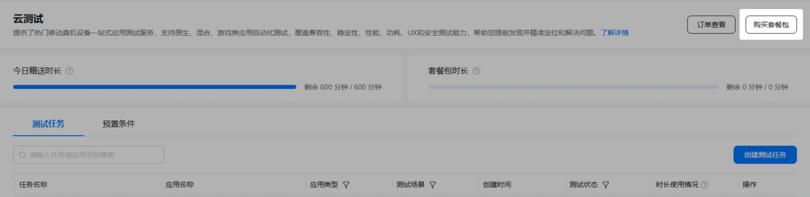
4. 在弹出的“购买”页面中，“售卖方式”选择“一次性资源包”，并选择所需规格、套餐配额和有效期，配置“购买数量”后，点击“购买”。

   

   * 实际套餐配额以页面展示为准。
   * 购买的套餐包，只能在当前项目下使用，其他项目无法使用该套餐包。
   * 如您尚未维护账户付费信息，系统会提示您，请您根据提示前往联盟付费服务处完善付费信息。

   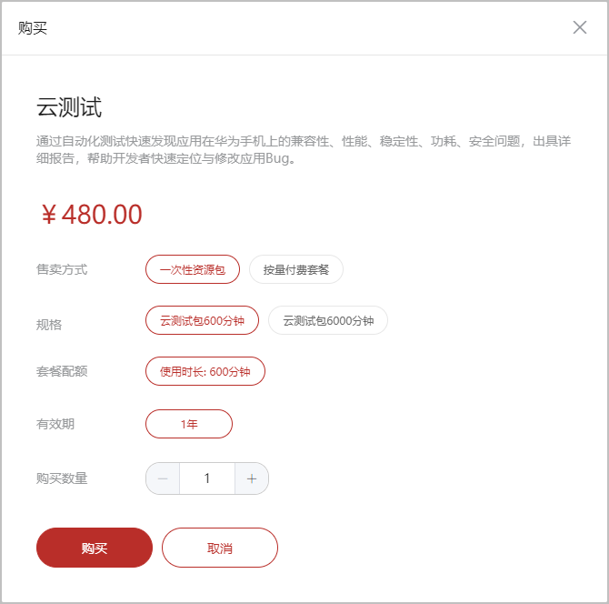
5. 在服务支付页面中，您可以选择“账户余额支付”，或第三方支付方式，有优惠券时，可选择[使用优惠券](https://developer.huawei.com/consumer/cn/doc/app/agc-help-coupon-0000002242112062#section1565242035812)，确认金额后点击“确认并支付”。

   

   * 账户余额不足时，请您尽快[充值](https://developer.huawei.com/consumer/cn/doc/app/agc-help-topup-0000002277191065)。
   * 如您尚未签署华为AppGallery Connect付费服务协议或签署的协议非最新版本，请您阅读并勾选服务支付页面底部的选框，完成协议签署后才能订购付费服务。
   * 购买的一次性资源包支持退订，详情请参见[申请退款](#section09801652524)。

   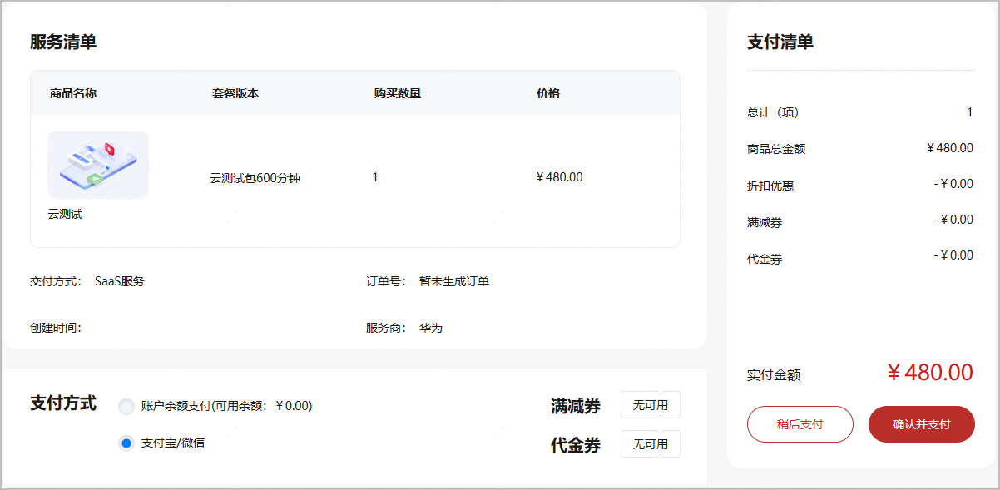
6. 如您当前因余额不足或其他原因无法立即支付，可以点击“稍后支付”。后续可进入“订单管理”页面选择该订单完成支付，具体详情请参见[支付订单](https://developer.huawei.com/consumer/cn/doc/app/agc-help-order-0000002277191077#section1978910437178)。

   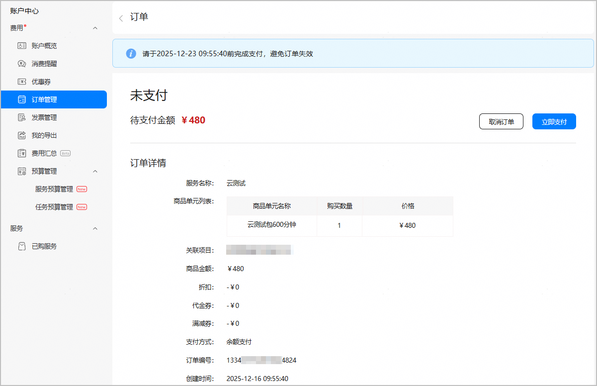

   您也可以在云测试服务页面右上角点击“订单查看”，进入“订单管理”页面完成支付。

   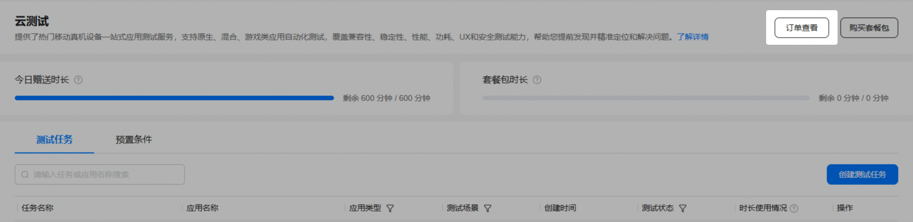
7. 支付完成后您即可使用套餐内的配额，如需查看项目配额，请点击“项目设置 > 项目配额”查看配额。

   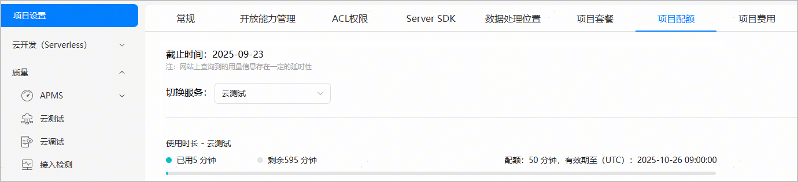

   您还可以返回云测试首页查看剩余的赠送时长和套餐包时长。

   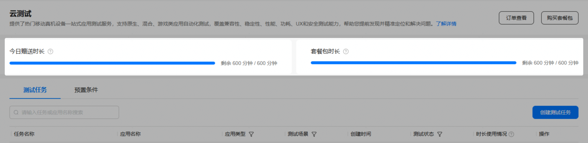
8. 如需开具发票，请点击云测试服务页面右上角的“订单查看”。然后在左侧菜单栏中选择“费用 > 发票管理”，进入发票管理页面对已购订单申请开票。开具发票周期为华为财务工作人员收到发票申请或您确认结算金额后的30个自然日内。

   

#### [h2]升级付费档

在使用云测试服务的项目下，您可以通过两种方式将您的项目套餐升级到付费档。升级到付费档后，当您账号内的赠送时长和套餐余额用尽后，超额部分系统将采用按量付费方式结算。

* 方式一：通过“项目设置 > 项目套餐 > 升级到付费档”将您的项目套餐升级到付费档。
  1. 登录[AppGallery Connect](https://developer.huawei.com/consumer/cn/service/josp/agc/index.html)，点击“开发与服务”。
  2. 选择想要升级到付费档的项目后，进入“项目设置 > 项目套餐”。
  3. 定位到云测试服务，点击“升级到付费档”。

     

     + 如您尚未维护账户付费信息，系统会提示您，请您根据提示前往联盟付费服务处完善付费信息。
     + 如您尚未签署华为AppGallery Connect付费服务协议或签署的协议非最新版本，请您阅读并勾选“确认升级”页面底部的选框，完成协议签署后才能升级到付费档。

     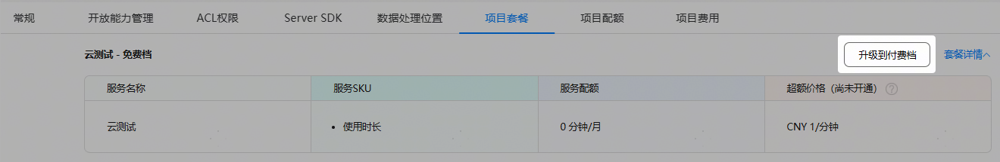

     

     如弹出“变更套餐成功提醒”提示框，表示已成功升级到付费档。

     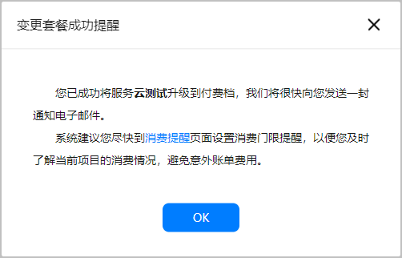
* 方式二：在云测试服务主界面，点击“购买套餐包”，在“购买”弹出框中选择“按量付费套餐”，然后点击“开通”升级到付费档。

  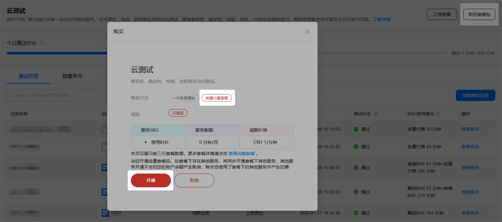

  升级成功后，您可以在“项目设置 > 项目套餐”页签查看开通结果。

  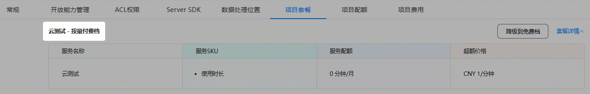

#### 费用查询

您可在“项目设置 > 项目费用”下查询当前项目的月总消费以及账户的欠费情况。如您的账户已欠费，请您尽快充值，以免影响使用，您可参考[充值](https://developer.huawei.com/consumer/cn/doc/app/agc-help-topup-0000002277191065)为账户充值。

充值成功后，金额到账有一定延迟，请您耐心等待。

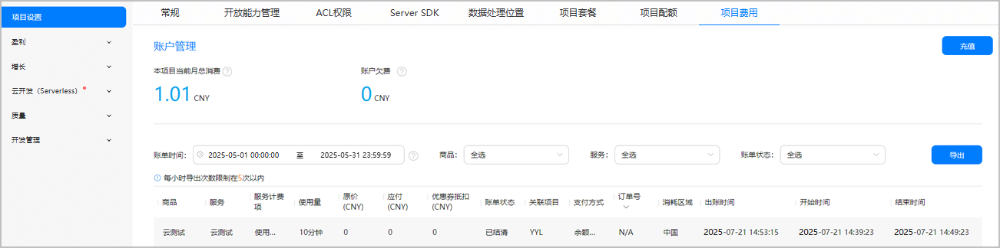

#### 申请退款

系统当前支持对一次性资源包进行退款，但有条件限制，需要满足以下两个条件：

* 一次性资源包中的套餐配额未被使用过。
* 购买一次性资源包时，通过第三方（支付宝/微信）扫码支付。

若满足条件且有退款需求，您可以发送退款申请邮件至agconnect@huawei.com与我们联系，邮件中需包含开发者Developer ID和项目ID信息。我们会在1-3个工作日内完成退款审核，并邮件告知您退款申请的处理结果。

* 若一次性资源包的套餐配额使用过一部分，则不支持进行退款。

* 如果退款申请已经通过审核，将无法取消退款，请您谨慎操作。

成功退款后，您可在云测试服务主界面，查看“套餐包时长”是否已被扣减。

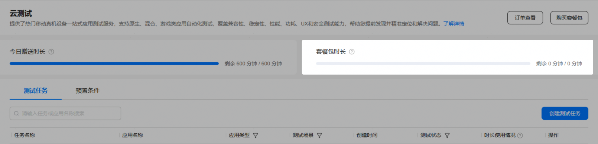

若您在退款成功后再次购买一次性资源包，您仍然能够享受购买折扣。
