上架测试按照应用市场应用上架的标准进行测试，为您的应用上架提供质量保证。上架测试可对应用进行兼容性测试、稳定性测试、性能测试、功耗测试、UX测试和隐私测试。

上架测试通过仅表示相关测试项通过，无法确保该应用审核通过。

#### 前提条件

* 在使用云测试服务前必须先创建您的项目。
* 请准备好已配置发布证书且打包时编译模式选择“release”的应用包，不同格式的应用包大小均在4GB以内。
* 由于隐私测试需要获取应用的隐私配置信息，在进行隐私测试之前，请确保以下两点：
  + 待检测应用包关联的应用在当前账号下，否则请切换登录账号或加入对应团队后重试。
  + 应用已配置隐私声明和隐私标签。如果尚未配置，请参考[配置隐私声明](/docs/distribute/agc/agc-help-release-app-0000002271695230/agc-help-release-app-privacy-state-0000002278878296)和[配置隐私标签](/docs/distribute/agc/agc-help-release-app-0000002271695230/agc-help-release-app-privacy-tag-0000002316420993)完成配置。

#### 创建测试任务

1. 登录[AppGallery Connect](https://developer.huawei.com/consumer/cn/service/josp/agc/index.html)，点击“开发与服务”。
2. 在项目列表中点击需要测试的项目。
3. 在左侧导航栏选择“质量 > 云测试”，进入云测试主界面。
4. 选择“测试任务”页签，点击“创建测试任务”。

   
5. 进入“配置测试任务”页面，在“测试对象”区域，上传新的应用软件包或选择之前已上传的应用软件包，并配置应用分类。
   * 上传新应用测试

     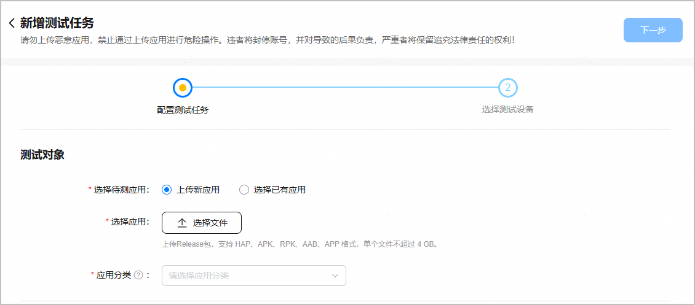

     | 配置项 | **说明** |
     | --- | --- |
     | 选择待测应用 | 选择“上传新应用”。 |
     | 选择应用 | 点击“选择文件”，上传您准备好的应用release包。应用包需满足以下条件才可成功上传：  + 配置发布证书，且打包时选择“release”编译模式。 + 应用包为HAP或APP格式，且大小不超过4GB。 当应用包的包名和版本与已上传的应用包相同，或者为In-house应用时，将不允许上传。如上传应用包时遇到其他错误，请根据弹框提示信息或[FAQ](/docs/distribute/agc/agc-help-cloudtest-0000002235710242/agc-help-cloudtest-faq-0000002255036920#section1685818203510)进行问题定位。  每个开发者账号每天最多支持上传500次，上传成功与否均累计计数。 |
     | 应用分类 | 应用类别分三级展示，请根据实际情况配置应用的一级、二级和三级分类。 |
   * 对已上传应用测试

     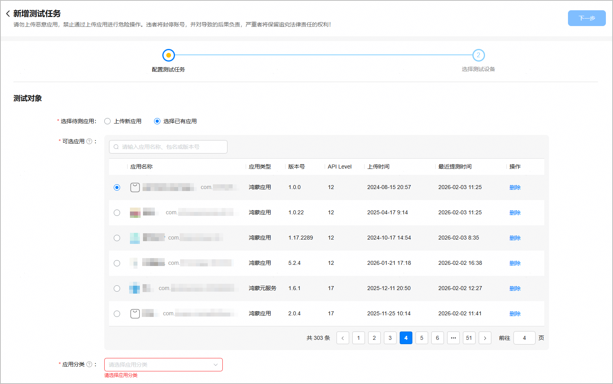

     | 配置项 | **说明** |
     | --- | --- |
     | 选择待测应用 | 选择“选择已有应用”。 |
     | 可选应用 | 应用列表分页展示您已经上传的应用软件包，每页展示15个应用。  可以翻页查找待测应用，也可以在搜索框中输入应用的名称、包名或版本号进行筛选，支持模糊查询。  点击应用列表中某个应用“操作”列的“删除”，可以删除该应用软件包。 |
     | 应用分类 | 应用类别分三级展示，请根据实际情况配置应用的一级、二级和三级分类。 |
6. 在“测试任务”区域，配置任务名称、测试场景和测试范围。

   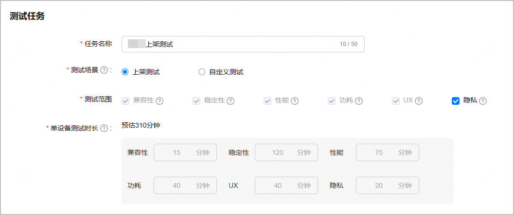

   | 配置项 | **说明** |
   | --- | --- |
   | 任务名称 | 系统默认以“应用名称+测试场景”预设了任务名称，您可以按需修改。  最长不超过64个字符，只允许输入中文、字母、数字或下划线。 |
   | 测试场景 | 选择“上架测试”。  说明：  按照应用上架华为应用市场的标准进行测试，为您的应用上架华为应用市场提供质量保证。 |
   | 测试范围 | 取值范围包括：兼容性测试、稳定性测试、性能测试、功耗测试、UX测试、隐私测试。  默认勾选所有测试专项，仅隐私测试支持根据实际需求取消勾选或重新勾选，其它测试专项不支持取消勾选。  说明：  * 系统暂不支持对儿童教育、游戏类型的应用或元服务进行性能测试和UX测试。 * 隐私测试与设备机型无关，单个隐私测试任务只会下发到一个设备上。 |
   | 单设备测试时长 | 系统根据您选择的应用包格式、测试范围动态预估单个测试设备的测试时长，不支持修改。  当设定的时间消耗完毕或测试任务提前完成时，系统将终止该测试任务。如果测试实际时长低于系统设定的测试时长，将以实际测试时长扣减时长额度。 |
7. “在预置条件”区域，根据实际情况判断是否需要填写预置条件内容。
   * 如果您的应用需要账号和密码登录后才能正常使用，或者您想在测试过程中自定义某些特定指令，可以参考[预置条件](/docs/distribute/agc/agc-help-cloudtest-0000002235710242/agc-help-cloudtest-presetcontent-0000002254933880)进行配置。配置完成后，点击页面右上角的“下一步”。
   * 如果您的应用不需要账号和密码登录，也不需要自定义特定指令，则无需配置预置条件，直接点击页面右上角的“下一步”。

   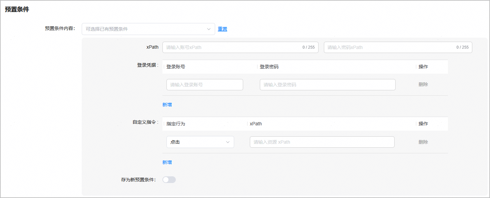
8. 在“选择测试设备”页面，您可以在搜索框中输入机型名称筛选机型，也可以根据设备形态、系统版本、API Level以及我的收藏、是否空闲机型、是否优惠机型等维度筛选您所需的机型。选择完成后，点击右上角的“提交”。

   

   * 系统根据您当前设置的测试场景及测试范围，判断设备是否支持本次测试。仅当设备完全支持您选择的测试场景和测试专项时，该设备卡片才会被高亮显示并支持选择；如果有1类测试专项（如性能测试）不支持，该设备卡片左下角将显示“当前设备不适配”字样，且该设备将被置灰不支持选择。
   * 所选待测设备的API Level值必须大于等于应用软件包的API Level值，且两者之间的差值需小于或等于5。如果不满足此条件，设备卡片左下角将显示“当前设备不适配”字样，并且该设备将被置灰不支持选择。如果无适配设备，您可以点击页面右上角的“上一步”，返回至“配置测试任务”页面，修改测试场景和测试范围后重试。
   * 点亮设备卡片右下角的可以收藏该设备。后续创建相同测试场景的测试任务时，通过“其他信息”过滤项中的“我的收藏”即可筛选出已收藏的设备。
   * 当前HarmonyOS 5及以上设备数量有限，为避免排队，建议您错峰在8点~12点期间进行应用软件包测试。

   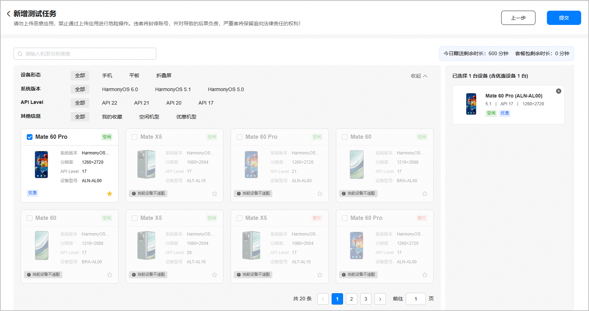

   如果被勾选的机型处于繁忙状态，您将在页面右侧看到红色区域的提示信息。建议您根据预计排队时长，合理安排测试时间。

   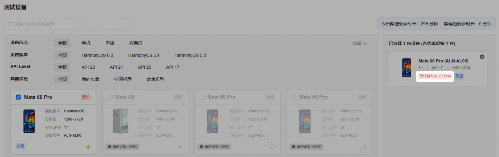
9. 在弹出的“使用详情确认”提示框中，点击“提交”。
   * 未开通按量付费且余额充足时，您可直接提交测试。

     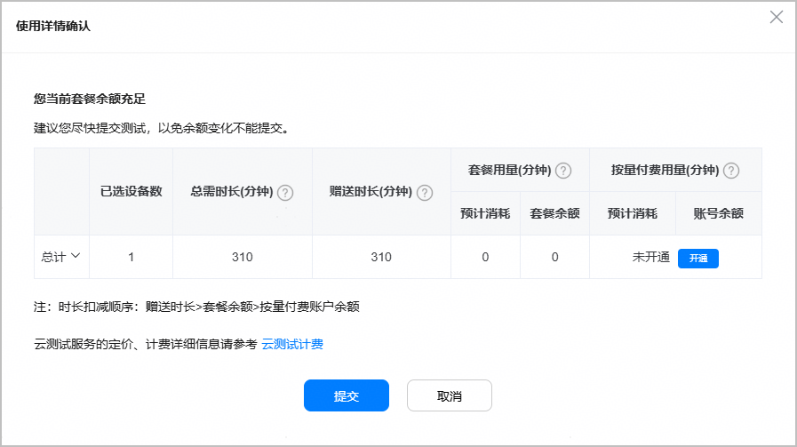
   * 未开通按量付费且余额不足时，建议您点击页面中的“购买套餐包”订购付费套餐，或者点击“开通”升级到付费档。具体请参见[订购付费套餐包](/docs/distribute/agc/agc-help-cloudtest-0000002235710242/agc-help-cloudtest-price-0000002254933346#section1973751217156)或[升级付费档](/docs/distribute/agc/agc-help-cloudtest-0000002235710242/agc-help-cloudtest-price-0000002254933346#section14462147149)。

     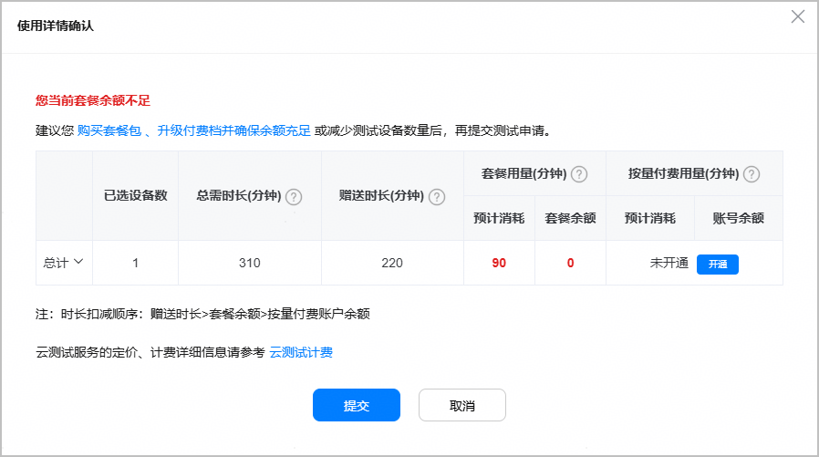
   * 已开通按量付费且余额充足，建议您尽快提交测试。

     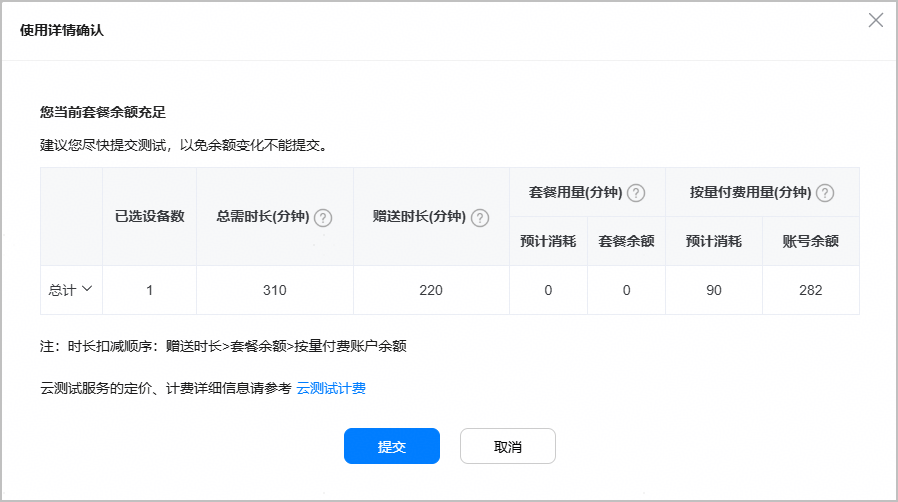
10. 在弹出的“提示”框中，点击“前往测试报告”。

    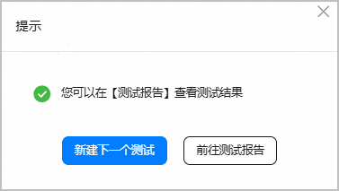
11. 系统返回“测试任务”页签，测试任务列表中最新创建的测试任务默认展示在最上方。
    * 您可以在测试任务未完成时，点击测试任务“操作”列的“查看报告”，进入测试报告概览页面查看测试任务的执行情况。

      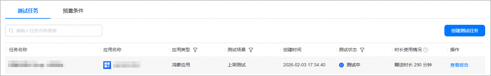
    * 您也可以在测试任务执行完成后查看测试报告。

      测试任务完成后，系统将发送邮件通知您，您可以点击邮件中的“云测试”链接返回到“测试任务”页签，并根据邮件中的测试场景、任务名称信息定位到具体的测试任务。

      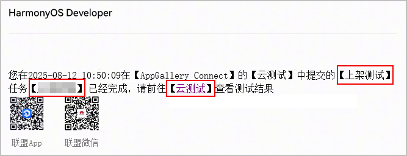
12. 上架测试的测试报告概览页面包含被测应用上架测试的总体情况，例如，被测应用相关信息，被测应用的兼容性检测情况以及测试结果详情。

    测试报告概览页的信息分布如下：

    * 应用信息区域

      为您展示被测应用的名称、版本、API Level、大小、适配设备等应用基本信息，以及该测试任务的测试场景、测试状态和测试时长信息。
    * 测试专项区域

      为您展示该测试任务所包含测试专项的统计信息，每个测试专项对应一个TAB页签，每个TAB页签内显示该测试专项的设备完成率、设备通过率和问题分布情况。

      

      测试报告页面展示的测试专项页签，由您创建上架测试任务时选择的“测试范围”决定。
    * 测试结果区域

      为您展示被测应用在所选测试设备上各项指标的测试结果。

    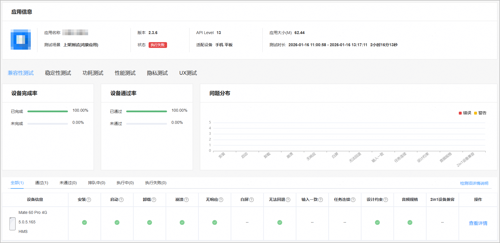
13. 点击测试专项区域的不同页签可查看被测应用的兼容性测试、稳定性测试、性能测试、功耗测试或UX测试情况。测试专项报告详情请参见[兼容性测试](/docs/distribute/agc/agc-help-cloudtest-viewreport-0000002289646669/agc-help-cloudtest-compatibilitytest-0000002289534101) | [稳定性测试](/docs/distribute/agc/agc-help-cloudtest-viewreport-0000002289646669/agc-help-cloudtest-stabilitytest-0000002254933876) | [性能测试](/docs/distribute/agc/agc-help-cloudtest-viewreport-0000002289646669/agc-help-cloudtest-performancetest-0000002289647209) | [功耗测试](/docs/distribute/agc/agc-help-cloudtest-viewreport-0000002289646669/agc-help-cloudtest-powerconsumptiontest-0000002255036916) | [UX测试](/docs/distribute/agc/agc-help-cloudtest-viewreport-0000002289646669/agc-help-cloudtest-uxtest-0000002289534109) | [隐私测试](/docs/distribute/agc/agc-help-cloudtest-viewreport-0000002289646669/agc-help-cloudtest-privacytest-0000002465035109)。
