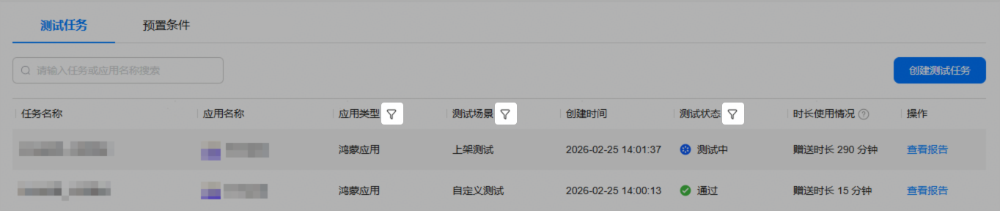
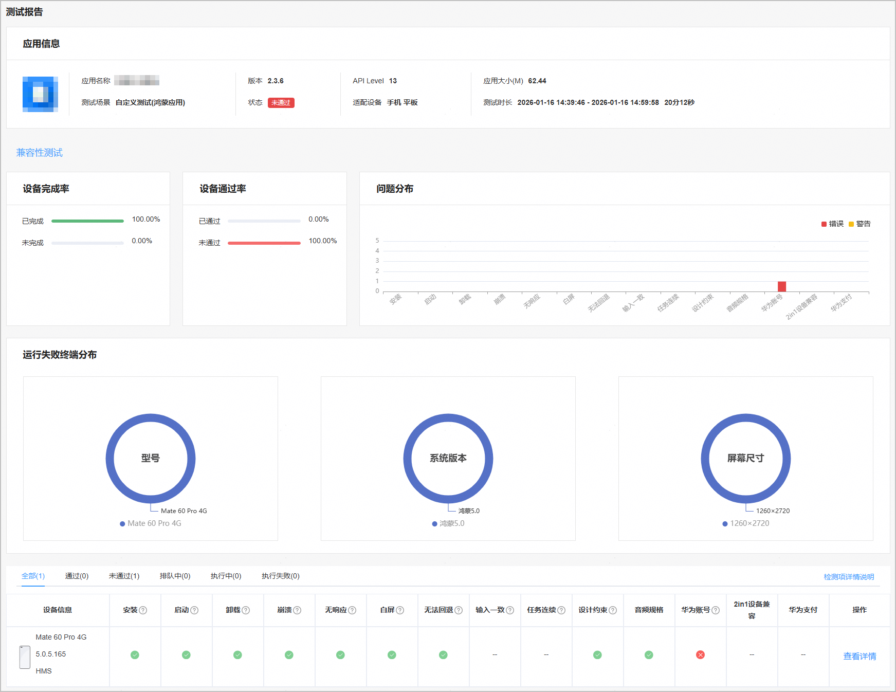
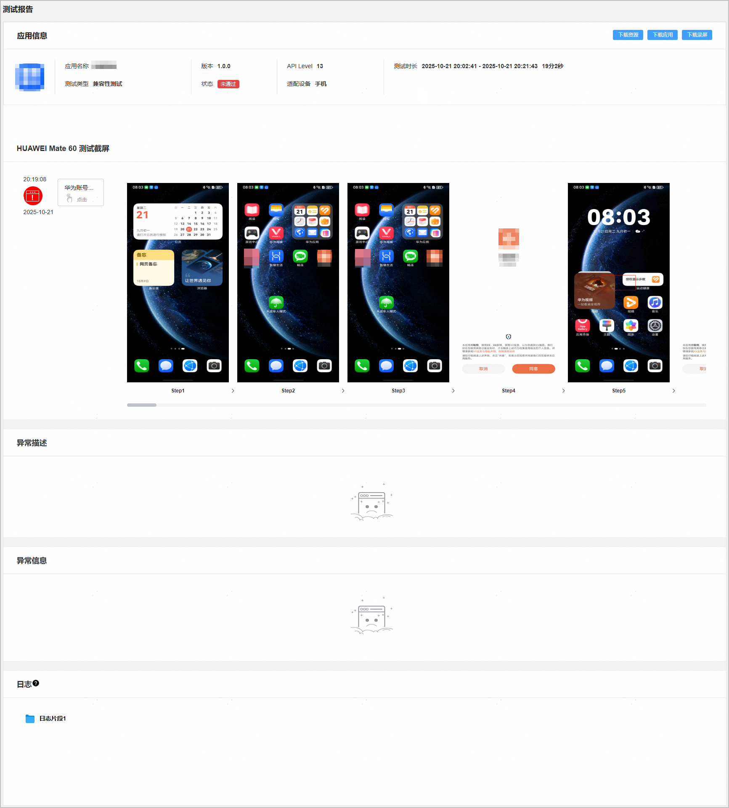
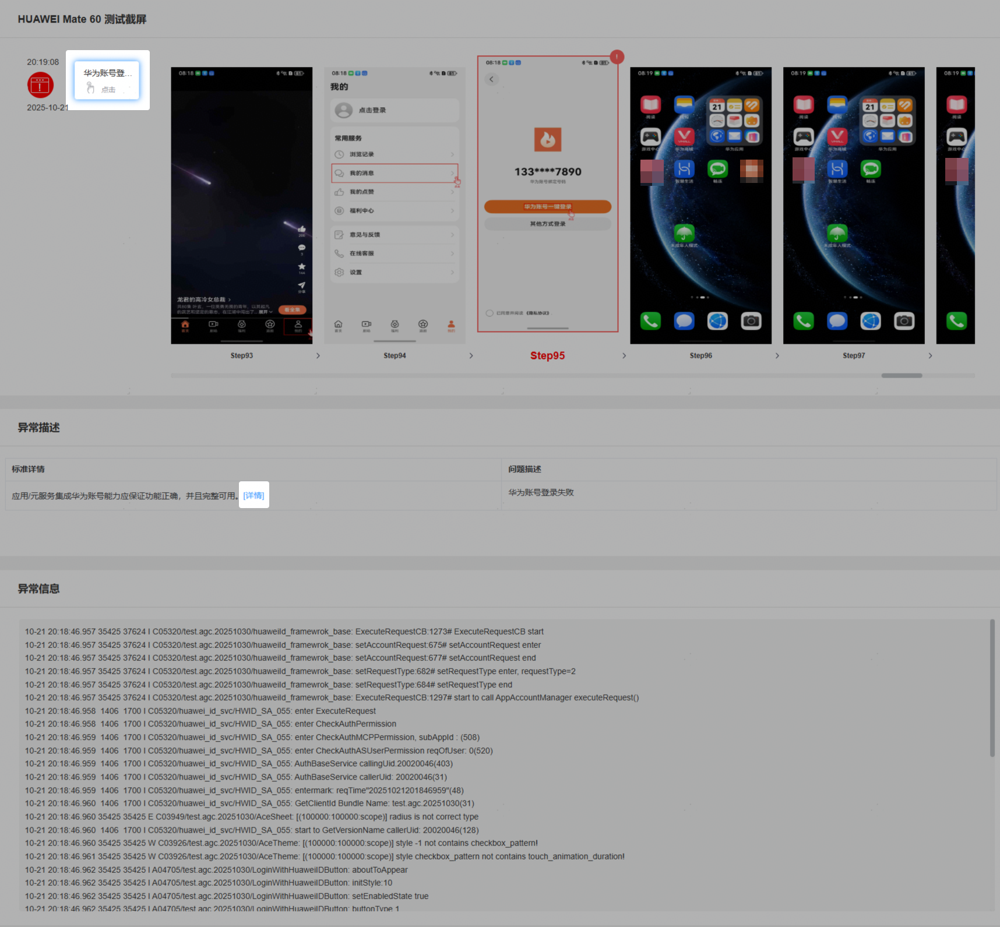
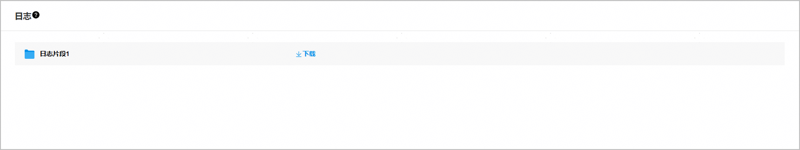

云测试为您提供全自动化的兼容性测试功能，用于检测应用或元服务在启动、崩溃、无响应、白屏、无法回退、输入一致、任务连续和设计约束等方面的兼容性问题。

#### 前提条件

您已成功创建测试任务，且配置的“测试范围”包含“兼容性测试”。

#### 查看测试报告

1. 登录[AppGallery Connect](https://developer.huawei.com/consumer/cn/service/josp/agc/index.html)，点击“开发与服务”。
2. 在项目列表中点击需要查看测试报告的项目。
3. 在左侧导航栏选择“质量 > 云测试”，进入云测试主界面。

4. 选择“测试任务”页签，您可以通过搜索框或测试任务列表中的“应用类型”、“测试场景”、“测试状态”右侧的筛选出您要查看的测试任务，然后点击“操作”列的“查看报告”进入测试报告页面。

   
5. 点击“兼容性测试”页签，您可从兼容性测试的测试报告中查看到应用整体的执行情况以及在所选手机上的具体执行情况。

   兼容性测试包含的检测项和检测标准如下表，您也可以点击测试结果区域的“检测项详情说明”查看各个检测项的检测标准。

   | **检测项** | **说明** |
   | --- | --- |
   | 安装 | 检测被测应用是否能够正常安装在其支持的OS版本或设备上。若可正常安装，则判断为通过；反之，则判断为不通过。 |
   | 启动 | 检测被测应用或元服务在其支持的OS版本或设备上是否出现无法启动、不能进入应用首页的情况。一般我们会对应用进行多次启动，任何一次出现上述问题均会被认为启动失败，判断为不通过。 |
   | 卸载 | 检测被测应用在其支持的OS版本或设备上安装后，是否能够正常卸载且未出现文件、数据和进程残留。若可正常卸载且不存在残留，则检测为通过；反之，则检测为不通过。 |
   | 崩溃 | 检测被测应用或元服务在其支持的OS版本或设备上运行过程时是否出现JsCrash崩溃异常。若未出现，则判断为通过；反之，则判断为不通过。 |
   | 无响应 | 检测被测应用或元服务在其支持的OS版本或设备上运行时是否出现无响应异常。若未出现，则判断为通过；反之，则判断为不通过。 |
   | 白屏 | 检测被测应用或元服务在其支持的OS版本或设备上运行时页面是否存在非设计的白屏。若出现，则判断为不通过；反之，则通过。 |
   | 无法回退 | 检测被测应用或元服务在其支持的OS版本或设备上运行时，进入某个页面后是否无法退出该页面且无法退出应用，只能强杀进程关闭。若出现，则判断为不通过；反之，则通过。 |
   | 输入一致 | 仅支持折叠屏。  检测被测应用或元服务在折叠屏上进行折叠态和展开态切换时是否出现输入内容丢失异常情况。若未出现，则判断为通过；反之，则判断为不通过。 |
   | 任务连续 | 仅支持折叠屏。  检测被测应用或元服务在折叠屏的展开态进行横竖屏切换时是否出现任务中断异常情况。若未出现，则判断为通过；反之，则判断为不通过。 |
   | 设计约束 | 检测被测应用或元服务在如下方面是否满足要求：  * 应用/元服务需配置其支持运行的最小和目标OS版本对应的SDK版本号。 * 应用需要支持64位so文件。 * 应用/元服务安装无兼容性问题。 * 应用/元服务升级后所带卡片名称不建议更改。 * 应用在申请权限时，需要在项目的配置文件中，逐个声明需要的权限。 * 应用/元服务需要明确支持的设备类型。 * 应用/元服务[程序包结构](/docs/dev/app-dev/getting-started/dev-fundamentals/application-package-structure)应符合规范。 * 所有HAP包的配置文件中bundleName、versionCode标签保持一致。 * 应用/元服务bundleName不可缺省。 * 应用/元服务versionCode不可缺省。 * 应用/元服务需要有图标。 * 应用仅支持非免安装。 * 元服务仅支持免安装。 * 元服务预加载对应模块类型不能为entry。 * 元服务需要合理设计申请手机号授权功能（仅自定义测试场景下的兼容性测试支持该检测项）。 * 元服务内所有包总和大小不超过10MB。 * 元服务单个包文件（包含其依赖的所有共享包）大小不超过2MB。 * 元服务禁止使用so文件。 * 卡片配置、卡片声明所支持的尺寸规格（参见supportDimensions字段取值范围）、卡片默认尺寸规格、卡片刷新方式应符合规范。具体详情请参见[卡片的配置文件](/docs/dev/app-dev/application-framework/form-kit/arkts-ui/arkts-ui-widget-configuration)。 * 卡片isdefault字段不可缺省。 * 卡片描述以索引展现。 * 卡片的显示名称有意义。 若某一项不符合要求，则判断为不通过；若全部符合要求，则通过。 |
   | 音频规格 | 检测被测应用或元服务在以下场景是否满足要求：  * 在音视频静音播放场景下，应用/元服务在静音播放时需采用share音频焦点策略，不得打断其他音频业务播放。 * 在短音、瞬态音播放场景下，应用/元服务需采用share、duck或pause音频焦点策略，实现与其它音频业务并发播放或短暂暂停后台音乐、听书等音频业务播放，不得打断其它音频业务并使其无法自动恢复播放。 |
   | 华为账号 | 检测集成华为账号能力（例如华为账号一键登录、华为账号登录或静默登录）的应用或元服务的登录功能实现是否正确。若登录功能实现正确且完整可用，则判断为通过；反之，则判断为不通过。  说明：  仅自定义测试场景下的兼容性测试支持该检测项。 |
   | 2in1设备兼容 | 检测支持2in1设备的应用或元服务使用鼠标、键盘、触控板操作时是否出现功能异常和兼容性问题。若出现，则判断为不通过；反之，则通过。 |
   | 华为支付 | 检测集成华为支付能力的应用或元服务在以下场景是否满足要求：  * 在商户基础支付场景下，支付页面需包含金额、余额、其他付款方式和确认支付等内容。 * 在免密支付/代扣场景下，支付页面需包含金额、余额、其他付款方式和签约产品等内容。 说明：  仅自定义测试场景下的兼容性测试支持该检测项。 |

   
6. 在“测试报告”下方的设备列表中，点击某款机型右侧“操作”列的“查看详情”，打开被测应用在这款机型上执行的测试详情。该测试报告详情中包含被测应用信息、测试时长、运行被测应用的测试设备、执行时间，同时重点提供测试发现的问题点、测试截屏、异常描述、异常信息和日志。

   
7. 当检测出应用存在异常问题时，测试截屏区域左侧会列出所有发现的错误及警告。您可点击这些错误或者警告，获得对应的测试截图和异常描述。例如：下图中检测出该应用出现了华为账号登录异常，您可点击左侧的“华为账号登录”错误，异常描述处将展示具体的体验建议，点击原因右侧的“详情”可查看应用体验建议细则或相关能力文档。如果存在异常信息，点击错误或警告后，异常信息处也会列出异常堆栈信息。

   
8. 在“日志”区域，点击鼠标悬停时出现的“下载”可将测试过程中打印的日志下载到本地查看。

   
