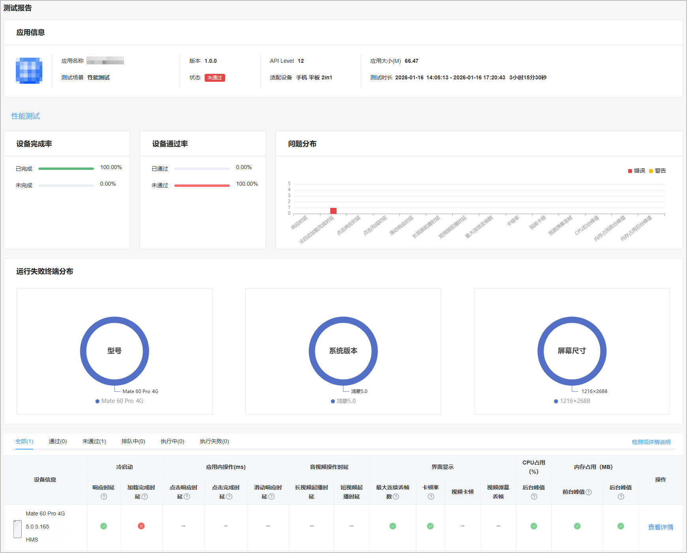
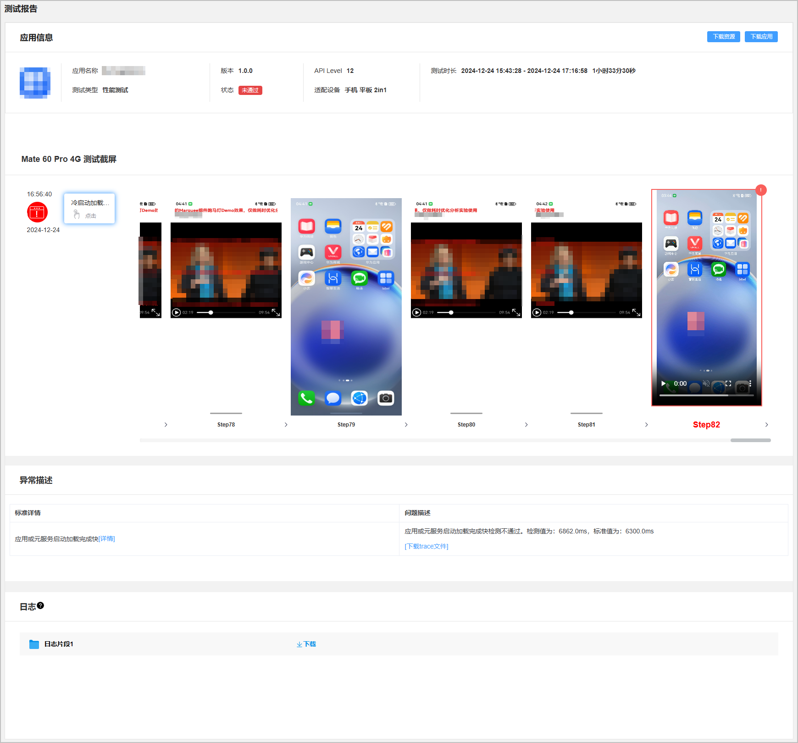

云测试提供的性能测试在真机设备上完成性能数据的采集，并深入分析应用或元服务性能薄弱点，支持检测冷启动时延、应用内操作时延、音视频操作时延、界面显示、内存占用、CPU占用等关键性能指标。

#### 前提条件

您已成功创建测试任务，且配置的“测试范围”包含“性能测试”。

#### 查看测试报告

1. 登录[AppGallery Connect](https://developer.huawei.com/consumer/cn/service/josp/agc/index.html)，点击“开发与服务”。
2. 在项目列表中点击需要查看测试报告的项目。
3. 在左侧导航栏选择“质量 > 云测试”，进入云测试主界面。
4. 选择“测试任务”页签，您可以通过搜索框或测试任务列表中的“应用类型”、“测试场景”、“测试状态”右侧的筛选出您要查看的测试任务，然后点击“操作”列的“查看报告”进入测试报告页面。

   

5. 点击“性能测试”页签，您可从性能测试的测试报告概要中查看基本的测试检测项检测结果。

   | 类别 | **检测项** | **说明** |
   | --- | --- | --- |
   | 冷启动 | 响应时延 | 检测被测应用或元服务的冷启动响应时延情况，时间起点：点击离手；时间终点：界面发生变化。  触屏：应用或元服务启动响应时延应≤250ms；键鼠：应用或元服务启动响应时延应≤250ms。 |
   | 加载完成时延 | 检测被测应用或元服务的冷启动加载完成时延情况，时间起点：应用首页铺满全屏；时间终点：应用首页所有占位符加载完成。  应用启动加载完成时延应≤6300ms；元服务启动加载完成时延应≤2200ms。 |
   | 应用内操作（ms） | 点击响应时延 | 检测被测应用或元服务内点击操作响应时延情况，时间起点：点击离手；时间终点：界面发生变化。  应用或元服务内点击操作响应时延应≤250ms。 |
   | 点击完成时延 | 检测被测应用或元服务内点击操作完成时延情况，时间起点：点击离手；时间终点：转场页面所有占位符加载完成。  应用内点击操作完成时延应≤3200ms；元服务内点击操作完成时延应≤6100ms。 |
   | 滑动响应时延 | 检测被测应用或元服务内滑动操作响应时延情况，时间起点：手指滑动；时间终点：界面发生变化。  抛滑（速度大于300mm/s ）场景：触屏响应时延应≤180ms；拖滑（速度小于100mm/s）场景： 触屏响应时延应≤150ms。 |
   | 音视频操作时延 | 长视频起播时延 | 检测在线长视频（超过半个小时视频）类应用播放视频时的起播时延情况。  应用在线视频播放起播时延应≤1200ms。 |
   | 短视频起播时延 | 检测在线短视频（一般小于5分钟）类应用快速切换视频时的起播时延情况。  应用内滑动视频，新视频起播时延应≤500ms。 |
   | 界面显示 | 最大连续丢帧数 | 检测被测应用或元服务冷启动、滑动、转场过程最大连续丢帧数情况。需满足如下要求：  * 应用或元服务的冷启动过程最大连续丢帧数应≤4。 * 应用或元服务的滑动过程最大连续丢帧数应≤4。 * 应用或元服务的应用内转场过程最大连续丢帧数应≤4。 |
   | 卡顿率 | 检测被测应用或元服务冷启动、滑动、转场过程卡顿率情况。需满足如下要求：  * 应用或元服务冷启动过程卡顿率应≤135ms/s。 * 应用或元服务滑动过程卡顿率应≤35ms/s。 * 应用或元服务的应用内转场过程卡顿率应≤135ms/s。 |
   | 视频卡顿 | 检测被测应用或元服务在线视频播放过程中视频卡顿情况。需满足如下要求：  在线视频播放过程中最大卡顿时长应≤300ms；在线视频播放过程中卡顿次数应≤2。 |
   | 视频弹幕丢帧 | 检测被测应用或元服务播放视频过程中弹幕丢帧情况。需满足如下要求：  应用视频播放过程中弹幕滚动帧率稳定，最大连续丢帧数应≤4。 |
   | CPU占用（%） | 后台峰值 | 检测被测应用或元服务退后台后CPU占用情况。  应用或元服务后台CPU占用峰值应&lt;10%。 |
   | 内存占用（MB） | 前台峰值 | 检测被测应用或元服务前台场景内存峰值占用情况。  建议应用在前台且亮屏使用过程中的内存占用应≤1500MB。 |
   | 后台峰值 | 检测被测应用或元服务动态内存峰值占用情况。  建议应用完成操作后，各类应用在后台的内存占用峰值应≤800MB。 |

   

6. 在“测试报告”下方的设备列表中，点击某款机型右侧“操作”列的“查看详情”，打开被测应用在这款机型上执行的测试详情。

   该测试报告详情中包含被测应用信息、测试时长、运行被测应用的测试设备、执行时间，同时重点提供测试发现的问题点、测试截屏、异常描述和日志。当检测出应用存在异常问题时，测试截屏区域左侧会列出所有发现的错误及警告，您可以点击这些警告或错误问题，获得对应的测试截图和异常描述信息。

   在“日志”区域，点击鼠标悬停时出现的“下载”可将测试过程中打印的日志下载到本地查看。

   
