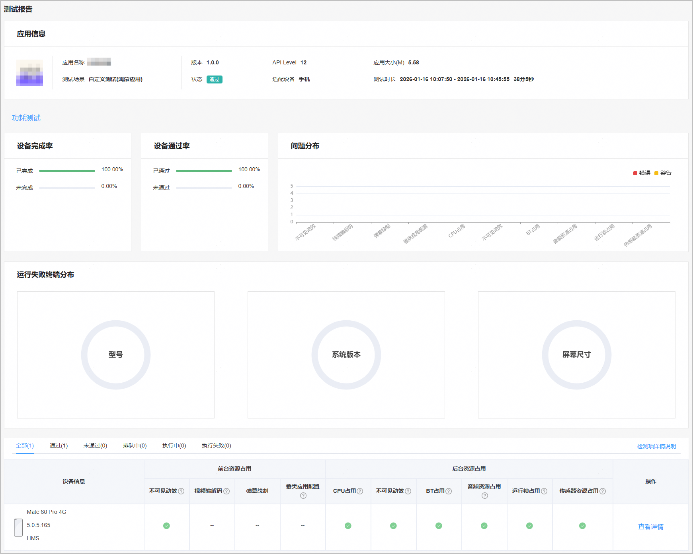
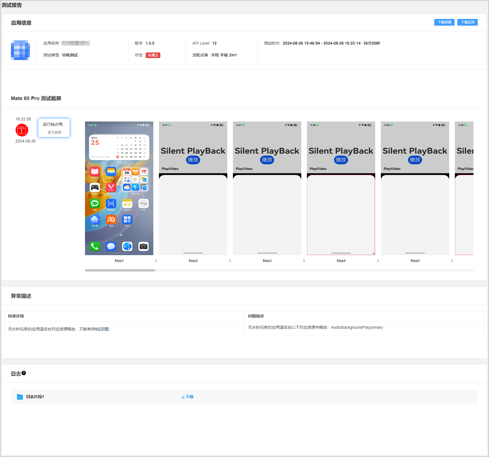

云测试提供应用或元服务在真机设备上的功耗测试功能，检测影响应用或元服务功耗的前台资源占用和后台资源占用的各项关键指标。

#### 前提条件

您已成功创建测试任务，且配置的“测试范围”包含“功耗测试”。

#### 查看测试报告

1. 登录[AppGallery Connect](https://developer.huawei.com/consumer/cn/service/josp/agc/index.html)，点击“开发与服务”。
2. 在项目列表中点击需要查看测试报告的项目。
3. 在左侧导航栏选择“质量 > 云测试”，进入云测试主界面。
4. 选择“测试任务”页签，您可以通过搜索框或测试任务列表中的“应用类型”、“测试场景”、“测试状态”右侧的筛选出您要查看的测试任务，然后点击“操作”列的“查看报告”进入测试报告页面。

   

5. 点击“功耗测试”页签，您可从功耗测试的测试报告概要中获得基本的测试检测项检测结果。

   | 类别 | **检测项** | **说明** |
   | --- | --- | --- |
   | 前台资源占用 | 不可见动效 | 应用或元服务在前台，对于用户不可见动效应当及时停止以释放资源，不允许有RS绘制空跑。 |
   | 视频编解码 | 应用或元服务视频播放场景下，必须使用硬件编解码器（芯片支持的格式）。 |
   | 弹幕绘制 | 应用或元服务视频弹幕场景下，弹幕绘图使用硬件加速，不要使用CPU绘图。 |
   | 垂类应用配置 | 应用或元服务要根据自身分类设置正确的应用类型。  音乐类应用设置正确的音乐类型，使用系统低功耗方案运行；导航类应用设置正确的应用类型，使用系统自带的导航场景的音效算法运行。 |
   | 后台资源占用 | CPU占用 | 应用或元服务后台进程CPU负载约束：  * 长时任务：后台进程持续10分钟CPU使用率不得高于80%。 * 短时任务：后台进程任务期间CPU使用率不得高于80%。 |
   | 不可见动效 | 应用或元服务切入后台或者灭屏场景，用户不可见的绘制或动效应当立刻停止。 |
   | BT占用 | 无长时任务的应用或元服务退到后台后不允许有蓝牙扫描。 |
   | 音频资源占用 | * 无长时任务的应用或元服务退到后台后禁止使用麦克风或扬声器。 * 应用或元服务退后台后需合理使用音频播放，开启音频播放时，禁止不写入数据或者写入静音数据等类似恶意行为。 |
   | 运行锁占用 | 无长时任务的应用或元服务退到后台后需释放占用资源，不能有持锁。 |
   | 传感器资源占用 | * 无长时任务的应用或元服务退到后台后禁止使用定位服务。 * 应用或元服务退到后台后禁止使用传感器资源。 |

   
6. 在“测试报告”下方的设备列表中，点击某款机型右侧“操作”列的“查看详情”，打开被测应用在这款机型上执行的测试详情。

   该测试报告详情中包含被测应用信息、测试时长、运行被测应用的测试设备、执行时间，同时重点提供测试发现的问题点、测试截屏、异常描述、异常信息和日志。您可点击测试截屏查看被测应用在所选手机上的遍历情况。

   在“日志”区域，点击鼠标悬停时出现的“下载”可将测试过程中打印的日志下载到本地查看。

   
