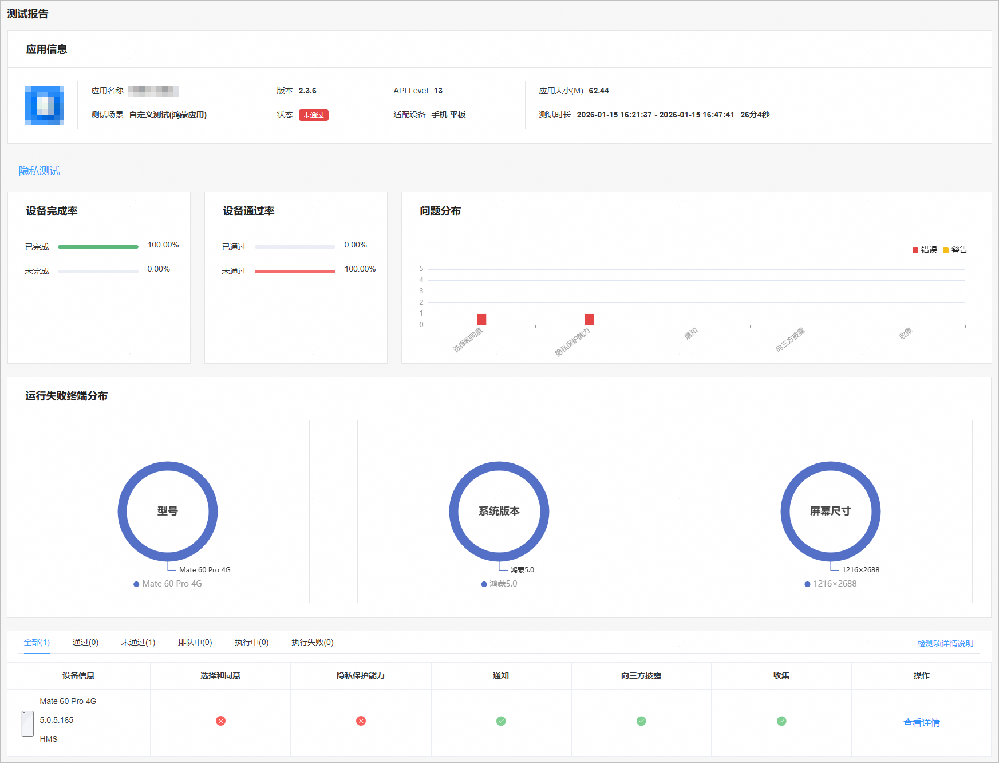
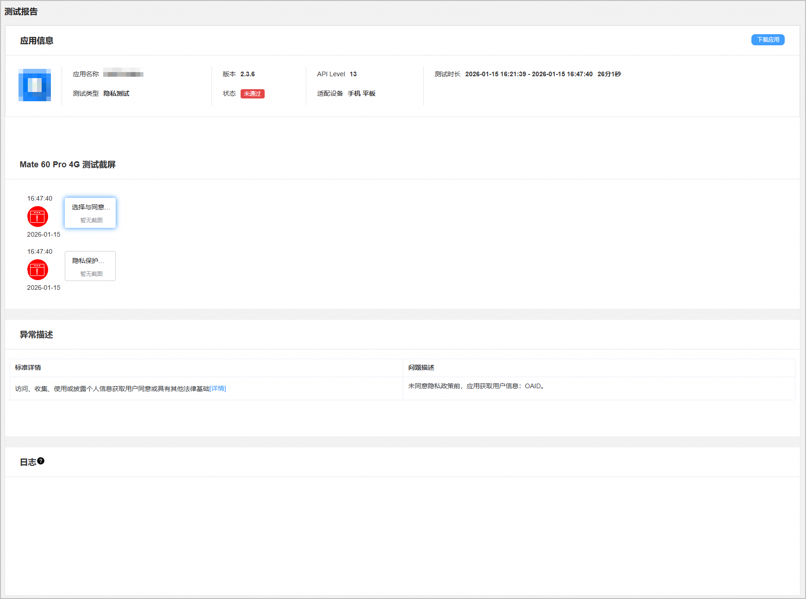

云测试提供应用或元服务在真机设备上的隐私测试能力，支持检测隐私政策的选择和同意、隐私保护能力、隐私通知、向第三方披露和收集等方面隐私问题，从而规范应用全生命周期的隐私行为。

#### 前提条件

您已成功创建测试任务，且配置的“测试范围”包含“隐私测试”。

#### 查看测试报告

1. 登录[AppGallery Connect](https://developer.huawei.com/consumer/cn/service/josp/agc/index.html)，点击“开发与服务”。
2. 在项目列表中点击需要查看测试报告的项目。
3. 在左侧导航栏选择“质量 > 云测试”，进入云测试主界面。
4. 选择“测试任务”页签，您可以通过搜索框或测试任务列表中的“应用类型”、“测试场景”、“测试状态”右侧的筛选出您要查看的测试任务，然后点击“操作”列的“查看报告”进入测试报告页面。

   
5. 点击“隐私测试”页签，您可从隐私测试的测试报告概览页中，查看应用或元服务在隐私方面相关指标项的检测结果是否满足要求。

   | **检测项** | **说明** |
   | --- | --- |
   | 选择和同意 | 检测被测应用或元服务在如下方面是否满足要求：  * 访问、收集、使用或披露个人信息，需获取用户同意或具有其他法律基础。 * 应用权限申请遵循最小化原则。 * 权限申请需告知权限使用目的，禁止诱导欺骗用户授权。 * 拒绝权限电话、通讯录、定位、短信、录音、相机、存储、日历等权限时，应用不应退出或关闭（**仅自定义测试场景下的隐私测试支持该检测项**）。 * 禁止应用频繁申请权限（**仅自定义测试场景下的隐私测试支持该检测项**）。 * 应用向用户申请权限的弹窗中，应用名需要与应用实际名称保持一致。 * 应用向用户申请权限，不应该在系统权限申请弹窗前进行自定义弹窗，对用户体验造成影响。 * 提供用户访问隐私政策的方式（**仅自定义测试场景下的隐私测试支持该检测项**）。 * 禁止提前、批量申请敏感权限。 若全部符合要求，则通过；若某一项不符合要求，则判断为不通过。 |
   | 隐私保护能力 | 检测被测应用或元服务在如下方面是否满足要求：  * 个人信息标签与应用实际收集的数据保持一致。 * 访问图库时应合理使用Picker。 * 访问联系人时应合理使用Picker。 * 访问音频文件时应合理使用Picker。 * 应用在首次启动、注册登录界面，需以显著方式提示用户阅读隐私政策（**仅自定义测试场景下的隐私测试支持该检测项**）。 * 隐私政策中的运营/主体单位、应用名称与上传应用的开发者、应用名称主体一致（**仅自定义测试场景下的隐私测试支持该检测项**）。 * 隐私政策网址需能正常打开。 * 应用内隐私政策内容需与使用标准化隐私托管服务生成的隐私政策一致。 若全部符合要求，则通过；若某一项不符合要求，则判断为不通过。 |
   | 通知 | 检测被测应用或元服务在如下方面是否满足要求：  * 面向儿童的应用提供针对儿童的隐私政策（**仅自定义测试场景下的隐私测试支持该检测项**）。 * 隐私政策应描述收集个人信息的目的、方式和范围。 * 应用隐私政策应提供个人信息处理者的名称（或姓名）和联系方式、行使数据主体权利的方式和程序，且能正常打开阅读（**仅自定义测试场景下的隐私测试支持该检测项**）。 * 隐私政策提供收集个人信息清单、向第三方共享信息清单。 若全部符合要求，则通过；若某一项不符合要求，则判断为不通过。 |
   | 向第三方披露 | 检测被测应用或元服务的隐私政策是否包括嵌入的SDK列表。若包括，则判断为通过；反之，则判断为不通过。 |
   | 收集 | 检测被测应用或元服务在如下方面是否满足要求：  * 禁止超频次收集个人信息。 * 禁止以特定频率收集个人信息。 * 禁止过度收集和使用个人信息。 若全部符合要求，则通过；若某一项不符合要求，则判断为不通过。 |

   
6. 在“测试报告”下方的设备列表中，点击测试机型右侧“操作”列的“查看详情”，进入测试报告详情页面。

   当系统检测出应用存在隐私相关问题时，测试截屏区域左侧会列出所有发现的警告或错误问题。您可以点击这些警告或错误问题，获得对应的异常描述信息。

   

   隐私测试与设备机型无关，单个隐私测试任务只会下发到一个设备上。

   
