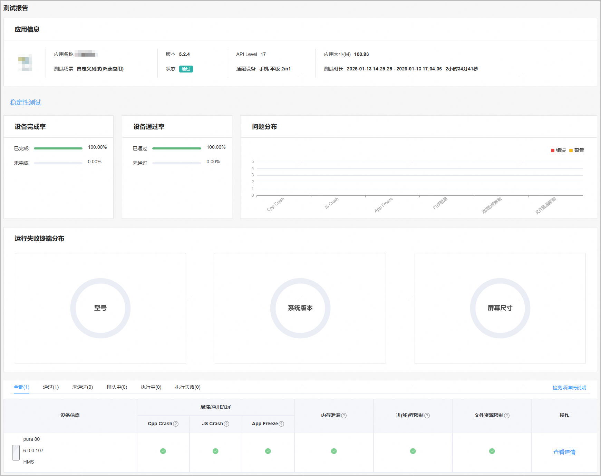
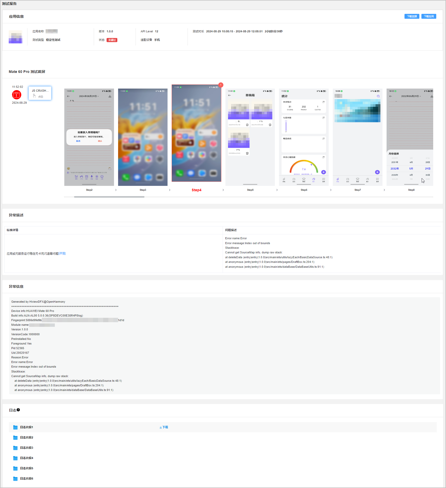

稳定性测试通过长时间遍历测试和随机测试，检测应用或元服务是否存在崩溃、冻屏、内存泄漏、进（线）程限制、文件资源限制等稳定性问题。

#### 前提条件

您已成功创建测试任务，且配置的“测试范围”包含“稳定性测试”。

#### 查看测试报告

1. 登录[AppGallery Connect](https://developer.huawei.com/consumer/cn/service/josp/agc/index.html)，点击“开发与服务”。
2. 在项目列表中点击需要查看测试报告的项目。
3. 在左侧导航栏选择“质量 > 云测试”，进入云测试主界面。

4. 选择“测试任务”页签，您可以通过搜索框或测试任务列表中的“应用类型”、“测试场景”、“测试状态”右侧的筛选出您要查看的测试任务，然后点击“操作”列的“查看报告”进入测试报告页面。

   
5. 点击“稳定性测试”页签，您可从稳定性测试的测试报告中获得基本的测试检测项检测结果。

   稳定性测试包含的检测项和检测标准如下，您也可以点击测试结果区域的“检测项详情说明”查看各个检测项的检测标准。

   | **检测项** | **说明** |
   | --- | --- |
   | Cpp Crash | 检测被测应用或元服务在指定时间内运行后是否出现Cpp崩溃。当1小时内发生Cpp崩溃的次数小于1，则此项检测通过；反之，则此项检测不通过。 |
   | JS Crash | 检测被测应用或元服务在指定时间内运行后是否出现JS页面崩溃。当1小时内发生JS页面崩溃的次数小于1，则此项检测通过；反之，则此项检测不通过。 |
   | App Freeze | 检测被测应用或元服务在指定时间内运行后是否出现冻屏卡死异常。当1小时内发生App Freeze的次数小于1，则此项检测通过；反之，则此项检测不通过。 |
   | 内存泄露 | 检测被测应用或元服务在指定时间内运行后是否出现内存泄漏错误。当1小时内发生内存泄露的次数小于1，则此项检测通过；反之，则此项检测不通过。 |
   | 进（线）程限制 | 检测被测应用或元服务在运行过程中是否出现资源过载行为，例如线程过载 、FD过载等。当应用或元服务fork的子进程和线程个数分别小于512时，则此项检测通过；反之，则此项检测不通过。 |
   | 文件资源限制 | 检测被测应用或元服务在运行过程中是否出现文件资源过载行为。当应用或元服务打开的文件句柄小于1024个时，则此项检测通过；反之，则此项检测不通过。 |

   
6. 点击某款机型右侧“操作”列的“查看详情”，进入测试报告详情页面，可查看测试过程中出现的测试截屏，异常描述、异常信息，以及日志。

   当检测出应用存在异常问题时，测试截屏区域左侧会列出所有发现的错误及警告。您可点击这些错误或者警告，获得对应的测试截图和异常描述。例如：下图中检测出该应用出现了JS CRASH异常，您可点击左侧的“JS CRASH”错误，测试截屏跳转到对应的截图Step4，异常描述处给出具体的体验建议，点击原因右侧的“详情”可查看应用体验建议细则。如果存在异常信息，点击错误或警告后，异常信息处也会列出异常堆栈信息。

   在“日志”区域，点击鼠标悬停时出现的“下载”可将测试过程中打印的日志下载到本地查看。

   
