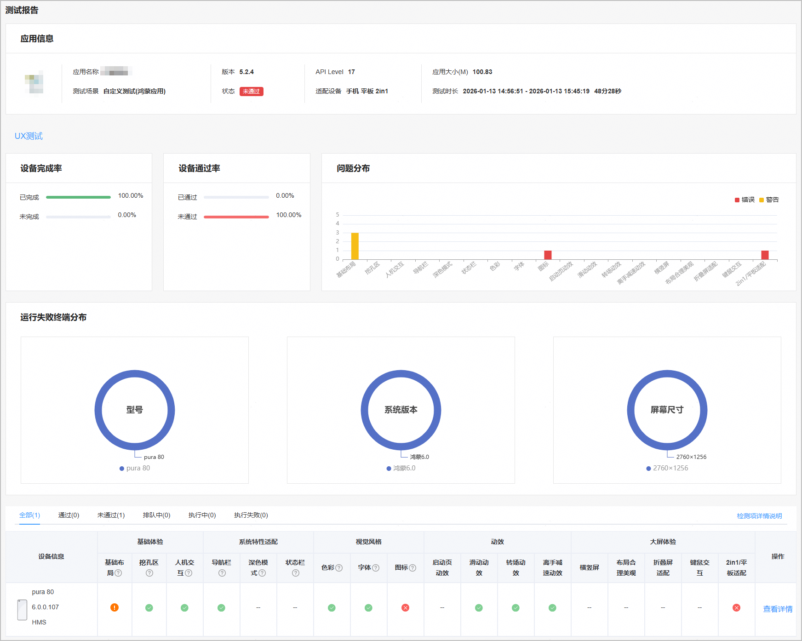
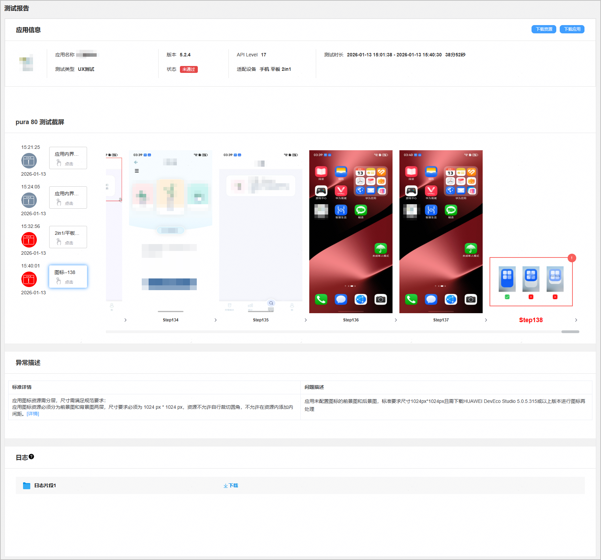

云测试提供应用或元服务在真机设备上的UX测试功能，支持检测的问题类别包括基础体验、系统特性适配、视觉风格、动效、大屏体验等。

#### 前提条件

您已成功创建测试任务，且配置的“测试范围”包含“UX测试”。

#### 查看测试报告

1. 登录[AppGallery Connect](https://developer.huawei.com/consumer/cn/service/josp/agc/index.html)，点击“开发与服务”。
2. 在项目列表中点击需要查看测试报告的项目。
3. 在左侧导航栏选择“质量 > 云测试”，进入云测试主界面。
4. 选择“测试任务”页签，您可以通过搜索框或测试任务列表中的“应用类型”、“测试场景”、“测试状态”右侧的筛选出您要查看的测试任务，然后点击“操作”列的“查看报告”进入测试报告页面。

   
5. 点击“UX测试”页签，您可从UX测试的测试报告概览页中，查看应用/元服务在基础体验、系统特性适配、视觉风格、动效、大屏体验方面相关指标项的展示效果是否满足要求。

   

   vp是屏幕密度相关像素，根据屏幕像素密度转换为屏幕物理像素。fp是字体像素，与vp类似适用屏幕密度变化，随系统字体大小设置而变化。

   关于像素单位vp、fp的详细说明请参考[布局基础](/docs/design/general-design-basics/layout/layout-basics#section197873139478)，px和vp单位的换算方法请参考[像素单位转换](https://developer.huawei.com/consumer/cn/doc/harmonyos-references/arkts-apis-uicontext-uicontext#vp2px12)。

   | 类别 | **检测项** | **说明** |
   | --- | --- | --- |
   | 基础体验 | 基础布局 | 不支持元服务。  应用支持在不同屏幕尺寸的设备上良好显示，图片、视频等界面元素应避免出现错位/截断/变形/模糊等问题。 |
   | 挖孔区 | 界面布局需要适配摄像头的挖孔区域，若重要信息或交互操作（例如底部页签/顶部页签、工具栏、标题栏、搜索框、输入框、悬浮按钮、横幅通知等）和挖孔区之间有遮挡，则需要局部避开挖孔区显示。  若重要信息或交互操作和挖孔区无遮挡，则无需避开挖孔区显示；悬浮类控件或功能（例如弹出框、侧边栏等），无需避开挖孔区显示；可以上下滚动的内容，例如列表、卡片等无需避开挖孔区显示。  若应用支持横竖屏旋转，则横竖屏的界面布局均需满足以上挖孔适配要求。 |
   | 人机交互 | * 应用内相关手势操作与系统手势无冲突。 * 长按手势持续时长在400ms-650ms范围内；双击手势的识别间隔最少70ms，最多400ms。 * 可点击热区尺寸需大于或等于40vp×40vp。 |
   | 系统特性适配 | 导航栏 | * 手机、折叠屏、平板等设备屏幕底部有导航条，应用或元服务需对底部导航条进行适配。   + 应用内的底部固定控件、输入键盘、应用底部的悬浮按钮等均需要进行向上抬高，避免和导航条互相遮挡，也要避免导航条底部背景色与应用内底部背景色不融合，需要为导航条提供沉浸的背景效果。   + 应用内的可滚动内容，需要能显示在导航条下方。当滚动到最底部时，要避免导航条遮挡导致最底部功能不可用。   + 应用内的弹出框、半模态等控件，需要向上避让导航条，避免交互误触。   + 沉浸式场景，例如游戏、全屏播放视频，导航条可自动隐藏，支持从底部上滑恢复显示导航条。 * 元服务头部导航栏满足规范（仅自定义测试场景下的兼容性测试支持该检测项）。 如需使用头部导航栏，建议您直接调用元服务官方提供的[AtomicServiceNavigation](https://developer.huawei.com/consumer/cn/doc/harmonyos-references/ohos-atomicservice-atomicservicenavigation)导航栏控件。若选择自行设计开发导航样式，请遵循：    + 整个标题栏区域信息简洁易识别。一级标题栏范围内有且仅最多显示 2 个元素（包含文本、图片标识、功能操作），非一级标题栏范围内有且仅最多显示3个元素（必须）。   + 合理设置标题栏高度，避免过低（低于44vp）出现元服务胶囊与标题栏、底部内容信息重叠问题（必须）。   + 标题栏范围仅有一个元素时，需要保证左对齐（必须）。   + 合理设置标题文本字号，一级标题建议加粗，默认字号不小于20fp，非一级标题默认字号不小于18fp（推荐）。   + 明确一级界面和非一级界面关系，非一级界面的标题栏必须提供返回或关闭按钮（必须）。 * 元服务胶囊需满足规范。 元服务所有界面的导航栏右侧统一配置元服务胶囊（Menubar），在界面设计中合理避让该区域，避免功能冲突。 |
   | 深色模式 | 不支持元服务。  应用开启深色模式后，界面深色风格呈现，界面各元素都可以清晰识别。 |
   | 状态栏 | 应用或元服务需要对状态栏进行适配显示。  * 采用沉浸一体化的背景设计，保证效果的整体性，避免状态栏区域被单独切割。 * 根据页面内状态栏区域的背景色选择合适的状态栏颜色 (黑/白)，保证状态栏信息的易读性。 * 避免在状态栏背景区域内采用左右半区对比差异过大的颜色，导致部分状态栏信息无法阅读。 |
   | 视觉风格 | 色彩 | 不支持元服务。  * 应用图标或标题文字与背景对比度大于3:1。 * 应用正文文字与背景对比度大于4.5:1。 |
   | 字体 | 文本字号不小于8fp。 |
   | 图标 | * 应用图标分为前景图和背景图两层，尺寸为 1024 px \* 1024 px。应用图标显示正常，图标显示完整。无明显的模糊、拉伸、压缩、锯齿等情况。 * 应用内的界面图标不小于8vp。 * 应用图标显示正常，无明显模糊、拉伸、压缩、锯齿等情况。 |
   | 动效（不支持元服务） | 滑动动效 | * 界面滑动到边界位置时存在反馈动效。 * 界面滑动有上下位移的反馈动效。 |
   | 转场动效 | 应用内相邻界面切换时存在转场动效。 |
   | 离手减速动效 | 对于可滑动页面，达到一定手速的滑动操作，在手离开屏幕后界面应继续移动，移动速度应该随时间缓慢下降，直至界面停止移动。 |
   | 大屏体验（支持应用和元服务） | 横竖屏 | 适配横屏显示，横竖屏切换过程流畅，不卡顿；屏幕比例接近1:1时横竖屏布局正常且一致。 |
   | 布局合理美观 | * 界面布局正常，图片、视频等界面元素不会发生错位、截断、变形、模糊等问题，关键信息内容展示正常。 * 展开态文字、图标的大小和数量不超过阈值： 展开态文字/图标大小为折叠态的 1~1.2 倍 (推荐)。  平板上文字/图标大小为直板机的 1~1.5 倍 (推荐)。  文字/图标放大倍数不超过1.2/1.5 倍 (必须)。  不建议一排图标数量过多导致信息过密，折叠屏上建议一排不超过8个图标。 * 展开态弹出框的高度为折叠态高度/直板机高度的1~1.2倍 (推荐)。 * 广告图控件占比要求：折叠屏展开态横竖屏时，广告图的图片高度不要超过一屏幕的1/2。 * 上下图文信息量适中。 * 单行文本字数要求：折叠屏展开态一行不超过40个字。 |
   | 折叠屏适配 | 设备开合过程流畅，不卡顿，界面布局正常，操作交互正常。 |
   | 键鼠交互 | * 当光标悬浮在应用或元服务的可交互控件上，控件或者光标需要提供对应的视觉反馈。 * 支持使用鼠标和触控板选中目标，被选中目标提供被选中状态的视觉反馈。 * 可通过鼠标和触控板框选多个目标。 * 当显示的内容超出应用窗口，可通过滑动页面浏览未显示的内容。 鼠标：  左键点击窗口滚动条，拖拽滚动浏览内容。  在内容区域滚动滚轮，纵向滚动浏览内容。  在内容区域Shift键+滚动滚轮，横向滚动浏览内容 (推荐)。  在内容区域点击滚轮，移动光标离开初始位置，内容沿光标偏离方向连续滚动 (推荐)。  触控板：  单指单击窗口滚动条，拖拽滚动浏览内容。  在内容区域双指横向/纵向滑动，横向/纵向浏览内容。 * 在文本内容区域，可对文本进行多选操作。 鼠标：  在目标文本上按住鼠标左键拖拽，选择任意长度文本。  在目标文本上双击鼠标左键，选择对应的词组。  在目标文本上三击鼠标左键，选择完整的段落。  触控板：  在目标文本上单指按住触控板后拖拽，选择任意长度文本。  在目标文本上单指双击，选择对应的词组。  在目标文本上单指三击，选择完整的段落。 * 应用中的主要任务流支持键盘的焦点导航，按Tab键激活焦点， Tab键和方向键移动焦点位置，Space键激活焦点操作，Enter键进入焦点内部。 |
   | 2in1/平板适配 | 暂不支持。 |

   
6. 在“测试报告”下方的设备列表中，点击某款机型右侧“操作”列的“查看详情”，进入测试报告详情页面。

   当系统检测出应用存在异常问题时，测试截屏区域左侧会列出所有发现的警告或错误问题。您可以点击这些警告或错误问题，获得对应的测试截图和异常描述信息。在“日志”区域，点击鼠标悬停时出现的“下载”可将测试过程中打印的日志下载到本地查看。

   
