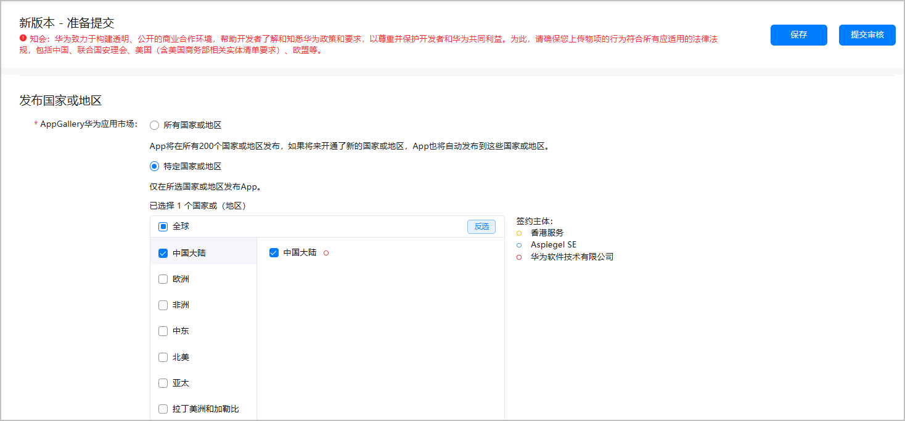
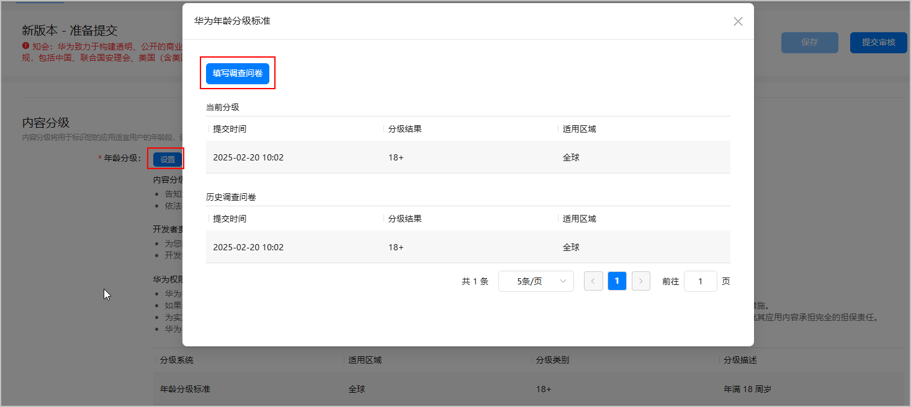
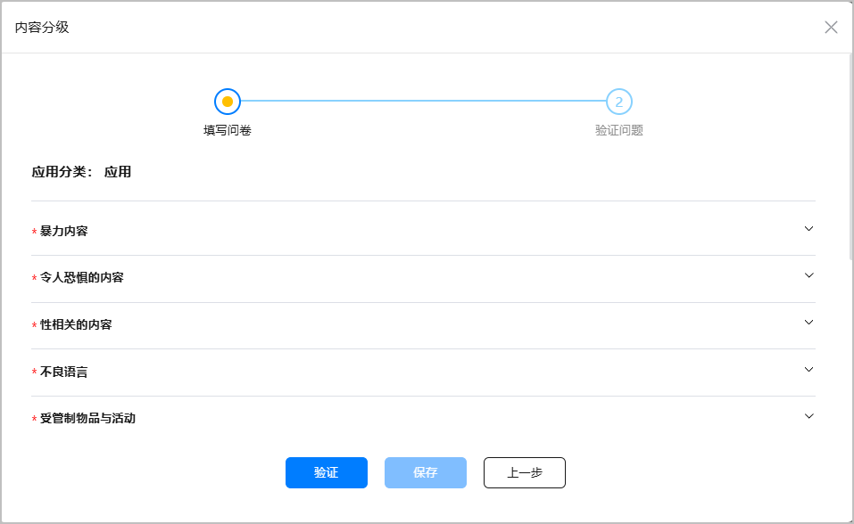
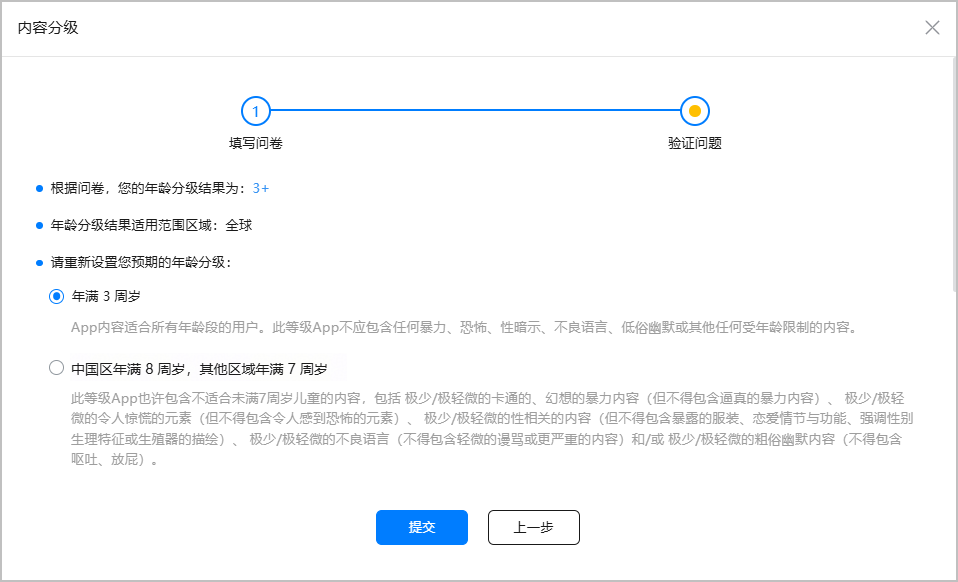
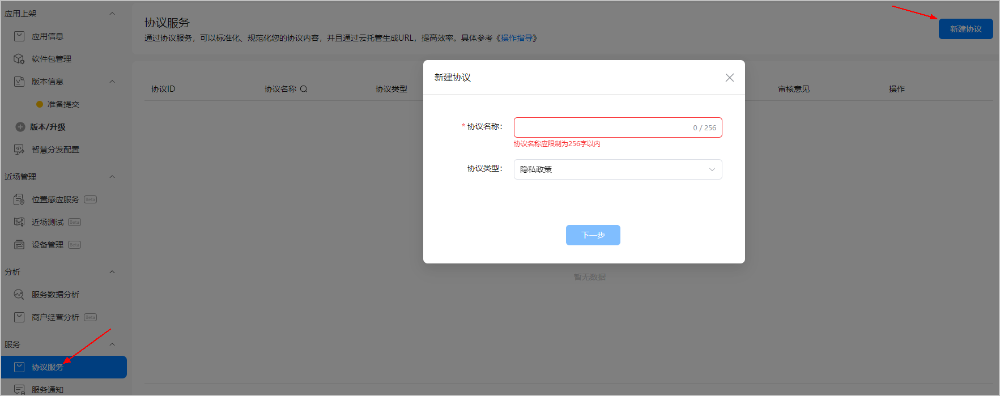
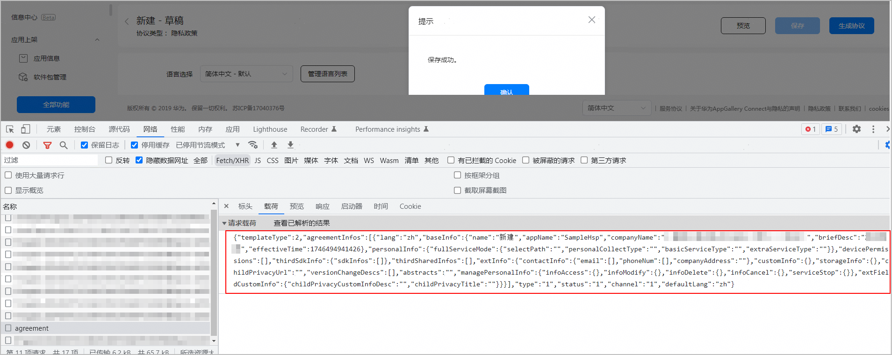

您可以通过AppGallery Connect API发布HarmonyOS应用/元服务。

具体流程如下：

1. [创建应用](#section107mcpsimp)
2. [开发应用](#section108mcpsimp)
3. [设置内容分级](#section116mcpsimp)
4. [配置应用信息](#section109mcpsimp)
5. [上传应用文件](#section110mcpsimp)
6. [更新应用文件/软件包信息](#section1513442818717)
7. [提交元服务资质审核](#section6977644414)
8. [管理用户协议](#section1941871612719)
9. [管理隐私政策协议](#section12499920101118)
10. [发布应用](#section111mcpsimp)


为了帮助您更好的开发，我们提供了[Publishing API示例代码](/docs/distribute/agc/agc-help-connect-api-0000002236015554/agc-help-connect-api-demo-0000002238448026)。您可以参考Demo工程中的示例代码编写您的应用程序。

#### 创建应用

由于当前Publishing API不支持直接创建应用，需要您先在AppGallery Connect手动创建，具体步骤参见[创建应用](https://developer.huawei.com/consumer/cn/doc/app/agc-help-app-0000002235710234)章节。创建应用后您需要参见[查看应用信息](/docs/distribute/agc/agc-help-app-0000002235710234/agc-help-view-app-info-0000002282674569)获取应用ID。

#### 开发应用

应用创建后您可以按照正常流程完成应用的开发并打包，本文档仅介绍Publishing API相关的开发方法，应用的功能开发请自行完成。

#### 设置内容分级

在使用Publishing API发布应用之前，您必须设置应用的内容分级。可以通过[申请年龄分级](/docs/distribute/agc/agc-help-publish-api-reference-0000002271160565/agc-help-publish-api-post-app-age-rating-0000002236201262)接口完成；也可以在AppGallery Connect中手动配置，具体配置方式如下。

1. 登录[AppGallery Connect](https://developer.huawei.com/consumer/cn/service/josp/agc/index.html)，选择“APP与元服务”。
2. 点击应用名称进入应用开发页面。
3. 选择“分发”页签，在左侧导航栏选择“应用上架 > 准备提交”。
4. 在页面右侧查看“发布国家或地区”是否已选择了应用需要发布的国家或地区。如果没有选择，需要手动选择。

   
5. 在“内容分级”栏点击“设置”，在弹出窗口中选择“填写调查问卷”。

   
6. 填写各项内容的相关问卷，完成后点击“验证”。

   
7. 修改完成后点击“提交”。

   

#### 配置应用信息


调用Publishing API前请确认已经[获取服务端授权](/docs/distribute/agc/agc-help-connect-api-0000002236015554/agc-help-connect-api-obtain-server-auth-0000002271134661)。

应用开发完成后您可以调用Publishing API完善AppGallery Connect上应用的详细信息，您需要关注的应用信息包括以下两部分：

* 应用基本信息：应用基本信息包括应用的语言、分类、国家码、开发者信息等，您可以调用[更新应用基本信息](/docs/distribute/agc/agc-help-publish-api-reference-0000002271160565/agc-help-publish-api-appinfo-update-0000002236201246)接口。如果您需要确定应用当前信息是否准确，您还可以调用[查询应用信息](/docs/distribute/agc/agc-help-publish-api-reference-0000002271160565/agc-help-publish-api-appinfo-query-0000002236041422)接口和[查询应用包名对应的appid](/docs/distribute/agc/agc-help-publish-api-reference-0000002271160565/agc-help-publish-api-appid-list-0000002271000617)接口，查询当前应用的详情。
* 语言描述信息：语言描述信息包括应用各个语种的描述信息，您需要调用[更新应用语言信息](/docs/distribute/agc/agc-help-publish-api-reference-0000002271160565/agc-help-publish-api-language-info-update-0000002271160569)接口完成语言描述信息的新增或修改，其中默认语言的信息必须填写。如果您需要删除某个语言描述信息，可调用[删除应用语言信息](/docs/distribute/agc/agc-help-publish-api-reference-0000002271160565/agc-help-publish-api-language-info-delete-0000002271000621)接口。

**更新应用基本信息接口**调用示例代码如下：

更新应用的分类、支持的设备、分发地区等。

```
public static void updateAppInfo(String domain, String clientId, String token, String appId) {
        HttpPut put = new HttpPut(domain + "/publish/v3/app-info?appId=" + appId);

	put.setHeader("Authorization", "Bearer " + token);
	put.setHeader("client_id", clientId);

	JSONObject keyString = new JSONObject();

	//Request Body
	keyString.put("defaultLang", "zh-CN");
	keyString.put("harmonyChildType", 10000000);
	//...

	StringEntity entity = new StringEntity(keyString.toString(), Charset.forName("UTF-8"));
	entity.setContentEncoding("UTF-8");
	entity.setContentType("application/json");
	put.setEntity(entity);

	try {
		CloseableHttpClient httpClient = HttpClients.createDefault();
		CloseableHttpResponse httpResponse = httpClient.execute(put);
		int statusCode = httpResponse.getStatusLine().getStatusCode();
		if (statusCode == HttpStatus.SC_OK) {
			BufferedReader br =
				new BufferedReader(new InputStreamReader(httpResponse.getEntity().getContent(), Consts.UTF_8));
			String result = br.readLine();

			JSONObject object = JSON.parseObject(result);
			System.out.println(object.get("ret"));
		}
	} catch (Exception e) {
		System.out.println(e);
	}

}
```

#### 上传应用文件

应用信息填写完整后，您需要准备应用的相关文件，例如APP软件包，以及应用的图标、介绍图片、视频文件等。通过[Upload Management API](/docs/distribute/agc/agc-help-connect-api-0000002236015554/agc-help-upload-api-guide-0000002271160549)上传应用文件为服务器对服务器上传，相对于AppGallery Connect中上传文件的上传速度更快，且不受您个人设备所在网络的限制。

上传应用文件包括如下步骤：

1. 获取上传文件地址

   在上传文件前，调用[获取上传文件地址](/docs/distribute/agc/agc-help-upload-api-reference-0000002236041486/agc-help-upload-api-upload-url-0000002236201294)接口获取文件上传的地址。
2. 上传文件

   调用[上传文件](/docs/distribute/agc/agc-help-upload-api-reference-0000002236041486/agc-help-upload-api-upload-file-0000002271160621)接口将文件上传到华为文件服务器。

#### 更新应用文件/软件包信息

* 图片、视频等文件上传成功后，您可以调用[更新应用文件信息](/docs/distribute/agc/agc-help-publish-api-reference-0000002271160565/agc-help-publish-api-app-file-info-update-0000002236041430)接口将文件的具体信息写入AppGallery Connect。
* 应用软件包上传成功后，您可以调用[更新应用软件包信息](/docs/distribute/agc/agc-help-publish-api-reference-0000002271160565/agc-help-publish-api-app-package-info-update-0000002236201250)接口将应用的软件包信息写入AppGallery Connect；调用[查询软件包编译状态](/docs/distribute/agc/agc-help-publish-api-reference-0000002271160565/agc-help-publish-api-query-compile-status-0000002236041434)接口，查询应用当前关联的软件包编译状态信息；调用[查询应用未处理的问题工单](/docs/distribute/agc/agc-help-publish-api-reference-0000002271160565/agc-help-publish-api-post-app-version-voc-0000002495233986)接口，查询用户反馈的应用问题，便于及时处理。

#### 提交元服务资质审核

将应用资源文件更新到应用后，可以调用资质审核管理接口，提交元服务资质审核。避免在提交发布后，因为资质不合规导致上架审核不通过。

1. 调用[查询需要上传的资质文件信息](/docs/distribute/agc/agc-help-publish-api-reference-0000002271160565/agc-help-publish-api-query-tag-qual-dependent-0000002271160577)接口，查询元服务需要上传的所有资质文件信息。在获取需要上传的资质文件清单后，调用[Upload Management API](/docs/distribute/agc/agc-help-connect-api-0000002236015554/agc-help-upload-api-guide-0000002271160549)上传资质文件。
2. 调用[提交资质审核任务](/docs/distribute/agc/agc-help-publish-api-reference-0000002271160565/agc-help-publish-api-post-qualification-review-0000002271000629)接口，提交元服务资质文件的审核。

   也可以调用[查询资质审核任务详情](/docs/distribute/agc/agc-help-publish-api-reference-0000002271160565/agc-help-publish-api-get-qualification-review-0000002236041438)接口、[修改资质审核任务](/docs/distribute/agc/agc-help-publish-api-reference-0000002271160565/agc-help-publish-api-put-qualification-review-0000002422530746)接口、[撤销资质审核任务](/docs/distribute/agc/agc-help-publish-api-reference-0000002271160565/agc-help-publish-api-cancel-qualification-review-0000002236201258)接口，对资质审核任务进行详情查询、修改和撤销。
3. 如果元服务资质审核已通过，但在提交上架时因资质问题被驳回，需要先调用[删除资质审核任务](/docs/distribute/agc/agc-help-publish-api-reference-0000002271160565/agc-help-publish-api-delete-qualification-review-0000002526538788)接口移除旧的资质材料，然后重新提交资质审核任务。

#### 管理用户协议

应用开发完成后，可以调用用户协议相关接口，完善用户协议信息。

1. 调用[新建用户协议](/docs/distribute/agc/agc-help-publish-api-reference-0000002271160565/agc-help-publish-api-create-user-agreement-0000002271160581)接口，创建用户协议。
2. 调用[更新用户协议](/docs/distribute/agc/agc-help-publish-api-reference-0000002271160565/agc-help-publish-api-update-user-agreement-0000002294845626)接口，修改用户协议信息。
3. 如果您需要确定用户协议信息是否准确，可以调用[查询用户协议列表](/docs/distribute/agc/agc-help-publish-api-reference-0000002271160565/agc-help-publish-api-query-user-agreement-0000002236041442)接口，查询当前用户协议详情。

#### 管理隐私政策协议

应用开发完成后，可以调用隐私政策协议相关接口，完善隐私政策协议信息。

1. 创建隐私政策协议。

   您可以在AppGallery Connect手动创建，具体步骤如下。
   1. 登录[AppGallery Connect](https://developer.huawei.com/consumer/cn/service/josp/agc/index.html)，选择“APP与元服务 > 协议服务”，点击“新建协议”。
   2. 选择协议类型为“隐私政策”，填写协议名称后，点击“下一步”。

      
   3. 根据应用真实信息填写模板，具体请参见[管理隐私声明](https://developer.huawei.com/consumer/cn/doc/app/agc-help-privacy-policy-0000002316794885)。
   4. 按F12打开浏览器调试工具，选择“网络”页签，点击“保存”按钮。搜索agreement，红框中内容即为隐私政策协议相关参数。

      
2. 隐私政策协议创建成功后，根据获取的参数，可以调用[更新隐私政策协议](/docs/distribute/agc/agc-help-publish-api-reference-0000002271160565/agc-help-publish-api-update-privacy-agreement-0000002328805169)接口，修改隐私政策协议信息。
3. 隐私政策协议信息补充完整后，可以调用[提交隐私政策协议](/docs/distribute/agc/agc-help-publish-api-reference-0000002271160565/agc-help-publish-api-put-privacy-agreement-0000002271000633)接口发布隐私政策协议，将协议从“草稿态”更新为“完成态”。
4. 如果您需要确定隐私政策协议信息是否准确，可以调用[查询隐私政策协议列表](/docs/distribute/agc/agc-help-publish-api-reference-0000002271160565/agc-help-publish-api-query-privacy-agreement-0000002328924925)接口，查询当前隐私政策协议详情。

#### 发布应用

应用信息补充完整后，您可以调用Publishing API提交应用发布，发布成功后您的应用将会在AppGallery中上架。

1. 应用文件上传成功后，您可以调用[提交发布](/docs/distribute/agc/agc-help-publish-api-reference-0000002271160565/agc-help-publish-api-app-submit-0000002271160585)接口提交发布请求。
2. 提交发布后，您可以调用[更新版本上架时间](/docs/distribute/agc/agc-help-publish-api-reference-0000002271160565/agc-help-publish-api-update-release-time-0000002271160573)接口，修改应用的版本上架时间；调用[更新分阶段发布](/docs/distribute/agc/agc-help-publish-api-reference-0000002271160565/agc-help-publish-api-phased-release-0000002271000625)接口，将分阶段发布修改为全网发布，或者更新分阶段发布的设置。
3. 如果您提交发布后还需修改其他应用信息，可以调用[撤销审核](/docs/distribute/agc/agc-help-publish-api-reference-0000002271160565/agc-help-publish-api-on-shelf-cancel-0000002271000637)接口。

**提交发布**调用示例代码如下：

```
public static void submit(String domain,String clientId, String token, String appId){
    HttpPost put = newHttpPost(domain + "/publish/v2/app-submit?appid="+ appId);

    put.setHeader("Authorization", "Bearer "+ token);
    put.setHeader("client_id", clientId);

    try{
        CloseableHttpClient httpClient = HttpClients.createDefault();
        CloseableHttpResponse httpResponse = httpClient.execute(put);
        intstatusCode = httpResponse.getStatusLine().getStatusCode();
        if(statusCode == HttpStatus.SC_OK) {
            BufferedReader br =
                newBufferedReader(newInputStreamReader(httpResponse.getEntity().getContent(), Consts.UTF_8));
            String result = br.readLine();

            JSONObject object = JSON.parseObject(result);
            System.out.println(object.get("ret"));
        }
    } catch(Exception e) {

    }
}
```
