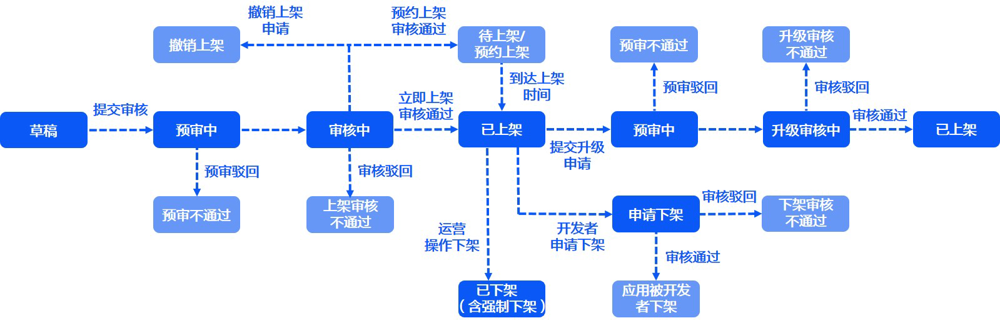
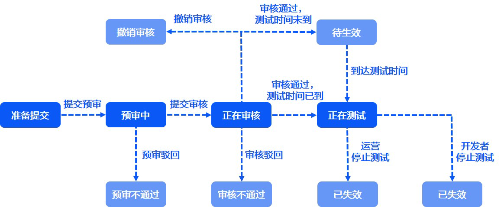

Publishing API中涉及使用**releaseType**字段标识**应用状态**，在不同**releaseType**字段值即应用的**发布方式**。

* **releaseType**为1，即全网发布。
* **releaseType**为6，即测试发布。

#### 全网发布的应用状态流转说明

全网发布方式时，应用状态的各状态间的转换如下图所示。

#### 测试发布的应用状态流转说明

测试发布方式时，应用状态的各状态间的转换如下图所示。

