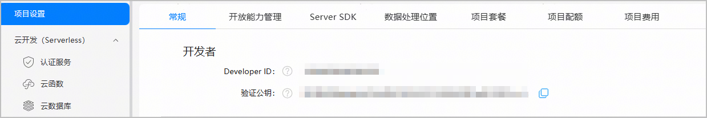

当华为服务器向开发者服务器发送带有签名字符串的通知消息时，开发者服务器可以使用验签公钥对通知消息进行验签，验签公钥需提前从AppGallery Connect获取。

1. 登录[AppGallery Connect](https://developer.huawei.com/consumer/cn/service/josp/agc/index.html)，选择“开发与服务”。
2. 在项目列表中找到您的项目，点击您的应用。
3. 在“项目设置 > 常规”页面的“开发者”栏点击“复制”获取“验证公钥”。

   
