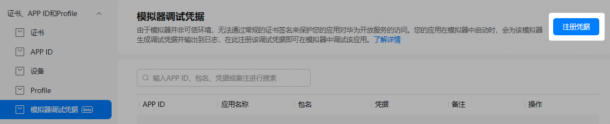
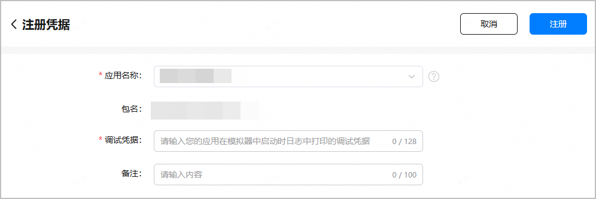
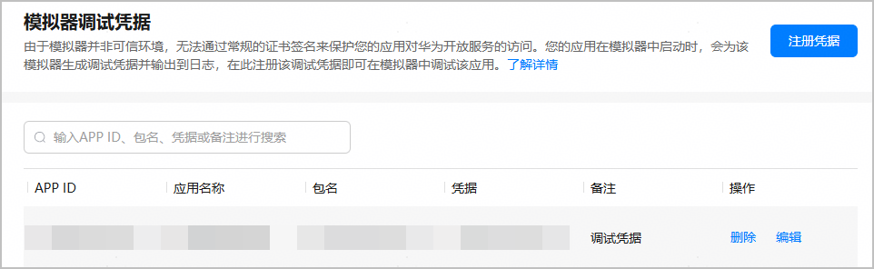

应用/元服务在模拟器中启动时，该模拟器下会生成调试凭据并输出到日志，您需要将生成的调试凭据注册到AGC云侧，才可在模拟器中调试应用/元服务。

* 一个团队账号下最多允许注册100个调试凭据。
* 一个应用/元服务可以注册多个调试凭据，但一个调试凭据仅能绑定一个应用/元服务。

#### 前提条件

* 您已在AGC为应用/元服务创建APP ID，具体操作请分别参见[为HarmonyOS应用创建APP ID](/docs/distribute/agc/agc-help-app-0000002235710234/agc-help-create-app-0000002247955506#section16423184171915) | [为元服务创建APP ID](/docs/distribute/agc/agc-help-app-0000002235710234/agc-help-create-atomic-service-0000002247795706#section16423184171915)。
* 您已获取应用/元服务在模拟器中启动时日志中打印的调试凭据。例如，获取Cloud Foundation Kit调试凭据可参考[使用模拟器调试](/docs/dev/app-dev/application-services/cloud-foundation-kit-guide/cloudfoundation-emulator)。

#### 操作步骤

1. 登录[AppGallery Connect](https://developer.huawei.com/consumer/cn/service/josp/agc/index.html)，选择“证书、APP ID和Profile”。
2. 在左侧导航栏选择“模拟器调试凭据”菜单，进入“模拟器调试凭据”页面，点击右上角“注册凭据”。

   
3. 在“注册凭据”页面，填写凭据信息后，点击“注册”。

   

   | 参数 | 说明 |
   | --- | --- |
   | 应用名称 | 选择需注册调试凭据的应用/元服务名称。  注意：  请确保此处选择的是模拟器中生成调试凭据的应用/元服务。如选择错误，注册的调试凭据将不可用。需先删除调试凭据，再重新绑定正确的应用/元服务。 |
   | 包名 | 选择应用名称后自动填充。 |
   | 调试凭据 | 输入已获取的模拟器调试凭据。 |
   | 备注 | 填写备注信息，如自定义的凭据名称等。不超过100字。 |
4. 调试凭据注册成功，“模拟器调试凭据”页面展示凭据信息。
   * 点击“编辑”，可修改凭据备注。
   * 点击“删除”，可删除凭据。

     

     凭据删除后无法再用于模拟器中调试应用/元服务，请谨慎操作。

   
