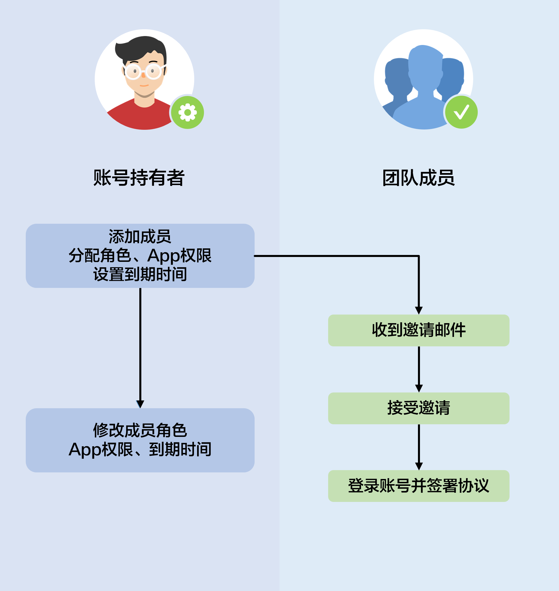

#### 账号持有者

“账号持有者”是一种特殊的角色，当您完成华为开发者账号注册时，您的账号将自动成为“账号持有者”。“账号持有者”拥有该账号在AppGallery Connect下所有资源的权限，包括用户与权限管理、应用的管理和上架、运营活动管理、协议签署等。一个账号只能有一个“账号持有者”，那就是该账号本身。

#### 团队账号

使用账号持有者登录AppGallery Connect后，您可以在该账号下维护您的应用。但是，当您的企业有多个人员需要共同维护您的应用时，如果允许所有职员都使用账号持有者登录，那么任何人都有随意创建和修改的权限，必然会导致管理混乱和安全风险。

此时，您可以要求所有需要参与应用维护的人员都注册一个华为账号，您使用账号持有者登录后可以邀请其他账号加入您的团队。账号持有者作为主账号，其他账号作为子账号，主账号可以给子账号分配不同的角色和权限，使用子账号登录时即可在权限范围内对主账号下的应用进行共同操作管理。每个团队中团队成员最多为200个，每个华为账号最多可加入10个团队。

账号持有者或其他有权限的账号可以为团队成员设置到期时间，超过到期时间的成员不再属于该团队，将无法访问该团队在AppGallery Connect的任何资源。如果需要，可以通过修改团队成员的到期时间，重新将该成员加入团队。

#### 角色与权限

AppGallery Connect提供了灵活的账号权限管理机制。账号持有者或其他有权限的成员在邀请其他成员账号加入团队时，可以为其指定一个或多个角色。团队成员加入成功后，该成员即可拥有该角色默认被授予的权限。

例如小王负责发布应用，可以分配APP管理员角色。小张负责回复应用评论，可以分配客服角色。小李负责签署协议，可以分配法务角色。所有团队成员在权限范围内共同对账号持有者下的资源进行操作管理。

AppGallery Connect预置的角色包括：

* 管理员：具有大部分权限，可以添加成员账号，并为其添加权限（法务角色除外）。
* APP管理员：管理被授权应用相关的各个方面，例如：开发、维护、众测、提交上架、定价、运营等，同时还可添加除管理员及法务之外的所有角色成员。
* 运营：负责应用上架后的运营工作。
* 开发：负责应用的开发和交付。
* 客服：负责回复用户评论和问题。
* 财务：管理财务信息。拥有查看：应用内付费、付费下载明细、财务报告等财务相关报表的权限。
* 法务：全团队唯一拥有代签协议权限的角色，可代表账号持有者签订AppGallery Connect协议。

每个角色对应的权限，请参见[角色与权限](/docs/distribute/agc/agc-help-developid-0000002235870038/agc-help-rolepermission-0000002271930352)。
