如果您需要更新自己的华为开发者账号信息，可以通过AppGallery Connect进行更改。

#### 查看和编辑个人信息

1. 在任意AppGallery Connect页面的右上角点击您的用户名，然后选择“个人信息”。

   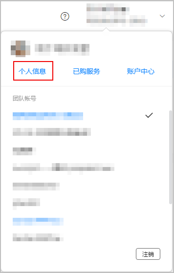
2. 页面将跳转到“用户与访问”模块的“用户 > 个人信息”页面，点击左侧页面用户名后的“管理”。

   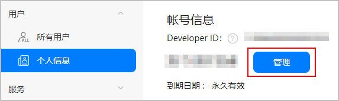
3. 页面将跳转到华为账号中心页面，您可以在“个人信息”菜单中查看或编辑您的个人信息。

   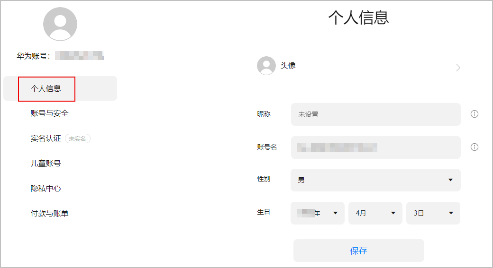

#### 保护账号安全

在华为账号中心页面，您可以在“账号与安全”菜单中设置，例如：修改登录账号名称，绑定手机号、邮箱，修改安全手机号、安全邮箱，重置密码，冻结账号等。

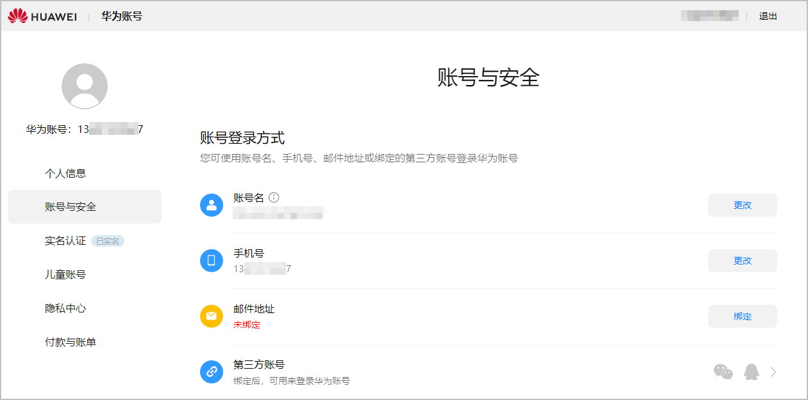

#### [h2]修改账号名

注册账号时生成的账号名是随机字符串， 为了方便好友通过账号名搜索到您，您可点击“账号名”右侧的“更改”修改账号名。但账号名仅可修改一次，修改后将不再展示“更改”按钮。

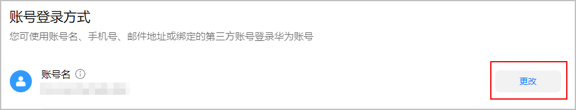

#### [h2]绑定手机号/邮箱

* 若您注册账号时使用了电子邮箱，系统将自动绑定电子邮箱，您也可点击“手机号”右侧的“绑定”，输入发送至安全手机的验证码后绑定手机号，这样您既可使用电子邮箱，也可使用绑定的手机号登录华为账号。

  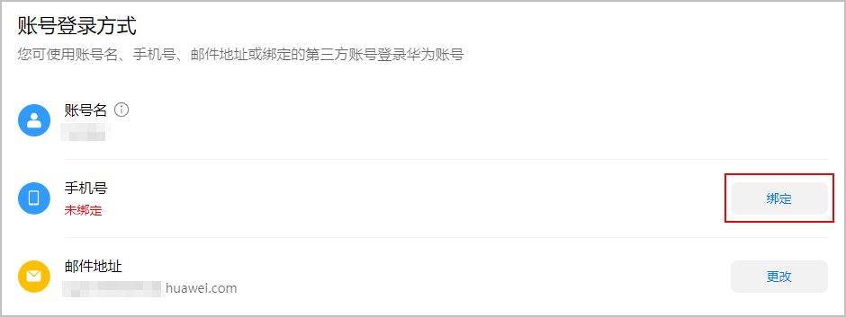
* 若您注册账号时使用了手机号，系统将自动绑定手机号，您也可点击“邮件地址”右侧的“绑定”，输入验证码后绑定电子邮箱，这样您既可使用手机号，也可使用绑定的电子邮箱登录华为账号。

  

  未设置“安全手机号”时，验证码将发送至注册账号时使用的手机号上。反之，验证码将发送至安全手机号上。

  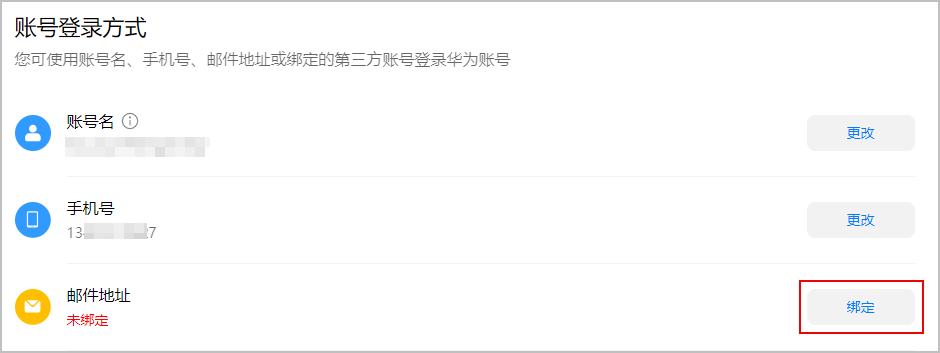

#### [h2]解绑邮箱

* 不支持解绑手机号，且已绑定手机号的情况下，才可解绑邮箱，否则只支持更改邮箱。
* 未设置“安全手机号”时，验证码将发送至注册账号时使用的手机号上。反之，验证码将发送至安全手机号上。

绑定邮箱后，您可根据需要进行解绑。点击“邮件地址”右侧的“解绑”，输入验证码后即可解绑邮箱。解绑后，您将不能使用原邮件地址登录华为服务、第三方应用和游戏。

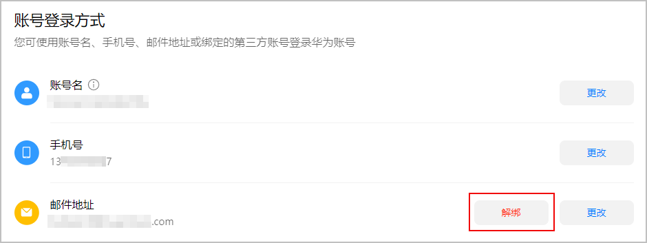

#### [h2]设置安全手机号/安全邮箱

为了保护您的账号安全，您可点击“设置”设置安全手机号，或者安全邮件地址。设置完成后，若开启了“双重验证”，后续登录华为账号、重置密码或验证身份时，均需进行密码和验证码的双重验证。

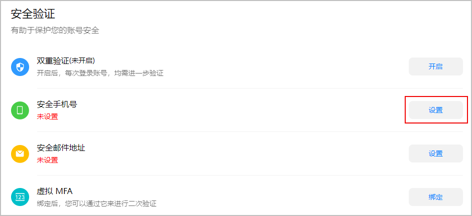

#### [h2]重置账号密码

1. 在“安全中心”区域，点击“重置账号密码”右侧的“重置”。

   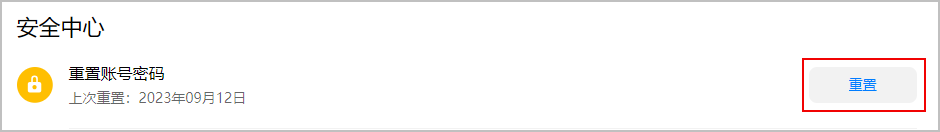
2. 若设置了安全手机号，需要输入安全手机验证码。然后在“重置账号密码”窗口，输入旧密码，并按照密码要求设置新密码，点击“确定”完成密码修改。

   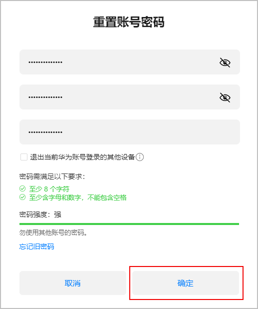

#### [h2]冻结/解冻账号

若您怀疑账号被盗，可点击“冻结账号”右侧的 ，在“冻结账号”弹出窗口点击“冻结”，输入要冻结的账号即可将账号紧急冻结。为保障您的账号安全，被冻结的账号将自动从设备上退出登录。

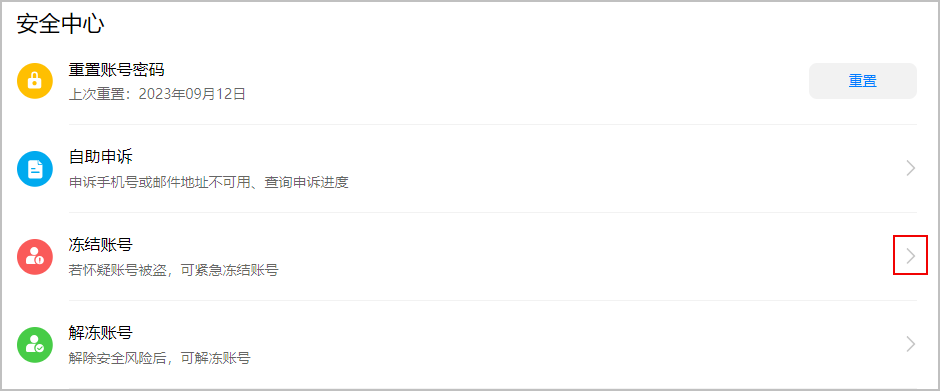

风险解除后，可点击“解冻账号”右侧的 ，在“解冻账号”弹出窗口点击“解冻”将账号解冻。

#### 查看角色和权限

在AppGallery Connect的“用户与访问”模块的“用户 > 个人信息”菜单下，您可以查看您当前账号的角色和权限。作为账号持有者，拥有所有权限，作为团队账号的子账号，角色和权限由账号持有者分配，有关团队账号的具体说明，请参见[管理团队账号](/docs/distribute/agc/agc-help-developid-0000002235870038/agc-help-manageaccount-0000002306610129)。

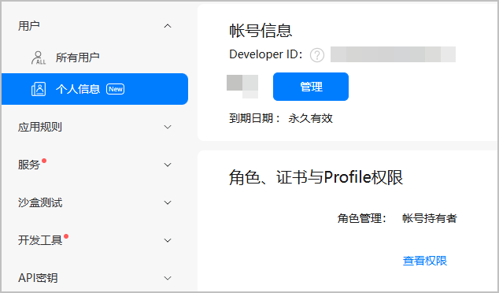

#### 设置通知消息

在AppGallery Connect的“用户与访问”模块的“用户 > 个人信息”菜单下，您还可以设置在发生某些重大事件时给您的邮箱地址或手机发送通知消息。

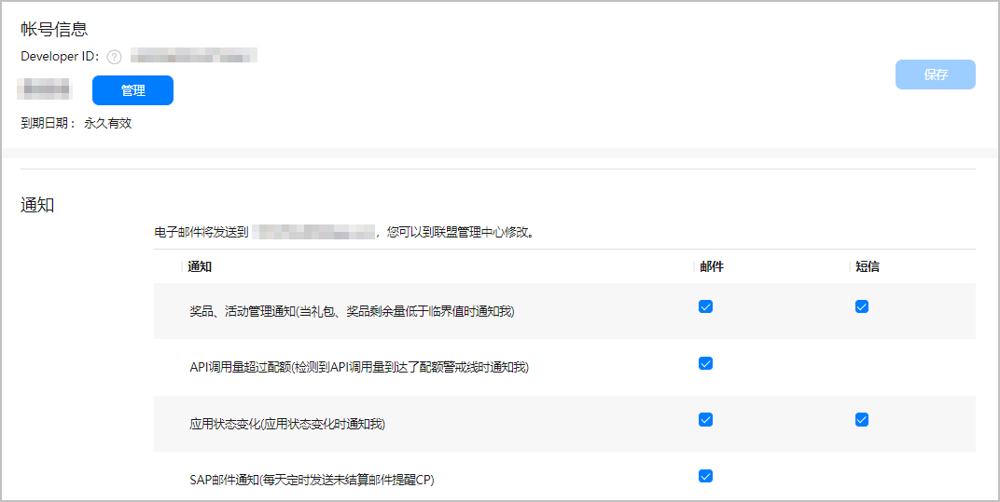
