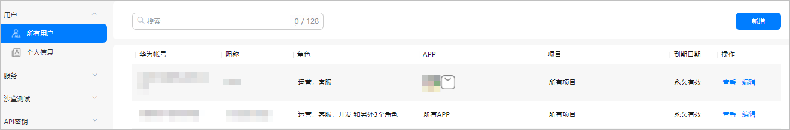
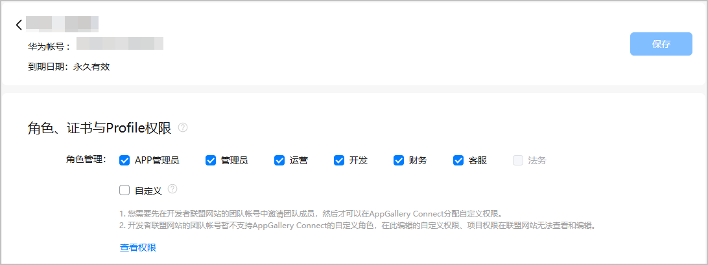
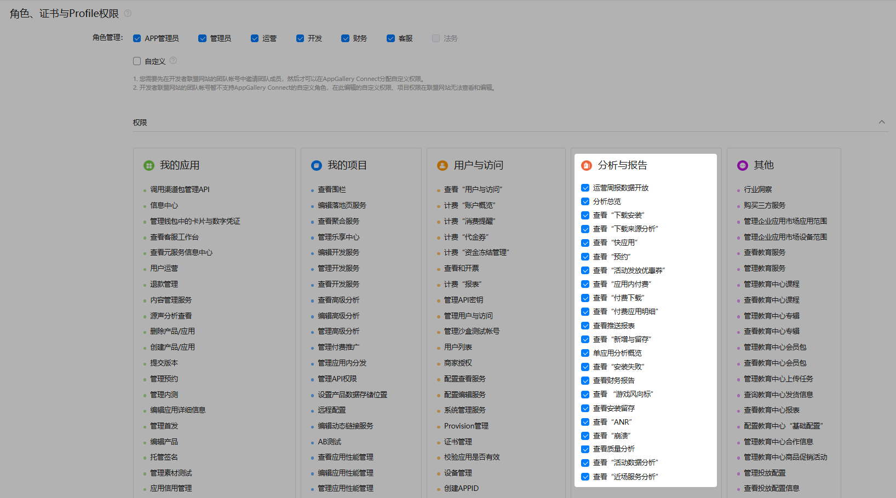
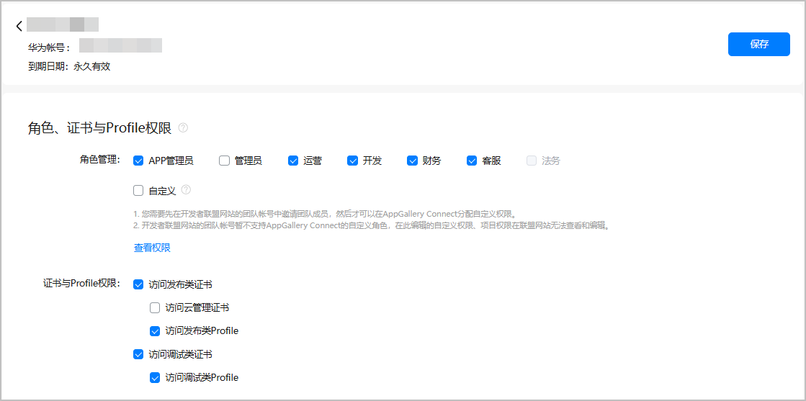
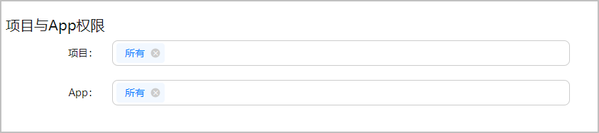
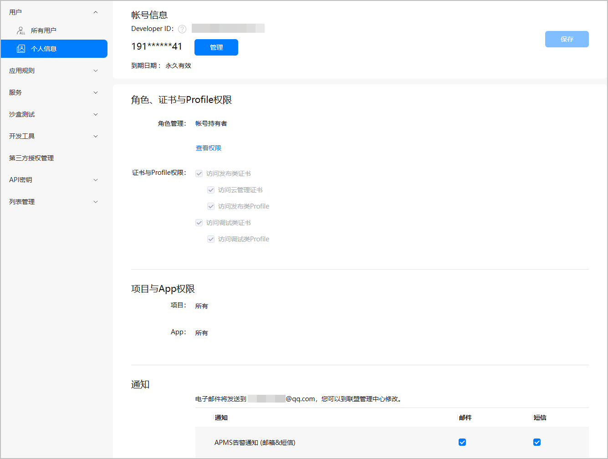
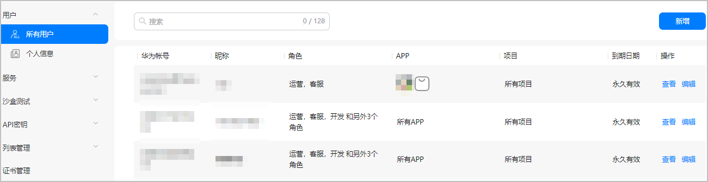
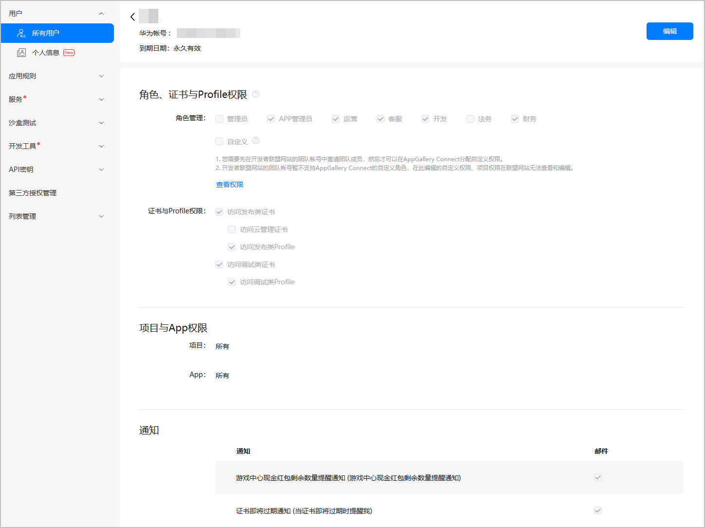
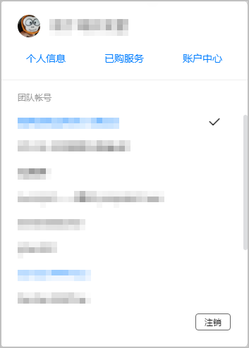

当您的企业有多个人员需要共同维护您的应用时，如果允许所有职员都使用账号持有者登录，那么任何人都有随意创建和修改的权限，必然会导致管理混乱和安全风险。此时您可以组建一个团队，邀请别的账号加入您的团队，并为其分配不同的角色和权限。

#### 添加成员账号

账号持有者或其他有“管理用户与访问”权限的成员（详见[角色与权限](https://developer.huawei.com/consumer/cn/doc/app/agc-help-rolepermission-0000002271930352)）可以向团队中添加成员，并赋予成员账号相关角色和权限，共同进行业务管理。

1. 登录[AppGallery Connect](https://developer.huawei.com/consumer/cn/service/josp/agc/index.html)，点击“用户与访问”。
2. 选择“用户 > 所有用户”，点击右侧“新增”。

   
3. 在提示弹窗中点击“前往”，可进入华为开发者联盟的团队账号页面添加团队成员，具体操作请参见[添加团队成员](https://developer.huawei.com/consumer/cn/doc/start/mta-0000001059655998#section179147174817)。

   

   在弹窗中勾选“下次不再提示”，下次点击“新增”将直接进入华为开发者联盟的团队账号页面。

#### 编辑团队成员信息

当团队中成员的工作内容有调整后，可以对团队成员的信息进行修改，包括：

* 编辑团队成员的角色权限。
* 编辑团队成员的项目与应用权限。
* 编辑团队成员的其他信息。

只有账号持有者或其他有“管理用户与访问”权限的成员才可以编辑成员权限。

#### [h2]编辑角色权限

1. 登录[AppGallery Connect](https://developer.huawei.com/consumer/cn/service/josp/agc/index.html)，点击“用户与访问”。
2. 选择“用户 > 所有用户”，在用户列表中找到需要变更角色权限的成员，点击“操作”列的“编辑”，进入编辑页面。

3. 在“角色、证书与Profile权限”区域，勾选“角色管理”中的角色，可为当前成员赋予该角色和对应的基础权限。

   

   * 当前支持为团队成员配置的角色有：管理员、APP管理员、运营、开发、财务、客服、法务、自定义，支持多选。
   * 部分角色之间有包含关系，勾选某一角色时，其包含的角色也会被自动勾选。例如，勾选“管理员”角色将自动勾选APP管理员、运营、开发、财务、客服角色。自动勾选的角色不支持取消勾选。

   
4. 自定义“分析与报告”权限。

   仅支持对“分析与报告”权限组下的数据权限进行自定义操作，角色预置的其他权限组下的权限皆不可变更。
   1. 点击“查看权限”，可查看已分配角色具备的基础权限，角色和权限的对应关系请参见[角色与权限](https://developer.huawei.com/consumer/cn/doc/app/agc-help-rolepermission-0000002271930352)。
   2. 取消勾选或者勾选“分析与报告”下的权限，自定义角色的数据权限。

      若角色有预置的“分析与报告”权限，则默认全部勾选。您可以根据角色的实际职能保留或剔除权限，以实现更灵活更清晰的数据权限配置。

      

      

      若在“分析与报告”自定义权限配置尚未保存时重新编辑角色，则自定义权限将被重置。
5. 为成员分配证书与Profile权限。配置完成后，点击页面右上角的“保存”。

   其中，“账号持有者”和“管理员”角色，默认拥有所有证书与Profile权限，且不可取消勾选。当为成员分配了“APP管理员”或“开发”角色时，可根据需要调整系统预置的权限。“运营”、“客服”、“财务”和“法务”角色不具备证书与Profile权限。

   

   * 只有为成员分配了证书与Profile权限，成员账号才能访问“证书、APP ID和Profile > 证书”和“证书、APP ID和Profile > Profile”菜单，以申请证书和Profile。
   * 不同类型证书和Profile的适用业务与场景，请参见[管理证书、指纹](https://developer.huawei.com/consumer/cn/doc/app/agc-help-cert-0000002270829389)和[管理Profile](https://developer.huawei.com/consumer/cn/doc/app/agc-help-profile-0000002270709473)。

   

   不同角色对证书与Profile支持的操作见下表：

   | 类型 | 子类 | 账号持有者 | 管理员 | APP管理员 | 开发 | 运营、客服、财务和法务 | 操作 |
   | --- | --- | --- | --- | --- | --- | --- | --- |
   | 发布类证书 | 发布证书、In-house发布证书、企业应用发布证书、二进制证书 | 支持 | 支持 | 支持 | 支持 | 不支持 | 查看、创建、下载 |
   | 支持 | 支持 | 支持 | 不支持 | 不支持 | 删除 |
   | 发布类Profile | 发布Profile、In-house发布Profile、企业应用发布Profile、指定设备发布Profile | 支持 | 支持 | 支持 | 支持 | 不支持 | 查看、创建、编辑、更新 |
   | 支持 | 支持 | 支持 | 不支持 | 不支持 | 删除 |
   | 调试类证书 | 调试证书 | 支持 | 支持 | 支持 | 支持 | 不支持 | 查看、创建、删除、下载 |
   | 调试类Profile | 调试Profile | 支持 | 支持 | 支持 | 支持 | 不支持 | 查看、创建、编辑、更新、删除 |
   | 试用调试Profile（ACL申请页面创建） | 支持 | 支持 | 支持 | 支持 | 不支持 | 创建 |

#### [h2]编辑成员的项目与应用权限

1. 登录[AppGallery Connect](https://developer.huawei.com/consumer/cn/service/josp/agc/index.html)，点击“用户与访问”。
2. 选择“用户 > 所有用户”，在用户列表中找到需要变更项目与应用权限的成员，点击“操作”列的“编辑”，进入编辑页面。

3. “项目与App权限”下可以为该成员分配项目权限和App权限。赋权后，该成员可以对拥有权限的项目和App执行操作。

   

   

   * 在项目输入框中选择一个项目后，App输入框中将自动带出该项目下的所有应用和元服务。在App输入框中根据App名称和包名选择一个App后，项目输入框中将自动带出该App所属的项目。已选项目和App可点击叉号进行删除。
   * 项目权限和App权限相互独立，互不影响。

#### [h2]编辑成员的其他信息

如需修改团队成员的其他信息，如昵称、邮箱地址、权限到期日期等，请参见[编辑团队成员信息](https://developer.huawei.com/consumer/cn/doc/start/mta-0000001059655998#section13103440145018)。

#### 删除成员账号

当某个团队成员离开团队后，需要删除该团队成员的账号。删除账号将会删除该账号关联的相关数据，请谨慎操作。

访问[开发者联盟网站](https://developer.huawei.com/consumer/cn)的“管理中心”，左侧导航选择“设置 > 团队账号”，[删除团队成员](https://developer.huawei.com/consumer/cn/doc/start/mta-0000001059655998#section15278112819518)。

#### 查看账号信息

团队成员可在AppGallery Connect查看自己和其他成员的信息。

#### [h2]查看个人信息

选择“用户 > 个人信息”，可查看您的团队账号、您在团队内的角色权限、项目与App权限、通知权限。

您还可修改自己的通知权限，操作后点击“保存”即可。

#### [h2]查看其他成员信息

非账号持有者需要前往联盟才可查看账号持有者信息，详见[查看账号信息](https://developer.huawei.com/consumer/cn/doc/start/maug-0000001058696103#section1315591414555)。

1. 选择“用户 > 所有用户”，可在用户列表中查看所有团队成员的账号、昵称、角色、APP权限、项目权限（默认为所有项目）和账号到期日期。

   
2. 点击“操作”列“查看”，可进一步查看对应成员账号的详细信息，包括角色权限、项目与App权限、通知权限。

   

   如需编辑成员账号信息，点击右上角“编辑”，即可快速进入编辑页面。编辑成员账号详细操作请参见[编辑团队成员信息](#section569243433414)。

#### 切换团队

如果您加入了多个团队账号，那么登录 AppGallery Connect 将默认进入您最后一次访问选择的团队，您可以随时切换团队。

1. 登录 [AppGallery Connect](https://developer.huawei.com/consumer/cn/service/josp/agc/index.html) 官网。
2. 点击右上角的账号。在下拉框中，具有“✔”标志的是目前登录账号所属的团队账号，使用鼠标点击其他账号名称即可切换到其他账号的管理中心。

   
