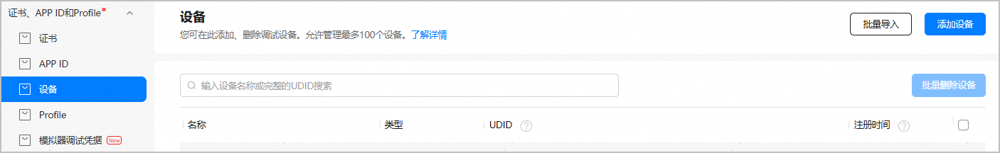
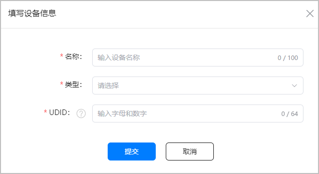
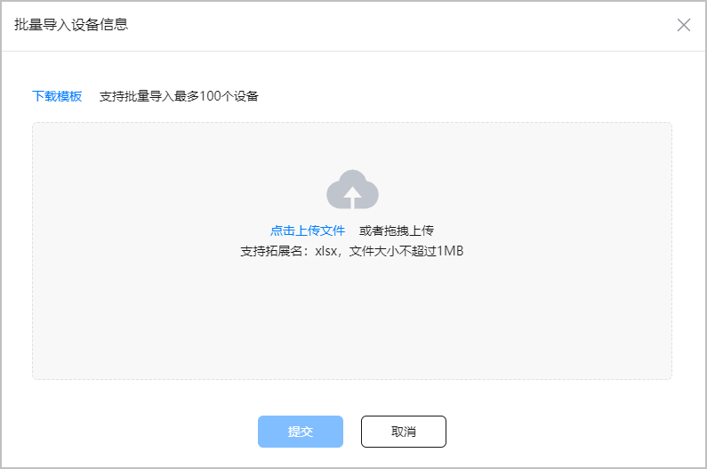
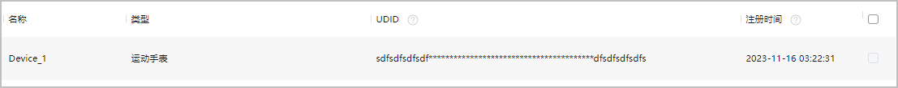
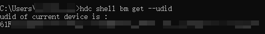
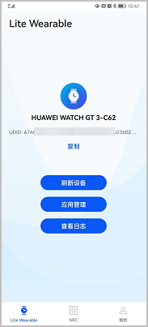

使用真机调试HarmonyOS应用/元服务、或者使用指定设备发布功能时，您需要先通过UDID将测试设备注册到AppGallery Connect设备列表，后续Profile中指定的设备将从此设备列表中选取。

一个账号每年最多可注册100台设备。

#### 操作步骤

1. 登录[AppGallery Connect](https://developer.huawei.com/consumer/cn/service/josp/agc/index.html)，选择“证书、APP ID和Profile”。
2. 在左侧导航栏选择“证书、APP ID和Profile > 设备”，进入“设备”页面。

   

   * 如需添加单个设备，点击右上角的“添加设备”，在弹出窗口填写设备信息，完成后点击“提交”。

     

     | 参数 | 说明 |
     | --- | --- |
     | 名称 | 自定义的设备名称，最大长度限制为100字符。为便于后续区分不同的测试设备，建议采用易识别的命名（如“XX用户”、“XX机型”）。 |
     | 类型 | 要注册的设备类型。 |
     | UDID | 设备唯一标识符，是由字母和数字组成的64位字符串。您可在对应的设备上获取其UDID。  关于各类型设备如何获取UDID，请参见[UDID获取方法](#section67331926102911)。 |
   * 如需批量添加设备，点击右上角的“批量导入”，在弹出窗口进行以下操作：

     

     1. 在弹出窗口中点击“下载模板”。
     2. 在下载的模板表格中填写批量导入的设备信息。

        | 参数 | 说明 |
        | --- | --- |
        | 名称 | 自定义的设备名称，最大长度限制为100字符。为便于后续区分不同的测试设备，建议采用易识别的命名（如“XX用户”、“XX机型”）。 |
        | 类型 | 要注册的设备类型。 |
        | UDID | 注意：  请将“UDID”列单元格设置为文本格式。  设备唯一标识符，是由字母和数字组成的64位字符串。您可在对应的设备上获取其UDID。  关于各类型设备如何获取UDID，请参见[UDID获取方法](#section67331926102911)。 |
     3. 点击“点击上传文件”，上传填写好的模板文件，或直接拖拽文件上传。完成后点击“提交”。
3. 设备添加成功后，您可在“设备”页面查看设备信息。设备UDID以密文展示，鼠标悬停至密文UDID上，可查看完整的UDID。

   存在多个设备时，可通过设备名称或设备UDID查询，设备名称支持模糊查询，UDID仅支持精确查询。

   

#### UDID获取方法

* 在手机、平板、PC/2in1、智能手表、智慧屏上获取UDID的方法如下：
  1. 在设备上打开USB调试权限。
  2. 使用PC连接设备后，打开命令行工具，进入HDC目录（一般为：*DevEco Studio安装目录*/sdk/default/openharmony/toolchains），输入**hdc shell bm get --udid**命令，获取设备的UDID。

     

     

     + 在HarmonyOS或macOS上获取UDID的命令相同。
     + 如果执行命令后返回“[Fail]ExecuteCommand need connect-key? please confirm a device by help info”，可能是PC连接了多台调试设备，或者模拟器和真机同时使用。
       - 如果同时连接了模拟器和真机，请断开模拟器。
       - 如果连接了多台设备，每次执行命令时需要使用-t参数指定目标设备的标识符。您可先执行**hdc list targets命令**查询连接的设备，再通过**hdc -t *connect-key* shell bm get --udid**命令指定要连接的目标设备，其中connect-key为设备标识符，即**hdc list targets**返回的信息。

* 运动手表的UDID获取方法如下：
  1. 使用华为手机，从华为应用市场下载并安装应用调测助手和运动健康app。

     

     如无法下载到应用调测助手，请使用非HarmonyOS NEXT手机。
  2. 打开应用调测助手，选择底部的“Lite Wearable”页签。
  3. 点击“连接设备”，自动打开运动健康app。
  4. 在运动健康app的“设备”页签中，点击“添加设备”。
  5. 在“手表”列表，选择对应的手表型号。
  6. 点击“开始配对”，按界面指引完成运动手表与华为手机的配对。配对成功后，应用调测助手界面会显示运动手表型号和UDID， 点击“复制”即可复制UDID到剪贴板。

     
