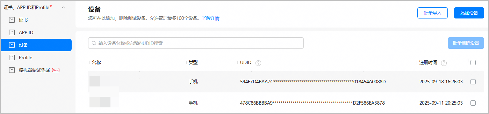
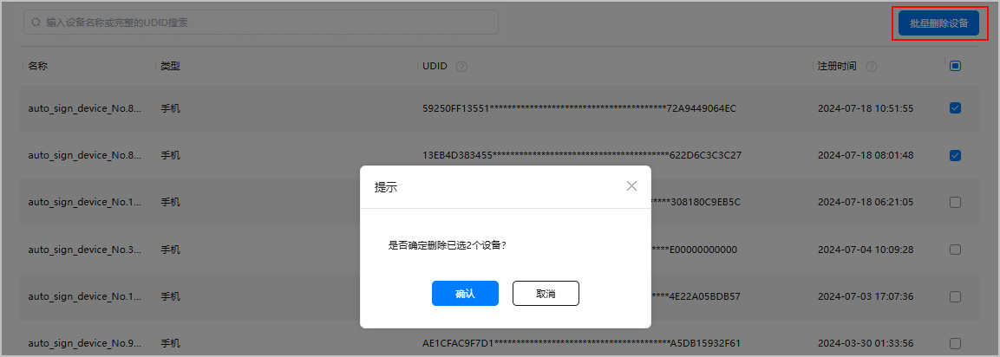
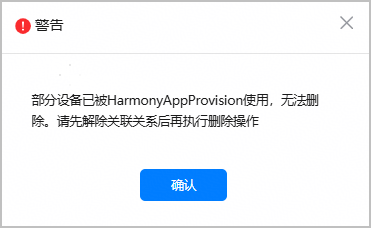
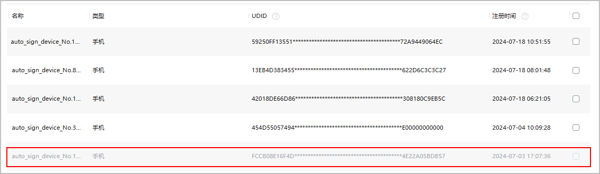

当后续不再使用某个已注册的设备时，您可以将该设备从列表中删除。

1. 登录[AppGallery Connect](https://developer.huawei.com/consumer/cn/service/josp/agc/index.html)，选择“证书、APP ID和Profile”。
2. 在左侧导航栏选择“证书、APP ID和Profile > 设备”，进入“设备”页面。

   
3. 勾选一个或多个需要删除的设备，点击“批量删除设备”，在弹出窗口中点击“确认”。

   

   若出现如下提示，表示设备已被Profile绑定。参考如下操作解绑：

   

   1. 左侧菜单选择“Profile”。
   2. 点击待解绑的Profile的“编辑设备”。
   3. 去勾选待删掉的设备，将设备与Profile解绑。
4. 返回设备列表，可查看设备删除情况。
   * 如设备在添加后一年内被删除，该设备将置灰显示且不再可用，效果如下图所示，但仍占用此一年的设备名额。设备添加时间满一年后，该已被删除的设备将被自动从列表中清除，清除后该设备不再占用设备名额。如设备在添加一年后被删除，该设备将直接从列表中清除，也不再占用设备名额。

     
   * 如您想重新添加在一年内被删除的、置灰显示的设备，可以通过[添加单个设备](/docs/distribute/agc/agc-help-device-0000002235870042/agc-help-add-device-0000002283189937#ZH-CN_TOPIC_0000002283189937__li116281013114813)或者[批量导入设备](/docs/distribute/agc/agc-help-device-0000002235870042/agc-help-add-device-0000002283189937#ZH-CN_TOPIC_0000002283189937__li142073458288)的方式，重新编辑新的设备名称，输入原UDID，即可添加成功。**需要注意的是，设备的注册时间依然以首次添加时间为准。**
