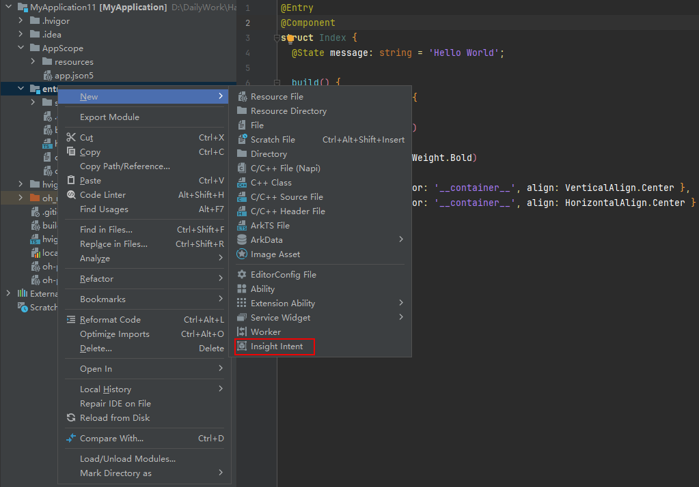

1. 确认需要使用的意图之后，工程中右击“entry”目录，选择“New > Insight Intent”新建意图。

   
2. 在配置文件（#PROJECT\_HOME/entry/src/main/resources/base/profile/insight\_intent.json）中配置意图。以“旅游”垂域下的“查看旅游攻略”意图场景为例，“insight\_intent.json”文件配置示例和说明如下。

   

   垂域Schema的所属垂域、意图名称，须分别与insight\_intent.json文件中的domain、intentName保持一致。

   ```
   {
     // 应用支持的意图列表
     // 必须声明应用支持插件包含的必选意图，应用上架时会进行校验
     "insightIntents": [
       {
         // 意图名称
         // 名称应当遵循意图框架规范，当前仅支持预置垂域意图，不允许自定义
         // 应用内意图名称唯一，不允许出现相同的名称定义
         "intentName": "ViewTravelGuides",
         // 意图所属的垂域
         "domain": "TravelDomain",
         // 意图版本号
         // 插件引用意图时会校验该版本号，只有和插件定义的版本号一致才能正常调用
         "intentVersion": "1.0.1",
         // 意图调用逻辑入口
         "srcEntry": "./ets/entryability/InsightIntentExecutorImpl.ets",
         "uiAbility": {
           // 意图所在module、ability，以及代码相对路径入口
           "ability": "EntryAbility",
           // UIAbility支持前后台两种执行模式
           "executeMode": [
             "background",
             "foreground"
           ]
         }
       }
     ]
   }
   ```
3. 如果您需要在同一个HarmonyOS应用/元服务内注册多个意图，可参照如下示例配置“insight\_intent.json”文件。

   ```
   {
     // 应用支持的意图列表
     // 必须声明应用支持插件包含的必选意图，应用上架时会进行校验
     "insightIntents": [
       {
         // 意图名称1
         // 名称应当遵循意图框架规范，当前仅支持预置垂域意图，不允许自定义
         // 应用内意图名称唯一，不允许出现相同的名称定义
         "intentName": "ViewTravelGuides",
         // 意图所属的垂域
         "domain": "TravelDomain",
         // 意图版本号
         // 插件引用意图时会校验该版本号，只有和插件定义的版本号一致才能正常调用
         "intentVersion": "1.0.1",
         // 意图调用逻辑入口
         "srcEntry": "./ets/entryability/InsightIntentExecutorImpl.ets",
         "uiAbility": {
           // 意图所在module、ability，以及代码相对路径入口
           "ability": "EntryAbility",
           // UIAbility支持前后台两种执行模式
           "executeMode": [
             "background",
             "foreground"
             ]
   		}
         },   {
         // 意图名称2
         // 名称应当遵循意图框架规范，当前仅支持预置垂域意图，不允许自定义
         // 应用内意图名称唯一，不允许出现相同的名称定义
         "intentName": "ViewSceneryInfo",
         // 意图所属的垂域
         "domain": "TravelDomain",
         // 意图版本号
         // 插件引用意图时会校验该版本号，只有和插件定义的版本号一致才能正常调用
         "intentVersion": "1.0.1",
         // 意图调用逻辑入口
         "srcEntry": "./ets/entryability/InsightIntentExecutorImpl.ets",
         "uiAbility": {
           // 意图所在module、ability，以及代码相对路径入口
           "ability": "EntryAbility",
           // UIAbility支持前后台两种执行模式
           "executeMode": [
             "background",
             "foreground"
           ]
         }
       }
     ]
   }
   ```
