AppGallery Connect（以下简称AGC）打造的“互动中心”是您与华为客服/服务商进行问题咨询和答疑的官方在线沟通平台，旨在提升您参与活动、申诉请求或反馈问题的效率，以便更高效地解决问题并优化产品价值。

#### 进入互动中心

1. 登录[AppGallery Connect](https://developer.huawei.com/consumer/cn/service/josp/agc/index.html#/)，点击首页左下角的“互动中心待办”的“更多”，或者右上角的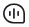进入页面。

   

   * “互动中心待办”展示最近未读的两条消息（包括应用审核、业务审核、系统通知和侵权投诉类消息），点击该消息可直接进入消息详情页面。
   * 上方角标数字为未读消息条数。
   * 点击页面的置顶消息后，此消息变成已读状态，后续不再显示。
   * 关闭页面的置顶消息后，后续也不再显示。

   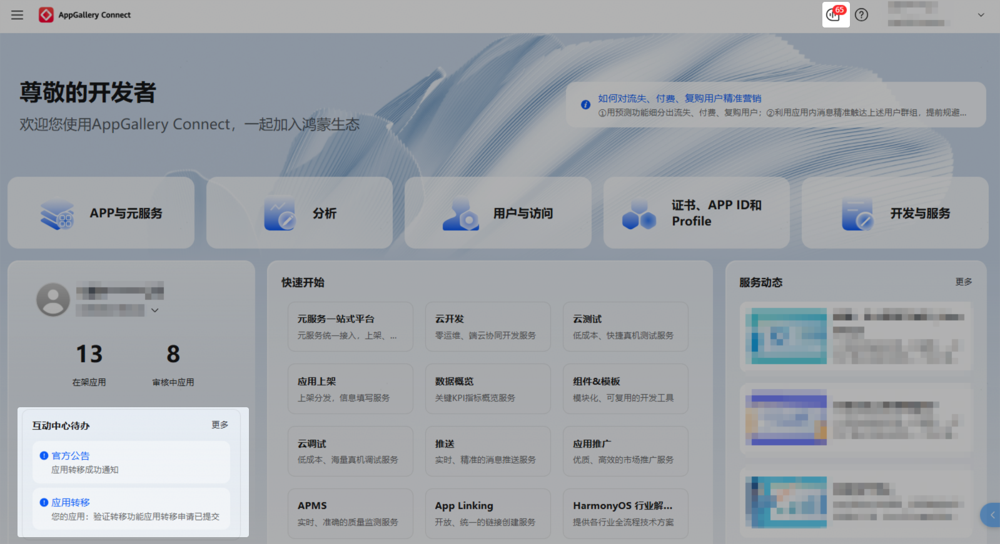
2. 互动中心首页默认展示全部类型的消息。
   * 您可以点击左上方的“应用审核”、“系统通知”等按钮查看不同模块的消息，也可以点击右上方的“申诉反馈”提交申诉请求或者反馈问题。
   * 您可以点击右上方的“消息设置”，选择通过“互动中心”、“邮件”或“联盟APP”渠道订阅消息通知。
   * 您可以点击“全部”下拉框，筛选“处理中”或者“已关闭”的消息。
   * 您可以点击“多选”按钮，对“已关闭”的消息进行批量删除、将未读消息批量设置为已读。超过半年的消息，系统会自动标记为已读。

     

     消息删除后会清空所有记录，请谨慎操作。

   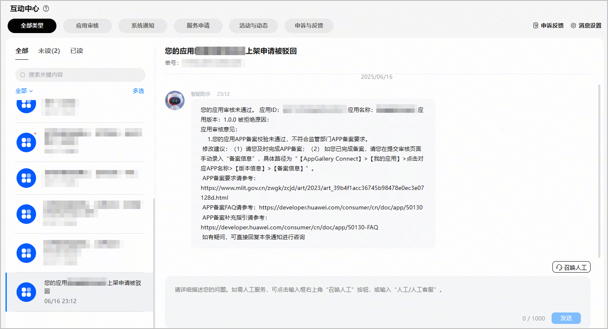

#### 处理应用审核问题

“应用审核”模块主要推送应用上下架相关类型的内容通知：

* 当您提交的审核被拒绝时，平台会把应用被拒绝的原因和修改建议推送给您。
* 当您的应用被下架时，平台会把应用下架的原因和后续操作推送给您。

* 召唤人工客服非实时客服，若未及时回复消息，请您稍作等待。
* 若您对审核被拒通知有异议，召唤人工客服回答后，如在2个工作日内未对客服的回复进行二次追问，系统将自动关闭当前会话。

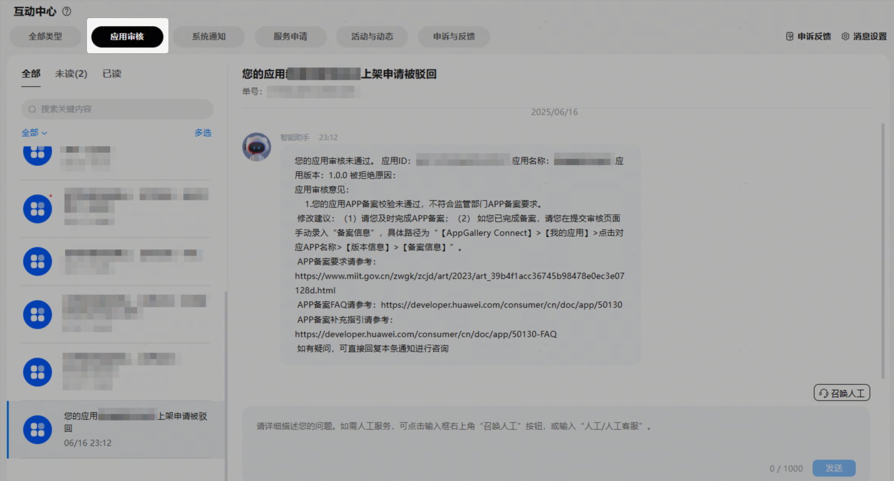

#### 查看系统通知

“系统通知”模块主要推送运营周报数据、业务策略调整、服务升级公告等通知消息。

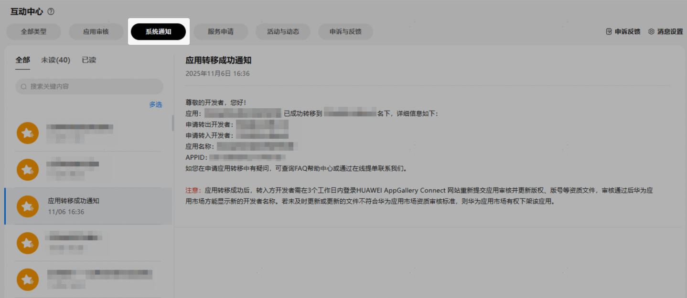

#### 查看服务申请结果

“服务申请”模块主要推送ACL权限、capability权限等业务申请的结果。

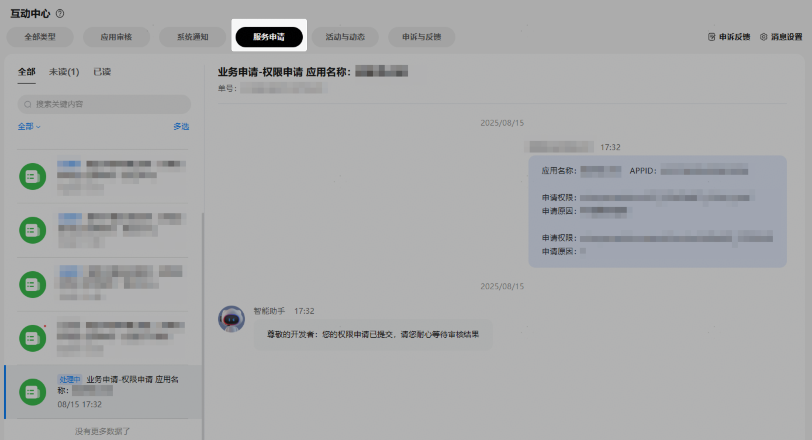

#### 参与官方活动

“活动与动态”模块主要推送组件模板、用户满意度调研、解决方案推广等活动。若您参与活动，华为工作人员将与您联系。活动主要参与形式有：

* 填写问卷调研
* 提供活动意向

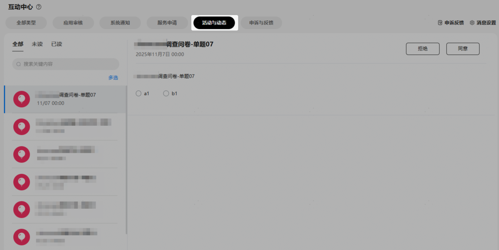

#### 处理申诉请求或反馈问题

“申诉与反馈”模块支持处理“[侵权投诉](#section16208534417)”、“[用户恶意差评申诉](#section143471854244)”、“[侵权投诉-申请恢复上架](#section10869016165814)”和“[帐号/应用处理申诉](#section941611471759)”这四种场景的申诉请求，还支持对分发、运营、分析等环节遇到的问题进行[反馈](#section68459561)。

您可以点击右侧“申诉反馈”，提交“申诉”或者新建“问题反馈”。

若您在5个工作日内未对客服回复的申诉结果进行二次追问或反馈，系统将自动关闭当前会话。

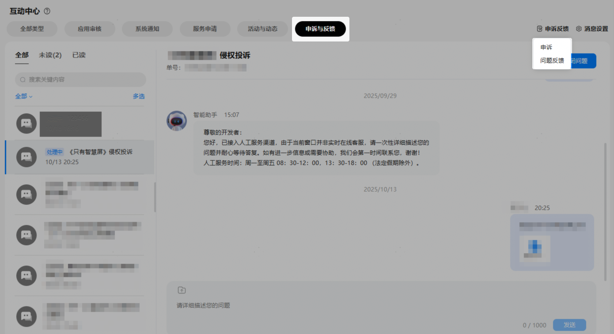

#### [h2]侵权投诉

您可以对侵犯您知识产权的应用进行申诉。当您成功提交申诉后，您和申诉对象会分别收到一条申诉消息。

* 若申诉对象认为申诉不合理，则可以拒绝申诉。若双方存在争议，华为方的法务给出最后的处理结果。
* 若申诉对象认为申诉合理，则需要下架侵权应用。

在新建申诉页面，申诉类型选择“侵权投诉”，根据页面引导填写信息后，点击“提交”。

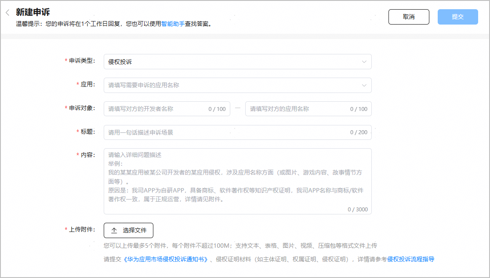

#### [h2]用户恶意差评申诉

您可以对用户的恶意差评进行申诉。若您的申诉合理，相关用户的恶意差评将被删除。

在新建申诉页面，申诉类型选择“用户恶意差评申诉”，根据页面引导填写信息后，点击“提交”。

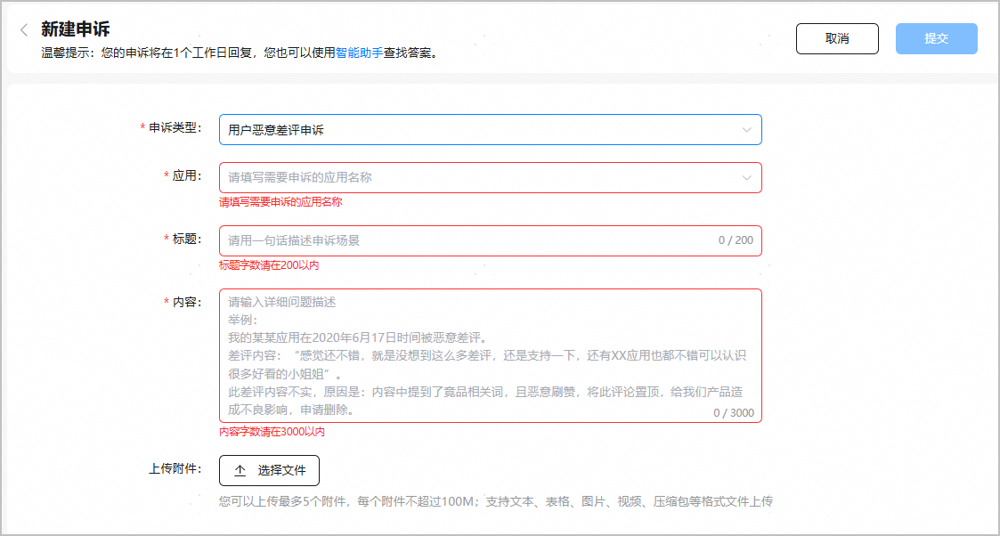

#### [h2]侵权投诉-申请恢复上架

您可以对因投诉方发起侵权投诉而下架的应用进行恢复上架申诉。

需要提供[《华为应用市场侵权投诉反通知书》](https://developer.huawei.com/consumer/cn/service/josp/agc/cis/doc/HUAWEI_AppGallery_Counter_Notification_of_Suspected_Infringement_Complaint%28cn%29.docx)、整改证明、不侵权证明、权属证明等信息，我们将根据您提交的材料向您反馈申诉结果。

在新建申诉页面，申诉类型选择“侵权投诉-申请恢复上架”，根据页面引导填写信息后，点击“提交”。

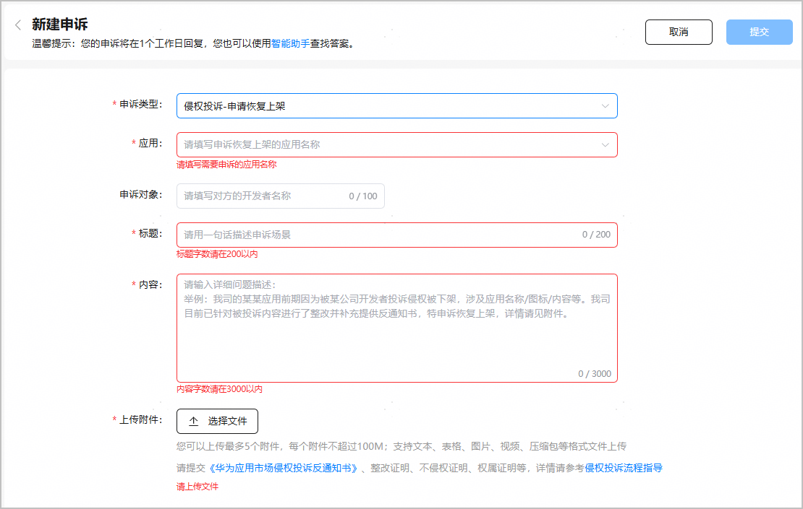

#### [h2]帐号/应用处理申诉

您可以对被冻结的账号或是被下架的应用进行申诉。

* 若您的账号已被冻结，请发邮件至developer@huawei.com进行申诉。
  + 邮件标题：[申请解冻账号]-[公司名称]-[开发者账号ID]，开发者账号ID查询方法请参见[查看应用信息](https://developer.huawei.com/consumer/cn/doc/app/agc-help-view-app-info-0000002282674569)。
  + 邮件正文：请说明申诉原因以及凭证，上传申诉及承诺函。
* 若您的应用被下架，在新建申诉页面，申诉类型选择“帐号/应用处理申诉”，根据页面引导填写信息后，点击“提交”。

  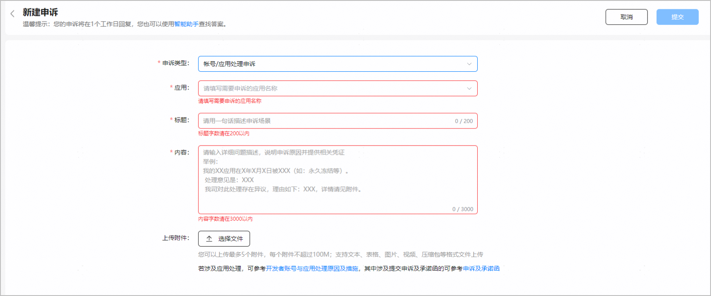

#### [h2]反馈问题

若您在分发、运营、分析等环节遇到问题，可以提交问题反馈，华为工作人员将在1个工作日内进行答疑。

在新建问题反馈页面，根据页面引导填写信息后，点击“提交”。

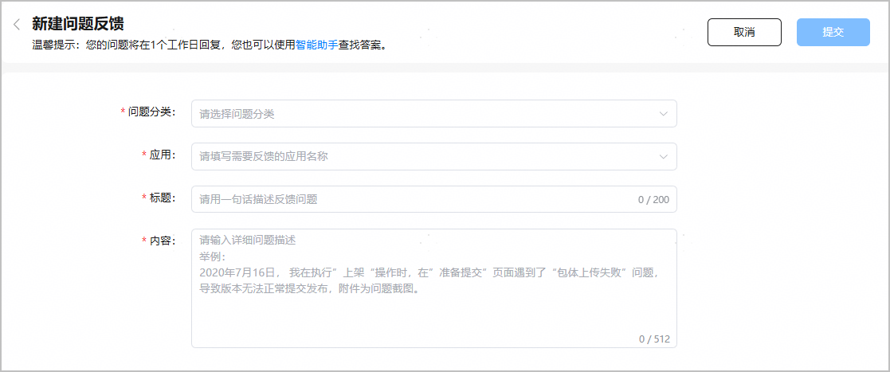

#### 订阅消息

您可以选择通过“互动中心”、“邮件”或“联盟APP”渠道接收不同模块的消息通知。

1. 在互动中心首页点击右上角的“消息设置”，进入消息订阅功能页面。

   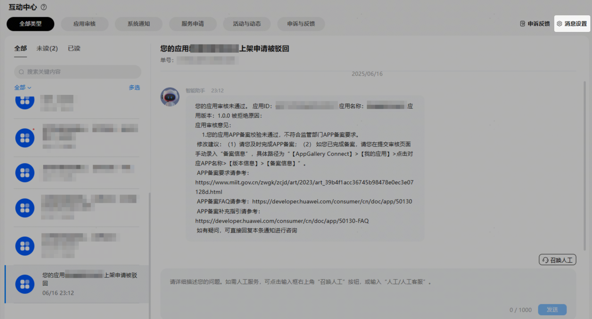
2. 勾选消息类型的接收渠道后，点击“保存”。
   * 互动中心：若勾选此列，您订阅的消息类型将通过互动中心消息进行推送。
   * 邮件：若勾选此列，您订阅的消息类型将通过实名认证邮箱进行推送（若团队账号下子账号勾选，则子账号和团队账号认证邮箱均会收到此类型消息）。
   * 联盟APP：若勾选此列，您订阅的消息类型将通过开发者联盟APP进行推送。为后续正常接收消息，请查看中的二维码，扫码下载开发者联盟APP。（提示：本渠道仅支持推送HarmonyOS5.0及以上应用/元服务的消息）

   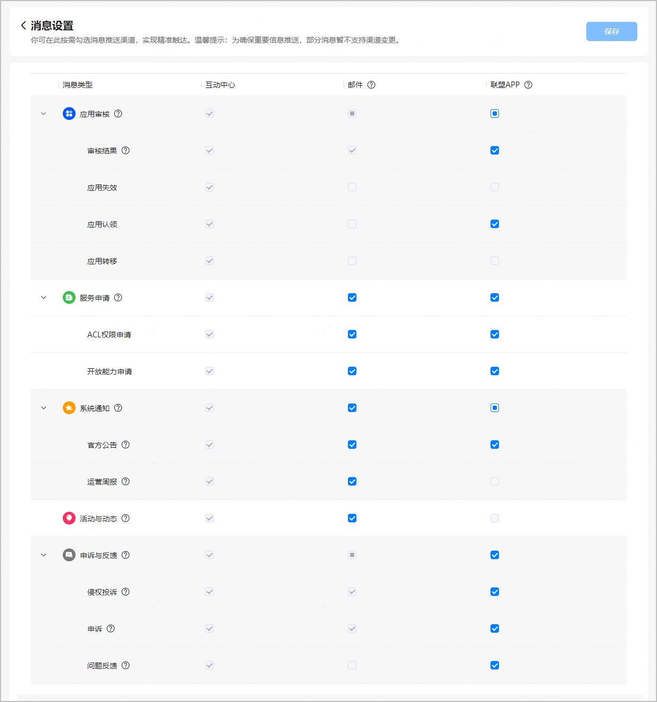
