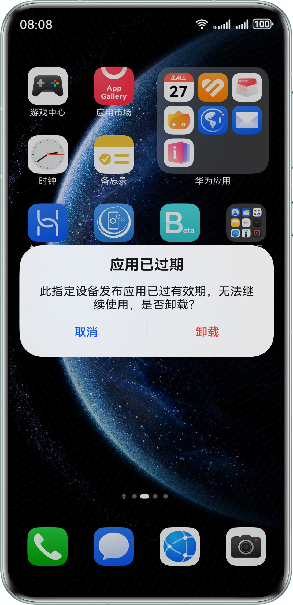
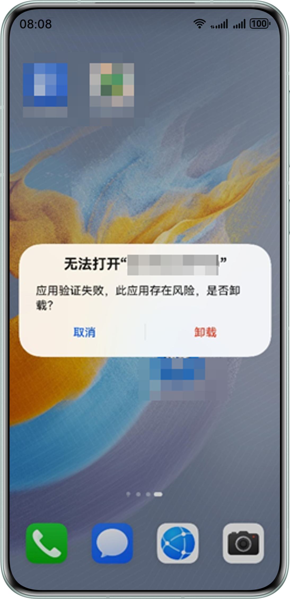

#### 点击应用提示“应用已过期”

指定设备发布应用版本存在有效期，当前为90天。使用超过有效期后，该应用版本将无法启动，提示如下。请更新应用版本号后重新编译打包并部署，即可正常下载安装新版本应用。

#### 点击应用提示“无法打开应用”

指定设备发布应用有安装数量限制，超过限制后，应用将无法启动，弹框提示如下。

#### 指定设备发布应用版本有效期90天，这个时间是怎么计算的？

应用版本有效期是以设备首次安装的时间为起点计算（非版本编译时间），从安装日向后推90个自然日。由于不同设备安装时间不同，同一版本可能出现部分设备提示过期、部分设备未过期的情况。

#### 指定设备发布一定要开启开发者模式才能使用吗？

是的，设备需开启开发者模式才能运行应用，不依赖账号或密码验证。若设备未开启开发者模式，应用将无法启动。
