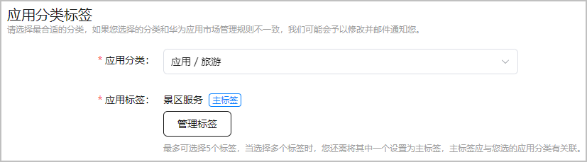
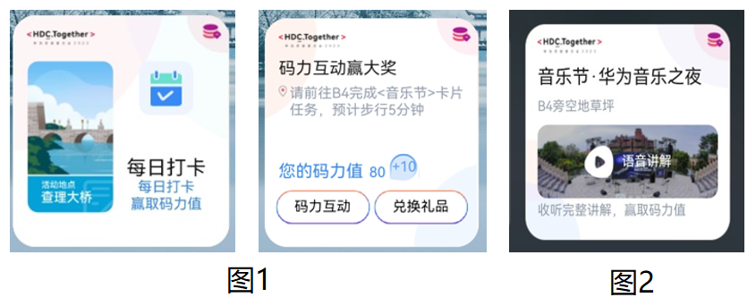

#### 近场服务权限

目前近场服务处于灰度开放阶段，使用服务之前，请先发送邮件申请开通该权限。申请邮件格式要求如下，华为方收到邮件后，将在15个工作日内完成审核，并邮件告知您审核结果。

| 邮箱地址 | 邮件标题 | 邮件内容 |
| --- | --- | --- |
| agconnect@huawei.com | 申请开通近场服务 | * 邮件正文内容，需包含如下信息：   + **Developer ID**：获取方法请参见[查看应用信息](/docs/distribute/agc/agc-help-app-0000002235710234/agc-help-view-app-info-0000002282674569)。   + **APP ID**：获取方法请参见[查看应用信息](/docs/distribute/agc/agc-help-app-0000002235710234/agc-help-view-app-info-0000002282674569)。   + **应用/元服务名称**   + **应用分类和应用标签的主标签**：可在“APP与元服务 > 分发 > 应用上架 > 应用信息”页面查看。    + **计划接入的近场服务类型**：例如，POI（小艺建议）、POI（花瓣地图）、信标设备（小艺建议）、NFC、标签服务。   + **计划部署规模**：例如，计划部署XX个POI/信标设备/HarmonyOS标签，覆盖全国所有XX门店。 * 邮件附件内容：POI接入小艺建议场景、信标设备接入小艺建议场景、标签场景需要提供PPT材料（可参考[XXX接入近场服务.pptx](https://alliance-communityfile-drcn.dbankcdn.com/FileServer/getFile/cmtyPub/011/111/111/0000000000011111111.20260427153121.75797205154058207708264807425926%3A20260531164041%3A2800%3A86ED85DF49ECDDEBF8C3CE7DDA3A43AD33851D03CDFC55825AEE097BB66A9B8B.pptx?needInitFileName=true)模板进行准备），其他场景（例如POI接入花瓣地图）则无需提供PPT材料。 |

#### 预置卡片权限

对于HarmonyOS NEXT应用或元服务，近场服务支持模板卡片和预置卡片两种卡片类型：

* 模板卡片：不需要申请权限，默认开通。

  无需开发，样式交互单一，用户无需打开或加载元服务即可被推荐，但HarmonyOS应用需要在安装后才可被推荐。模板卡片样例可参考[模板卡片设计示例](/docs/distribute/agc/agc-help-location-sense-appendix-0000002349021732/agc-help-card-design-example-0000002349021736)。
* 预置卡片：需要发送邮件申请开通。

  需要开发，样式交互可以自定义，例如点击卡片即可播放音频，点击卡片直接完成打卡等体验，但需在用户已安装应用或打开元服务状态下才能被推荐。

* 预置卡片权限以应用/元服务维度生效。
* 申请开通预置卡片权限时，华为运营人员将根据业务相关性及审核标准进行评估，审核通过后方可开通。

申请邮件格式要求如下，华为方收到邮件后，将在15个工作日内完成审核，并邮件告知您审核结果。

| 邮箱地址 | 邮件标题 | 邮件内容 |
| --- | --- | --- |
| agconnect@huawei.com | 申请开通近场服务预置卡片 | 需包含以下信息：   * **Developer ID**：获取方法请参见[查看应用信息](/docs/distribute/agc/agc-help-app-0000002235710234/agc-help-view-app-info-0000002282674569)。 * **APP ID**：获取方法请参见[查看应用信息](/docs/distribute/agc/agc-help-app-0000002235710234/agc-help-view-app-info-0000002282674569)。 * **应用/元服务名称** * **预置卡片样式设计图** * **使用场景** 请尽量详细描述应用或元服务的使用场景。可参考如下示例：   + 场景一：HDC大会期间，在松山湖-查理大桥上展示【打卡】卡片，点击卡片即可完成打卡，系统自动给与积分，如图1。   + 场景二：HDC大会期间，在松山湖-B4草坪上展示【音乐节】卡片，点击卡片即可收听音乐节介绍音频，系统自动给与积分，如图2（小艺建议渠道示例）。  |
