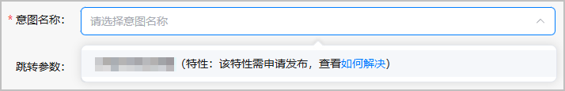

#### 创建近场服务时提示无意图可选，如何解决

当您创建近场服务选择意图名称时，如果提示您暂无意图可选，请检查工程配置文件（#PROJECT\_HOME/entry/src/main/resources/base/profile/insight\_intent.json）中是否注册需要使用的意图。如果未配置意图，请参考[意图开发说明](https://developer.huawei.com/consumer/cn/doc/app/agc-help-insight-config-poi-0000002349175932)正确配置和调用意图。

#### 创建近场服务时提示意图特性需申请发布，如何解决

当您创建近场服务选择首次使用的意图时，若意图下未能正常展示支持的特性，您可发送邮件反馈给华为运营人员，申请发布该特性，华为方收到邮件后，将在15个工作日进行处理，并邮件告知您处理结果。

反馈邮件格式要求如下：

| 邮箱地址 | 邮件标题 | 邮件内容 |
| --- | --- | --- |
| agconnect@huawei.com | 位置推特性未发布问题 | 需包含以下信息：   * **应用名称** * **APP ID**：获取方法请参见[查看应用信息](/docs/distribute/agc/agc-help-app-0000002235710234/agc-help-view-app-info-0000002282674569)。 * **意图名称** * **页面问题截图**。示例如下：  |
