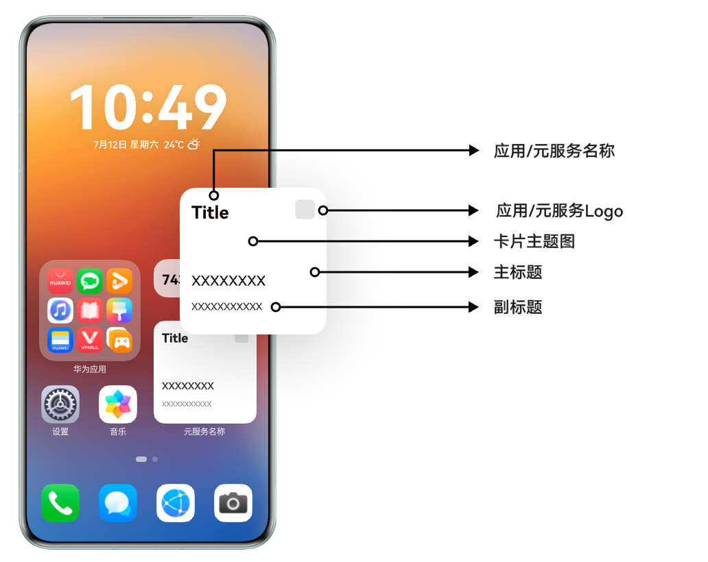
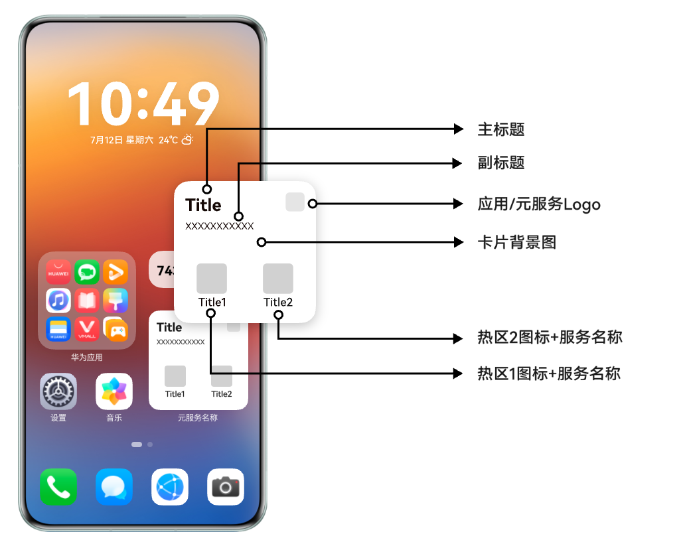
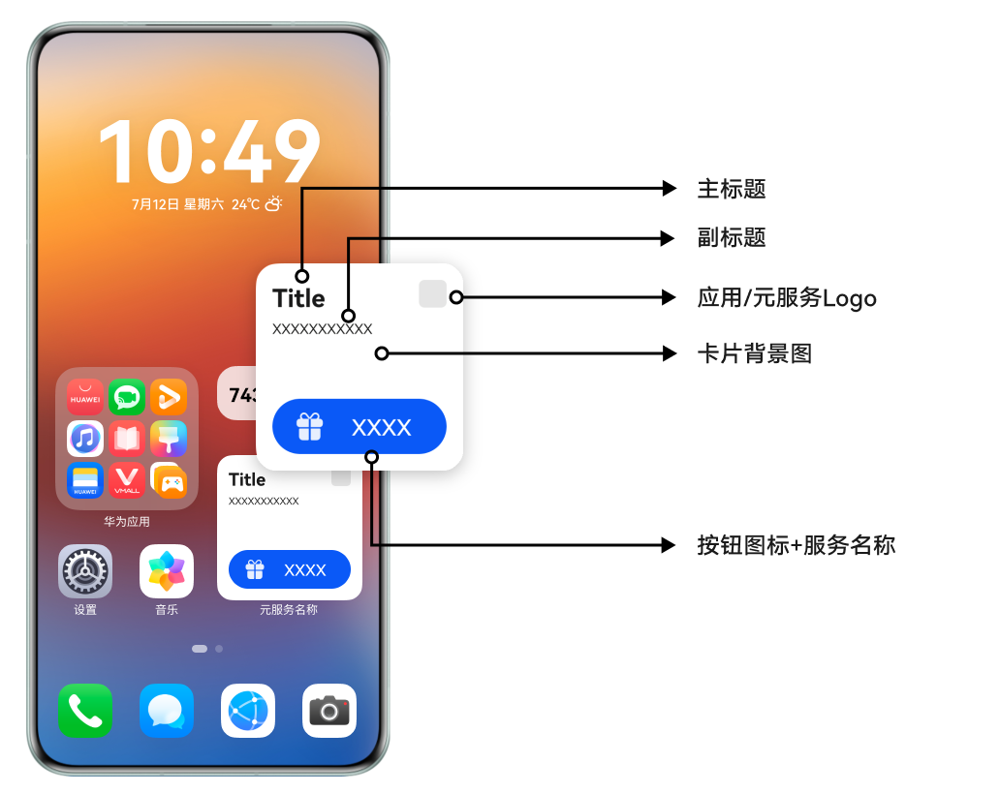

当前模板卡片类型支持图文版、双按钮版、单按钮版三种，卡片样式仅支持2\*2尺寸规格。在卡片设计过程中，您可参照本章节设计不同业务类型的模板卡片。

* 图文版主题图顶部和底部不建议放置重要内容，以防被蒙层或其他输入信息遮挡。重要内容建议放在中间。
* 双按钮和单按钮背景图建议不要太抢眼，以免妨碍卡片阅读。

#### 图文版

| 卡片布局 | 卡片示例 |
| --- | --- |
|  |  |

#### 双按钮版

| 卡片布局 | 卡片示例 |
| --- | --- |
|  |  |

#### 单按钮版

| 卡片布局 | 卡片示例 |
| --- | --- |
|  |  |
