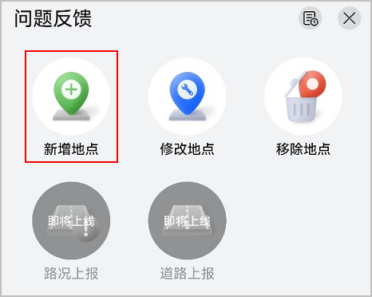

当您注册信标或者POI位置时，如果提示**未查询到想要的位置信息**或者平台匹配的**位置信息有误**，您可通过花瓣地图或邮件两种方式反馈需要增加的位置。

#### 通过花瓣地图反馈

应用市场搜索“花瓣地图”并安装，然后按照如下步骤反馈位置信息：

1. 进入花瓣地图首页，点击“反馈”按钮。
2. 在页面下方的“问题反馈”弹出框中，点击“新增地点”。

   
3. 在“新增地点”页面，按照提示填写相关位置信息，然后点击“提交”即完成位置反馈。

#### 发送邮件反馈

您可发送反馈邮件，华为方收到邮件后，将在15个工作日内为您安排对接人员，并邮件告知您处理结果。

反馈邮件格式要求如下：

* **邮箱地址**

  agconnect@huawei.com

  

  本邮箱仅用于处理位置信息反馈事宜，其他咨询类问题请勿发送至本邮箱。
* **邮件标题**

  【近场服务】-【设备位置/POI位置问题反馈】-【Developer ID】-【APP ID】

  

  请参见[查看应用信息](/docs/distribute/agc/agc-help-app-0000002235710234/agc-help-view-app-info-0000002282674569)获取Developer ID和APP ID。
* **邮件内容**

  需包含以下信息，反馈模板：[线下反馈模板.xlsx](https://alliance-communityfile-drcn.dbankcdn.com/FileServer/getFile/cmtyPub/011/111/111/0000000000011111111.20260427153122.29341366844388876812446070753209%3A20260531165522%3A2800%3AB78C1DA8257E27DC6575809870D8C0C5179A4B415EB53D90E2C6B37DFF098F18.xlsx?needInitFileName=true)。

  | 反馈内容 | 必填(M)/选填(O) | 说明 |
  | --- | --- | --- |
  | 城市 | M | 地点所属城市名称，建议把省份、城市填写完整。  填写示例：广东省佛山市。 |
  | 分类 | M | 地点类型。请参考反馈模板中“位置分类”页的一级分类和二级分类选择地点类型，优先按照二级分类反馈，若二级分类里无合适的选项，可反馈一级分类，选择最贴近的分类即可。  填写示例：旅客问讯处。 |
  | 名称 | M | 地点名称。通过“-”将景区名称和子景点名称连接。  填写示例：颐和园-揽风亭。 |
  | 经度 | M | 请参考GCJ-02标准，精确到小数点后6位。  可以打开**https://lbs.amap.com/tools/picker**链接，登录后输入关键词名称后点击“搜索”获取。“坐标获取结果”中逗号前的部分即为经度信息 。  填写示例：135.763584。 |
  | 纬度 | M | 请参考GCJ-02标准，精确到小数点后6位。  可以打开**https://lbs.amap.com/tools/picker**链接，登录后输入关键词名称后点击“搜索”获取。“坐标获取结果”中逗号后的部分即为纬度信息 。  填写示例：34.980725。 |
  | 图片 | O | 地点图片。须是JPG或者PNG图片，大小500KB以内，辅助审核用途。  填写示例：https://dimg04.c-ctrip.com/images/200113000000v9w1eEFD5.jpg 。 |
  | 描述 | O | 该地点的介绍或者备注。  填写示例：该点位线上已有，但名称/坐标错误。 |
