当您的应用/元服务已上架，并且使用自有真机测试通过，您就可以创建全网态近场服务。

* 创建服务之前，请确保您已在应用/元服务中[开发意图](https://developer.huawei.com/consumer/cn/doc/app/agc-help-insight-config-beacon-0000002270752670)，并且已完成应用/元服务上架。
* 一个应用/元服务最多支持创建2000个近场服务。

#### 新建服务

1. 登录[AppGallery Connect](https://developer.huawei.com/consumer/cn/service/josp/agc/index.html)，点击“APP与元服务”。
2. 进入“HarmonyOS”页签，您可通过包名、应用名称、应用类型等信息进行筛选，然后在应用列表中点击您的应用/元服务名称。

   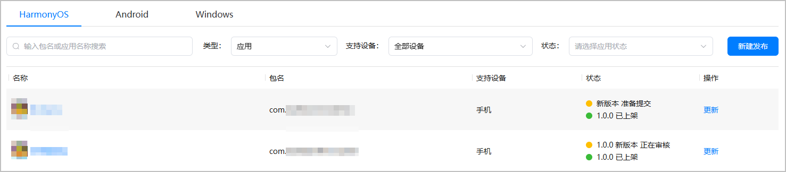
3. 左侧菜单栏选择“近场服务 > 近场管理”，进入近场管理主界面。选择“服务管理”页签，点击“新建”。

   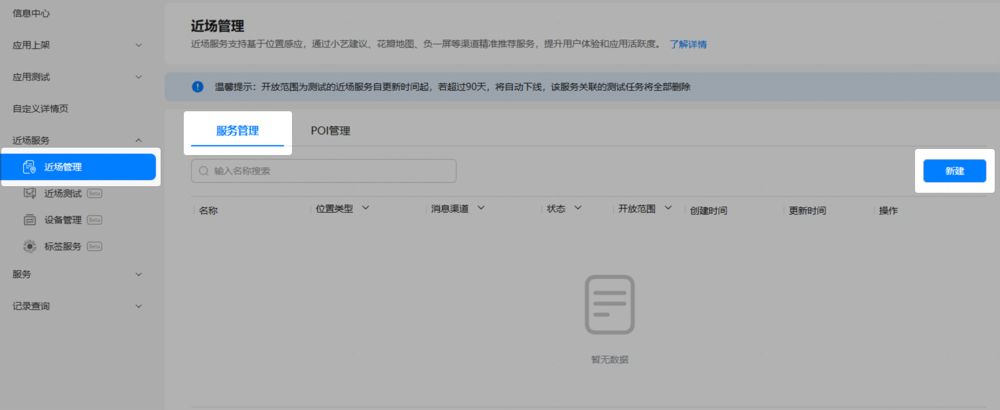

#### 配置服务基本信息

进入“新建服务”页面，在“基本信息”区域配置服务基本信息。

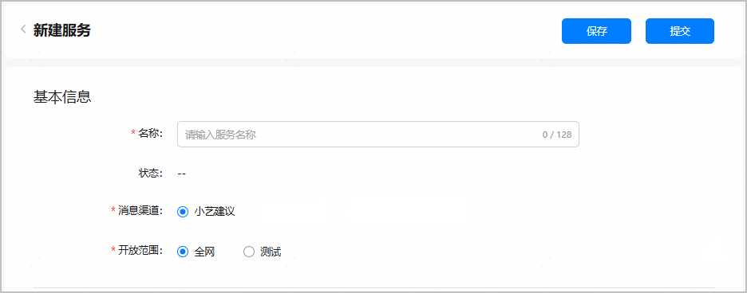

| 配置项 | 说明 | |
| --- | --- | --- |
| 名称 | 近场服务名称，长度为1~128个字符。 | |
| 状态 | 服务的状态。   * 草稿：点击“保存”后，服务状态变更为“草稿”。 * 审核中：点击“提交”后，服务状态变更为“审核中”。 * 审核驳回：内容设置不合规，服务申请被平台运营驳回，服务状态变更为“审核驳回”。可参考[图文素材审核细则](https://developer.huawei.com/consumer/cn/doc/app/agc-help-card-design-detail-rules-0000002349181504)修改内容后重新提交服务上线申请。 * 已上线：平台运营审核通过后，服务状态变更为“已上线”。 * 已下线：您自行点击“下线”或者由华为侧强制下线。 | |
| 消息渠道 | 向用户推送应用/元服务卡片的渠道。**请选择“小艺建议”**。 | |
| 开放范围 | 此配置项决定您创建的是测试态近场服务还是全网态近场服务，**请选择“全网”**。 | |

#### 选择关联的信标设备

在“新建服务”页面的“感应方式”区域，选择关联的信标设备。

* 可多选，最多选择200个信标设备，且支持全选。
* 点击设备名称链接时，将打开该设备详情页面。
* 当列表中设备数量较大时，可通过鼠标上下滚动或右侧滑动条查看所有设备信息，也可在“感应设备”后的搜索框中输入设备名称进行模糊查询。
* 选择设备过程中，可通过“关联状态”检查勾选的设备是否正确。下拉框选择“已关联”时，仅展示已勾选的信标设备；选择“未关联”时，仅展示未勾选的信标设备。

  

  + 设备列表中仅展示“待激活”状态的设备。
  + 被其他已上线全网态近场服务使用的设备，不展示在设备待选列表中。

  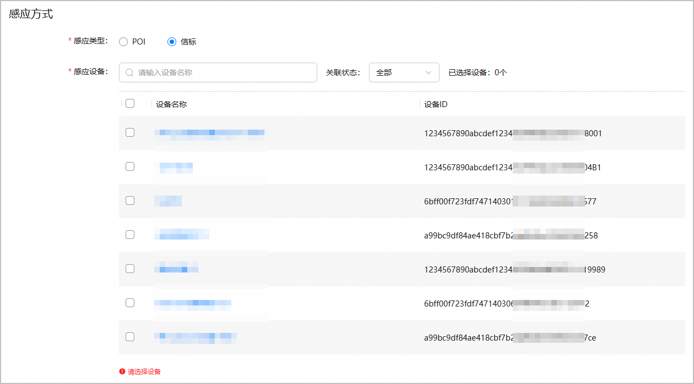

#### 配置服务提醒内容和提醒时段

在“新建服务”页面的“提醒配置”区域，配置服务提醒内容和提醒时段。

#### [h2]内容设置

为了确保输入内容的正确性和合规性，防止出现涉黄、涉政、涉暴等敏感信息，近场服务已接入风控系统。在配置或查看近场服务内容时，如果页面提示“输入内容可能存在风险”或“输入内容不合规”，建议您修改为合规内容，以避免服务申请被驳回。

当前支持2\*2格式的图文版、双按钮版、单按钮版模板卡片和预置卡片。其中，预置卡片权限需单独申请，请参考[预置卡片权限](https://developer.huawei.com/consumer/cn/doc/app/agc-help-location-sense-apply-permission-0000002382902149#section562916152116)发送申请邮件。请根据您的实际使用场景选择合适的卡片类型。

* 模板卡片-图文版（适合信息量少，有1个跳转热区的卡片）

  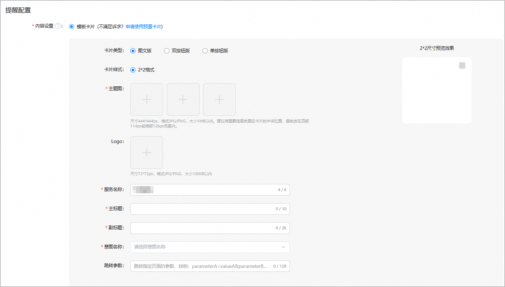

  | 配置项 | 说明 |
  | --- | --- |
  | 主题图 | 带内容的底图。传1-3张，尺寸444\*444px，格式为JPG/PNG，大小1MB以内。顶部114px或底部126px范围内避免放置重要信息，建议将重要信息放置在卡片的中间位置。传多张时以轮播效果进行展示。为保证更好的卡片展示效果，建议您至少传2张主题图。 |
  | Logo | 可选，应用/元服务Logo。传1张，尺寸72\*72px，格式为JPG/PNG，大小100KB以内。  如果未上传，当应用存在全网在架版本时，系统默认使用同比例压缩后的应用图标展示Logo。 |
  | 服务名称 | 不超过6个字符。系统默认填充“应用上架/元服务上架 > 应用信息”页面的“应用名称”，您也可以自定义服务名称。 |
  | 主标题 | 对关键内容的简要说明，会在卡片上加粗显示。不超过10个字符，建议控制在9个字符以内。 |
  | 副标题 | 对关键内容的阐述。不超过26个字符，建议控制在11个字符以内。 |
  | 意图名称 | 选择您已在应用程序包中定义的意图名称。 |
  | 跳转参数 | 可选，意图调用时定义的意图参数，通过该参数可跳转指定页面。不超过128个字符。  需要按key=value的键值对形式输入，多个键值对之间以“&”分隔，填写样例：parameterA=valueA&parameterB=valueB。  点击卡片任意区域将跳转指定页面。 |
* 模板卡片-双按钮版（适合有2个跳转热区的卡片）

  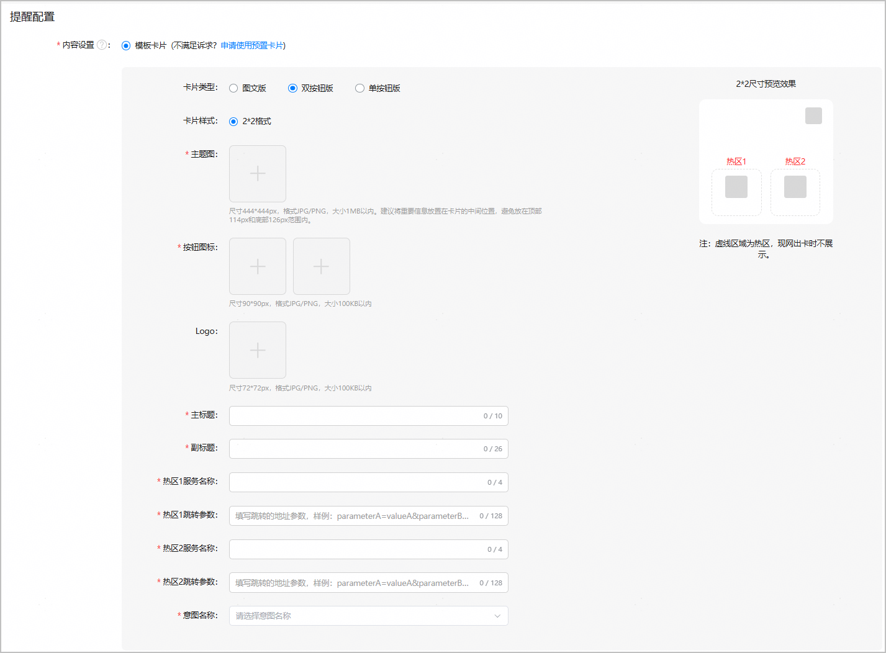

  | 配置项 | 说明 |
  | --- | --- |
  | 主题图 | 带内容的底图，建议不要太抢眼以免妨碍卡片阅读。传1张，尺寸444\*444px，格式为JPG/PNG，大小1MB以内。 |
  | 按钮图标 | 热区按钮的背景图。传2张，作为2个热区的按钮背景图。尺寸90\*90px，格式JPG/PNG，大小100KB以内。 |
  | Logo | 可选，应用/元服务Logo。传1张，尺寸72\*72px，格式为JPG/PNG，大小100KB以内。  如果未上传，当应用存在全网在架版本时，系统默认使用同比例压缩后的应用图标展示Logo。 |
  | 主标题 | 对关键内容的简要说明，会在卡片上加粗显示。不超过10个字符，建议控制在9个字符以内。 |
  | 副标题 | 对关键内容的阐述。不超过26个字符，建议控制在11个字符以内。 |
  | 热区1服务名称 | 热区1按钮图标下方展示的内容，可根据跳转页面的功能来定义。不超过4个字符。 |
  | 热区1跳转参数 | 意图调用时定义的意图参数，通过该参数可跳转指定页面。不超过128个字符  需要按key=value的键值对形式输入，多个键值对之间以“&”分隔，填写样例：parameterA=valueA&parameterB=valueB。  点击热区1将跳转指定页面，热区外点击则跳转指定页面首页。 |
  | 热区2服务名称 | 热区2按钮图标下方展示的内容，可根据跳转页面的功能来定义。不超过4个字符。 |
  | 热区2跳转参数 | 意图调用时定义的意图参数，通过该参数可跳转指定页面。不超过128个字符  需要按key=value的键值对形式输入，多个键值对之间以“&”分隔，填写样例：parameterA=valueA&parameterB=valueB。  点击热区2将跳转指定页面，热区外点击则跳转指定页面首页。 |
  | 意图名称 | 选择您已在应用程序包中定义的意图名称。 |
* 模板卡片-单按钮版（适合有1个跳转热区的卡片）

  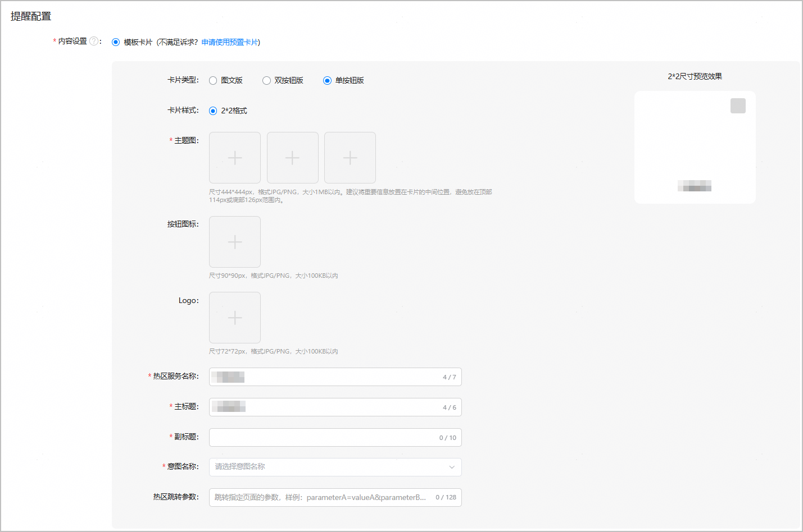

  | 配置项 | 说明 |
  | --- | --- |
  | 主题图 | 带内容的底图。传1-3张，尺寸444\*444px，格式为JPG/PNG，大小1MB以内。顶部114px或底部126px范围内避免放置重要信息，建议将重要信息放在卡片的中间位置。传多张时以轮播效果进行展示。为保证更好的卡片展示效果，建议您至少传2张主题图。 |
  | 按钮图标 | 可选，在按钮左侧展示的图标。传1张，尺寸90\*90px，格式为JPG/PNG，大小100KB以内。 |
  | Logo | 可选，应用/元服务Logo。传1张，尺寸72\*72px，格式JPG/PNG，大小100KB以内。  如果未上传，当应用存在全网在架版本时，系统默认使用同比例压缩后的应用图标展示Logo。 |
  | 热区服务名称 | 按钮图标右侧展示的内容，可根据跳转页面的功能来定义。不超过7个字符。 |
  | 主标题 | 对关键内容的简要说明，会在卡片上加粗显示。不超过6个字符。系统默认填充“应用上架/元服务上架 > 应用信息”页面的“应用名称”。 |
  | 副标题 | 对关键内容的阐述。不超过10个字符。 |
  | 意图名称 | 下拉框选择您已在应用程序包中定义的意图名称。  **若您切换了应用程序包，需重新选择意图名称****。** |
  | 热区跳转参数 | 意图调用时定义的意图参数，通过该参数可跳转指定页面。不超过128个字符。  需要按key=value的键值对形式输入，多个键值对之间以“&”分隔，填写样例：parameterA=valueA&parameterB=valueB。  点击按钮将跳转指定页面，按钮外点击则跳转指定页面首页。 |
* 预置卡片

  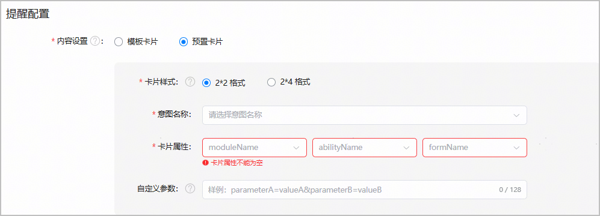

  | 配置项 | 说明 |
  | --- | --- |
  | 卡片样式 | 当前“小艺建议”渠道仅支持展示2\*2，2\*4样式的卡片内容。  系统会在页面加载初始化时判断是否有满足条件的卡片样式，如不满足，页面将给出提示信息。 |
  | 意图名称 | 选择您已在应用程序包中定义的意图名称。 |
  | 卡片属性 | 包含如下三部分信息：  + moduleName：应用模块名。 + abilityName：应用能力名。 + formName：卡片名。 配置完成后，右侧将展示卡片对应的快照预览效果。  说明：  + 系统仅对全网在架、测试版本提供卡片属性筛选能力，分阶段发布版本暂不涉及。 + 若应用开发态已定义多张不同的卡片，则不同POI位置绑定不同的卡片即可，此场景下需要选择moduleName、abilityName和formName，而不需要配置“自定义参数”。 + 若应用开发态只定义了一张卡片，不同POI位置将绑定同一个卡片，此场景下不需要选择moduleName、abilityName和formName，系统会自动填充。但需要您配置“自定义参数”来区分不同的卡片内容，应用会基于该“自定义参数”完成对应的卡片内容加载。 |
  | 自定义参数 | 如果您在应用开发态只定义了一张卡片，可通过配置该参数呈现不同的卡片内容，不超过128个字符。  需要按key=value的键值对形式输入，多个键值对之间以“&”分隔，填写样例：parameterA=valueA&parameterB=valueB。 |

#### [h2]预览卡片效果

提醒内容配置过程中，可以在页面右侧预览卡片效果。

* 模板卡片-图文版

  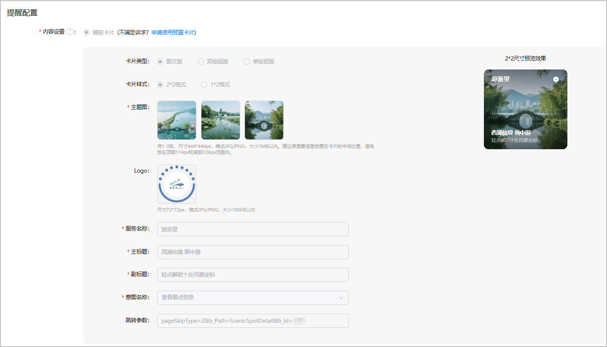
* 模板卡片-双按钮版

  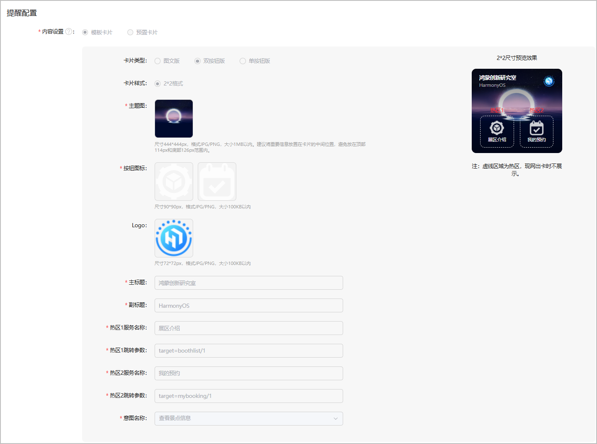
* 模板卡片-单按钮版

  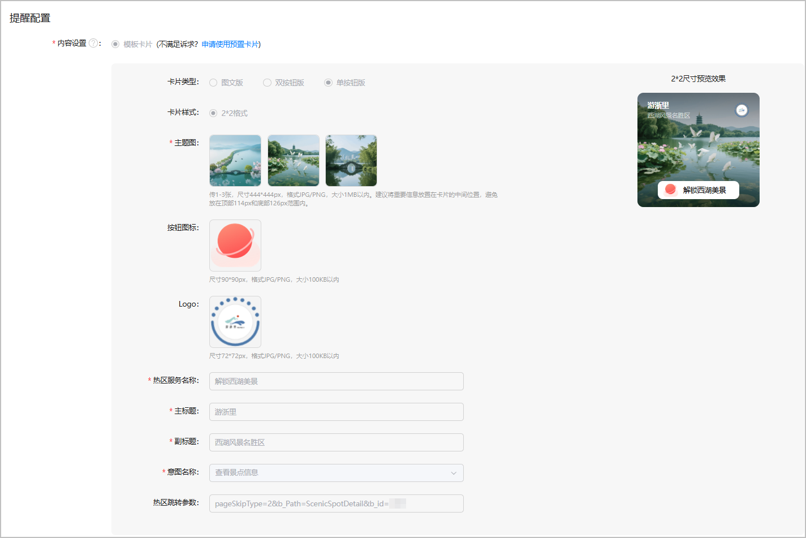
* 预置卡片

  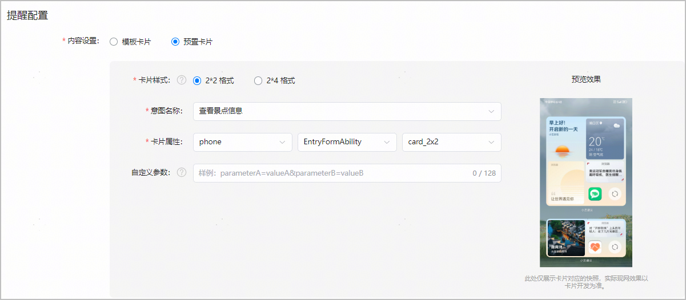

#### [h2]时段设置

默认选择“不启用”，全时段推送服务内容。如果您希望根据用户行为习惯，在指定的时间段内推送服务内容，可以选择“启用”前的单选框以开启定时推送功能。这样，在非指定时间段内，系统将不会向用户推送服务内容，从而避免打扰用户。

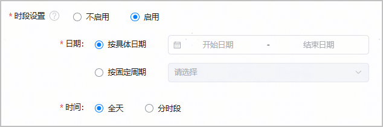

| 配置项 | 说明 |
| --- | --- |
| 日期 | * 按具体日期：在开始日期和结束日期处下拉选择具体的年、月、日，结束日期必须晚于开始日期。 * 按固定日期：取值包括：每天、每周一、每周二、每周三、每周四、每周五、每周六、每周日。   + 选择“每天”时，系统会每天向用户推送服务内容。   + 选择“每天”外的其他选项，例如，每周一、每周三、每周五，系统会在每周一、每周三、每周五向用户推送服务内容。 |
| 时间 | * 全天：默认选中，系统会在选定的日期范围内全时段推送内容。 * 分时段：可以设置一天里推送内容的起止时间，时间范围为00:00~23:59，以小时为单位，结束时间必须晚于开始时间。 |

#### 提交服务申请

在申请全网态服务上线之前，请确保真机测试已满足[小艺建议出卡的验收要求](https://developer.huawei.com/consumer/cn/doc/app/agc-help-xiaoyi-requirements-for-card-out-0000002430663182)，以避免申请后被审核驳回。

1. 服务配置完成后，点击页面顶端的“提交”。

   
2. 返回服务列表，全网态服务状态变更为“审核中”，华为运营人员会及时处理审核，并邮件通知您审核结果。

   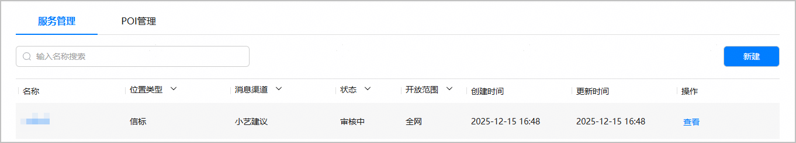
3. （可选）如果全网态服务上线后，小艺建议不出卡，请按下述步骤进行排查。

   

   全网态服务审核通过后，需要隔天生效，生效后手机端才能接收到小艺建议推荐的卡片内容。

   1. 将手机的“意图框架调试”开关关闭。操作路径：设置 - 系统 - 开发者选项 - 意图框架调试，关闭“意图框架调试”开关。

      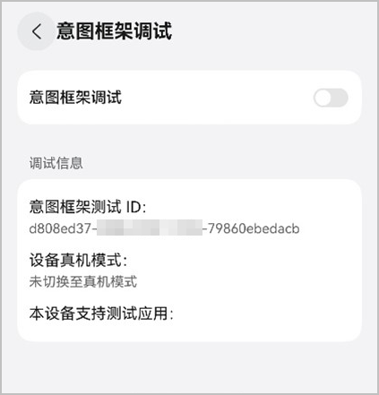
   2. 手机插入SIM卡。
   3. 手机登录华为账号。
   4. 打开系统位置权限。
   5. 打开小艺App的“个性化推荐”开关。

      操作路径：小艺App - 点击右上角头像 - 设置 - 个性化推荐 - “个性化推荐”开关。
   6. 打开小艺App的“基于位置信息提供服务”开关。

      操作路径：小艺App - 点击右上角头像 - 设置 - 其他 - “基于位置信息提供服务”开关。
   7. 手机进入POI的200米感应范围内。
   8. 小艺建议加桌卡片尺寸只能是2\*2、4\*4，不能是2\*4。

   排除上述原因后，如果小艺建议仍未出卡或出卡内容不符合预期，请参考[小艺建议出卡问题的反馈方法](https://developer.huawei.com/consumer/cn/doc/app/agc-help-feedback-method-for-non-card-issue-0000002445351893)进行反馈。
