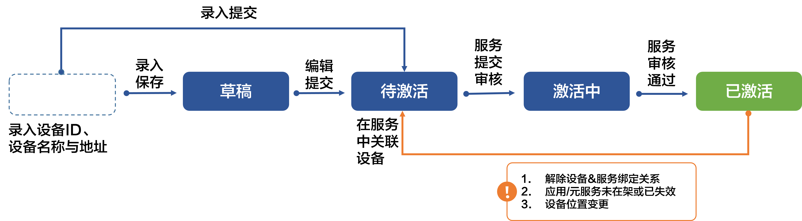
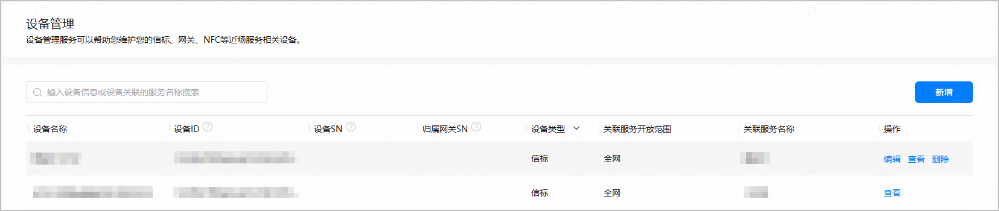
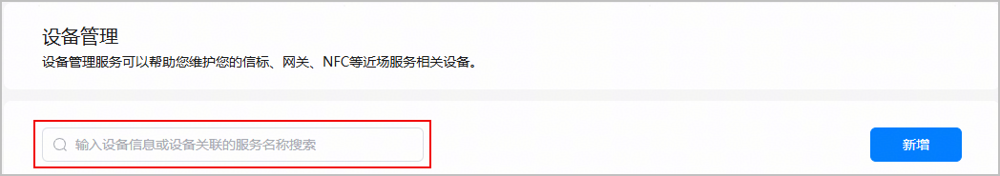
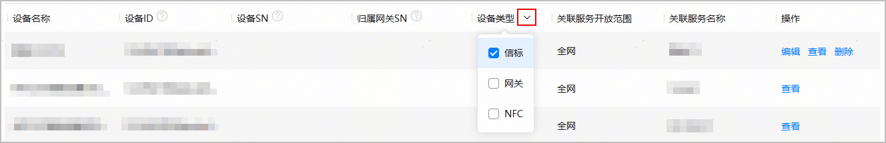

#### 设备状态

信标设备状态包括草稿、待激活、激活中、已激活4种。状态流转图如下：

#### 设备不同状态下的操作权限

不同状态的信标设备支持不同的操作。

| 状态 | 如何进入该状态 | 支持的操作 |
| --- | --- | --- |
| 草稿 | 录入设备信息后，点击“保存”。 | 编辑（支持编辑保存、编辑提交）、查看、删除。  说明：  编辑后点击“保存”，设备状态仍为“草稿”。点击“提交”，设备状态变更为“待激活”。 |
| 待激活 | 以下几种情况下，设备均处于“待激活”状态。   * 录入的设备已点击“提交”发起注册申请，但尚未被近场服务选用。 * 设备已与近场服务关联，但关联的近场服务为草稿态。 * 设备关联的近场服务上线后被成功下线。 * 更新设备关联的近场服务时，设备被取消勾选。 | 编辑（仅支持编辑提交）、查看、删除。 |
| 激活中 | 设备已与服务绑定，且创建的服务正在审核中。 | 查看。 |
| 已激活 | 设备已与服务绑定，且服务已成功上线。 | 查看。 |

#### 设备维护

设备列表会展示所有设备的类型和可执行操作，您可以在设备列表管理您的设备。

#### [h2]查询设备

在设备管理主界面，您可以在搜索框中输入设备名称、设备ID、设备关联的服务名称，模糊筛选设备。

也可在设备列表中点击“设备类型”右侧的，筛选您需要查询的设备类型。

#### [h2]编辑设备

处于“草稿”、“待激活”状态的设备，支持修改设备名称、设备地址等信息，点击设备“操作”列的“编辑”进入“编辑设备”页面修改即可。

编辑设备页面各配置项说明：

| 区域 | 配置项 | 定义 | 说明 |
| --- | --- | --- | --- |
| 设备类型 | 设备类型 | 设备归属的分类。 | 提交后不支持修改。 |
| 设备型号 | 预置的设备型号。包括：   * YLWL\_Beacon\_BLM5210：深圳云里物里科技股份有限公司生产的蓝牙信标。 * YSYF\_Beacon\_MBM02：南京盈商云服信息技术有限公司生产的蓝牙信标。 * KT\_Module：厦门科拓通讯技术股份有限公司生产的蓝牙模组。 * 其它：除深圳云里物里、南京盈商云服、厦门科拓以外的厂商生产的信标设备。 |
| 业务属性配置 | 设备ID | 信标设备标识。 | 提交后不支持修改。  当设备的“设备型号”为“YLWL\_Beacon\_BLM5210”、“YSYF\_Beacon\_MBM02”、“其它”时展示该配置项。  说明：  设备ID为40位16进制数，由Beacon信标设备的“UUID+Major+Minor”组成。其中UUID必须以**6bff00f723fdf7471403****0**为前缀且不支持大写字母。Major和Minor须分别转换为4位16进制数。 |
| UUID | 信标设备标识符中的UUID字段。 | 提交后不支持修改。  当设备的“设备型号”为“KT\_Module”时展示该配置项。 |
| Major | 信标广播中的Major字段。 |
| Minor | 信标广播中的Minor字段。 |
| 设备名称 | 信标设备的名称，由开发者自定义。 | 全局唯一，长度不超过30个字符。 |
| 位置信息 | 设备所在地理位置信息描述。 | 在文本框中输入设备的位置信息后，系统将下拉显示多个关联地址。  选中目标地址后，文本框中将展示实际地址，包含省、市、区及详细地址，右侧地图将定位到对应的位置，并根据最新修改位置的经纬度坐标重新绘制出一个蓝色矩形框，即6位geohash围栏。您可基于此蓝框区域调整信标设备的布设位置，请勿贴近边缘配置，需确保将信标布设在蓝框区域内。  仅支持搜索匹配地址，不支持手动编辑地址。  说明：  若提示“未查询到输入的位置信息”或者平台匹配的位置信息有误，您可发送邮件[反馈位置信息](https://developer.huawei.com/consumer/cn/doc/app/agc-help-position-info-feedback-0000002349181500)。 |
| 经度/纬度 | 设备所在位置的经纬坐标。 | 当“位置信息”选择地址时自动刷新为所选地址的坐标。在右侧地图中鼠标点击位置标记在地图上移动时，左侧经纬度会随之变化。 |
| 场景分类 | 设备应用的场景分类，包括：   * 文旅 * 酒店 * 政府机关 * 医疗保健服务中心 * 交通运输 * 教育机构 | 与现有小艺建议定义的场景分类选项同步。请根据实际业务场景进行选择。 |
| 备注 | 设备的附加说明，由开发者自定义，例如可补充设备特性信息。 | 可选，长度为0~30个字符。 |

#### [h2]查看设备

在任何设备状态下，您都可以查看设备信息。只需点击设备“操作”列的“查看”，即可进入“查看设备”页面查看设备信息和geohash围栏。

#### [h2]删除设备

处于“草稿”、“待激活”状态的设备支持“删除”设备操作。点击设备“操作”列的“删除”，在弹出的“删除设备”框中点击“删除”即可将设备删除。
