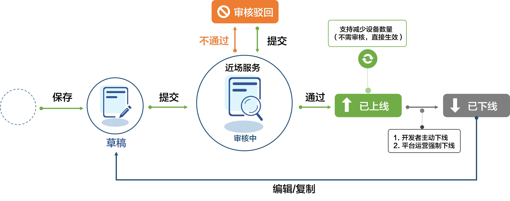
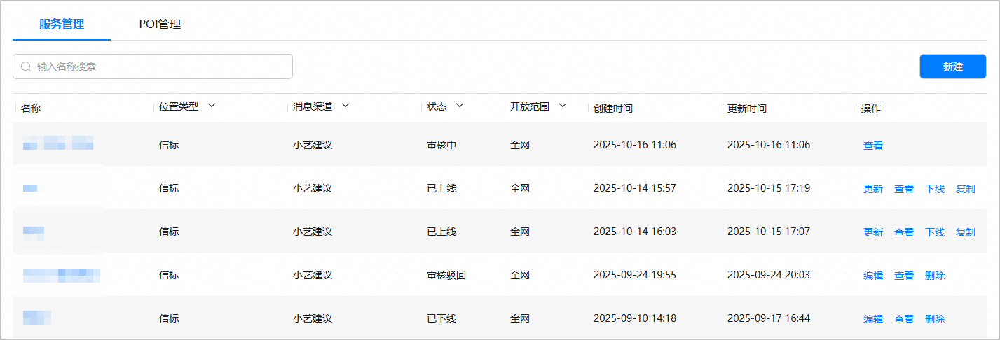
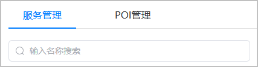
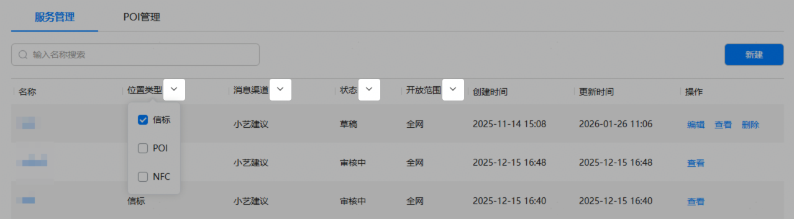

* 服务状态包括草稿、审核中、审核驳回、已上线、已下线5种状态。状态流转图如下：

  
* 不同状态的服务支持不同的操作，具体如下：

  

  对于使用1\*2格式模板卡片的存量近场服务，不支持编辑和更新操作。

  | 状态 | 如何进入该状态 | 支持的操作 |
  | --- | --- | --- |
  | 草稿 | 录入服务信息后，点击“保存”。 | 编辑、查看、删除。 |
  | 审核中 | 录入服务信息后已点击“提交”发起服务上线申请，等待平台运营审核。 | 查看。 |
  | 审核驳回 | 内容设置不合规，服务申请被平台运营驳回。  可参考[图文素材审核细则](https://developer.huawei.com/consumer/cn/doc/app/agc-help-card-design-detail-rules-0000002349181504)修改内容后重新提交服务上线申请。 | 编辑、查看、删除。 |
  | 已上线 | 服务申请审核通过。 | 更新、查看、下线、复制。 |
  | 已下线 | 包括如下场景：  + 服务信息有变化，被开发者主动下线。 + 设备位置变更，被平台运营强制下线。 + 接到用户投诉，平台运营强制下线应用下所有内容。 | 编辑、查看、删除。 |

#### 服务管理

服务列表会展示出所有服务的状态和可执行操作，您可以在服务列表管理您的服务。

#### [h2]查询服务

当您创建的近场服务数量比较多时，若要查询某个服务，您可以通过近场服务的名称、位置类型、消息渠道、状态或开放范围进行筛选，且支持多条件组合查询。

* 搜索框中输入要查询的近场服务名称或服务内关联的信标设备名称进行筛选，支持模糊查询。

  
* 服务列表中点击“位置类型”、“消息渠道”、“状态”或“开放范围”右侧的设置筛选条件。未设置时，则默认全部。

  

#### [h2]编辑服务

处于“草稿”、“审核驳回”、“已下线”状态的服务，您可以点击“操作”列的“编辑”进入“编辑服务”页面对所有配置项进行修改。在“感应方式”区域：

* 已勾选的设备将展示在待选设备列表的顶部，便于您进行调整。
* 您可通过“关联状态”筛选项检查勾选的设备是否正确。下拉框选择“已关联”时，仅展示已勾选的设备；选择“未关联”时，仅展示未勾选的设备。

完成修改后，您可以提交服务上线申请。

#### [h2]查看服务

任一服务状态下均支持查看服务信息，点击“操作”列的“查看”进入“查看服务”界面，即可查看服务配置信息（“感应方式”区域仅展示已勾选的信标设备）和服务审核意见。

**请注意，若服务详情页出现****“该图片不合规”的提示，为防止服务申请被驳回，请您务必将其更改为合规图片。**

#### [h2]更新服务

仅处于“已上线”状态且“开放范围”配置为“全网”的服务支持“更新”操作。您可点击“操作”列的“更新”进入服务详情页，“感应方式”区域仅展示已勾选的信标设备，允许减少部分信标设备，但不允许新增信标设备。取消勾选的设备状态将变更为“待激活”。且更新后提交服务上线申请，无需审核，可立即生效。

#### [h2]复制服务

仅处于“已上线”状态的服务支持“复制”操作。您可点击“操作”列的“复制”快速复制一个相同配置的服务，但由于一个设备只能被一个服务关联，所以复制服务时需要您重新设置关联的设备。

#### [h2]下线服务

仅处于“已上线”状态的服务支持“下线”操作。服务下线后，关联的设备状态变更为：待激活。

#### [h2]删除服务

处于“草稿”、“审核驳回”、“已下线”状态的服务支持“删除”操作。点击服务“操作”列的“删除”，在弹出的提示框中点击“确认”即可将服务删除。
