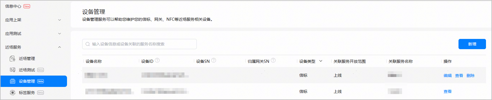
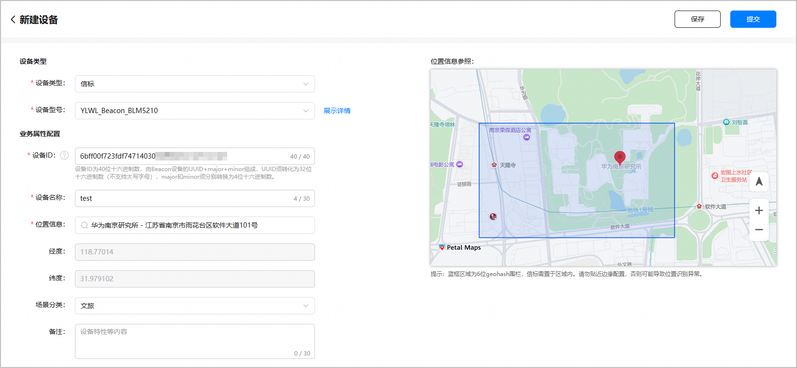
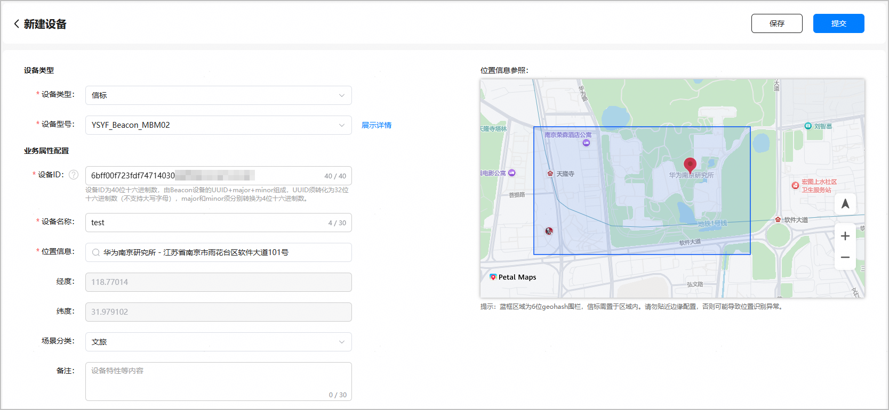
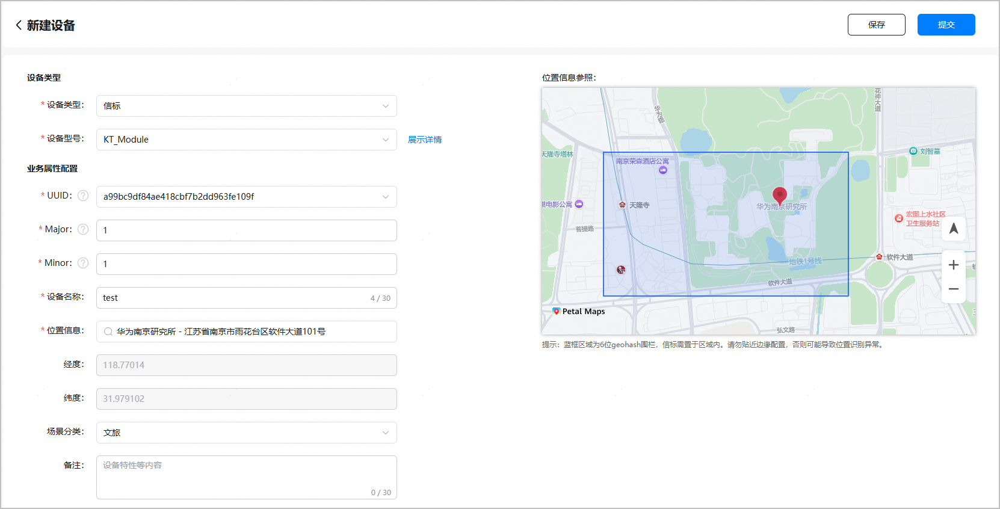
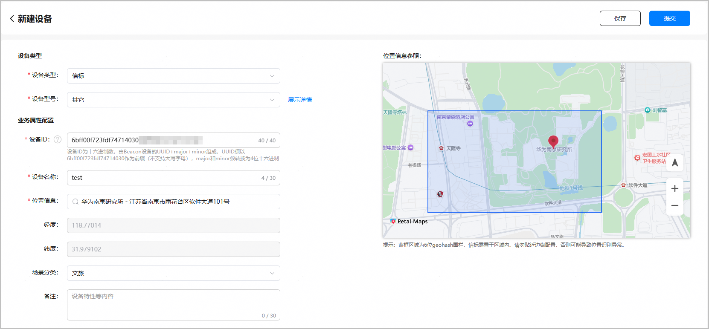

* 您团队账号下的所有项目均可使用注册的信标设备。
* 每个团队账号最多支持添加10万台设备。

1. 登录[AppGallery Connect](https://developer.huawei.com/consumer/cn/service/josp/agc/index.html)，点击“APP与元服务”。

   
2. 进入“HarmonyOS”页签，您可通过包名、应用名称、应用类型等信息进行筛选，然后在应用列表中点击您的应用/元服务名称。

   
3. 左侧菜单栏选择“近场服务 > 设备管理”。在设备管理主界面，点击“新增”。

   
4. 进入“新建设备”页面，“设备类型”选择“信标”，并根据实际需求选择“设备型号”。不同设备型号所需配置的设备信息存在差异，请按照页面提示进行配置。
   * 设备型号：YLWL\_Beacon\_BLM5210

     

     | 区域 | 配置项 | 定义 | 说明 |
     | --- | --- | --- | --- |
     | 设备类型 | 设备类型 | 设备归属的分类。 | 请选择“信标”。 |
     | 设备型号 | 预置的设备型号。  YLWL\_Beacon\_BLM5210：深圳云里物里科技股份有限公司生产的蓝牙信标。 | 您可点击“设备型号”下拉框旁边的“展示详情”查看设备的生产厂商、上市时间、供电方式、支持协议等信息。点击后名称变为“隐藏详情”，再次点击后隐藏设备详情，名称变为“展示详情”。 |
     | 业务属性配置 | 设备ID | 信标设备标识符。 | 全局唯一，仅支持数字和字母。  说明：  设备ID为40位16进制数，由Beacon信标设备的“UUID+Major+Minor”组成。其中UUID必须为以**6bff00f723fdf7471403****0**为前缀的32位十六进制数，且不支持大写字母。Major和Minor须分别转换为4位16进制数。 |
     | 设备名称 | 信标设备的名称，由开发者自定义。 | 全局唯一，长度不超过30个字符。 |
     | 位置信息 | 设备所在地理位置信息描述。 | 在文本框中输入设备的位置信息后，系统将下拉显示多个关联地址。  选中目标地址后，文本框中将展示实际地址，包含省、市、区及详细地址。右侧地图将定位到对应的位置，并根据该位置的经纬度坐标绘制出一个蓝色矩形框，即6位geohash围栏。您可基于此蓝框区域调整信标设备的布设位置，请勿贴近边缘配置，需确保将信标布设在蓝框区域内。  仅支持搜索匹配地址，不支持手动编辑地址。  说明：  若提示“未查询到输入的位置信息”或者平台匹配的位置信息有误，您可发送邮件[反馈位置信息](/docs/distribute/agc/agc-help-location-sense-appendix-0000002349021732/agc-help-position-info-feedback-0000002349181500)。 |
     | 经度/纬度 | 设备所在位置的经纬坐标。 | 当“位置信息”选择地址时自动刷新为所选地址的坐标。在右侧地图中鼠标点击位置标记在地图上移动时，左侧经纬度会随之变化。 |
     | 场景分类 | 设备应用的场景分类，包括：  + 文旅 + 酒店 + 政府机关 + 医疗保健服务中心 + 交通运输 + 教育机构 | 与现有小艺建议定义的场景分类选项同步。请根据实际业务场景进行选择。 |
     | 备注 | 设备的附加说明，由开发者自定义，例如可补充设备特性信息。 | 可选，长度为0~30个字符。 |
   * 设备型号：YSYF\_Beacon\_MBM02

     

     | 区域 | 配置项 | 定义 | 说明 |
     | --- | --- | --- | --- |
     | 设备类型 | 设备类型 | 设备归属的分类。 | 请选择“信标”。 |
     | 设备型号 | 预置的设备型号。  YSYF\_Beacon\_MBM02：南京盈商云服信息技术有限公司生产的蓝牙信标。 | 您可点击“设备型号”下拉框旁边的“展示详情”查看设备的生产厂商、上市时间、供电方式、支持协议等信息。点击后名称变为“隐藏详情”，再次点击后隐藏设备详情，名称变为“展示详情”。 |
     | 业务属性配置 | 设备ID | 信标设备标识符。 | 全局唯一，仅支持数字和字母。  说明：  设备ID为40位16进制数，由Beacon信标设备的“UUID+Major+Minor”组成。其中UUID必须为以**6bff00f723fdf7471403****0**为前缀的32位十六进制数，且不支持大写字母。Major和Minor须分别转换为4位16进制数。 |
     | 设备名称 | 信标设备的名称，由开发者自定义。 | 全局唯一，长度不超过30个字符。 |
     | 位置信息 | 设备所在地理位置信息描述。 | 在文本框中输入设备的位置信息后，系统将下拉显示多个关联地址。  选中目标地址后，文本框中将展示实际地址，包含省、市、区及详细地址，右侧地图将定位到对应的位置，并根据该位置的经纬度坐标绘制出一个蓝色矩形框，即6位geohash围栏。您可基于此蓝框区域调整信标设备的布设位置，请勿贴近边缘配置，需确保将信标布设在蓝框区域内。  仅支持搜索匹配地址，不支持手动编辑地址。  说明：  若提示“未查询到输入的位置信息”或者平台匹配的位置信息有误，您可发送邮件[反馈位置信息](/docs/distribute/agc/agc-help-location-sense-appendix-0000002349021732/agc-help-position-info-feedback-0000002349181500)。 |
     | 经度/纬度 | 设备所在位置的经纬坐标。 | 当“位置信息”选择地址时自动刷新为所选地址的坐标。在右侧地图中鼠标点击位置标记在地图上移动时，左侧经纬度会随之变化。 |
     | 场景分类 | 设备应用的场景分类，包括：  + 文旅 + 酒店 + 政府机关 + 医疗保健服务中心 + 交通运输 + 教育机构 | 与现有小艺建议定义的场景分类选项同步。请根据实际业务场景进行选择。 |
     | 备注 | 设备的附加说明，由开发者自定义，例如可补充设备特性信息。 | 可选，长度为0~30个字符。 |
   * 设备型号：KT\_Module

     

     | 区域 | 配置项 | 定义 | 说明 |
     | --- | --- | --- | --- |
     | 设备类型 | 设备类型 | 设备归属的分类。 | 请选择“信标”。 |
     | 设备型号 | 预置的设备型号。  KT\_Module：厦门科拓通讯技术股份有限公司生产的蓝牙模组。 | 您可点击“设备型号”下拉框旁边的“展示详情”查看设备的生产厂商、上市时间、供电方式、支持协议等信息。点击后名称变为“隐藏详情”，再次点击后隐藏设备详情，名称变为“展示详情”。 |
     | 业务属性配置 | UUID | 信标设备标识符中的UUID字段。 | 选择已由系统预置的备选值。UUID由32位16进制数组成，实际长度不足32位时，系统将自动补齐32位。 |
     | Major | 信标广播中的Major字段。 | 取值范围：0~65535，默认值为1。 |
     | Minor | 信标广播中的Minor字段。 |
     | 设备名称 | 信标设备的名称，由开发者自定义。 | 全局唯一，长度不超过30个字符。 |
     | 位置信息 | 设备所在地理位置信息描述。 | 在文本框中输入设备的位置信息后，系统将下拉显示多个关联地址。  选中目标地址后，文本框中将展示实际地址，包含省、市、区及详细地址，右侧地图将定位到对应的位置，并根据该位置的经纬度坐标绘制出一个蓝色矩形框，即6位geohash围栏。您可基于此蓝框区域调整信标设备的布设位置，请勿贴近边缘配置，需确保将信标布设在蓝框区域内。  仅支持搜索匹配地址，不支持手动编辑地址。  说明：  若提示“未查询到输入的位置信息”或者平台匹配的位置信息有误，您可发送邮件[反馈位置信息](/docs/distribute/agc/agc-help-location-sense-appendix-0000002349021732/agc-help-position-info-feedback-0000002349181500)。 |
     | 经度/纬度 | 设备所在位置的经纬坐标。 | 当“位置信息”选择地址时自动刷新为所选地址的坐标。在右侧地图中鼠标点击位置标记在地图上移动时，左侧经纬度会随之变化。 |
     | 场景分类 | 设备应用的场景分类，包括：  + 文旅 + 酒店 + 政府机关 + 医疗保健服务中心 + 交通运输 + 教育机构 | 与现有小艺建议定义的场景分类选项同步。请根据实际业务场景进行选择。 |
     | 备注 | 设备的附加说明，由开发者自定义，例如可补充设备特性信息。 | 可选，长度为0~30个字符。 |
   * 设备型号：其它

     

     | 区域 | 配置项 | 定义 | 说明 |
     | --- | --- | --- | --- |
     | 设备类型 | 设备类型 | 设备归属的分类。 | 请选择“信标”。 |
     | 设备型号 | 预置的设备型号。  其它：除深圳云里物里、南京盈商云服、厦门科拓之外的厂商生产的信标设备。 | 您可点击“设备型号”下拉框旁边的“展示详情”查看设备的生产厂商、上市时间、供电方式、支持协议等信息。点击后名称变为“隐藏详情”，再次点击后隐藏设备详情，名称变为“展示详情”。 |
     | 业务属性配置 | 设备ID | 信标设备标识符。 | 全局唯一，仅支持数字和字母。  说明：  设备ID为40位16进制数，由Beacon信标设备的“UUID+Major+Minor”组成。其中UUID必须为以**6bff00f723fdf7471403****0**为前缀的32位十六进制数，且不支持大写字母。Major和Minor须分别转换为4位16进制数。 |
     | 设备名称 | 信标设备的名称，由开发者自定义。 | 全局唯一，长度不超过30个字符。 |
     | 位置信息 | 设备所在地理位置信息描述。 | 在文本框中输入设备的位置信息后，系统将下拉显示多个关联地址。  选中目标地址后，文本框中将展示实际地址，包含省、市、区及详细地址，右侧地图将定位到对应的位置，并根据该位置的经纬度坐标绘制出一个蓝色矩形框，即6位geohash围栏。您可基于此蓝框区域调整信标设备的布设位置，请勿贴近边缘配置，需确保将信标布设在蓝框区域内。  仅支持搜索匹配地址，不支持手动编辑地址。  说明：  若提示“未查询到输入的位置信息”或者平台匹配的位置信息有误，您可发送邮件[反馈位置信息](/docs/distribute/agc/agc-help-location-sense-appendix-0000002349021732/agc-help-position-info-feedback-0000002349181500)。 |
     | 经度/纬度 | 设备所在位置的经纬坐标。 | 当“位置信息”选择地址时自动刷新为所选地址的坐标。在右侧地图中鼠标点击位置标记在地图上移动时，左侧经纬度会随之变化。 |
     | 场景分类 | 设备应用的场景分类，包括：  + 文旅 + 酒店 + 政府机关 + 医疗保健服务中心 + 交通运输 + 教育机构 | 与现有小艺建议定义的场景分类选项同步。请根据实际业务场景进行选择。 |
     | 备注 | 设备的附加说明，由开发者自定义，例如可补充设备特性信息。 | 可选，长度为0~30个字符。 |
5. 配置完成后，点击页面顶部的“提交”发起设备注册申请，该信标设备为“待激活”状态，可以被近场服务关联使用。若点击“保存”，该信标设备为“草稿”状态，将无法被近场服务关联使用。

   
