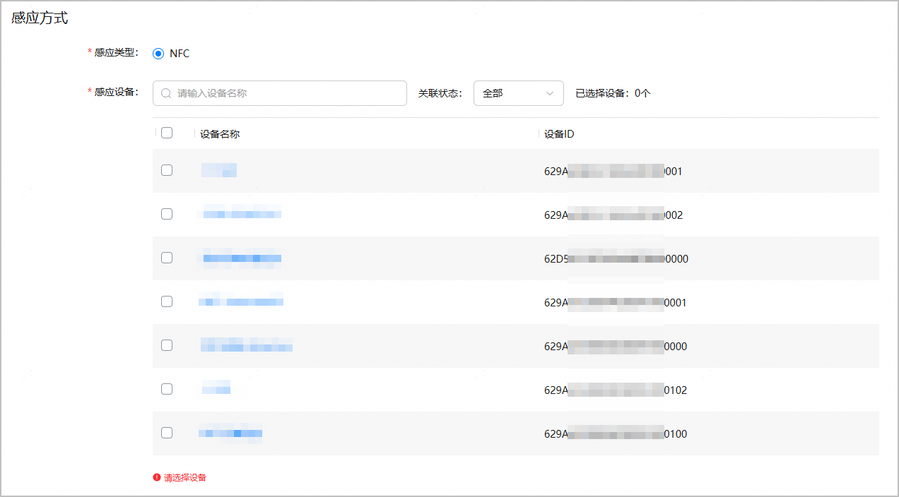
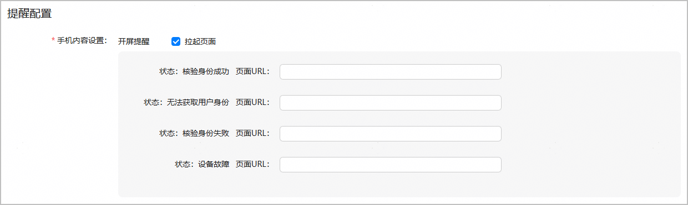
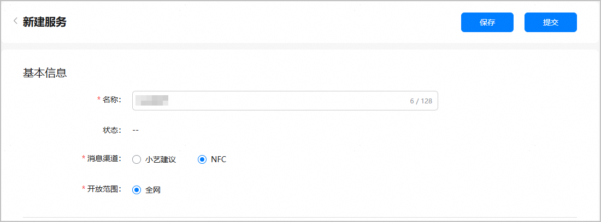
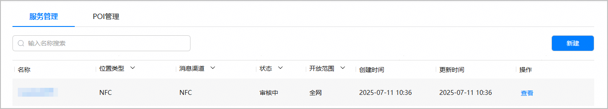

* 创建近场服务之前，请确保您的应用/元服务已上架。
* 一个应用/元服务最多支持创建2000个近场服务。

#### 新建服务

1. 登录[AppGallery Connect](https://developer.huawei.com/consumer/cn/service/josp/agc/index.html)，点击“APP与元服务”。
2. 进入“HarmonyOS”页签，您可通过包名、应用名称、应用类型等信息进行筛选，然后在应用列表中点击您的应用/元服务名称。

   
3. 左侧菜单栏选择“近场服务 > 近场管理”，进入近场管理主界面。选择“服务管理”页签，点击“新建”。

   

#### 配置服务基本信息

进入“新建服务”页面，在“基本信息”区域配置服务基本信息。

| 配置项 | 说明 | |
| --- | --- | --- |
| 名称 | 近场服务名称，长度为1~128个字符。 | |
| 状态 | 服务的状态。   * 草稿：点击“保存”后，服务状态变更为“草稿”。 * 审核中：点击“提交”后，服务状态变更为“审核中”。 * 审核驳回：内容设置不合规，服务申请被平台运营驳回，服务状态变更为“审核驳回”。可参考[图文素材审核细则](https://developer.huawei.com/consumer/cn/doc/app/agc-help-card-design-detail-rules-0000002349181504)修改内容后重新提交服务上线申请。 * 已上线：平台运营审核通过后，服务状态变更为“已上线”。 * 已下线：您自行点击“下线”或者由华为侧强制下线。 | |
| 消息渠道 | 向用户推送应用/元服务卡片的渠道。**请选择“NFC”**。 | |
| 开放范围 | 此配置项决定您创建的是测试态近场服务还是全网态近场服务，请保持默认选择“全网”。 | |

#### 选择关联的NFC设备

在“新建服务”页面的“感应方式”区域，选择关联的NFC设备。

* 可多选，最多选择100个NFC设备，且支持全选。
* 点击设备名称链接时，将打开该设备详情页面。
* 当列表中设备数量较大时，可通过鼠标上下滚动或右侧滑动条查看所有设备信息，也可在“感应设备”后的搜索框中输入设备名称进行模糊查询。
* 选择设备过程中，可通过“关联状态”检查勾选的设备是否正确。下拉框选择“已关联”时，仅展示已勾选的NFC设备；选择“未关联”时，仅展示未勾选的NFC设备。

  

  + 设备列表中仅展示“待激活”状态的设备。
  + 被其他已上线全网态近场服务使用的设备，不展示在设备待选列表中。

  

#### 配置服务提醒内容

1. 在“新建服务”页面的“提醒配置”区域，配置服务提醒内容。

   

   为了确保输入内容的正确性和合规性，防止出现涉黄、涉政、涉暴等敏感信息，近场服务已接入风控系统。在配置或查看近场服务内容时，如果页面提示“输入内容可能存在风险”或“输入内容不合规”，建议您修改为合规内容，以避免服务申请被驳回。

   

   | 配置项 | 说明 | |
   | --- | --- | --- |
   | 手机内容设置 | “开屏提醒”表示用户手机处于开屏状态时，碰一碰闸机后以何种形式接收内容提醒。  目前仅支持通过“拉起页面”方式向用户推送内容。 | |
2. 勾选“开屏提醒”的“拉起页面”选项，然后根据用户碰一碰NFC闸机设备后的返回状态，配置“页面URL”以拉起不同的应用或元服务页面。

   | 闸机设备状态 | 状态说明 | 配置项 | 配置项说明 |
   | --- | --- | --- | --- |
   | 核验身份成功 | 获取用户身份、验证身份成功，闸机成功开门。 | 页面URL | 输入App Linking应用/元服务链接。链接配置方法请参考[创建应用链接](https://developer.huawei.com/consumer/cn/doc/harmonyos-guides/app-linking-startupapp#在agc为应用创建关联的网址域 名)/[创建元服务链接](https://developer.huawei.com/consumer/cn/doc/atomic-guides/atomic-applinking#section48651523147)。  不同闸机设备状态的页面URL，须与应用/元服务开发态创建的页面对应。 |
   | 无法获取用户身份 | 无法获取用户OpenId/UnionId。 |
   | 核验身份失败 | 获取用户身份、验证身份失败，闸机未成功开门。  包含以下几种情况：  * 已下载和安装应用，但尚未购票 * 未下载和安装应用，且未购票 * 使用非华为账号购票 |
   | 设备故障 | 设备发生故障。 |

#### 提交服务申请

1. 服务配置完成后，点击页面顶端的“提交”。

   
2. 返回服务列表，全网态服务状态变更为“审核中”，华为运营人员会及时处理审核，并邮件通知您审核结果。

   
