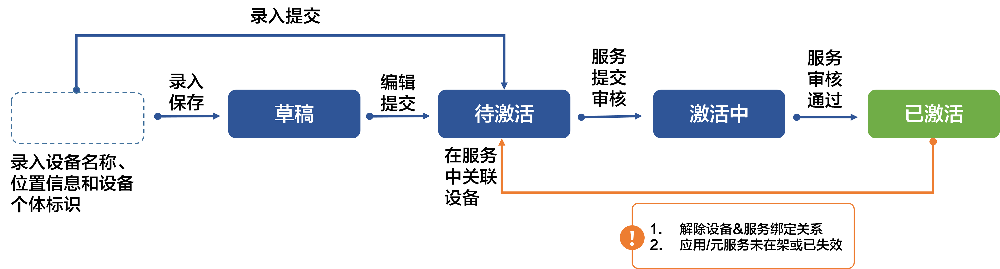
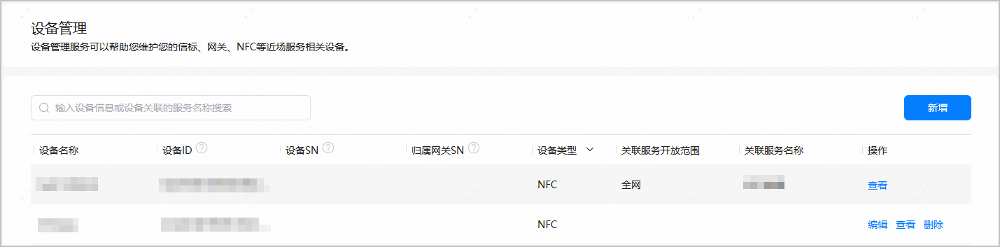
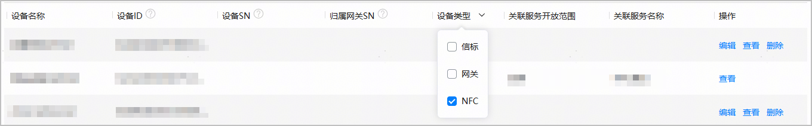

#### 设备状态

* NFC设备状态包括草稿、待激活、激活中、已激活4种。状态流转图如下：

  
* 不同状态的设备支持不同的操作，具体如下：

  | 状态 | 如何进入该状态 | 支持的操作 |
  | --- | --- | --- |
  | 草稿 | 录入设备信息后，点击“保存”。 | 编辑（支持编辑保存、编辑提交）、查看、删除。  说明：  编辑后点击“保存”，设备状态仍为“草稿”。点击“提交”，设备状态变更为“待激活”。 |
  | 待激活 | 以下几种情况下，设备均处于“待激活”状态。  + 录入的设备已点击“提交”发起注册申请，但尚未被近场服务选用。 + 设备已与近场服务关联，但关联的近场服务为草稿态。 + 设备关联的近场服务上线后被成功下线。 + 更新设备关联的近场服务时，设备被去勾选。 | 查看、删除。 |
  | 激活中 | 设备已与服务绑定，且创建服务申请正在审核中。 | 查看。 |
  | 已激活 | 设备已与服务绑定，且服务已成功上线。 | 查看。 |

#### 设备维护

设备列表会展示所有设备的类型和可执行操作，您可以在设备列表管理您的设备。

#### [h2]查询设备

在设备管理主界面，您可以在搜索框中输入设备名称、设备ID或设备关联的服务名称，模糊筛选设备。

也可在设备列表中点击“设备类型”右侧的，筛选您需要查询的设备类型。

#### [h2]编辑设备

处于“草稿”状态的设备，支持修改设备型号、设备名称、设备位置信息、设备个体标识等，点击设备“操作”列的“编辑”即可进行修改。

如果修改了设备型号、设备位置信息或者设备个体标识，系统将重新计算并刷新设备ID。

#### [h2]查看设备

在任何设备状态下，您都可以查看设备信息。只需点击设备“操作”列的“查看”，即可进入查看设备页面。

#### [h2]删除设备

处于“草稿”、“待激活”状态的设备支持“删除”设备操作。点击设备“操作”列的“删除”，在弹出的“删除设备”框中点击“删除”即可将设备删除。
