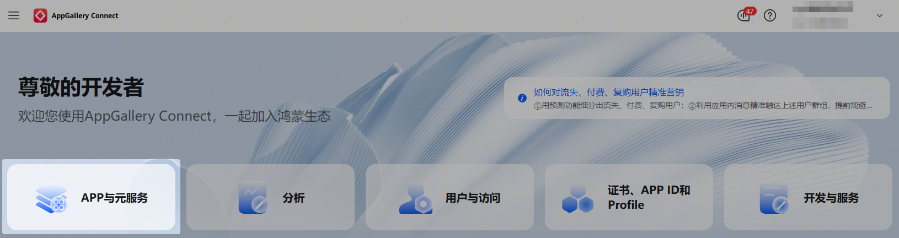
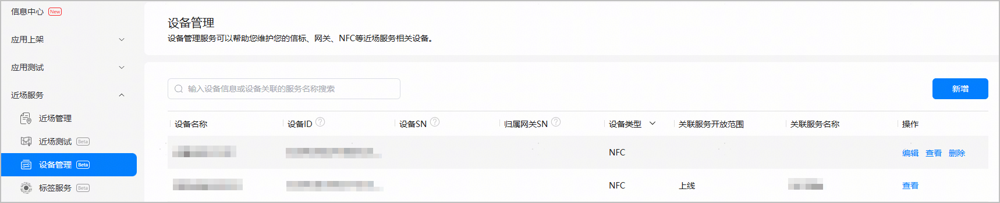
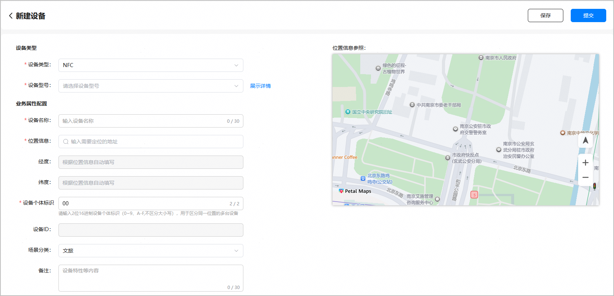

* 注册的所有NFC设备，您团队账号下的每个项目均可使用。
* 每个团队账号最多支持添加10万台NFC设备。

1. 登录[AppGallery Connect](https://developer.huawei.com/consumer/cn/service/josp/agc/index.html)，点击“APP与元服务”。

   
2. 进入“HarmonyOS”页签，您可通过包名、应用名称、应用类型等信息进行筛选，然后在应用列表中点击您的应用/元服务名称。

   
3. 左侧菜单栏选择“近场服务 > 设备管理”。在设备管理主界面，点击“新增”。

   
4. 进入“新建设备”页面，“设备类型”选择“NFC”，并选择设备型号，然后按照页面提示配置设备信息。

   

   | 区域 | 配置项 | 定义 | 说明 |
   | --- | --- | --- | --- |
   | 设备类型 | 设备类型 | 设备归属的分类。**“**NFC”表示NFC闸机设备。 | 此场景下不涉及使用其他类型的设备，**请选择“NFC”。** |
   | 设备型号 | 预置的设备型号。包括：  * SD-WG-EKGE：深大智能厂商设备 * 锐瞳6 Max：爱聚厂商设备 * FJC-MAT656：深圳富士智能厂商设备 | 根据选择的“设备类型”自动完成刷新。您可点击“设备型号”下拉框旁边的“展示详情”查看设备的生产厂商等信息。点击后名称变为“隐藏详情”，再次点击后隐藏设备详情，名称变为“展示详情”。 |
   | 业务属性配置 | 设备名称 | NFC设备的名称，由开发者自定义。 | 全局唯一，长度不超过30个字符。 |
   | 位置信息 | 设备所在地理位置信息描述。 | 在文本框中输入设备的位置信息后，系统将下拉显示多个关联地址。  选中目标地址后，文本框中将展示实际地址，包含省、市、区及详细地址，右侧地图将定位到对应的位置并显示地址名称。  仅支持搜索匹配地址，不支持手动编辑地址。  说明：  若提示“未查询到输入的位置信息”或者平台匹配的位置信息有误，您可发送邮件[反馈位置信息](/docs/distribute/agc/agc-help-location-sense-appendix-0000002349021732/agc-help-position-info-feedback-0000002349181500)。 |
   | 经度/纬度 | 设备所在位置的经纬坐标。 | 当“位置信息”选择地址时自动刷新为所选地址的坐标。在右侧地图中鼠标点击位置标记在地图上移动时，左侧经纬度会随之变化。 |
   | 设备个体标识 | 用于区分同一位置的不同设备。 | 2位16进制数，仅支持数字（0-9）和字母（A-F，不区分大小写）。  即同一位置下最多允许注册256个NFC设备。 |
   | 设备ID | NFC设备标识。 | 系统根据您录入的设备型号和设备个体标识信息自动生成设备ID，不支持修改。  设备ID为12字节24位16进制数，生成逻辑为：设备生产厂商组织标识（6位） + 设备群组标识（12位） + 设备型号标识（4位）+ 设备个体标识（2位）。  其中，设备生产厂商组织标识、设备型号标识根据设备型号取值，设备群组标识 = 【hash（设备位置信息）】取前8位 + 4位16进制随机数。 |
   | 场景分类 | 设备应用的场景分类，包括：  * 文旅 * 酒店 * 政府机关 * 医疗保健服务中心 * 交通运输 * 教育机构 | 选择场景分类，默认为“文旅”。 |
   | 备注 | 设备的附加说明，由开发者自定义，例如可补充设备特性信息。 | 可选，长度为0~30个字符。 |
5. 配置完成后，点击页面顶部的“提交”，则提交设备注册申请，NFC设备状态为“待激活”，可在创建近场服务时选用。若点击“保存”，并未发起设备注册申请，NFC设备状态为“草稿”，将无法被近场服务关联使用。

   
