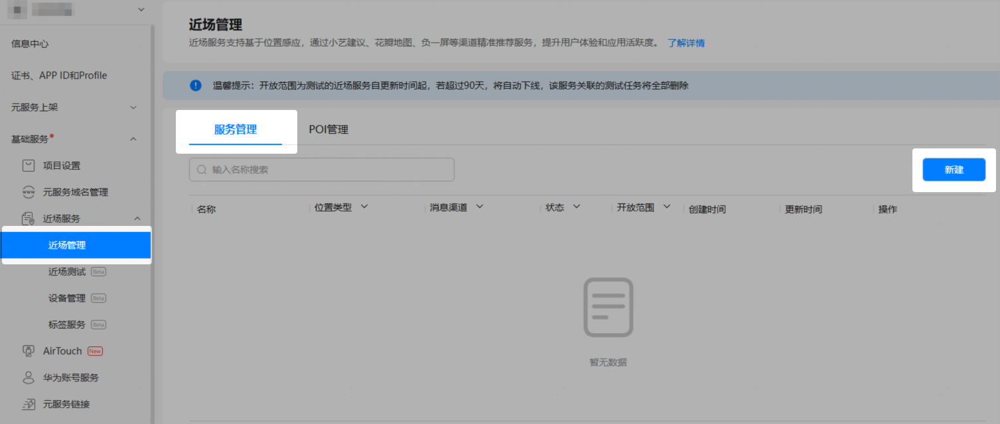
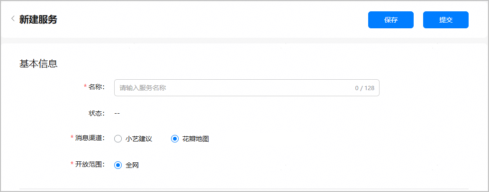
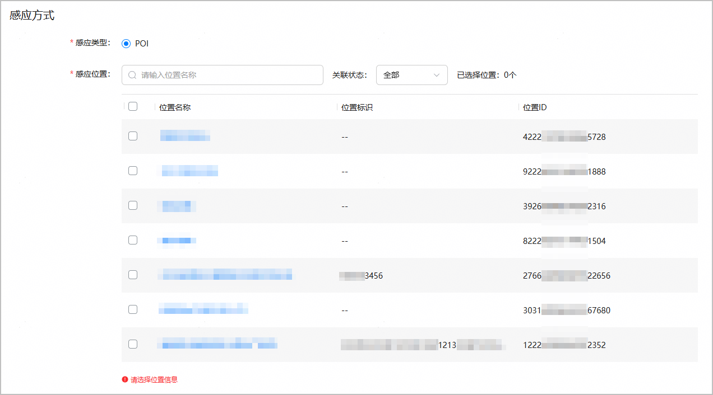
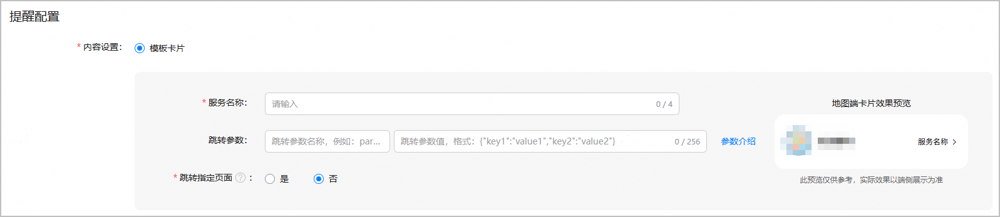
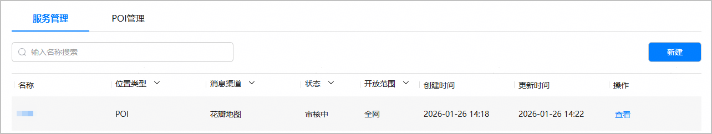

一个应用/元服务最多支持创建2000个近场服务。

#### 新建服务

1. 登录[AppGallery Connect](https://developer.huawei.com/consumer/cn/service/josp/agc/index.html)，点击“快速开始”中的“元服务一站式平台”卡片。

   
2. 在左上角的下拉列表中选择您的元服务。

   
3. 左侧菜单栏选择“基础服务 > 近场服务 > 近场管理”，进入近场管理主界面。
4. 选择“服务管理”页签，点击“新建”。

   

#### 配置服务基本信息

进入“新建服务”页面，在“基本信息”区域配置服务基本信息。



| 配置项 | 说明 | |
| --- | --- | --- |
| 名称 | 近场服务名称，长度为1~128个字符。 | |
| 状态 | 服务的状态。   * 草稿：点击“保存”后，服务状态变更为“草稿”。 * 审核中：点击“提交”后，服务状态变更为“审核中”。 * 审核驳回：内容设置不合规，服务申请被平台运营驳回，服务状态变更为“审核驳回”。可参考[图文素材审核细则](/docs/distribute/agc/agc-help-location-sense-appendix-0000002349021732/agc-help-card-design-detail-rules-0000002349181504)修改内容后重新提交服务上线申请。 * 已上线：平台运营审核通过后，服务状态变更为“已上线”。 * 已下线：您自行点击“下线”或者由华为侧强制下线。 | |
| 消息渠道 | 向用户推送应用/元服务卡片的渠道。**请选择“花瓣地图”**。 | |
| 开放范围 | 此配置项决定您创建的是测试态近场服务还是全网态近场服务，请保持默认选择“全网”。 | |

#### 选择关联的POI位置

在“新建服务”页面的“感应方式”区域，选择关联的POI位置。

* 可多选，最多选择1000个POI，且支持全选。
* 点击位置名称链接时，将打开该POI位置详情页面。
* 当列表中POI数量较大时，可通过鼠标上下滚动或右侧滑动条查看所有POI信息，也可在“感应位置”后的搜索框中输入POI名称进行模糊查询。
* 选择POI过程中，可通过“关联状态”检查勾选的POI是否正确。下拉框选择“已关联”时，仅展示已勾选的POI；选择“未关联”时，仅展示未勾选的POI。


* POI列表中仅展示状态为“已激活”且使用场景为“全网”的POI。
* 被其他已上线全网态近场服务使用的POI，不展示在POI待选列表中。



#### 配置服务提醒内容

在“新建服务”页面的“提醒配置”区域，配置服务提醒内容。


为了确保输入内容的正确性和合规性，防止出现涉黄、涉政、涉暴等敏感信息，近场服务已接入风控系统。在配置或查看近场服务内容时，如果页面提示“输入内容可能存在风险”或“输入内容不合规”，建议您修改为合规内容，以避免服务申请被驳回。

为提高灵活性，在创建近场服务时，目前支持通过配置“服务名称”、“跳转参数”和“跳转指定页面”来自定义元服务卡片上跳转按钮的名称和目标页面，从而实现元服务详情页的精准跳转。



| 配置项 | 说明 |
| --- | --- |
| 服务名称 | 用户在花瓣地图搜索POI后，POI详情窗口关联的元服务卡片上展示的按钮名称，不超过4个字符。 |
| 跳转参数 | * 第一个输入框：填写元服务自定义跳转参数名称，不允许为空，至少包含一个字符。 * 第二个输入框：填写元服务自定义跳转参数值，需要以\\{"key1":"value1","key2":"value2"\}格式填写，不允许为空。 |
| 跳转指定页面 | 是否需要拼接POI位置标识进行页面跳转，默认为“否”。   * 选择“是”时：跳转链接将拼接所选POI的位置标识，跳转至指定页面。 * 选择“否”时：跳转链接不会拼接所选POI的位置标识，所有POI点位均根据配置的“跳转参数”跳转至统一目标页面。 说明：  如果您选择“是”，请确保所选的POI已配置“位置标识”。否则，将无法通过区分POI实现指定页面的跳转。 |

下文根据“跳转指定页面”配置项的不同取值提供示例。

* “跳转指定页面”选择“是”时

  以“跳转参数”第一个输入框的值为params，第二个输入框的值为\\{"path":"ScenicSpotSimpleDetail","from":"hwmap","param":"4"\}，服务关联POI的位置标识为A001为例，花瓣地图会将此处配置的跳转参数传递给元服务。示例代码如下：

  ```
  FullScreenLaunchComponent({
    content: ColumChildHsp,
    appId: this.hspAppId,
    options: {
      parameters: {
        // params对应跳转参数第一个输入框填写的自定义跳转参数名称，{"path":"ScenicSpotSimpleDetail","from":"hwmap","param":"4","id":"A001"}对应跳转参数第二个输入框填写的自定义参数值以及POI的位置标识
        params: '{"path":"ScenicSpotSimpleDetail","from":"hwmap","param":"4","id":"A001"}',
      }
    }
  })
    .margin({ top: 20 })
  ```

  用户点击按钮后，元服务可在EmbeddableUIAbility的onCreate中通过want获取花瓣地图传递的参数，解析出要跳转的目标页面。示例代码如下：

  ```
  export default class AtomicServiceHspAbility extends EmbeddableUIAbility {
    onCreate(want: Want, launchParam: AbilityConstant.LaunchParam): void {
      const param = JSON.parse(want.parameters.params as string) as Record <string, Object>;
      if (param)
      {
        // param解析值：params = {"path":"ScenicSpotSimpleDetail","from":"hwmap","param":"4","id":"A001"}
      }
    }
  }
  ```
* “跳转指定页面”选择“否”时

  以“跳转参数”第一个输入框的值为params，第二个输入框的值为\\{"path":"ScenicSpotSimpleDetail","from":"hwmap","param":"4"\}为例，花瓣地图会将此处配置的跳转参数传递给元服务。示例代码如下：

  ```
  FullScreenLaunchComponent({
    content: ColumChildHsp,
    appId: this.hspAppId,
    options: {
      parameters: {
        // params对应跳转参数第一个输入框填写的自定义跳转参数名称，{"path":"ScenicSpotSimpleDetail","from":"hwmap","param":"4"}对应跳转参数第二个输入框填写的自定义参数值
        params: '{"path":"ScenicSpotSimpleDetail","from":"hwmap","param":"4"}',
      }
    }
  })
    .margin({ top: 20 })
  ```

  用户点击按钮后，元服务可在EmbeddableUIAbility的onCreate中通过want获取花瓣地图传递的参数，解析出要跳转的目标页面。示例代码如下：

  ```
  export default class AtomicServiceHspAbility extends EmbeddableUIAbility {
    onCreate(want: Want, launchParam: AbilityConstant.LaunchParam): void {
      const param = JSON.parse(want.parameters.params as string) as Record <string, Object>;
      if (param)
      {
        // param解析值：params = {"path":"ScenicSpotSimpleDetail","from":"hwmap","param":"4"}
      }
    }
  }
  ```

#### 提交服务申请

1. 服务配置完成后，点击页面顶端的“提交”。

   
2. 返回服务列表，全网态服务状态变更为“审核中”，华为运营人员会及时处理审核，并邮件通知您审核结果。

   

   全网态服务审核通过后，将于次日生效。生效后，您才能在花瓣地图的POI详情页体验一键拉起元服务。

   
