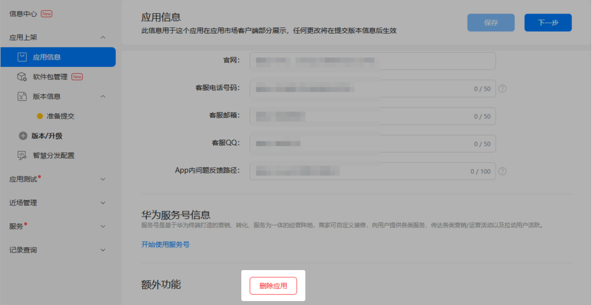
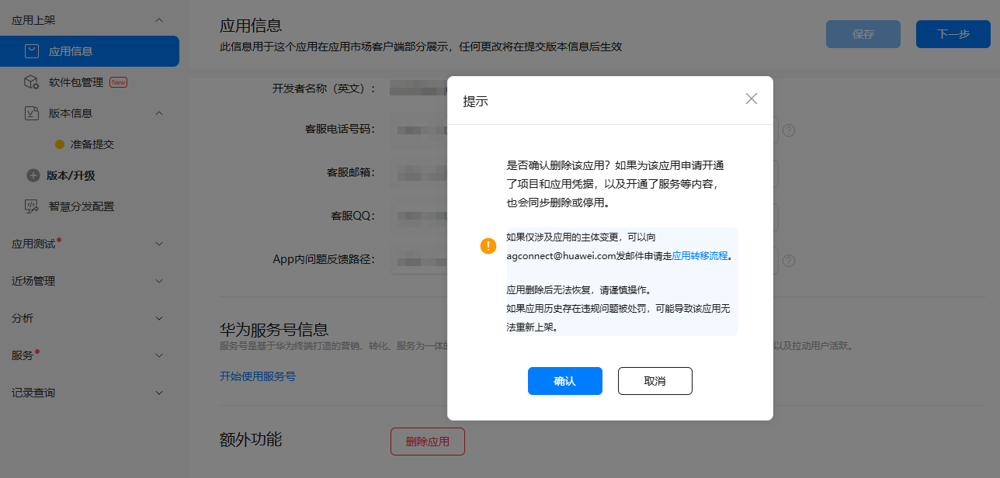
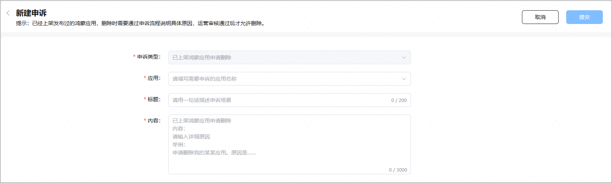
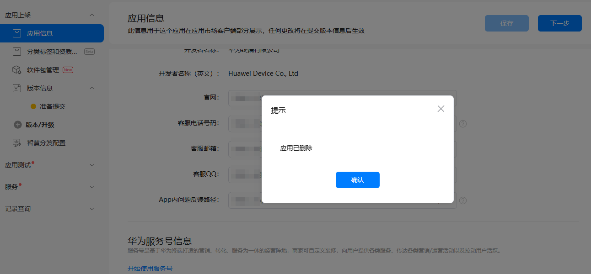
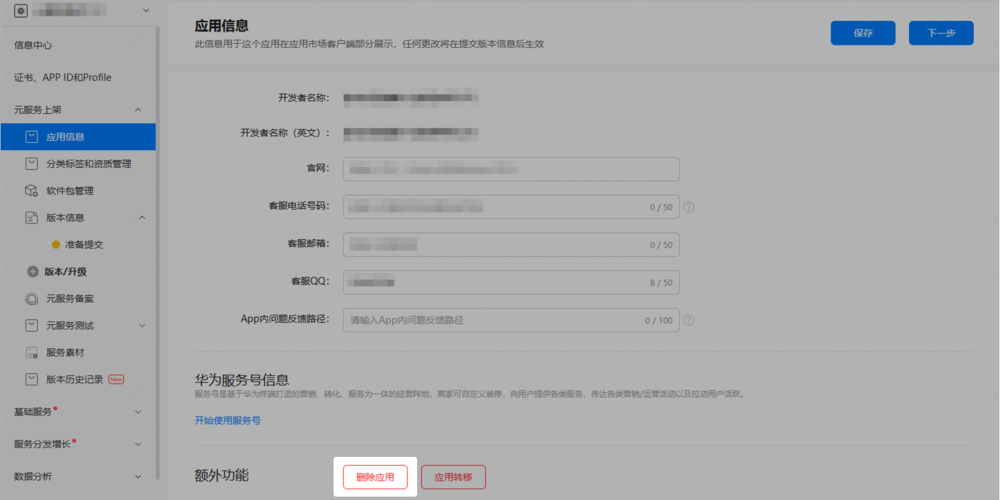
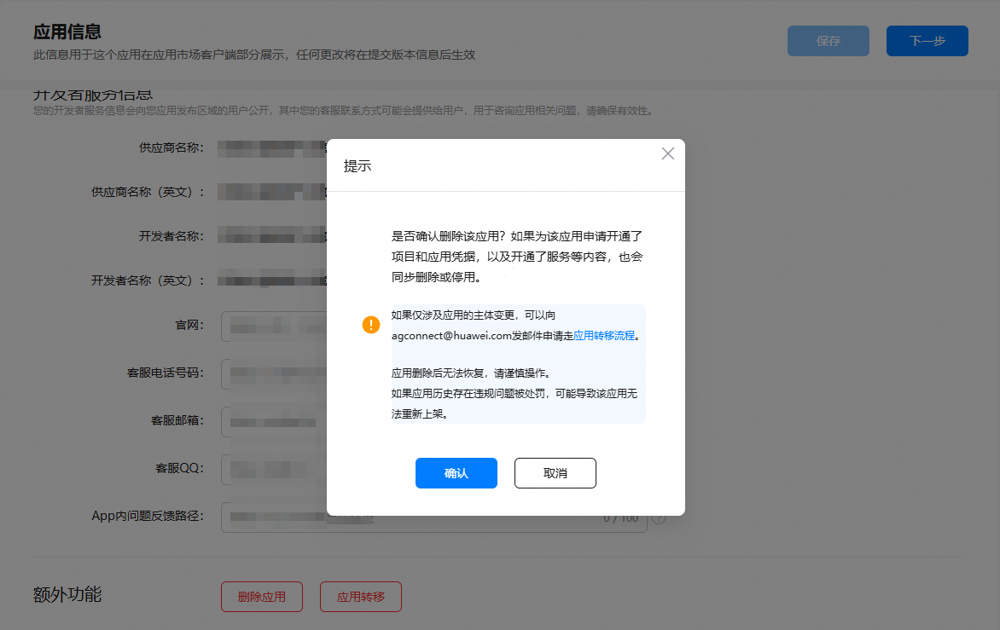
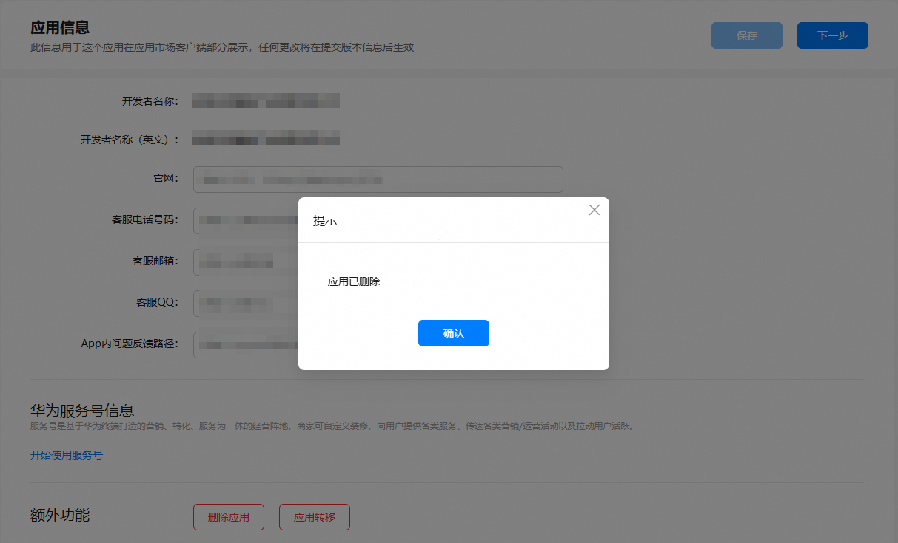

若您选择的应用类型或设备类型有误，或者您的应用已下架且不再使用等，您可以删除应用。可通过“开发与服务 > 项目设置”和“分发 > 应用上架/元服务上架 > 应用信息”两个入口删除，处理逻辑相同，下文仅以“分发 > 应用上架/元服务上架 > 应用信息”入口删除应用为例说明。

#### 前提条件

待删除应用的状态不能属于“已上架”、“正在审核”或“下架处理中”中的任意一种。

若需要删除处于“已上架”、“正在审核”或“下架处理中”状态的应用，请按照如下引导进行操作：

* 对于“已上架”状态的应用，您可[提交下架申请](https://developer.huawei.com/consumer/cn/doc/app/agc-help-maintain-remove-0000002274058145#section516715913203)，并可根据审批进度进行[催审](https://developer.huawei.com/consumer/cn/doc/app/agc-help-maintain-remove-0000002274058145#section1431432482017)，应用下架成功变为“已下架”状态后再删除应用。
* 对于“正在审核”状态的应用，您可提交[撤销审核](https://developer.huawei.com/consumer/cn/doc/app/agc-help-release-push-0000002312626049#section18227759939)申请，审核通过变为“已撤销上架”状态后再删除应用。
* 对于“下架处理中”状态的应用，您可进行[催审](https://developer.huawei.com/consumer/cn/doc/app/agc-help-maintain-remove-0000002274058145#section1431432482017)，审核通过变为“已下架”状态后再删除应用。

#### 操作步骤

* 建议备份待删除应用的相关素材、品牌方案、软件包等重要数据。删除应用后，相关文件不可恢复，请谨慎操作。
* 建议确认待删除应用的开发、分发、运营等相关的服务是否继续使用，删除应用后，AGC会关闭已经开通的服务，请谨慎操作。
* 删除应用后，用户将无法再通过华为应用市场访问或下载该应用。为避免出现用户数据丢失、反馈与沟通渠道受限、信任度下降等问题，建议您在删除应用前尽可能提前通知用户，并提供必要的数据备份和迁移指导。

#### [h2]HarmonyOS应用

1. 登录[AppGallery Connect](https://developer.huawei.com/consumer/cn/service/josp/agc/index.html)，点击“APP与元服务”。
2. 在应用列表页的“HarmonyOS”页签，点击待删除应用的名称，进入应用详情页。
3. 在左侧导航栏选择“应用上架 > 应用信息”，点击页面底部的“删除应用”。

   

   * 当前处于“已上架”、“正在审核”或“下架处理中”状态的应用不支持删除，因此不会显示“删除应用”按钮。
   * 当“应用测试 > 版本列表”中存在“正在测试”状态的版本时，不支持删除，停止测试后才可执行删除操作。

   
4. 系统弹出提示框，请仔细阅读提示信息，根据实际需求进行下一步操作。
   * 如果您需要进行应用转移，请先点击提示框中的“应用转移流程”，参照模板发送应用转移申请邮件，然后点击“取消”，无需再执行后续步骤。
   * 如果确认要删除应用，请点击“确认”，继续执行后续步骤。

   
5. 基于应用的上架状态，删除应用的后续步骤分为两种情况。
   * 删除应用前，应用正式上架过
     1. 确认后则直接进入“新建申诉”页面，请根据页面提示，选择待删除应用的应用名称并说明删除应用的原因，如下图所示。填写完成后，点击“提交”。
        + 申诉类型：保持默认选择“已上架鸿蒙应用申请删除”（请确保在应用信息页面点击“删除应用”新建申诉，不可直接在互动中心页面提交申诉请求）。
        + 应用：可在下拉框选择待删除应用的应用名称，或者输入应用名称关键词筛选应用。
        + 标题：一句话简要描述下删除应用的场景。
        + 内容：按照样例格式，详细说明下删除应用的原因。

        
     2. 申诉工单提交后，您可进入[互动中心](https://developer.huawei.com/consumer/cn/doc/app/agc-help-interaction-center-0000002276985946)查看工单处理进展，华为运营人员审核后会进行答复。
        + 如果审核未通过，请根据工单回复结论进行相应处理。
        + 如果审核通过，您便可重新执行步骤[3](#ZH-CN_TOPIC_0000002271413701__zh-cn_topic_0000001146716617_li1033752255115)删除应用。
   * 删除应用前，应用尚未全网上架，也不存在正在发布的测试版本

     确认后弹框提示您“应用已删除”，表示应用已被成功删除。点击“确认”，系统自动跳转至应用列表页面，可发现该应用已不再展示。

     

#### [h2]元服务

1. 登录[AppGallery Connect](https://developer.huawei.com/consumer/cn/service/josp/agc/index.html)，点击“快速开始”中的“元服务一站式平台”卡片。

   
2. 在左上角的下拉列表中选择待删除的元服务。

   
3. 在左侧导航栏选择“元服务上架 > 应用信息”，点击页面底部的“删除应用”。

   

   * 当前处于“已上架”、“正在审核”或“下架处理中”状态的元服务不支持删除，因此不会显示“删除应用”按钮。
   * 当“元服务上架 > 元服务测试 > 版本列表”中存在“正在测试”状态的版本时，不支持删除，停止测试后才可执行删除操作。

   
4. 系统弹出提示框，请仔细阅读提示信息，根据实际需求进行下一步操作。
   * 如果您需要进行应用转移，请先点击提示框中的“应用转移流程”，参照模板发送应用转移申请邮件，然后点击“取消”，无需再关注后续步骤。
   * 如果确认要删除应用，请点击“确认”。

   
5. 确认后弹框提示您“应用已删除”，表示应用已被成功删除。点击“确认”，系统自动跳转至应用列表页面，可发现该元服务已不再展示。

   
