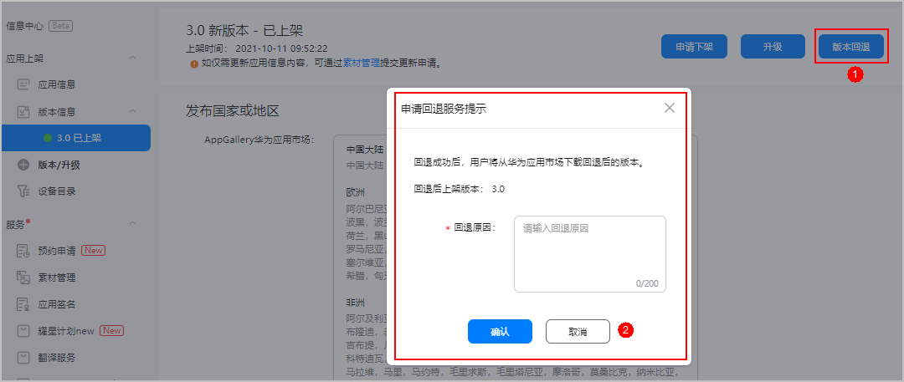
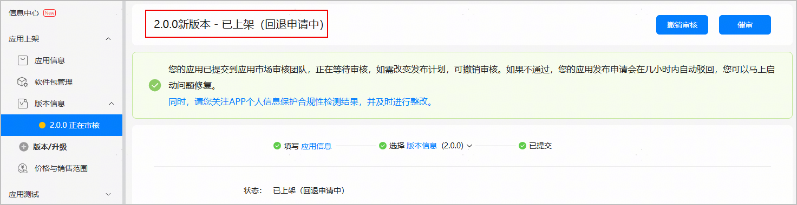

您可以将当前在架的应用版本回退到上一个版本。版本回退是将当前在架版本回退到最近一次上架的应用版本，且只能按照版本发布顺序依次回退。如果您已回退到初始版本，您将无法继续回退。

通过分阶段发布的应用版本暂不支持回退。

#### 前提条件

待回退版本前至少存在一个在架版本。例如：某应用按Version1->Version2演进，则可以从Version2回退至Version1，但无法对Version1进行回退。

#### 提交回退申请

1. 登录[AppGallery Connect](https://developer.huawei.com/consumer/cn/service/josp/agc/index.html)，选择“APP与元服务”。
2. 在应用列表中点击待回退的应用版本链接，进入该版本的“版本信息”页面。
3. 点击右上角的“版本回退”，在弹出框中填写回退原因，并点击“确认”。

   

   此时版本信息页面显示该版本“已上架（回退申请中）”，为确保您回退版本符合当前华为应用市场的发布标准，华为方会对回退申请进行审核，请耐心等待审核通过即可。

   

   当您的应用从版本2回退到版本1后，如果您想再次对版本1升级，您需要确保您提交的应用签名与版本2的应用签名一致，否则选取软件包时会弹出错误提示框。相关内容请参见[软件包签名不一致如何处理](/docs/distribute/agc/agc-help-maintain-0000002270829401/agc-help-maintain-upgrade-0000002236494386#section17520173352618)。

   
