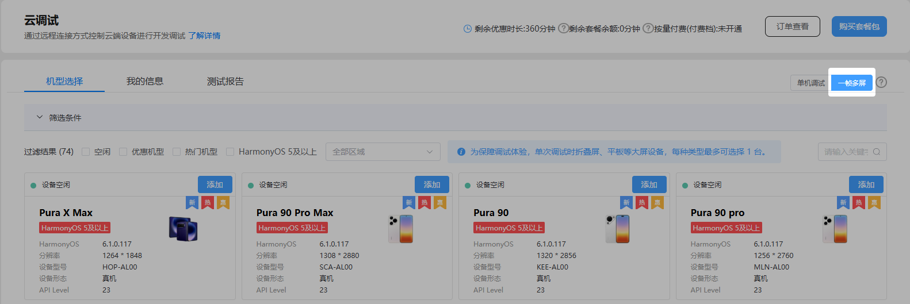
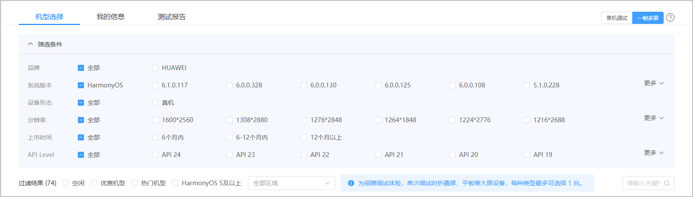
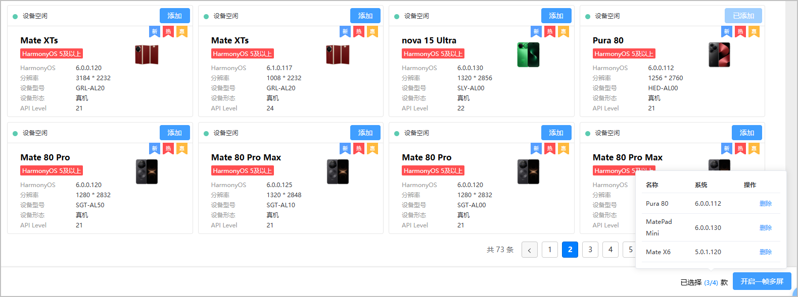
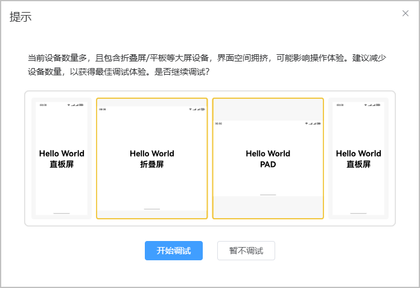
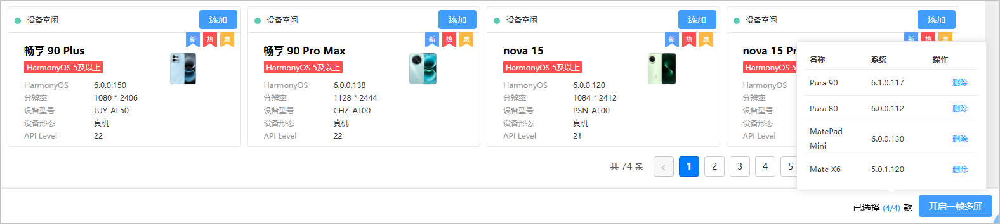
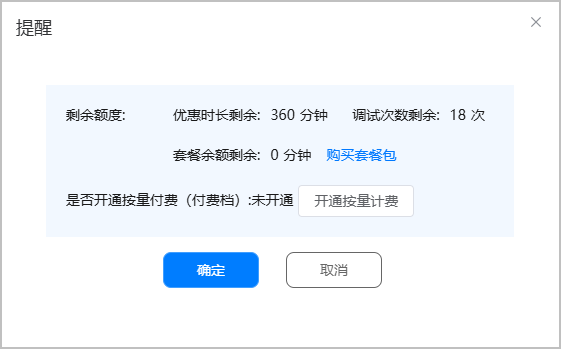
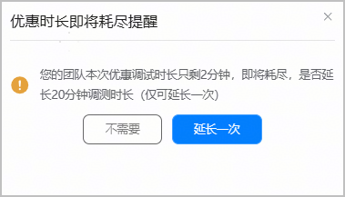
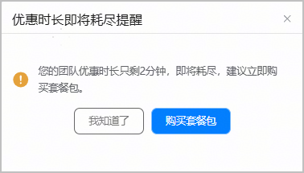

如果您的应用支持在多种设备类型（如手机、平板）上安装和使用，可选择一帧多屏调试场景进行调试。

一帧多屏调试场景支持对HAP/APP格式的应用进行调试，每次调试可同时申请2~4台设备，以验证应用在不同机型上的表现，从而提升调试效率，提前发现并解决问题。

* 云调试的使用高峰期为每天的13点~23点，为避免排队，建议您错峰在8点~12点期间进行软件包调试。
* 系统以账号为维度，每日零点为您提供360分钟的免费额度。如果您添加了团队成员，主账号与成员子账号的优惠时长不共用，各自独立享有系统为其分配的优惠时长。

1. 登录[AppGallery Connect](https://developer.huawei.com/consumer/cn/service/josp/agc/index.html)，点击“开发与服务”。
2. 在项目列表中点击需要调试的项目。
3. 在左侧导航栏选择“质量 > 云调试”，进入云调试主界面，点击“一帧多屏”。

   
4. 点击“筛选条件”，根据实际需要，您可从品牌、系统版本、设备形态、分辨率、上市时间、API Level、是否优惠机型、是否热门机型和是否HarmonyOS 5及以上机型等维度筛选出待调试的机型。

   
5. 筛选设备后，点击设备图框右上角的“添加”可将其添加到调试任务中。一次调试任务至少需添加2台设备，最多支持添加4台设备，页面下方将显示已添加的设备数量。完成设备选择后，点击“开启一帧多屏”。

   

   * 为保障调试体验，在一次调试任务中，折叠屏、平板等大屏设备，每种设备类型最多可选择1台。
   * 每个设备图框中均显示“设备空闲/繁忙”的设备状态标识，您仅可选择处于空闲状态的设备进行调试。

   
6. 如果您添加了4台调试设备，其中包含折叠屏手机或平板时，调试界面可能会显得比较拥挤。为保障调试体验，系统将弹出提示框询问您是否继续调试。

   

   * 您可以点击“开始调试”继续调试。
   * 或点击“暂不调试”，调整设备数量后点击“开启一帧多屏”继续调试。

     调整方法：点击页面右下角的设备数量，比如（4/4），在弹出的悬浮框中，点击“操作”列的“删除”，即可将添加的设备删除。

     
7. 在弹出的“提醒”框中确认剩余额度后，点击“确定”，系统将预扣特定的时间额度（单次调试时长\*设备数量）。如果设备调试提前结束，则按实际使用量进行扣费结算。

   

   * 系统按照“优惠时长 ＞ 套餐余额 ＞ 按量付费”的优先顺序扣除调试时间，详见[计费优先级说明](https://developer.huawei.com/consumer/cn/doc/app/agc-help-clouddebug-price-0000002255019568#section14889225364)。
   * 如果剩余的优惠时长额度不足，您可以点击“[购买套餐包](https://developer.huawei.com/consumer/cn/doc/app/agc-help-clouddebug-price-0000002255019568#section1554613186493)”订购项目付费套餐，或点击“[开通按量计费](https://developer.huawei.com/consumer/cn/doc/app/agc-help-clouddebug-price-0000002255019568#section12857373426)”根据实际使用量付费。

   
8. 使用优惠时长进行设备调试时，单次调试时长不得超过20分钟。当20分钟调试时长即将用尽时，系统会弹出如下提示框询问您是否需要延长调试时间。
   * 如需延长调试时间且剩余优惠时长额度充足时，请点击“延长一次”，系统将在20分钟基础上再增加20分钟调试时间，您可以继续调试。
   * 如无需延长调试时间，则点击“不需要”，当20分钟调试时长用尽时，系统将释放调试设备。

   
9. 如您点击了“延长一次”，当40分钟调试时长即将用尽时，系统会再次弹框提示您。

   

   * 如您点击“我知道了”，当40分钟调试时长用尽时，调试设备将被释放，您需要重新申请设备才能继续调试。
   * 如您点击“购买套餐包”，则可以在弹出的“购买”窗口中购买付费套餐包或开通按量付费。当40分钟调试时长用尽时，调试设备将被释放。您可以重新申请调试设备，并在调试时长即将用尽时，如下图所示，根据实际调试情况选择是否使用付费套餐额度继续进行调试。

     
