在本场景下，如无特殊说明，“应用”所指代的对象包括HarmonyOS 5及以上应用和元服务。

#### 前提条件

* 调试应用前必须先[申请调试设备](https://developer.huawei.com/consumer/cn/doc/app/agc-help-clouddebug-applyequip-multidevice-0000002578270131)。
* 在使用云调试服务前，请准备好配置了发布证书且打包时编译模式选择“release”的应用包，且应用软件包的大小须在4GB以内。

#### 上传应用

1. 设备初始化成功后，系统将自动进入“一帧多屏”控制台页面，点击右上角的“安装应用”。

   
2. 页面右侧弹出“应用列表”窗口。点击“本地上传”，上传本地待调试的应用release包。上传完成后，应用将自动安装。

   此外，您也可以在调试前进入“我的信息”页签上传应用，具体操作方法请参见[管理应用](https://developer.huawei.com/consumer/cn/doc/app/agc-help-clouddebug-manageapp-multidevice-0000002578350145)。这样，应用列表中将可看到之前已上传的应用，鼠标悬停在应用图框上，点击即可安装应用。

   

   * 当前仅支持上传和安装配置了发布证书且在打包时“Build Mode”选择“release”的应用release包，暂不支持In-house应用及debug版本的应用包。
   * 上传应用包时，系统会对包名、版本和SHA256进行重复性校验。允许上传具有相同包名和版本但SHA256不同的应用包。如果待上传应用包的包名、版本和SHA256与已成功上传的应用包完全一致，则无法上传并弹框提示您。
   * HAP和APP格式的HarmonyOS应用在真机设备上安装完成后均会自动打开，无需您手动操作。

   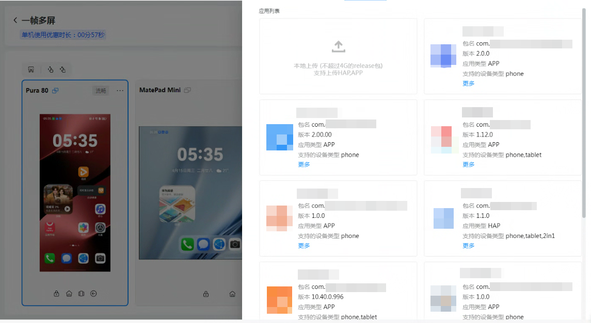
3. 在应用安装过程中或安装完成后，设备顶部都会显示提示信息，以便您了解应用的安装状态及结果。

   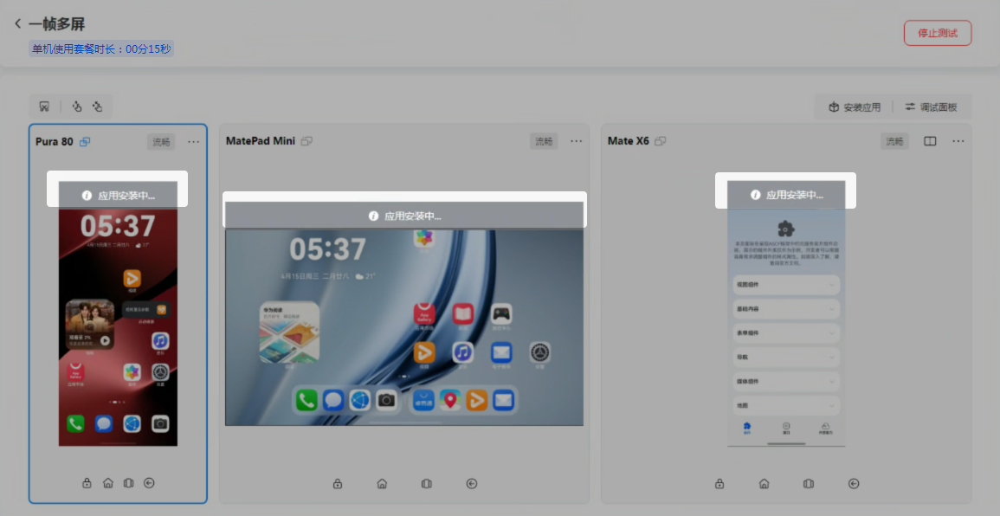

#### 调试说明

应用安装完成后，点击应用列表窗口任意位置将其收起，返回“一帧多屏”控制台页面。

在调试界面，蓝色图框框选的设备为系统首次初始化的主机，其余设备为从机。在主机上进行点击、鼠标滑动等远程操作时，其余从机设备会同步联动，您即可直观了解应用在不同设备上的运行和使用情况。如需单独调试某台从机设备，直接在从机设备上操作即可。

调试过程中，如需更换主机，可以点击某一台从机设备名称右侧的将其切换为主机。

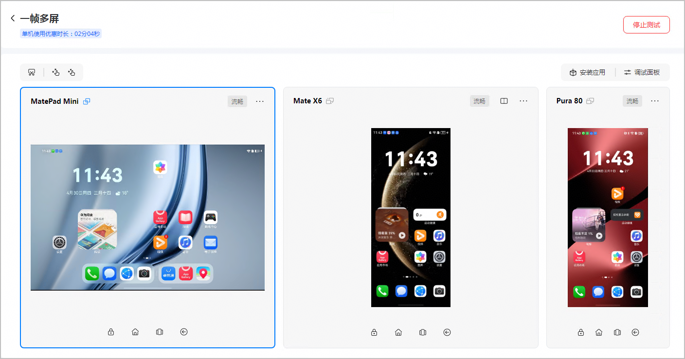

如果需要手动安装或删除您上传的其他应用，可点击页面右上角的“安装应用”，在右侧弹出的“应用列表”窗口进行操作：鼠标悬停在应用图框上，点击安装应用，或点击删除应用。

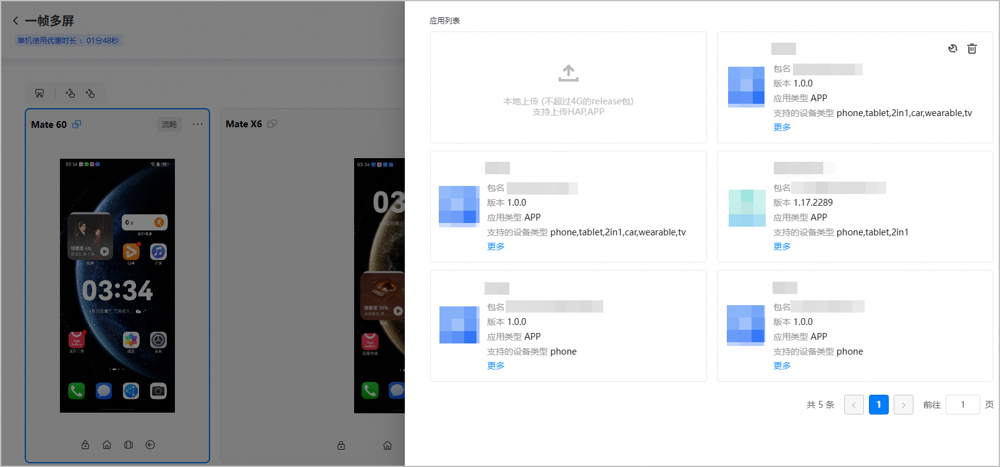

**界面按钮说明**

| 按钮位置 | 样式 | 功能名称 | 功能介绍 | |
| --- | --- | --- | --- | --- |
| 设备区域 |  | 截图 | 对当前设备页面进行截图。 | |
|  | 双指展开 | 在某些特殊场景下，例如地图或图片处理类应用，当需要在屏幕上模拟双指展开功能时，请点击此按钮。 | |
|  | 双指捏合 | 在某些特殊场景下，例如地图或图片处理类应用，当需要在屏幕上模拟双指捏合功能时，请点击此按钮。 | |
|  | 设置该设备为主机 | 设置当前设备为主机，其余设备则变更为从机。  说明：  * 设置主机后，主机作为主控操作设备联动其余从机设备，同时仍可独立操作从机。 * 一帧多屏模式下，因设备类型、设备型号、系统版本、分辨率及应用界面控件等因素存在差异，部分设备界面可能出现联动失败的情况，属于正常现象。您可以单独操作不同步的设备，以恢复界面联动。 | |
|  | 切换该设备为主机 | 将当前从机切换为主机，原主机则变更为从机。 | |
|  | 切换设备分辨率 | 根据需要选择设备分辨率，分辨率选项包括：流畅、标清和高清。 | |
|  | 切换设备展开状态 | 仅折叠屏手机设备支持，包括展开态和折叠态。 | |
|  | 设备详情 | 展示当前设备的主机名、系统版本、API Level和分辨率信息。 | |
|  | 释放设备 | 单独释放该台设备。仅允许释放单台从机设备，如果当前设备为主机，则不允许释放。 | |
|  | 安装应用 | 点击后页面右侧弹出“应用列表”窗口，您可以上传、安装或删除应用。 | |
|  | 调试面板 | 点击后页面右侧将弹出调试面板窗口，包含以下页签：   * 控制参数：可输入hdc shell命令操作设备，或设置设备的地理位置以了解应用在特定位置的使用情况。 * 截屏：可查看、下载或删除历史截图。 * Hilog：在线查看和导出设备运行期间的系统日志、应用日志，以便定位问题。 | |
|  | 锁屏 | 锁定设备界面，使设备立即进入黑屏状态或是从黑屏状态唤醒。 | |
|  | 返回主页 | 使设备从当前操作界面返回主页。 | |
| 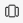 | 菜单 | 进入最近打开的应用列表。 | |
|  | 返回 | 返回上级界面。 | |
| **点击****后右侧弹出的应用列表区域** |  | 安装 | 手动安装已上传的HAP/APP应用。 | |
|  | 删除 | 删除已上传的应用文件。 | |
| 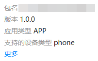 | 更多 | 显示已上传应用的基本信息，包括文件大小、上传时间和API Level。 | |

#### 使用调试面板调试

当前调试面板窗口包含以下页签：

* [控制参数](#section3837959183319)：可输入hdc shell命令操作设备，或设置设备的地理位置以了解应用在特定位置的使用情况。
* [截屏](#section1520653317105)：可查看、下载或删除历史截图。
* [Hilog](#section1590075862118)：在线查看和导出设备运行期间的系统日志、应用日志，以便定位问题。

#### [h2]控制参数

1. 在调试页面中，点击页面右上角的“调试面板”。

   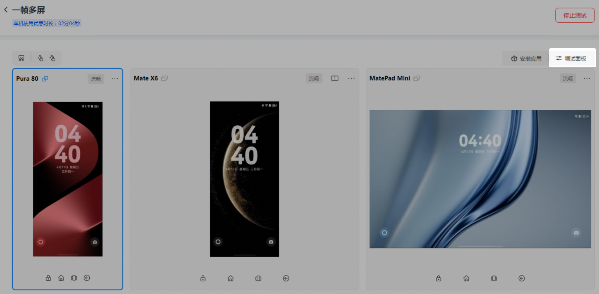
2. 页面右侧弹出调试面板窗口，默认进入“控制参数”页签。
   * Shell脚本操作

     在“Shell脚本”区域，选择“执行设备”，在“执行命令”输入框中输入hdc shell命令，点击“执行”即可发送命令。

     

     + 由于安全限制，当前hdc调试不支持reboot、reboot recovery等命令。
     + 输入命令时，可不携带“hdc shell”前缀，当携带前缀时，系统会自动过滤前缀后再执行命令。

     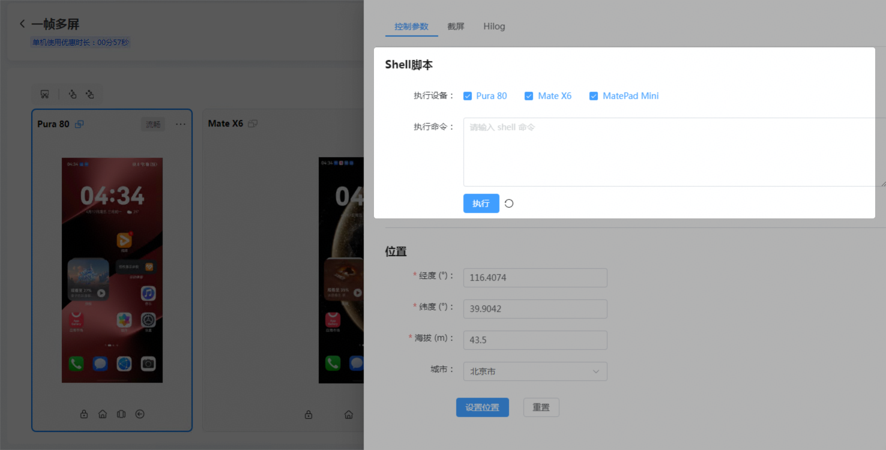

     此外，云调试已支持识别持续打印输出的shell命令（如hilog），并新增了停止操作。当系统识别出您输入的为持续打印日志的hdc shell命令时，命令执行一段时间后，“执行”按钮将自动变更为“停止”，如下图所示，您可根据需要随时点击“停止”以暂停命令执行。点击“停止”后，按钮将恢复为“执行”，您可以继续执行当前命令或其他hdc shell命令。

     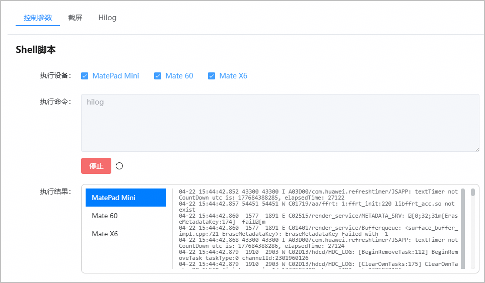
   * 设置地理位置

     您可以通过设置调试设备的地理位置信息，了解应用在特定位置的使用情况。

     在“位置”区域，填写GPS的相关信息，包括经度、纬度、海拔高度和城市。填写完成后，点击“设置位置”，当页面提示设置成功时，即表示地理位置设置完成。

     如需测试其他位置，可点击“重置”清空各项配置，重新输入目标位置进行测试即可。

     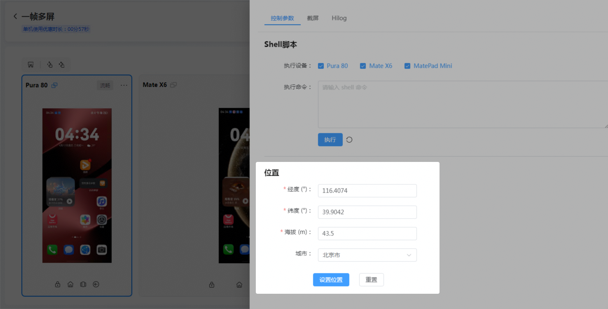

#### [h2]截屏

云调试服务支持在调试过程中实时对设备进行截屏。当您在调试应用过程中需要保存特殊场景的信息时，可以通过截屏功能保存场景界面，以便您定位问题。操作方法如下：

* 截图：在“一帧多屏”控制台页面，点击左上角的，即可对调试中的多台设备操作界面进行截屏。
* 查看截图：在“一帧多屏”控制台页面，点击右上角的，页面右侧滑出调试面板窗口。点击“截屏”页签即可查看截图，如下图所示，系统会按照截图时的时间戳分组展示每次的设备截图。

* 下载截图：进入调试面板窗口的“截屏”页签，可点击分组右侧的图标下载整个分组截图，也可点击单张截图图框右上角的图标下载单张截图。点击“全部下载”可下载所有分组截图。
* 删除截图：进入调试面板窗口的“截屏”页签，可点击分组右侧的图标删除整个分组截图，也可点击单张截图图框右上角的图标删除单张截图。点击“全部删除”可删除所有分组截图。

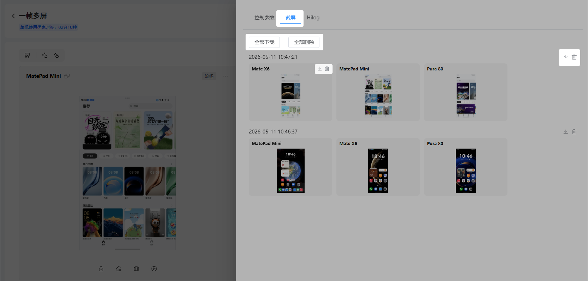

#### [h2]Hilog

1. 在调试面板窗口，点击“HiLog”页签。

   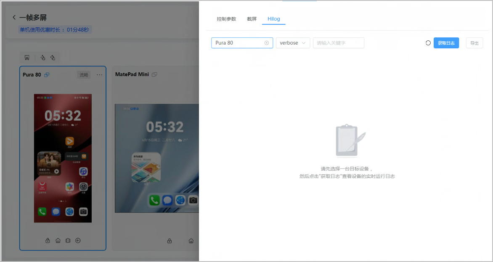
2. 下拉框中选择目标设备和日志类型（目前支持的日志类型有verbose、debug、info、warn、error和assert），并可根据需要在输入框输入日志关键字，然后点击“获取日志”。

   

   日志可实时展示500条，下载15000条。

   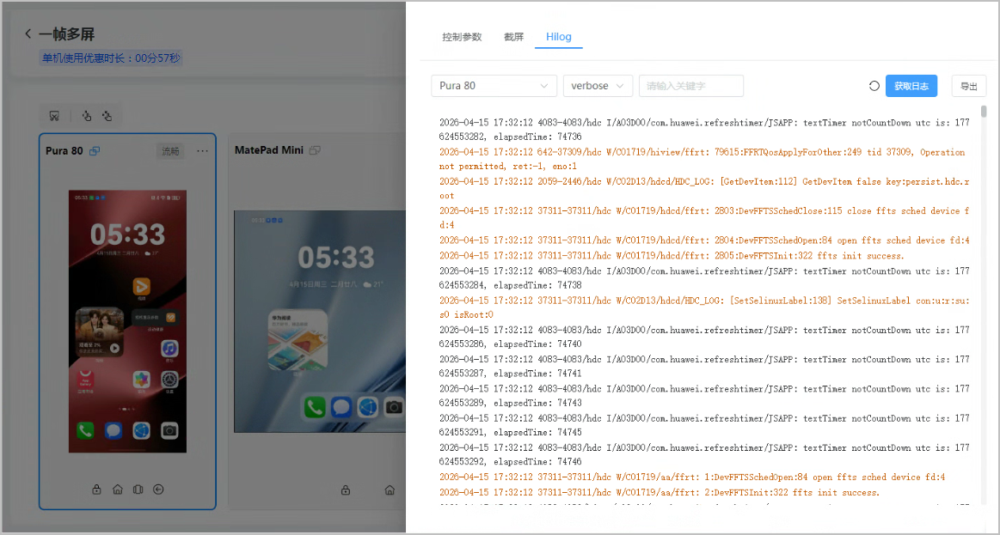
3. （可选）获取到相关日志信息后，您可点击“停止”终止日志获取，或点击“导出”将获取的日志保存至本地。

   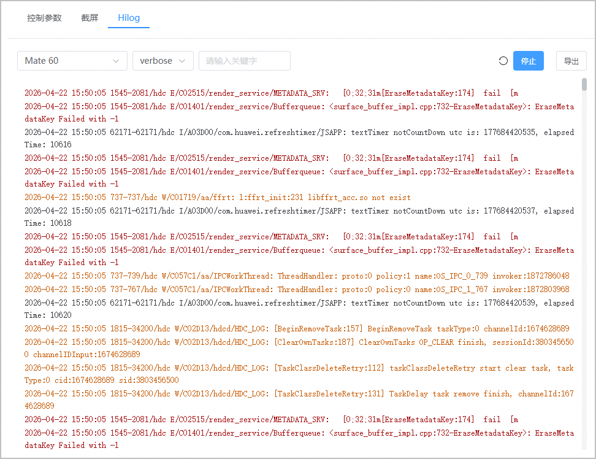

#### 释放设备

当您申请的调试设备的使用额度未用完时，您可手动释放设备。设备提前释放后，系统会按照实际使用额度进行结算。

#### [h2]释放单一设备

当调试中的设备数量大于2台，且您不再需要对其中某一台设备进行调试时，您可手动释放该设备。

* 一帧多屏调试场景下，至少需保留2台设备进行调试。
* 不允许删除主机设备。如需删除主机，可先将某台从机设备切换为主机，再进行删除操作。

1. 在调试界面，点击待释放的设备图框上方的图标。

   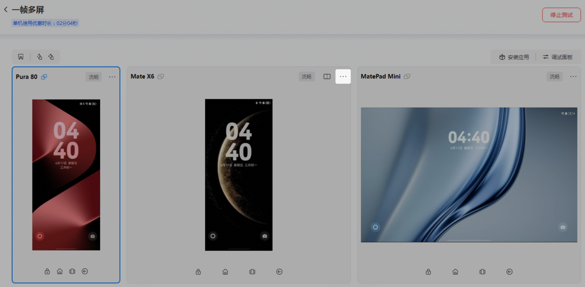
2. 在弹出框中点击，即可释放该设备，您可看到释放的设备将从调试界面中移除。

   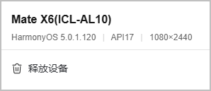

#### [h2]释放所有设备

1. 在调试界面中，点击右上角“停止测试”。

   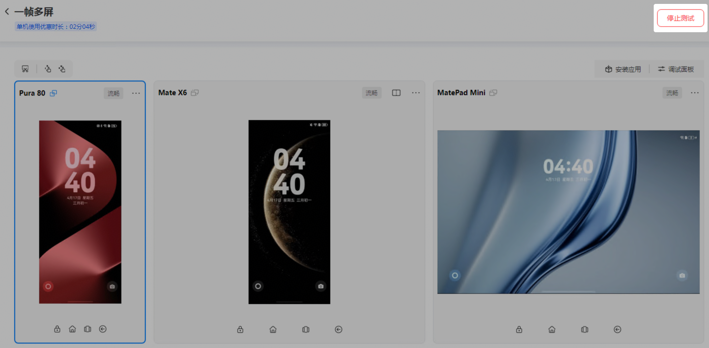
2. 在弹出的提示框中点击“确定”，即可结束调试并释放所有设备，页面随即跳转回云调试主界面。

   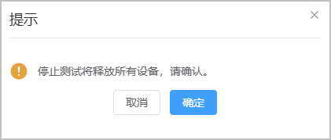
