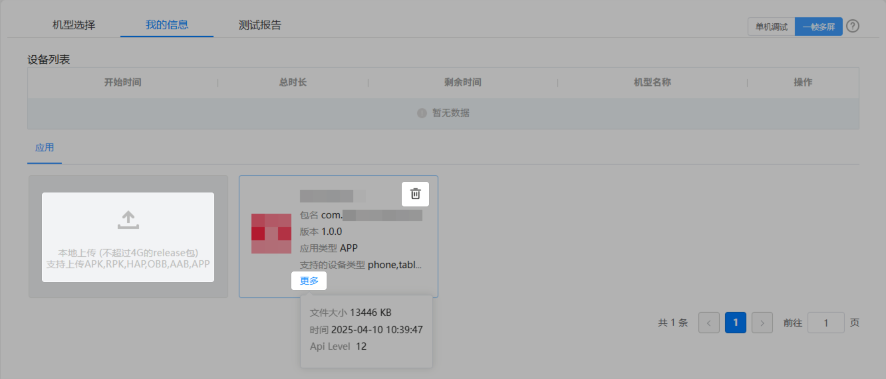

在云调试服务主界面，选择“我的信息”页签，点击“一帧多屏”后，您可以在下方的“应用”页签上传、删除应用，或查看已上传应用的相关信息。

* 上传应用：点击“本地上传”区域，从本地上传HAP或APP格式的应用。

  

  上传应用包时，系统会对包名、版本和SHA256进行重复性校验。允许上传具有相同包名和版本但SHA256不同的应用包。如果待上传应用包的包名、版本和SHA256与已成功上传的应用包完全一致，则无法上传并弹框提示您。
* 删除应用：鼠标悬停在应用图框上方，点击即可删除已上传的应用。
* 查看应用信息：点击“更多”，在弹出框中将显示已上传应用的大小、上传时间等信息。

  
