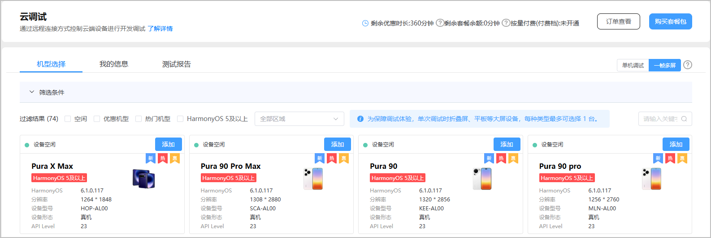
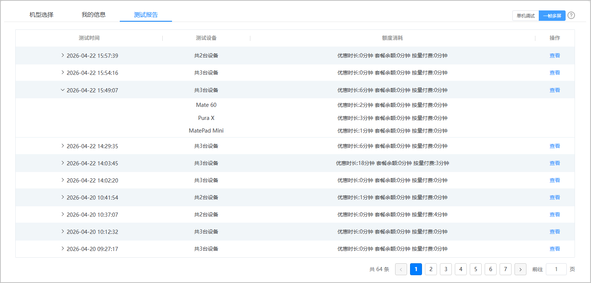
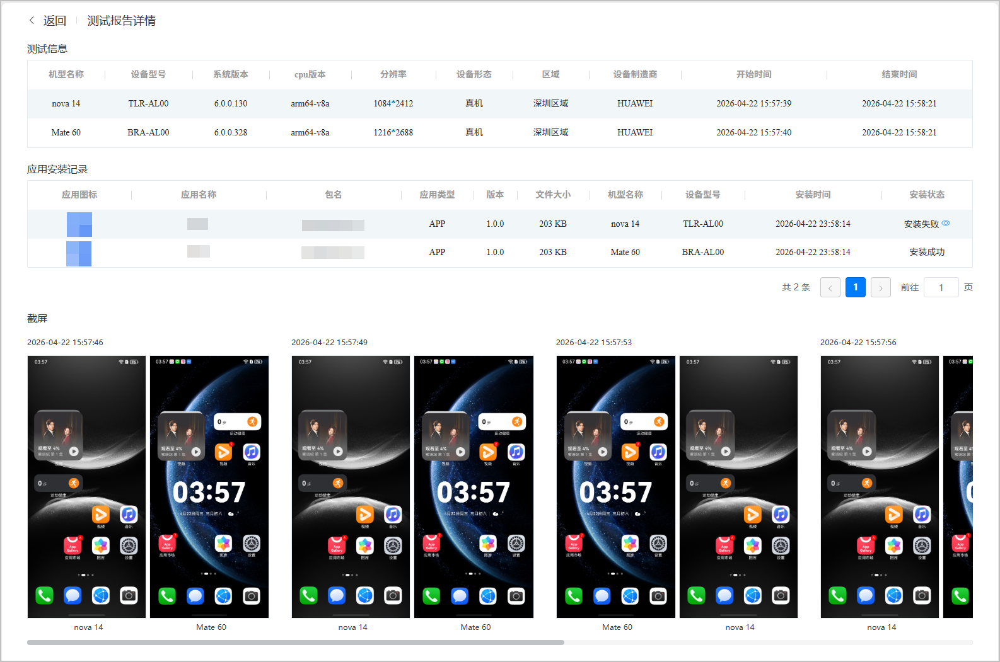
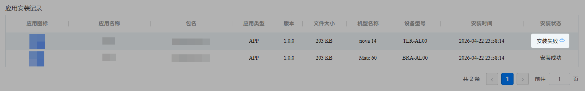

在一帧多屏调试过程中，系统会自动生成测试报告。您既可以在调试过程中实时查看报告，也可以在调试结束后查看完整报告。您可在“测试报告”页签查看您调试过的设备的相关测试信息，以及优惠时长、套餐余额和按量付费的额度消耗。

#### 前提条件

您正在进行或者已完成应用调试。

#### 操作步骤

1. 登录[AppGallery Connect](https://developer.huawei.com/consumer/cn/service/josp/agc/index.html)，点击“开发与服务”。
2. 在项目列表中点击需要测试的项目。

3. 在左侧导航栏选择“质量 > 云调试”。

   
4. 在“测试报告”页签下，点击右侧的“一帧多屏”，您可以查看所有调试任务下多个设备的优惠时长、套餐余额和按量付费的总计额度消耗。点击任一调试任务“测试时间”列左侧的，将展开显示该调试任务下每个调试设备的优惠时长、套餐余额和按量付费的额度消耗。

   
5. 点击某一调试任务“操作”列的“查看”，将进入测试报告详情页面，您可以在此页面查看历史调试设备的详细信息、应用安装记录以及历史截图数据。

   
6. 在“应用安装记录”区域，如果应用安装失败，可以通过点击“安装状态”列的查看失败原因进行问题定位。

   
