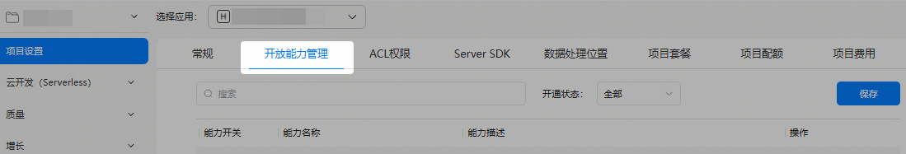
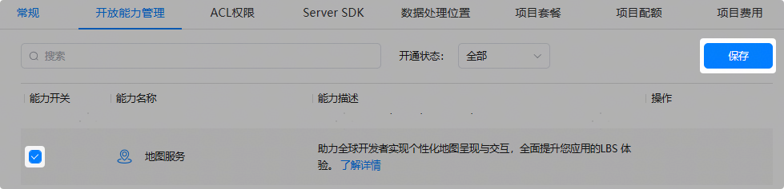
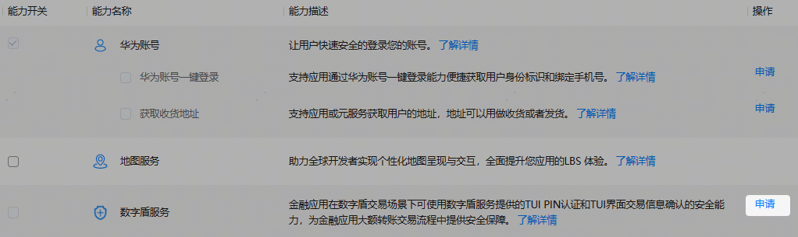
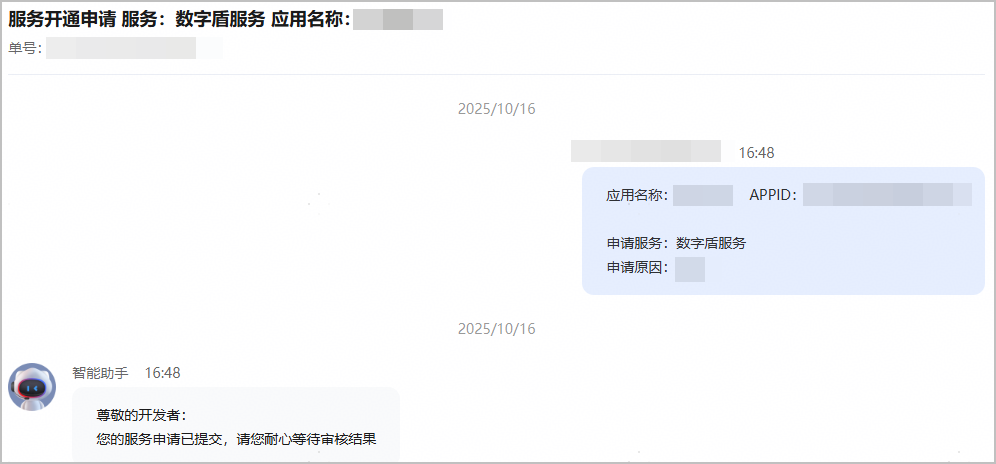

华为为HarmonyOS应用/元服务提供了众多开放能力，您可以选择接入，从而增加应用/元服务的能力。

在使用这些开放能力前，您需要开启相关能力。当前有两种方式：

* [直接开启](#ZH-CN_TOPIC_0000002465058093__li8528129202410)：若开放能力支持勾选，表示该能力可直接开启，无需申请。
* [申请开启](#ZH-CN_TOPIC_0000002465058093__li111920517243)：若开放能力不可勾选，表示该能力暂未完全开放，需要申请通过才可开启。

配置的开放能力信息会写入Profile，建议您在申请Profile前完成所需开放能力的配置。如果您在申请Profile后修改了开放能力配置，请重新下载Profile。

1. 登录[AppGallery Connect](https://developer.huawei.com/consumer/cn/service/josp/agc/index.html)，选择“开发与服务”。
2. 在项目列表中找到您的项目，并点击选择需开启开放能力的应用/元服务。
3. 在“项目设置”页面，选择“开放能力管理”页签。

   

   若您没有找到“开放能力管理”页签，请重新创建新的HarmonyOS应用/元服务。

   

4. 开启所需的开放能力。详细能力的配置请参考对应开放能力的开发指导，以下仅举例描述大体配置过程。
   * **若开放能力支持勾选，表示该能力可直接开启。**

     在“能力开关”栏勾选需要开启的开放能力开关，点击右上角“保存”即可。支持多选，一次操作（勾选或者取消勾选）的能力开关不得超过10个。

     
   * **若开放能力不可勾选，表示该能力暂未完全开放，需申请通过才可开启。**
     1. 以数字盾服务为例，点击对应能力的“申请”按钮。

        
     2. 在“新建业务申请”窗口填写申请原因，必要时可上传附件，然后点击“提交”。

        各能力对申请原因与附件的要求可能存在差异，请按实际界面要求操作。

        
     3. 进入互动中心页面，可看到申请已提交的消息。

        

        返回“开放能力管理”页面，原“申请”按钮变为“申请中”。

        

        申请审批通过后，互动中心会发送通知消息给您，同时您也会收到邮件通知。“申请中”按钮会变为置灰显示的“申请”，同时对应的能力开关会为您自动开启。

        

        

        + 后续如需关闭开放能力，可取消勾选对应的能力开关，点击“保存”。一次操作的能力开关不得超过10个。修改能力开关状态后，请务必重新下载Profile。
        + 若开放能力包含主能力和子能力，需参考以上步骤分别申请主能力和子能力。以华为账号服务为例，“华为账号”为主能力，其下包含“获取收货地址”等多个子能力。当前AGC已默认为应用/元服务开启“华为账号”主能力，子能力则需分别自行申请开启。
