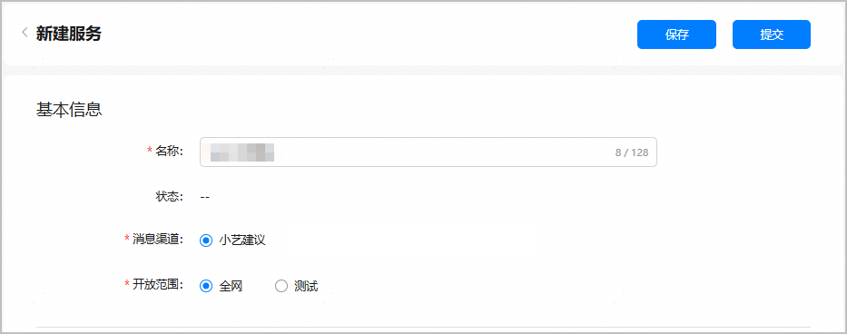
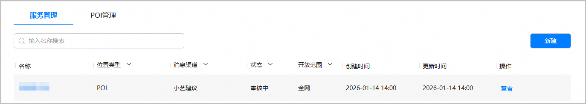

在申请全网态服务上线之前，请确保真机测试已满足[小艺建议出卡的验收要求](https://developer.huawei.com/consumer/cn/doc/app/agc-help-xiaoyi-requirements-for-card-out-0000002430663182)，以避免申请后被审核驳回。

1. 服务配置完成后，点击页面顶端的“提交”。

   
2. 返回服务列表，全网态服务状态变更为“审核中”，华为运营人员会及时处理审核，并邮件通知您审核结果。

   
3. （可选）如果全网态服务上线后，小艺建议不出卡，请按下述步骤进行排查。

   

   全网态服务审核通过后，需要隔天生效，生效后手机端才能接收到小艺建议推荐的卡片内容。

   1. 将手机的“意图框架调试”开关关闭。操作路径：设置 - 系统 - 开发者选项 - 意图框架调试，关闭“意图框架调试”开关。

      
   2. 手机插入SIM卡。
   3. 手机登录华为账号。
   4. 打开系统位置权限。
   5. 打开小艺App的“个性化推荐”开关。

      操作路径：小艺App - 点击右上角头像 - 设置 - 个性化推荐 - “个性化推荐”开关。
   6. 打开小艺App的“基于位置信息提供服务”开关。

      操作路径：小艺App - 点击右上角头像 - 设置 - 其他 - “基于位置信息提供服务”开关。
   7. 手机进入POI的200米感应范围内。
   8. 小艺建议加桌卡片尺寸只能是2\*2、4\*4，不能是2\*4。

   排除上述原因后，如果小艺建议仍未出卡或出卡内容不符合预期，请参考[小艺建议出卡问题的反馈方法](https://developer.huawei.com/consumer/cn/doc/app/agc-help-feedback-method-for-non-card-issue-0000002445351893)进行反馈。
