每个应用/元服务最多支持添加2000个POI位置。

#### 创建单个POI

1. 登录[AppGallery Connect](https://developer.huawei.com/consumer/cn/service/josp/agc/index.html)，点击“APP与元服务”。
2. 进入“HarmonyOS”页签，您可通过包名、应用名称、应用类型等信息进行筛选，然后在应用列表中点击您的应用/元服务名称。

   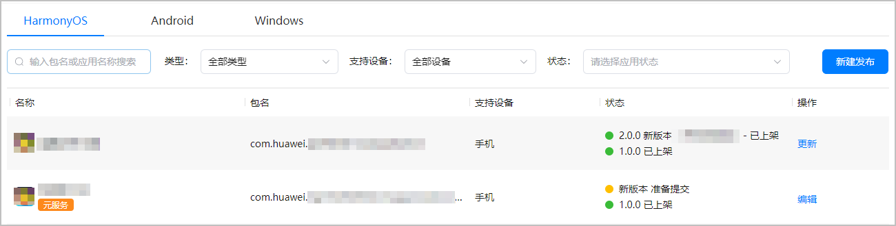
3. 左侧菜单栏选择“近场服务 > 近场管理”，在近场管理主界面选择“POI管理”页签，然后点击“新建”。

   
4. 在“新建POI”页面，“使用场景”选择“全网”，“位置名称”处输入位置关键词，选择您需要的地点，并根据需要设置该POI位置的“位置标识”（需确保在App中全局唯一），然后点击“发布”。发布后，该POI为“已激活”状态，可以被近场服务关联使用。若点击“保存”，该POI为“草稿”状态，将无法被近场服务关联使用。

   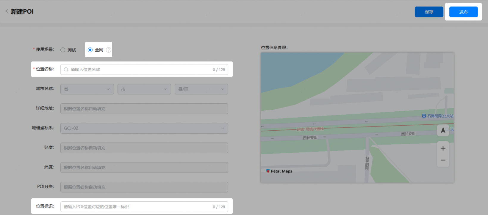
5. 如果新建POI出现问题，请参考如下方法解决。
   * 未查询到想要的位置信息时，请参考[如何反馈位置信息](/docs/distribute/agc/agc-help-location-sense-appendix-0000002349021732/agc-help-position-info-feedback-0000002349181500)反馈。

     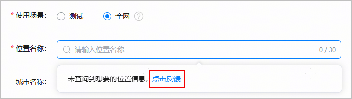
   * POI被其他应用占用时，请参考[申请使用已发布的POI](/docs/distribute/agc/agc-help-location-sense-appendix-0000002349021732/agc-help-apply-publish-poi-0000002382902157)反馈。

     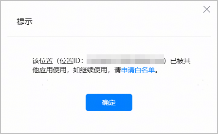
   * 提示POI位置信息非法时，请参考[邮件模板](/docs/distribute/agc/agc-help-location-sense-appendix-0000002349021732/agc-help-position-info-feedback-0000002349181500#section6548195854110)反馈。

     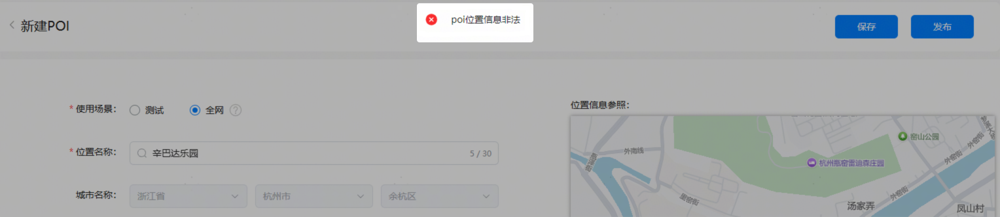

#### 批量导入POI

为提高开发者创建POI的效率，近场服务提供了批量导入POI的功能。每次最多可导入500个POI，如果POI总数超过500但不超过2000上限，可以分多次导入。

1. 进入“POI管理”页面，点击“导入”。

   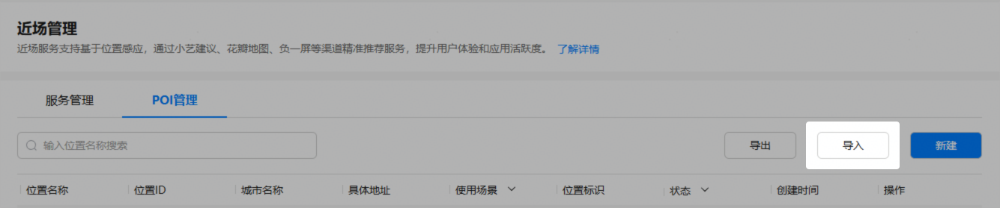
2. 在“导入”弹框中，点击“下载导入模板”将模板Excel文件下载到本地。

   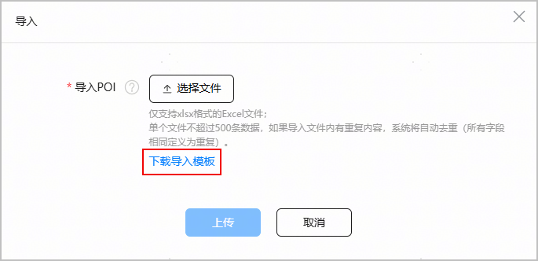
3. 按照模板文件中列出的字段和配置要求，填写要导入的POI信息。

   

   * 模板中的所有字段都必须以文本形式填写。
   * 每个模板文件中填写的POI总数最多支持500个。

   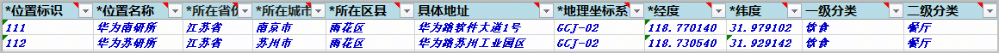

   | 字段 | 必填 | 说明 | |
   | --- | --- | --- | --- |
   | 位置标识 | 是 | 该POI位置的唯一标识，由开发者自定义，可用于区分不同的实体门店。需全局唯一，长度不超过128个字符。 | |
   | 位置名称 | 是 | 该POI位置的名称，长度不超过128个字符。 | |
   | 所在省份 | 是 | 该POI位置所在省份的名称。 | |
   | 所在城市 | 是 | 该POI位置所在城市的名称。 | |
   | 所在区县 | 是 | 该POI位置所在区/县的名称。  说明：  所在省份、所在城市、所在区县3个字段拼接后的长度不允许超过64个字符。 | |
   | 具体地址 | 否 | 建议尽量详细到XX路XX街道XX门牌号，以提高匹配率。长度不超过256个字符。 | |
   | 地理坐标系 | 是 | 下拉选择坐标系，支持的坐标系包括：  * GCJ-02：默认值。 * BD-09 * WGS-84 说明：  如果选择了BD-09或WGS-84，导入POI时系统将统一转换为GCJ-02坐标。 | |
   | 经度 | 是 | 需精确到小数点后6位，长度不超过128个字符。 | |
   | 纬度 | 是 | 需精确到小数点后6位，长度不超过128个字符。 | |
   | 一级分类 | 否 | 通常按照行业来划分，例如饮食、购物、休闲中心等，详情请查询[POI一级分类](/docs/distribute/agc/agc-help-location-sense-appendix-0000002349021732/agc-help-poi-classification-query-0000002395746324)。 | |
   | 二级分类 | 否 | 一级分类下细化出的功能分类，例如饮食分类下包括餐厅、饮品店等，详情请查询[POI二级分类](/docs/distribute/agc/agc-help-location-sense-appendix-0000002349021732/agc-help-poi-classification-query-0000002395746324)。 | |
4. 本地模板文件编辑完成后，返回“导入”窗口，点击“ 选择文件”选择编辑完成的模板文件，然后点击“上传”。

   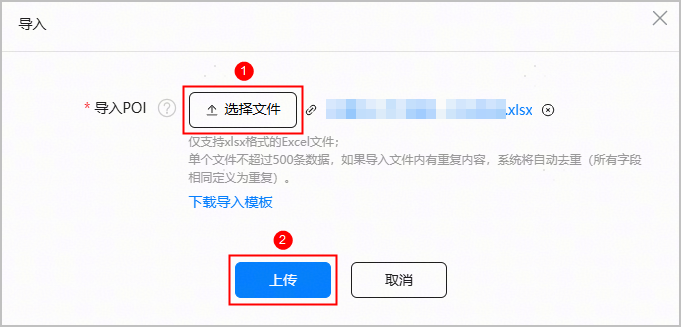
5. 系统对导入的POI数据进行校验，预计耗时5分钟。
   * 如果您要导入的POI总数超过500，可点击“继续导入”，在模板中填写剩余的POI信息并完成导入。

     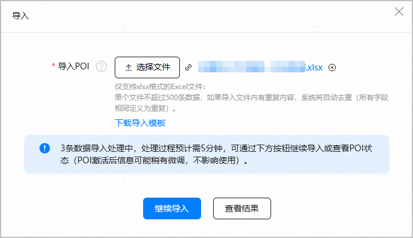
   * 如果POI导入完成或暂不打算继续导入其他POI，可点击“查看结果”或弹窗右上角的，返回到POI列表查看导入的POI信息。此时，可看到已导入POI的状态为“激活中”。

     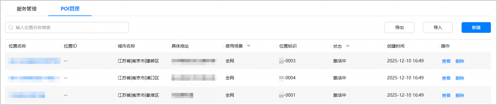
6. 当系统确认导入的POI为合法数据时，会将POI的状态更新为“已激活”，并同步更新POI的位置ID、城市名称、具体地址等信息。

   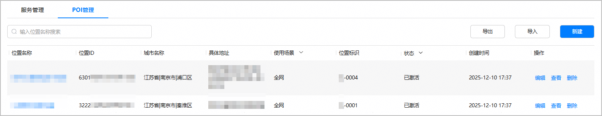

   当系统判断导入的POI数据不合法或POI已被其他应用使用时，会将POI的状态更新为“激活失败”。您可点击“激活失败”旁的查看报错信息。如果POI某些信息设置有误，请刷新模板文件后再次尝试导入。

   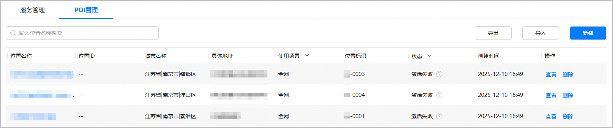
7. 如果导入POI出现其他问题，请参考如下方法解决。
   * 出现下图中报错，可能原因有两种：
     + 模板文件中的POI数量超过500。请将多余的POI数据拆分至另一个模板文件中，分批导入。
     + 模板文件格式错误导致系统解析失败。请检查模板文件是否包含非法的列或Sheet页。

     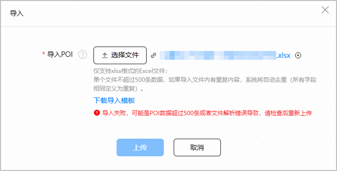
   * 模板文件中的某些字段为空或格式错误。请点击“下载”下载表格查看失败原因。

     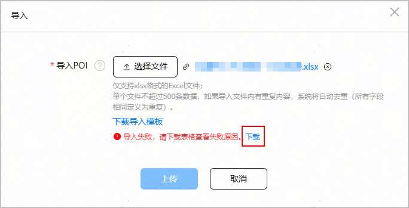

     根据“失败原因”列的描述，如下图所示，修改存在问题的字段后，再次尝试导入。

     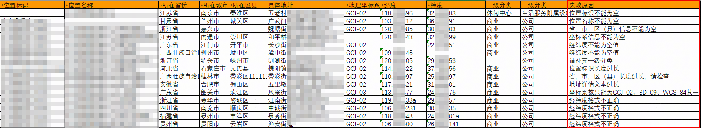
   * POI总数已超过2000上限。请核对POI列表中是否存在冗余的POI。

     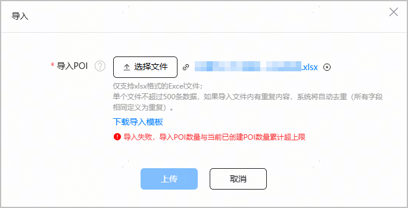
   * 系统校验POI数据时出现异常。请稍后再尝试导入。

     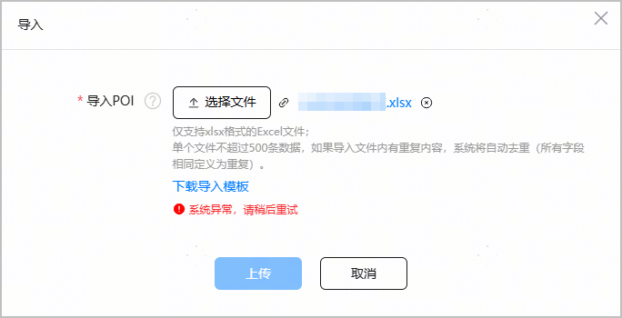

#### （可选）批量导出POI

当您需要检查已创建POI的点位信息是否正确时，为提高效率，可以使用近场服务的批量导出POI功能。您可以一次性导出所有POI，也可以通过POI的位置名称、使用场景、状态筛选出某些POI后进行导出。

1. 进入“POI管理”页面，根据需要筛选需要查看的POI。
   * 在搜索框中输入POI位置名称关键词进行模糊筛选。

     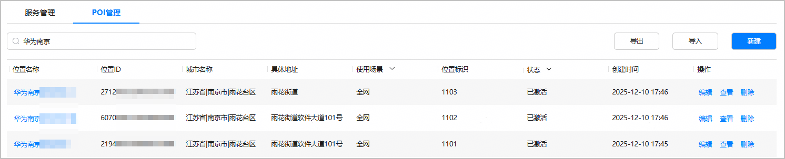
   * 选择POI的使用场景或状态进行筛选。

     
2. 完成POI筛选后，点击“导出”。

   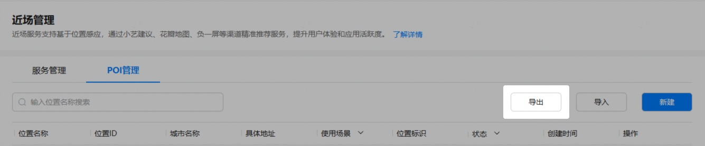
3. 页面顶端显示“导出成功”时，表示POI数据已导出到本地。导出文件以“近场服务POI信息\_时间戳.xlsx”格式命名。
