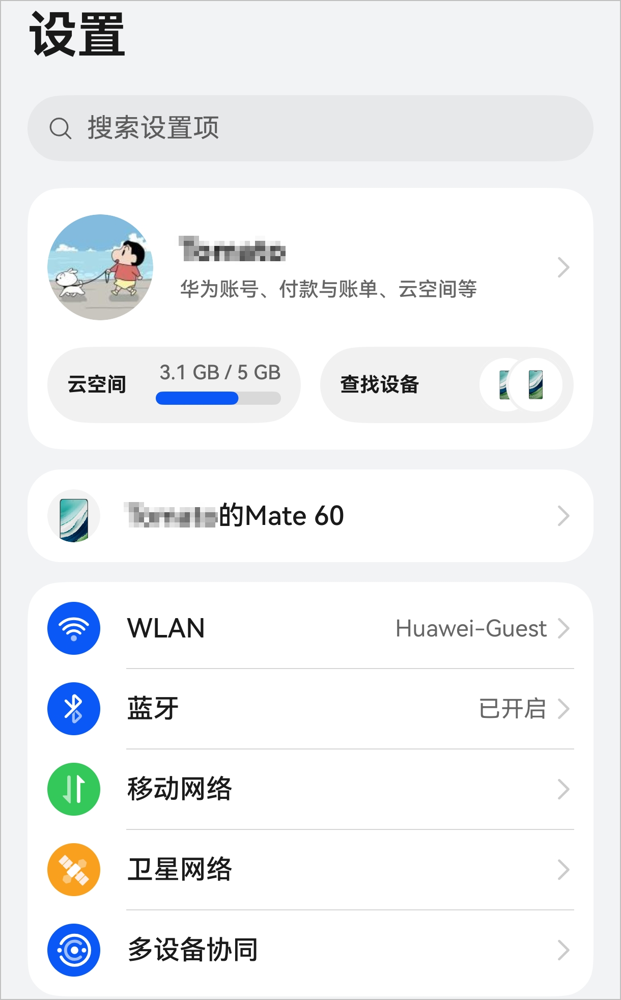
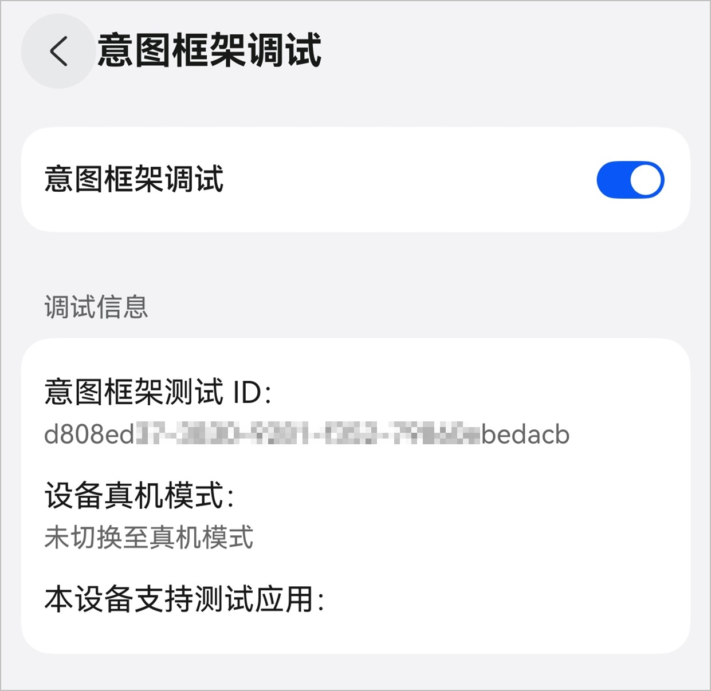
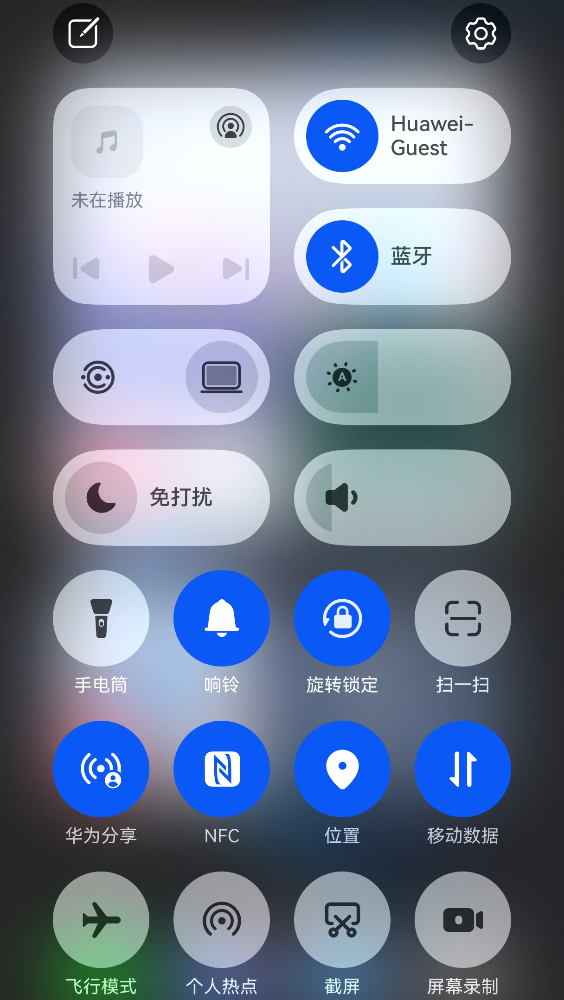
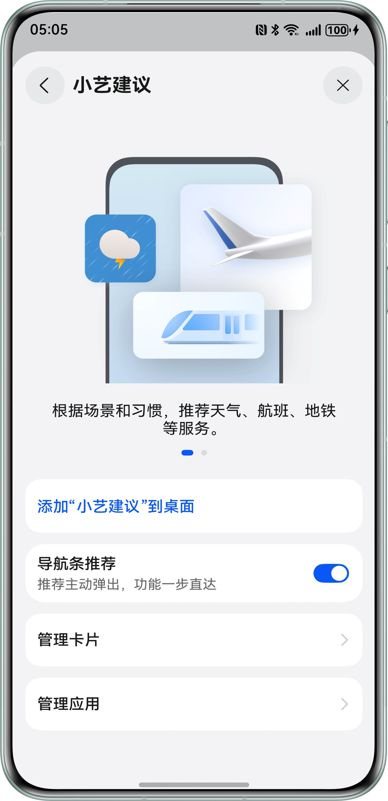
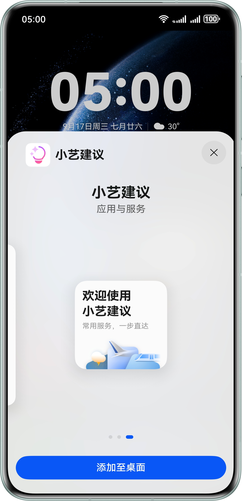
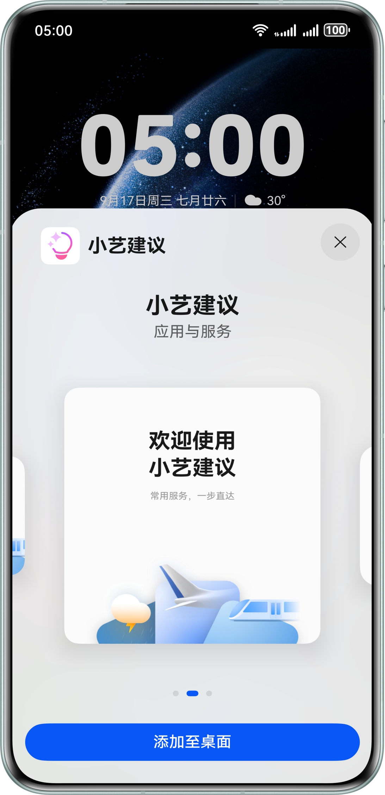

测试近场服务之前需要您开启手机相关权限，并且添加“小艺建议”到桌面，以便接收近场测试推送内容。

1. 根据应用类型以及应用或元服务上架情况进行相应处理。
   * 应用类型是HarmonyOS应用

     如果您的应用已上架，则进入华为应用市场下载至测试手机并安装应用。

     如果您的应用尚未正式上架，则通过[邀请测试](/docs/distribute/agc/agc-help-invite-test-0000002270829393/agc-help-invite-test-overview-0000002287701773)的方式下载至测试手机并安装应用。
   * 应用类型是元服务

     如果您的元服务已上架华为应用市场，则跳过本步骤。

     如果您的元服务尚未上架华为应用市场，则通过[邀请测试](/docs/distribute/agc/agc-help-invite-test-0000002270829393/agc-help-invite-test-overview-0000002287701773)的方式将未上架的元服务加载到测试手机。
2. 测试手机登录华为账号，且须确保华为账号绑定的手机号已添加到测试用户列表中。

   
3. 测试手机开启意图框架调试开关。操作路径：设置 - 系统 - 开发者选项 - 意图框架调试，开启“意图框架调试”开关。

   
4. 打开系统位置权限。

   
5. 打开小艺App，开启如下两个开关。
   * “个性化推荐”开关。

     操作路径：小艺App - 点击右上角头像 - 设置 - 个性化推荐 - “个性化推荐”开关。

     
   * “基于位置信息提供服务”开关。

     操作路径：小艺App - 点击右上角头像 - 设置 - 其他 - “基于位置信息提供服务”开关。

     
6. 添加“小艺建议”到桌面。

   操作路径：设置 - 小艺 - 小艺建议 - 添加“小艺建议”到桌面。

   

   请先点击“添加“小艺建议”到桌面”，通过左右滑动选择2\*2和4\*4卡片（目前不支持在2\*4卡片中出卡，所以请确保不要选择2\*4卡片）。然后点击“添加至桌面”，将两种尺寸的卡片均添加至桌面。

    
