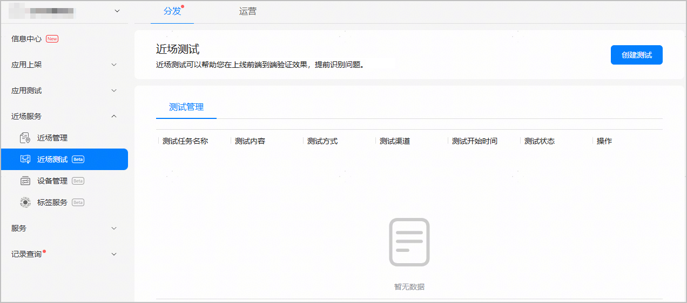
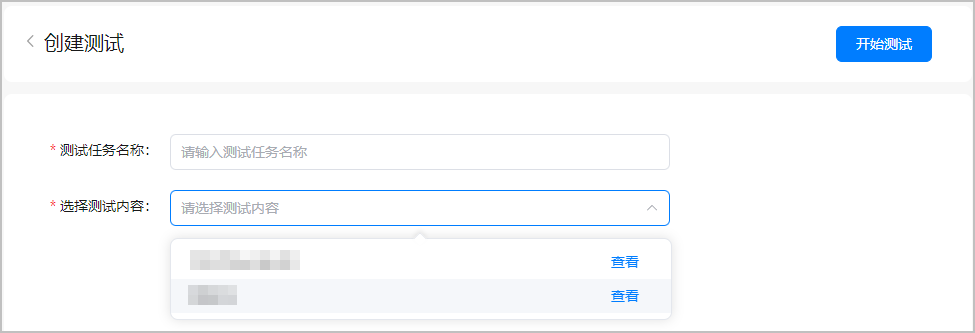

在AppGallery Connect近场测试服务界面，选择您需要测试的近场服务，对测试手机下发测试任务，使测试手机接收近场服务推送的内容。

1. 左侧菜单栏选择“近场服务 > 近场测试”，进入近场测试服务主界面，点击右上角的“创建测试”。

   
2. 进入“创建测试”页面，填写测试任务名称，选择您需要测试的近场服务，点击“开始测试”，下发测试任务。

   | 配置项 | **说明** |
   | --- | --- |
   | 测试任务名称 | 最长不超过64个字符，仅允许输入中文、数字和英文字母。 |
   | 选择测试内容 | 测试内容为在近场管理的“服务管理”页面创建的测试态近场服务。测试态服务数量比较多时，可在下拉框中输入关键词搜索测试态服务名称。  此场景下请选择测试方式为**“自有真机测试”**，选择的位置类型为**“POI”**的测试态服务。  已创建测试态服务时，您可以点击下拉框中测试内容右侧的“查看”，在打开的新窗口中查看您创建的近场服务详情，包括服务的基本信息、选择的POI位置、内容设置等，帮助您选择合适的测试内容。  说明：  同一条测试态近场服务支持多次测试，以最新下发的测试任务为准。 |

   
