在创建测试版本前，您需要提前确定需要参与测试的用户。测试用户在AGC中以测试群组的形式来管理，您可以将测试用户添加到测试群组中，在发布测试版本时选择分发到指定的测试群组。

最多可创建300个外部测试群组，所有外部测试群组的测试用户累计去重总数不超过10000个。

近期HarmonyOS应用邀请测试功能中短信邀请方式被滥用，影响了用户体验，对用户造成了骚扰。后续我们将统一采用电子邮件的方式邀请用户参与应用测试。请您在添加测试用户时，使用邮箱格式的华为账号进行添加，或者使用邀请码链接邀请用户参与测试。

对于通过邀请码链接加入群组的用户，在应用有新版本可供测试时，如果用户已绑定邮箱，将收到电子邮件邀请；如果用户仅绑定手机号而未绑定邮箱，则将不再收到短信邀请。

用户绑定/更改华为账号邮箱请参见：[账号信息设置](https://developer.huawei.com/consumer/cn/doc/start/account-management-0000001052865467)

1. 登录[AppGallery Connect](https://developer.huawei.com/consumer/cn/service/josp/agc/index.html)，选择“APP与元服务”。
2. 在应用列表页的“HarmonyOS”页签，点击应用名称，进入“分发”页面。
3. 在左侧导航栏选择“应用测试/元服务测试 > 测试用户”，进入“测试用户”页面，选择“外部测试用户群组”，点击右上角“创建测试群组”。

   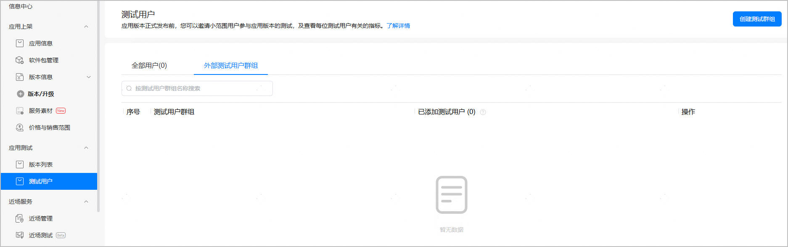
4. 在弹出的“创建测试群组”窗口，填写“群组名称”，点击“创建”。

   群组名称不超过50个字符。

   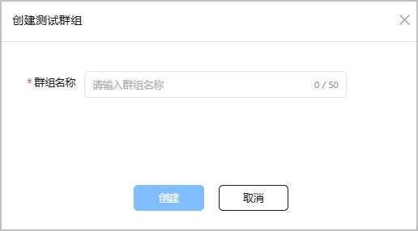
5. 测试群组创建成功后，“外部测试用户群组”页面展示群组名称。点击“操作”列“管理”，进入测试群组管理页面。

   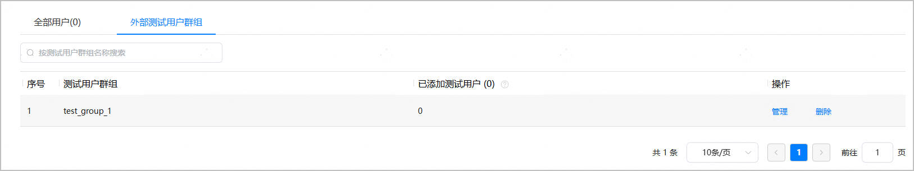
6. 点击“添加测试用户”。

   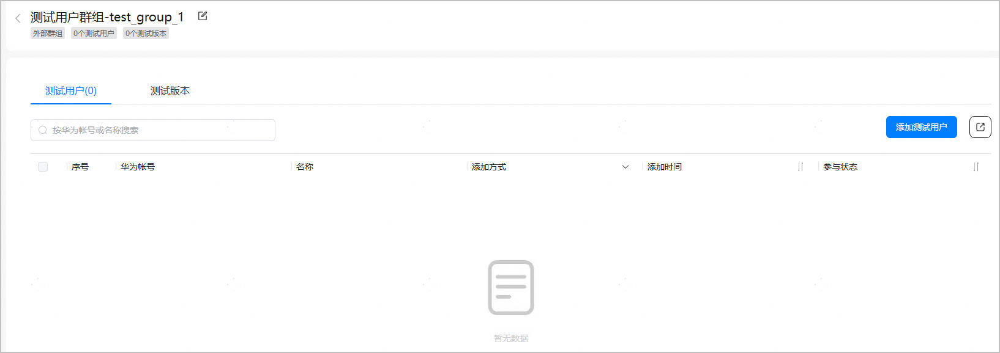
7. 在弹出的“添加测试用户”窗口，添加测试用户。当前支持三种不同的添加方式。。
   * 单个添加：适用于测试用户数量较少、可手动逐条添加的场景。

     填写测试用户的华为账号和用户名后，点击“添加”即可。添加多个测试用户时，需在测试群组管理界面点击“添加测试用户”逐条添加。

     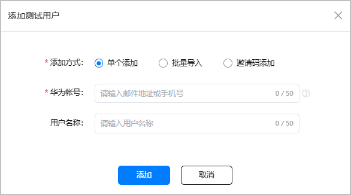

     | 参数 | 说明 |
     | --- | --- |
     | 华为帐号 | 测试账号必须是已经注册的华为账号，且仅支持邮箱格式或手机号码格式。  邮箱账号只能包含字母、数字、下划线、@、. 字符，最多80个字符。  后续我们将统一采用电子邮件的方式邀请用户参与应用测试。请您在手动添加测试用户时，使用邮箱格式的华为账号进行添加。用户绑定/更改华为账号邮箱请参见：[账号信息设置](https://developer.huawei.com/consumer/cn/doc/start/account-management-0000001052865467) |
     | 用户名称 | 非必填。不超过50个字符。 |
   * 批量导入：适用于测试用户数量较多的场景，上限为10000个用户。

     点击“下载导入模板”，使用记事本等txt文本编辑器打开下载的“User\_Import\_Template.csv”文件，根据模板中的样例格式填写测试用户的华为账号信息。保存文件后，点击“选择文件”将账号信息文件导入，导入成功后再点击“添加”按钮即可。

     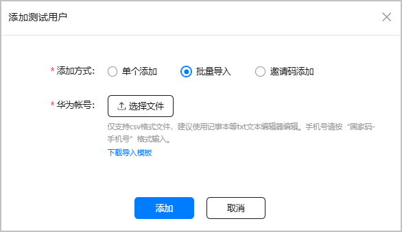

     

     导入的账号信息文件必须为.csv格式。建议使用记事本等txt文本编辑器编辑，否则可能会出现导入后乱码的情况。
   * 邀请码添加：适用于通过邀请码邀请测试用户的场景。此方式无需提前收集用户的华为账号，使用更方便，但仅限于分享给您非常信任的、不会将邀请码链接外泄的用户群体，否则可能导致邀请范围之外的用户加入您的测试群组。

     设置邀请码有效期和可邀请用户数量上限后，点击“生成邀请码”，即可生成一个邀请码。后续将邀请码拼接到测试版本分享链接上，即可通过分享链接的方式邀请测试用户，具体可参见[通过“分享链接+邀请码”邀请用户](/docs/distribute/agc/agc-help-privacy-appgallery-invite-test-0000002292624409/agc-help-appgallery-invite-testuser-0000002292624413#section8765163593316)。

     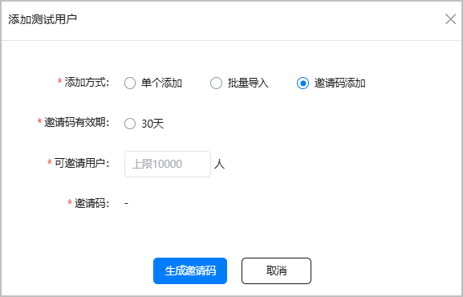

     | 参数 | 说明 |
     | --- | --- |
     | 邀请码有效期 | 默认有效期30天。到期后自动失效，对应的分享链接将无法再用于邀请新用户加入测试群组。 |
     | 可邀请用户 | 可设置的邀请用户数量上限为10000人。 |

8. 测试用户添加成功后，在测试群组管理页面可查看已添加的测试用户信息。
   * “测试用户”页签展示加入群组的所有测试用户。单个或批量导入的用户，页面展示其华为账号和用户名称；通过邀请码添加的用户，华为账号和用户名称均匿名化展示。

     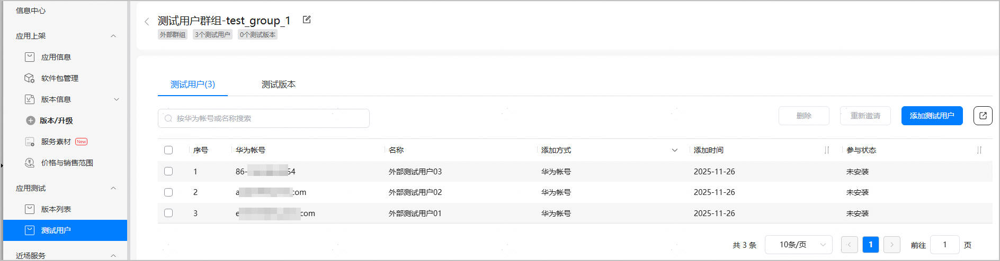

     + 导出：点击“导出”图标，可导出列表中的全部用户。
     + 重新邀请：如果测试群组在邀请测试任务开始后又添加了新的测试用户，新加入的测试用户不会自动收到邀请测试邮件
     + 您可以在此点击“重新邀请”，邀请指定测试用户：

       系统会再次向未安装的用户发送通知；已安装的用户，可以通过“分享链接”或“AppTest客户端”参与测试。

       用户可以通过邮件参与所有被邀请的测试版本。
     + 删除：点击“删除”，可删除该群组下指定的测试人员。
   * 点击“测试版本”页签，可查看群组关联的测试版本信息。测试版本将会根据实际进度展示正在测试、待生效、审核中三种状态。

     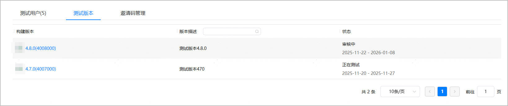
   * “邀请码管理”页签展示生成的邀请码信息（仅展示最近生成的3个邀请码）。

     

     当所有测试用户群组的数量相加去重、累计达到10000时，邀请码会自动失效，且“待邀请数量”会自动变为0。

     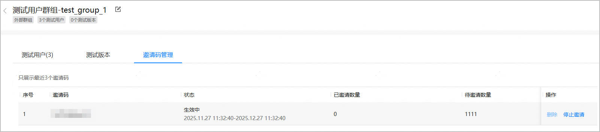

     邀请码状态有两种：

     + 生效中：邀请码生成后即为“生效中”状态，下方展示邀请码有效期。
     + 已失效：以下场景邀请码会变为“已失效”状态。
       - 邀请码到期
       - 通过该邀请码参与测试的用户数量达到邀请码设置的数量上限
       - 所有测试用户群组的数量相加去重，累计达到10000
9. 返回“应用测试/元服务测试 > 测试用户”菜单主页面，还可查看当前测试群组内已添加的用户总数。如需删除测试用户群组，请在停止邀请测试后，在“应用测试 > 测试用户”菜单主页面进行删除。

   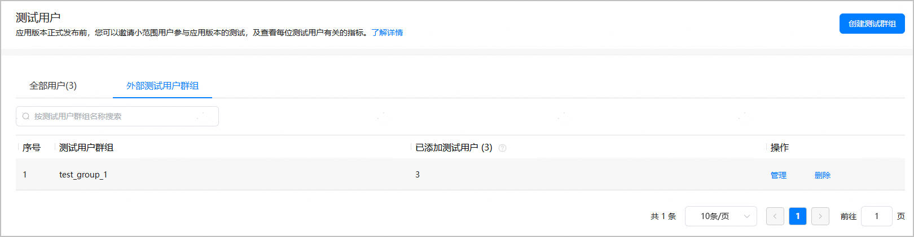

   

   “已添加测试用户”列仅统计已成功加入当前测试群组的用户数量，待使用邀请码邀请的用户数量未纳入统计。如无法删除，可以通过[在线工单系统](https://developer.huawei.com/consumer/cn/support/feedback/#/)与我们联系，工单问题分类请选择【华为应用分发】>【应用市场】>【应用发布】。

10. 您可以在“全部用户”页面查看并管理已加入外部测试用户群组的所有用户，及查看每位测试用户有关的指标。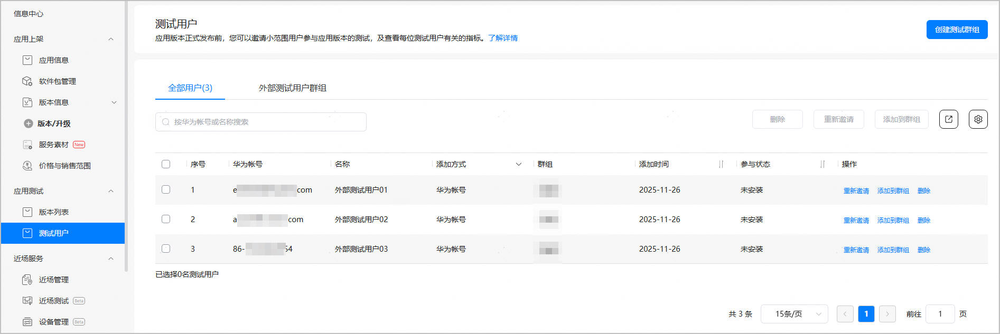

* 导出：点击“导出”图标，可导出列表中的全部用户。
* 重新邀请：如果测试群组在邀请测试任务开始后又添加了新的测试用户，新加入的测试用户不会自动收到邀请测试邮件。

  您可以在此点击“重新邀请”，邀请指定测试用户：

  + 系统会再次向未安装的用户发送通知；已安装的用户，可以通过“分享链接”或“AppTest客户端”参与测试。
  + 用户可以通过邮件参与所有被邀请的测试版本。
* 删除：点击“删除”，可删除该群组下指定的测试人员。
* 添加到群组：点击“添加到群组”，可以把指定的用户添加到不同的群组中。
* 自动清理长时间不活跃用户：点击图标后，可以在所有群组中，自动清理近90天未参加过该应用测试任务的用户。
