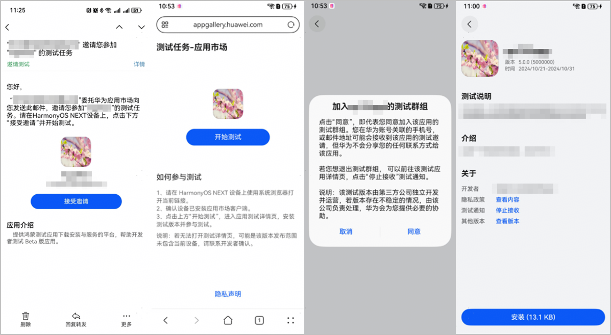

测试版本发布、且到达测试时间后，您便可以邀请用户参与测试。AGC提供了多种邀请方式：

* [通过邮件邀请用户](#section17742145773218)：测试任务开始，被邀请的用户会收到邮件通知，用户点击邮件中的链接参与测试。
* [通过分享链接邀请用户](#section666812158334)：将创建测试版本时生成的分享链接提供给新加入测试群组的用户，用户点击链接参与测试。
* [通过“分享链接+邀请码”邀请用户](#section8765163593316)：如果没有获取测试用户的华为账号，可以将拼接邀请码的邀请链接分享给用户，点击链接一样可以参与测试。

#### 通过邮件邀请用户

测试任务开始后，AGC会自动给测试版本选定的测试用户发送邮件，用户点开邮件后，即可参与测试。

如果测试群组在邀请测试任务开始后又添加了新的测试用户，新加入的测试用户不会自动收到邀请测试邮件。您可以[通过分享链接邀请新加入的测试用户参与测试](#section666812158334)。

用户通过邮件参与测试方式如下：

1. 点击邮件中的“接受邀请”。
2. 使用系统浏览器打开链接，进入邀请测试介绍页，点击“开始测试”。
3. 首次接受邀请时，需先点击“同意”加入应用的测试群组。后续可直接参与测试，或者在“应用尝鲜”专区查找应用。
4. 进入测试应用详情页，点击“安装”。

#### 通过分享链接邀请用户

您还可以直接将该分享链接提供给用户。

用户通过分享链接参与测试的方式如下：

1. 开发者获取分享链接，提供给用户。

* 在AGC发布测试版本页面获取

  

* 使用[查询应用信息接口](https://developer.huawei.com/consumer/cn/doc/app/agc-help-publish-api-appinfo-query-0000002236041422)获取

  

2. 用户使用系统浏览器打开分享链接，进入邀请测试介绍页，点击“开始测试”。
3. 首次接受邀请时，用户需先点击“同意”加入应用的测试群组。后续可直接参与测试，或者在“应用尝鲜”专区查找应用。
4. 用户进入测试应用详情页，点击“安装”。

#### 通过“分享链接+邀请码”邀请用户

若选定的测试群组中有“生效中”状态的邀请码，则可以将测试版本分享链接拼接邀请码后，提供给用户。此方式无需提前收集用户的华为账号，使用更方便，但仅限于分享给您非常信任的、不会将邀请码链接外泄的用户群体，否则可能导致邀请范围之外的用户加入您的测试群组。

链接拼接方式如下：

1. 测试版本提交审核后，[复制生成的分享链接](#ZH-CN_TOPIC_0000002292624413__li10574539121315)，如：http://xx.xx.xx?taskId=123456
2. 在上述链接的末尾，拼接上&invitationCode=*邀请码*
3. 获取拼接后的完整链接：http://xx.xx.xx?taskId=123456&invitationCode=*邀请 码*

用户参与方式与[通过分享链接邀请用户](#section666812158334)相同。
