* 请如实填写，当用户个人信息处理或敏感权限调用等场景发生变动时，请及时更新隐私政策。如实际情况与本隐私政策中内容不符，您将承担由此产生的法律责任及风险。
* 每个元服务最多可配置300个隐私政策，但上线时仅能关联1个隐私政策。

#### 新建隐私政策

1. 登录[AppGallery Connect](https://developer.huawei.com/consumer/cn/service/josp/agc/index.html)，点击“快速开始”中的“元服务一站式平台”卡片。

   
2. 在左上角下拉列表选择要发布的元服务。

   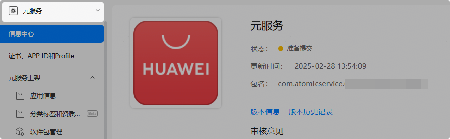
3. 左侧导航选择“元服务上架 > 协议服务”。
4. 进入“协议服务”界面，点击“新建协议”。
5. 在弹出窗口，“协议类型”选择“隐私政策”，填写“协议名称”，选择“默认语言”后，点击“下一步”，开始[编辑隐私政策](#section1915210137429)。

   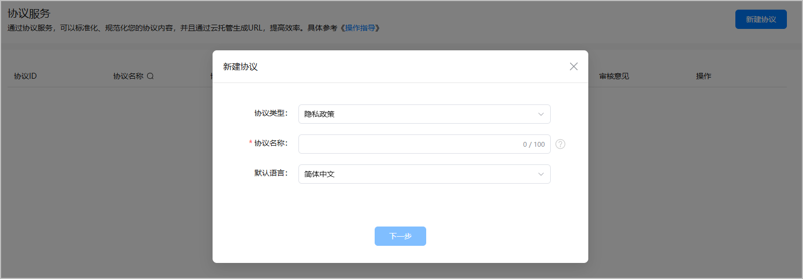

#### 编辑隐私政策

#### [h2]导语

导语内容模板比较固定，只需补充元服务的简介即可。

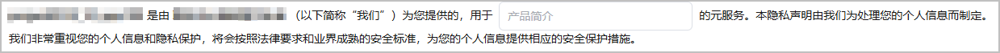

#### [h2]“我们如何收集和使用您的个人信息”模块

本模块需要声明如下信息：

* [收集用户数据说明](https://developer.huawei.com/consumer/cn/doc/app/agc-help-privacy-policy-app-0000002282162168#ZH-CN_TOPIC_0000002282162168__p67117382531)
* [个性化推荐说明](https://developer.huawei.com/consumer/cn/doc/app/agc-help-privacy-policy-app-0000002282162168#ZH-CN_TOPIC_0000002282162168__p727051052414)：仅当向用户推送个性化推荐内容时，才需要声明。
* [广告和营销说明](#ZH-CN_TOPIC_0000002317135133__p124613182316)：仅当元服务中存在广告或者营销内容时，才需要声明。

**【收集用户数据说明】**

1. 点击“增加数据信息”，添加各个业务场景涉及的数据项。

   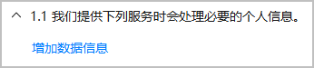
2. 勾选收集的用户数据项后，点击“确定”。

   

   由于后续会基于数据使用的业务场景维度进行说明，建议一次只选择一个业务场景涉及的数据项。

   
3. 按实际情况选择使用数据的业务场景、前提条件和时机，填写业务场景。

   

   敏感信息将以加粗形式显示。
4. 点击“增加数据信息”，可继续增加其他业务场景的数据说明。点击“-”，可删除对应的数据说明。最多支持200条数据说明。

**【个性化推荐说明】**

仅当向用户推送个性化推荐内容时，才需要声明。

1. 点击“增加个性化推荐说明”，再点击“增加数据信息”。

   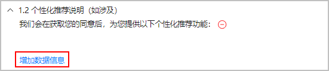
2. 勾选个性化推荐内容需要使用的数据项后，点击“确定”。

   

   由于后续会基于数据使用的业务场景维度进行说明，建议一次只选择一个业务场景涉及的数据项。

   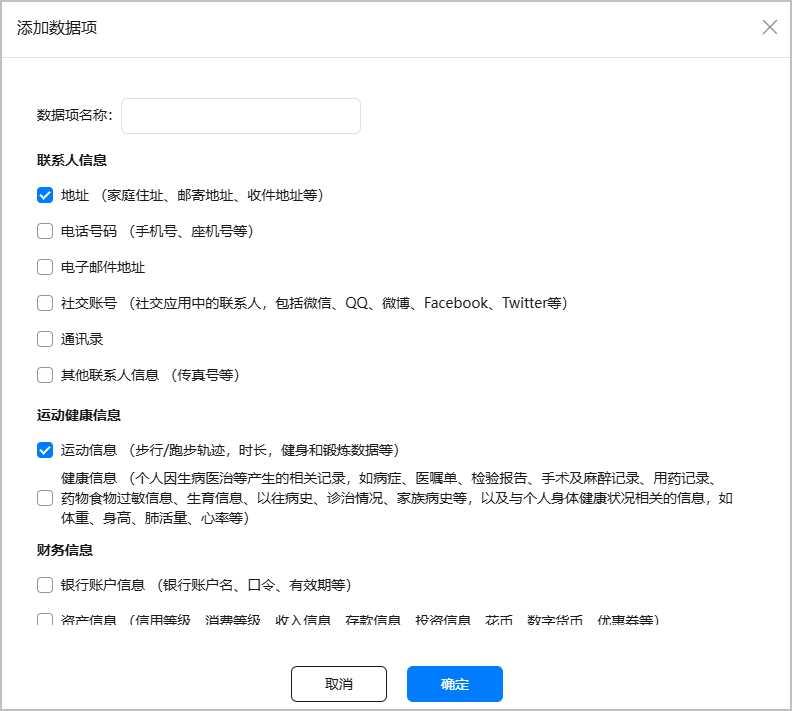
3. 填写使用所选数据项的个性化推荐内容。

   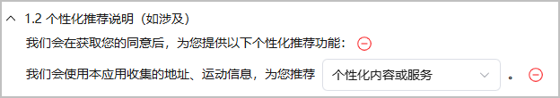
4. 点击“增加数据信息”，可继续增加其他业务场景的数据说明。点击“-”，可删除对应的数据说明。最多支持200条数据说明。
5. 填写用户关闭个性化推荐的路径。

**【广告和营销说明】**

* 仅当元服务中存在广告或营销内容时，才需要声明。
* 您需要完成[收集用户数据说明](#ZH-CN_TOPIC_0000002317135133__p67117382531)，才可以填写跨境处理说明。

1. 点击“增加广告和营销说明”。

   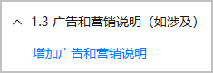
2. 说明元服务内的广告和营销活动名称、活动使用的用户数据，并且告知用户如何关闭此类活动推送。

   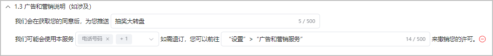

#### [h2]“设备权限调用”模块（可选）

如果元服务中使用了设备权限，则需要对调用的设备权限进行声明。

1. 点击“添加权限及使用说明”。
2. 在弹出窗口勾选调用的设备权限后，点击“确定”。

   

   * 由于后续会基于权限用途维度进行说明，建议一次只选择一个用途涉及的权限。
   * 请确保此处声明的设备权限和软件包中实际配置的权限保持一致，否则将无法提交审核。

   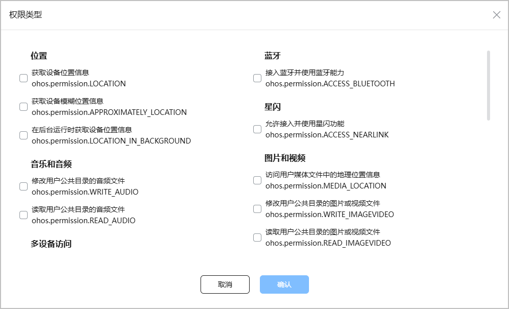
3. 填写所选权限的作用。

   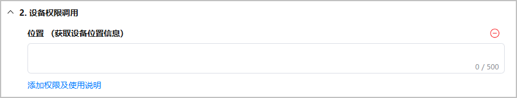
4. 点击“添加权限及使用说明”，可继续增加其他权限说明。点击“-”，可删除对应的权限说明。

#### [h2]“对未成年人的保护”模块

本模块需要声明对未成年人的保护政策。

1. 点击“增加对儿童保护声明”，生成对应声明模板。
2. 在模板中填写儿童隐私保护声明的链接，以及补充说明。

   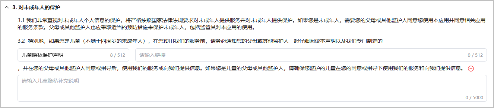

#### [h2]“与第三方共享”模块（可选）

如果元服务涉及将用户个人信息提供给第三方，则需要对三方共享信息进行声明。

1. 点击“增加三方共享信息声明”，生成对应声明模板。
2. 填写共享数据的第三方公司的信息。

   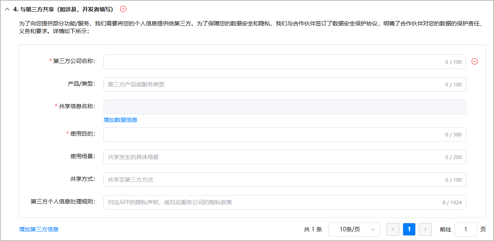
3. 如果将数据共享给多个第三方，点击“增加第三方信息”，继续增加其他第三方共享信息说明。点击“-”，可删除对应的数据说明。最多支持50条数据说明。

#### [h2]“第三方SDK”模块（可选）

如果元服务接入了第三方SDK，则需要对第三方SDK处理个人信息情况进行声明。

1. 点击“增加第三方SDK”，生成对应声明模板。
2. 填写接入的第三方SDK的信息。

   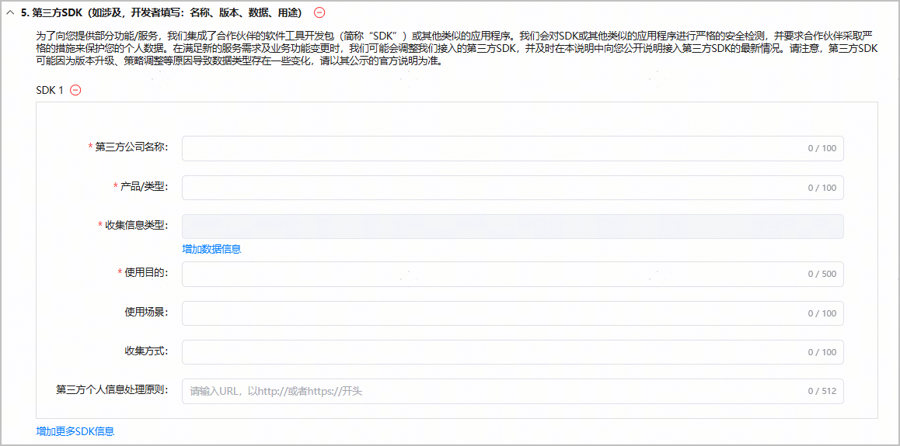
3. 如果元服务接入了多个第三方SDK，点击“增加更多SDK信息”，继续增加其他第三方SDK说明。点击“-”，可删除对应的第三方SDK。最多支持添加50个SDK。

#### [h2]“信息存储地点及期限”模块

本模块需要说明对用户信息的存储位置、存储期限。

1. 设置个人数据存储期限。
   * 固定存储期限：填写信息会存储的具体时间。
   * 实现处理目的所必要的最短时间

   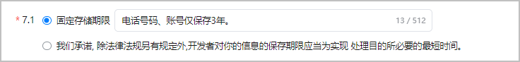
2. 设置个人数据存储位置。

   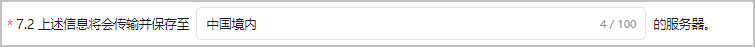
3. 如果涉及跨境数据处理，点击“增加跨境处理声明”，说明跨境数据处理的目的、数据接收方、具体数据项，以及数据存储地。

   

   您需要完成[收集用户数据说明](#ZH-CN_TOPIC_0000002317135133__p67117382531)，才可以填写跨境处理说明。

   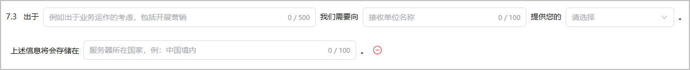

#### [h2]“开发者自定义章节”模块（可选）

如果有其他涉及用户利益，需要提示的事项或者免责说明，则在本模块进行说明。

1. 点击“增加开发者自定义章节（如涉及）”，填写相关信息。

   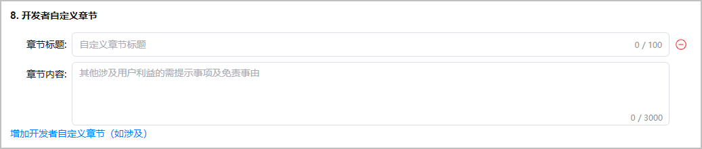
2. 点击“增加开发者自定义章节（如涉及）”，继续增加相关说明。点击“-”，可删除对应的章节。最多支持添加5个。

#### [h2]“如何联系我们”模块

在此模块提供用户联系您的方式。

1. 点击“增加商业联系方式”，可以配置电话、邮箱和公司地址多个联系方式。

   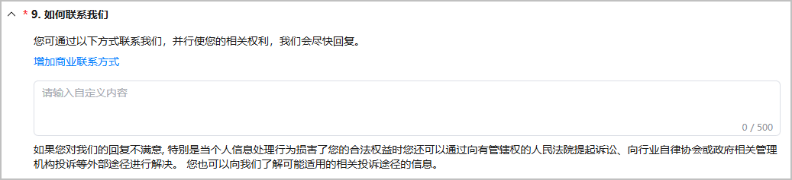
2. 点击“增加商业联系方式”，继续增加联系方式。点击“-”，可删除对应的联系方式。
3. 如果有除电话、邮箱和公司地址其他联系方式，可以自定义内容。

#### [h2]“隐私政策生效日期”模块

在此模块设置当前隐私政策的生效日期。

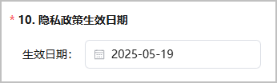

#### 生成隐私政策

#### [h2]首次生成隐私政策

所有内容编辑完成，您可以点击右上角“预览”查看内容，确认无误后点击“生成协议”，生成的隐私政策状态为“完成”。

如果暂时不想生成隐私政策，点击“保存”即可，保存的隐私政策状态为“草稿”。当前仅允许保存一个隐私政策草稿。

返回协议列表，可以对协议进行如下操作：

* 点击“编辑”：修改隐私政策名称和内容。

  

  只有以下状态的隐私政策支持修改：

  + “草稿态”隐私政策
  + “完成态”但未与在架版本关联的隐私政策
* 点击“删除”：删除对应的隐私政策。

  

  与在架版本关联的隐私政策不允许删除。

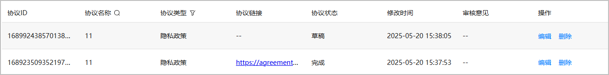

#### [h2]修改已有隐私政策

所有内容编辑完成，您可以点击右上角“预览”查看内容，如果暂时不想生成隐私政策，点击“保存”即可，保存的隐私政策状态为“草稿”。当前仅允许保存一个隐私政策草稿。

返回协议列表，可以对隐私政策进行如下操作：

* 点击“编辑”：修改隐私政策名称和内容。

  

  只有以下状态的隐私政策支持修改：

  + “草稿态”隐私政策
  + “完成态”但未与在架版本关联的隐私政策
* 点击“删除”：删除对应的隐私政策。

  

  与在架版本关联的隐私政策不允许删除。

依据是否关联在架版本，生成隐私政策的处理会有所不同。

* 未关联在架版本：点击“生成协议”，修改的内容将覆盖原隐私政策，对应隐私政策状态为“完成”。
* 关联在架版本：点击“生成协议”，修改的内容会需要华为方审核，审核通过后，更新内容方可生效。
  1. 选择是否需要明示用户重新授权。
     + 选择“需要”：更新的隐私政策审核通过后，用户在使用元服务时，将收到弹窗提示隐私政策发生了变化。
     + 选择“不需要”：用户使用元服务时，无弹窗提示。

     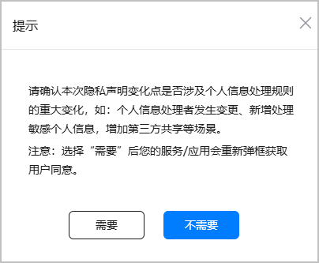
  2. 提交审核后，在原隐私政策的基础上新增一个“审核中”的隐私政策。
     + 审核通过：协议状态更新为“完成”，修改内容将覆盖原隐私政策，同时您会收到审核通过的邮件通知、页面置顶消息及互动中心消息。
     + 审核不通过：协议状态更新为“审核不通过”，您会收到审核不通过的邮件通知、页面置顶消息及互动中心消息。

     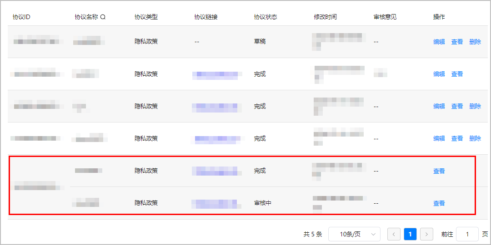
